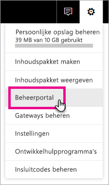
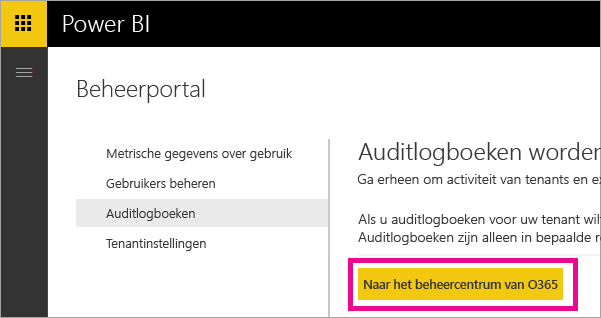
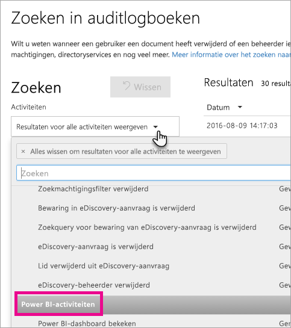
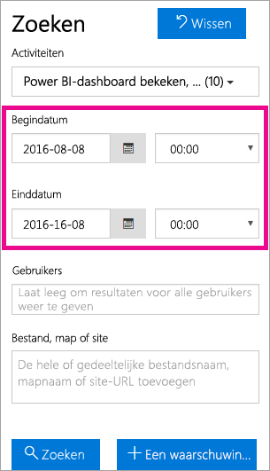
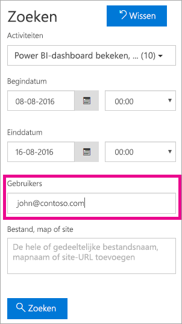
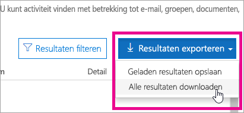

# <a name="using-auditing-within-your-organization"></a>Auditing gebruiken binnen uw organisatie

<iframe width="560" height="315" src="https://www.youtube.com/embed/zj4kA39jV_4?showinfo=0" frameborder="0" allowfullscreen></iframe>

Lees hier meer over de manier waarop u auditing kunt gebruiken met Power BI om uitgevoerde acties te controleren en onderzoeken. U kunt het Beveiligings- en nalevingscentrum of PowerShell gebruiken.

Weten wie welke actie uitvoert op een item in uw Power BI-tenant kan essentieel zijn om uw organisatie te helpen te voldoen aan de vereisten, zoals het voldoen aan regelgeving en archiefbeheer.

U kunt de auditgegevens filteren op datumbereik, gebruiker, dashboard, rapport, gegevensset en soort activiteit. U kunt de activiteiten ook downloaden in een CSV-bestand (bestand met door komma's gescheiden waarden) om de gegevens offline te analyseren.

> [!NOTE]
> De auditfunctie in Power BI is in preview en is beschikbaar in alle gegevensregio's.

## <a name="requirements"></a>Vereisten
U moet aan deze vereisten voldoen voor toegang tot de auditlogboeken:

- Voor toegang tot het auditgedeelte van het Beveiligings- en nalevingscentrum van Office 365 moet u een Exchange Online-licentie hebben (meegeleverd bij abonnementen op Office 365 Enterprise E3 en E5).
- U moet een algemene beheerder zijn of een Exchange-beheerdersrol hebben die toegang tot het auditlogboek biedt. 

  Exchange-beheerdersrollen worden beheerd via het Exchange-beheercentrum. Zie [Machtigingen in Exchange Online](https://technet.microsoft.com/library/jj200692(v=exchg.150).aspx) voor meer informatie.

- Als u wel toegang tot het auditlogboek hebt maar geen algemene beheerder of beheerder van de Power BI-service bent, krijgt u geen toegang tot het beheerportal van Power BI. In dit geval moet u een directe koppeling naar het Beveiligings- en nalevingscentrum van Office 365 ophalen.

## <a name="enabling-auditing-functionality-in-the-power-bi-admin-portal"></a>Auditing inschakelen in de Power BI-beheerportal

U moet auditing inschakelen voor uw organisatie als u met de rapporten wilt werken. U kunt dit doen met de tenantinstellingen in de beheerportal.

1. Selecteer het **tandwiel** in de rechterbovenhoek.

2. Selecteer **Beheerportal**.
   
   

3. Selecteer **Tenantinstellingen**.
   
   

4. Schakel **Auditlogboeken voor het controleren van interne activiteiten en naleving maken** in.

5. Selecteer **Toepassen**.

In Power BI worden nu verschillende activiteiten vastgelegd die door uw gebruikers worden uitgevoerd in Power BI. Het duurt 48 uur voordat de logboeken worden weergegeven in de app Beveiliging en compliance van Office 365. Ga naar de sectie [Lijst van activiteiten die worden gecontroleerd door Power BI](#list-of-activities-audited-by-power-bi) voor meer informatie over de activiteiten die worden vastgelegd.

> [!NOTE]
> Als u auditing wilt inschakelen voor Power BI in uw tenant, moet u ten minste één licentie voor een Exchange-postvak hebben in uw tenant.

## <a name="accessing-your-audit-logs"></a>Auditlogboeken raadplegen

Als u de auditlogboeken van Power BI wilt raadplegen, gaat u naar de app Beveiliging en compliance van Office 365.

1. Selecteer het **tandwiel** in de rechterbovenhoek.

2. Selecteer **Beheerportal**.
   
   

3. Selecteer **Auditlogboeken**.
 
4. Selecteer **Naar het Office 365-beheercentrum**.
   
   

U kunt ook [Office 365 | Beveiliging en compliance](https://protection.office.com/#/unifiedauditlog) kiezen.

> [!NOTE]
> Als u accounts van gewone gebruikers toegang wilt geven tot het auditlogboek, moet u machtigingen toewijzen in het beheercentrum van Exchange Online. U kunt bijvoorbeeld een gebruiker toewijzen aan een bestaande rolgroep, zoals Organisatiebeheer, of u kunt een nieuwe rolgroep maken met de rol Auditlogboeken. Zie [Machtigingen in Exchange Online](https://technet.microsoft.com/library/jj200692\(v=exchg.150\).aspx) voor meer informatie.

## <a name="search-only-power-bi-activities"></a>Alleen Power BI activiteiten zoeken

U kunt als volgt de resultaten beperken tot alleen Power BI-activiteiten.

1. Klik op de pagina **Auditlogboeken zoeken** onder **Zoeken** op de pijl omlaag bij **Activiteiten**.

2. Selecteer **Power BI-activiteiten**.
   
   

3. Maak een selectie buiten de vervolgkeuzelijst om deze te sluiten.

Uw zoekopdrachten worden nu gefilterd op alleen Power BI-activiteiten.

## <a name="search-the-audit-logs-by-date"></a>Op datum zoeken in auditlogboeken

U kunt op datumbereik zoeken in de logboeken met behulp van de velden Begindatum en Einddatum. De afgelopen zeven dagen zijn standaard geselecteerd. De datum en tijd worden weergegeven in de UTC-notatie (Coordinated Universal Time). Het maximale datumbereik dat u kunt opgeven is 90 dagen. Er wordt een fout weergegeven als het geselecteerde datumbereik groter is dan 90 dagen.

> [!NOTE]
> Als u het maximale datumbereik van 90 dagen gebruikt, selecteert u de huidige tijd voor de begindatum. Anders krijgt u een foutmelding met de mededeling dat de begindatum voor de einddatum valt. Als u auditing hebt ingeschakeld in de afgelopen 90 dagen, kan het maximale datumbereik niet beginnen voor de datum waarop auditing is ingeschakeld.



## <a name="search-the-audit-logs-by-users"></a>Op gebruiker zoeken in auditlogboeken

U kunt zoeken naar vermeldingen in het auditlogboek voor activiteiten die zijn uitgevoerd door specifieke gebruikers. Hiervoor typt u een of meer gebruikersnamen in het veld Gebruikers.  Voer de gebruikersnamen in waarmee ze zich aanmelden bij Power BI. De naam ziet eruit als een e-mailadres.
Laat dit vak leeg om vermeldingen weer te geven voor alle gebruikers (en serviceaccounts) in uw organisatie.



## <a name="viewing-search-results"></a>Zoekresultaten bekijken

Als u Zoeken selecteert, worden de zoekresultaten geladen en ziet u deze na een paar seconden onder Resultaten. Wanneer de zoekopdracht is voltooid, wordt het aantal gevonden resultaten weergegeven. 

> [!NOTE]
> Er worden maximaal 1000 gebeurtenissen weergegeven. Als er meer dan 1000 gebeurtenissen aan de zoekcriteria voldoen, worden de nieuwste 1000 gebeurtenissen weergegeven.

De resultaten bevatten de volgende informatie over elke gebeurtenis die wordt geretourneerd door de zoekopdracht.

| **Kolom** | **Beschrijving** |
| --- | --- |
| Datum |De datum en tijd (in UTC-notatie) wanneer de gebeurtenis heeft plaatsgevonden. |
| IP-adres |Het IP-adres van het apparaat waarmee de activiteit is uitgevoerd. Het IP-adres wordt weergegeven in de IPv4- of IPv6-adresindeling. |
| Gebruiker |De gebruiker (of het serviceaccount) die de actie heeft uitgevoerd die de gebeurtenis heeft veroorzaakt. |
| Activiteit |De activiteit die is uitgevoerd door de gebruiker. Deze waarde komt overeen met de activiteiten die u hebt geselecteerd in de vervolgkeuzelijst Activiteiten. Voor een gebeurtenis uit het auditlogboek van de Exchange-beheerder is de waarde in deze kolom een Exchange-cmdlet. |
| Item |Het object dat is gemaakt of gewijzigd als gevolg van de bijbehorende activiteit. Dit kan het bestand zijn dat is weergegeven of gewijzigd, of het gebruikersaccount dat is bijgewerkt. Niet alle activiteiten hebben een waarde in deze kolom. |
| Detail |Aanvullende details van een activiteit. Niet alle activiteiten hebben een waarde in deze kolom. |

> [!NOTE]
> Selecteer een kolomkop onder Resultaten om de resultaten te sorteren. U kunt de resultaten sorteren van A naar Z of van Z naar A. Klik op de kolomkop Datum om de resultaten te sorteren van de oudste naar de nieuwste vermelding of omgekeerd.

## <a name="view-the-details-for-an-event"></a>Details van een gebeurtenis bekijken

U kunt meer informatie over een gebeurtenis bekijken door de record van de gebeurtenis te selecteren in de lijst met zoekresultaten. Er verschijnt dan een pagina met details met de gedetailleerde eigenschappen uit de gebeurtenisrecord. De eigenschappen die worden weergegeven, zijn afhankelijk van de Office 365-service waarin de gebeurtenis zich voordoet. Als u aanvullende informatie wilt weergeven, selecteert u **Meer informatie**.

De volgende tabel bevat informatie over de details die kunnen worden weergegeven.

| **Parameter of gebeurtenis** | **Beschrijving** | **Aanvullende details** |
| --- | --- | --- |
| Power BI-rapport gedownload |Deze activiteit wordt geregistreerd wanneer een rapport wordt gedownload |Rapportnaam, Naam van gegevensset |
| Rapport maken |Deze activiteit wordt geregistreerd wanneer er een rapport wordt gemaakt. |Rapportnaam, Naam van gegevensset |
| Rapport bewerken |Deze activiteit wordt geregistreerd wanneer een rapport wordt bewerkt. |Rapportnaam, Naam van gegevensset |
| Gegevensset maken |Deze activiteit wordt geregistreerd wanneer een gegevensset wordt gemaakt. |Naam van gegevensset, DataConnectivityMode |
| Gegevensset verwijderen |Deze activiteit wordt geregistreerd wanneer een gegevensset wordt verwijderd. |Naam van gegevensset, DataConnectivityMode |
| Power BI-app maken |Deze activiteit wordt geregistreerd wanneer een Power BI-app wordt gemaakt |App-naam, Machtigingen, Naam van de werkruimte |
| Power BI-app installeren |Deze activiteit wordt geregistreerd wanneer een Power BI-app wordt geïnstalleerd |App-naam |
| Power BI-app bijwerken |Deze activiteit wordt geregistreerd wanneer een Power BI-app wordt bijgewerkt |App-naam, Machtigingen, Naam van de werkruimte |
| Verlengde proefversie Power BI gestart |Deze activiteit wordt geregistreerd wanneer een gebruiker de verlengde Pro-proefversie accepteert die beschikbaar is tot en met 31 mei 2018 | |
| Power BI-gegevensset geanalyseerd |Deze activiteit wordt geregistreerd wanneer een Power BI-gegevensset in Excel wordt geanalyseerd. | |
| Power BI Gateway gemaakt |Deze activiteit wordt geregistreerd wanneer een nieuwe gateway wordt gemaakt. |Gatewaynaam, Gatewaytype |
| Power BI Gateway verwijderd |Deze activiteit wordt geregistreerd wanneer een gateway wordt verwijderd. |Gatewaynaam, Gatewaytype |
| Gegevensbron toegevoegde aan Power BI-gateway |Deze activiteit wordt geregistreerd wanneer een gegevensbron wordt toegevoegd aan de gateway |Gatewaynaam, Gatewaytype, Naam van gegevensbron, Type gegevensbron |
| Gegevensbron verwijderd uit Power BI-gateway |Deze activiteit wordt geregistreerd wanneer een gegevensbron wordt verwijderd uit een gateway |Gatewaynaam, Gatewaytype, Naam van gegevensbron, Type gegevensbron |
| Beheerders Power BI-gateway gewijzigd |Deze activiteit wordt geregistreerd wanneer de beheerders van een gateway worden gewijzigd (toegevoegd of verwijderd) |Gatewaynaam, Toegevoegde gebruikers, Verwijderde gebruikers |
| Gebruikers gegevensbron Power IB-gateway gewijzigd |Deze activiteit wordt geregistreerd wanneer de gebruikers van een gateway worden gewijzigd (toegevoegd of verwijderd) |Gatewaynaam, Toegevoegde gebruikers, Verwijderde gebruikers |
| SetScheduledRefresh |Deze activiteit wordt geregistreerd wanneer een nieuwe vernieuwing wordt gepland voor een gegevensset |Naam van gegevensset, Vernieuwingsfrequentie (in minuten) |

## <a name="using-powershell-to-search"></a>Zoeken met PowerShell

U kunt PowerShell gebruiken om toegang tot de auditlogboeken te krijgen op basis van uw aanmeldingsgegevens. Dit loopt dan via Exchange Online. Hier volgt een voorbeeld van een opdracht voor het ophalen van vermeldingen uit het auditlogboek van Power BI.

> [!NOTE]
> U kunt de opdracht New-PSSession alleen gebruiken als er een Exchange Online-licentie is toegewezen aan uw account en als u toegang hebt tot het auditlogboek voor uw tenant.

```
Set-ExecutionPolicy RemoteSigned

$UserCredential = Get-Credential

$Session = New-PSSession -ConfigurationName Microsoft.Exchange -ConnectionUri https://outlook.office365.com/powershell-liveid/ -Credential $UserCredential -Authentication Basic -AllowRedirection

Import-PSSession $Session
Search-UnifiedAuditLog -StartDate 9/11/2016 -EndDate 9/15/2016 -RecordType PowerBI -ResultSize 1000 | Format-Table | More
```

Zie [Connect to Exchange Online PowerShell](https://technet.microsoft.com/library/jj984289\(v=exchg.160\).aspx) (Verbinding maken met Exchange Online PowerShell) voor meer informatie over het maken van verbinding met Exchange Online.

Zie [Search-UnifiedAuditLog](https://technet.microsoft.com/library/mt238501\(v=exchg.160\).aspx) voor meer informatie over parameters en het gebruik van de opdracht Search-UnifiedAuditLog.

Als u wilt zien hoe u met behulp van PowerShell het auditlogboek kunt doorzoeken en vervolgens licenties van Power BI Pro kunt toewijzen aan vermeldingen, raadpleegt u [Power BI Pro licenties toewijzen met behulp van Power BI-auditlogboek en PowerShell](https://powerbi.microsoft.com/blog/using-power-bi-audit-log-and-powershell-to-assign-power-bi-pro-licenses/).

## <a name="export-the-power-bi-audit-log"></a>Power BI-auditlogboek exporteren

U kunt het auditlogboek van Power BI exporteren naar een CSV-bestand.

1. Selecteer **Resultaten exporteren**.

2. Selecteer **Geladen resultaten opslaan** of **Alle resultaten downloaden**.
   
   

## <a name="record-and-user-types"></a>Record- en gebruikerstypen

De details van de vermeldingen in het auditlogboek bestaan onder andere uit een RecordType en een UserType. Alle Power BI-vermeldingen hebben het RecordType 20.

Zie [Gedetailleerde eigenschappen in het auditlogboek van Office 365](https://support.office.com/article/Detailed-properties-in-the-Office-365-audit-log-ce004100-9e7f-443e-942b-9b04098fcfc3) voor een volledig overzicht.

## <a name="list-of-activities-audited-by-power-bi"></a>Lijst van activiteiten die worden gecontroleerd door Power BI

| Activiteit | Beschrijving | Aanvullende details |
| --- | --- | --- |
| CreateDashboard |Deze activiteit wordt geregistreerd wanneer een nieuw dashboard wordt gemaakt. |- Naam van dashboard. |
| EditDashboard |Deze activiteit wordt geregistreerd wanneer de naam van een dashboard wordt gewijzigd. |- Naam van dashboard. |
| DeleteDashboard |Deze activiteit wordt geregistreerd wanneer een dashboard wordt verwijderd. |- Naam van dashboard. |
| PrintDashboard |Deze activiteit wordt geregistreerd wanneer een dashboard wordt afgedrukt. |- Naam van dashboard.<br/>- Naam van gegevensset. |
| ShareDashboard |Deze activiteit wordt geregistreerd wanneer een dashboard wordt gedeeld. |- Naam van dashboard.<br/>- E-mailadres van geadresseerde<br/>- Naam van gegevensset.<br>- Machtigingen voor opnieuw delen. |
| ViewDashboard |Deze activiteit wordt geregistreerd wanneer een dashboard wordt weergegeven. |- Naam van dashboard. |
| ExportTile |Deze gebeurtenis wordt geregistreerd wanneer gegevens worden geëxporteerd uit een dashboardtegel. |- Naam van tegel.<br/>- Naam van gegevensset. |
| DeleteReport |Deze activiteit wordt geregistreerd wanneer een rapport wordt verwijderd. |- Naam van rapport. |
| ExportReport |Deze gebeurtenis wordt geregistreerd wanneer gegevens worden geëxporteerd uit een rapporttegel. |- Naam van rapport.<br/>- Naam van gegevensset. |
| PrintReport |Deze activiteit wordt geregistreerd wanneer een rapport wordt afgedrukt. |- Naam van rapport.<br/>- Naam van gegevensset. |
| PublishToWebReport |Deze activiteit wordt geregistreerd wanneer een rapport naar het web wordt gepubliceerd. |- Naam van rapport.<br/>- Naam van gegevensset. |
| ViewReport |Deze activiteit wordt geregistreerd wanneer een rapport wordt weergegeven. |- Naam van rapport. |
| ExploreDataset |Deze gebeurtenis wordt geregistreerd wanneer u een gegevensset verkent door deze te selecteren. |- Naam van gegevensset. |
| DeleteDataset |Deze gebeurtenis wordt geregistreerd wanneer een gegevensset wordt verwijderd. |- Naam van gegevensset. |
| CreateOrgApp |Deze activiteit wordt geregistreerd wanneer een organisatie-inhoudspakket wordt gemaakt. |- Naam van organisatie-inhoudspakket.<br/>- Namen van dashboards.<br/>- Namen van rapporten.<br/>- Namen van gegevenssets. |
| CreateGroup |Deze activiteit wordt gestart wanneer een groep wordt gemaakt. |- Groepsnaam. |
| AddGroupMembers |Deze activiteit wordt geregistreerd wanneer een lid wordt toegevoegd aan de werkruimte van een Power BI-groep. |- Groepsnaam.<br/>- E-mailadressen. |
| UpdatedAdminFeatureSwitch |Deze gebeurtenis wordt geregistreerd wanneer een schakeloptie voor een beheerfunctie wordt gewijzigd. |- Naam van schakeloptie.<br/>- Nieuwe status van schakeloptie. |
| OptInForProTrial |Deze gebeurtenis wordt geregistreerd wanneer een gebruiker ervoor kiest om Power BI Pro te proberen in de service. |- E-mailadres. |

## <a name="next-steps"></a>Volgende stappen

[Power BI-beheerportal](service-admin-portal.md)  
[Power BI Premium - wat is het?](service-premium.md)  
[Purchasing Power BI Pro](service-admin-purchasing-power-bi-pro.md) (Power BI Pro kopen)  
[Machtigingen in Exchange Online](https://technet.microsoft.com/library/jj200692\(v=exchg.150\).aspx)  
[Connect to Exchange Online PowerShell](https://technet.microsoft.com/library/jj984289\(v=exchg.160\).aspx) (Verbinding maken met Exchange Online PowerShell)  
[Search-UnifiedAuditLog](https://technet.microsoft.com/library/mt238501\(v=exchg.160\).aspx)  
[Gedetailleerde eigenschappen in het auditlogboek van Office 365](https://support.office.com/article/Detailed-properties-in-the-Office-365-audit-log-ce004100-9e7f-443e-942b-9b04098fcfc3)  

Nog vragen? [Misschien dat de Power BI-community het antwoord weet](http://community.powerbi.com/)