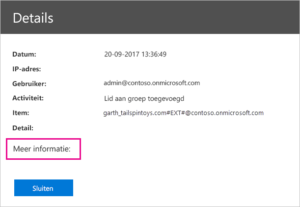

# <a name="using-auditing-within-your-organization"></a>Auditing gebruiken binnen uw organisatie

Weten wie welke actie uitvoert op een item in uw Power BI-tenant kan essentieel zijn om uw organisatie te helpen te voldoen aan de vereisten, zoals het voldoen aan regelgeving en archiefbeheer. Gebruik Power BI-controles om acties van gebruikers te controleren, zoals Rapport weergegeven en Dashboard weergeven. U kunt de controlefunctie niet gebruiken om machtigingen te controleren.

U voert controles uit in het Office 365-centrum voor beveiliging en naleving of u gebruikt PowerShell. In dit artikel behandelen we de beide mogelijkheden. U kunt de auditgegevens filteren op datumbereik, gebruiker, dashboard, rapport, gegevensset en soort activiteit. U kunt de activiteiten ook downloaden in een CSV-bestand (bestand met door komma's gescheiden waarden) om de gegevens offline te analyseren.

## <a name="requirements"></a>Vereisten

U moet aan deze vereisten voldoen voor toegang tot de auditlogboeken:

- Voor toegang tot het auditgedeelte van het Beveiligings- en nalevingscentrum van Office 365 moet u een Exchange Online-licentie hebben (meegeleverd bij abonnementen op Office 365 Enterprise E3 en E5).

- U moet een algemene beheerder zijn of een Exchange-beheerdersrol hebben die toegang tot het auditlogboek biedt. Exchange-beheerdersrollen worden beheerd via het Exchange-beheercentrum. Zie [Machtigingen in Exchange Online](/exchange/permissions-exo/permissions-exo/) voor meer informatie.

- Als u wel toegang tot het auditlogboek hebt maar geen algemene beheerder of beheerder van de Power BI-service bent, krijgt u geen toegang tot het beheerportal van Power BI. In dit geval moet u een directe koppeling naar het [Office 365-centrum voor beveiliging en naleving](https://sip.protection.office.com/#/unifiedauditlog) ophalen.

- Als u auditlogboeken voor Power BI in uw tenant wilt weergeven, moet u ten minste één licentie voor een Exchange-postvak hebben in uw tenant.

## <a name="accessing-your-audit-logs"></a>Auditlogboeken raadplegen

Zorg ervoor dat logboekregistratie in Power BI is ingeschakeld als u de logboeken wilt raadplegen. Raadpleeg voor meer informatie [Auditlogboeken](service-admin-portal.md#audit-logs) in de documentatie voor de beheerportal. Er kan een vertraging tot 48 uur bestaan tussen het inschakelen van de controlefunctie en het kunnen weergeven van controlegegevens. Als u niet direct gegevens ziet, controleert u de controlelogboeken op een later tijdstip. Er kan een vergelijkbare vertraging optreden tussen het ophalen van machtiging voor het weergeven van controlelogboeken en het kunnen openen van de logboeken.

De Power BI-auditlogboeken zijn rechtstreeks beschikbaar via het [Office 365-centrum voor beveiliging en naleving](https://sip.protection.office.com/#/unifiedauditlog). Er is ook een koppeling vanuit de Power BI-beheerportal:

1. Selecteer in Power BI rechtsboven het **tandwielpictogram** en selecteer vervolgens **Beheerportal**.

   

1. Selecteer **Auditlogboeken**.

1. Selecteer **Naar het Office 365-beheercentrum**.

   

Als u accounts van gewone gebruikers toegang wilt geven tot het auditlogboek, moet u machtigingen toewijzen in het beheercentrum van Exchange Online. U kunt bijvoorbeeld een gebruiker toewijzen aan een bestaande rolgroep, zoals Organisatiebeheer, of u kunt een nieuwe rolgroep maken met de rol Auditlogboeken. Zie [Machtigingen in Exchange Online](/exchange/permissions-exo/permissions-exo/) voor meer informatie.

## <a name="search-only-power-bi-activities"></a>Alleen Power BI activiteiten zoeken

Volg deze stappen om de resultaten te beperken tot alleen Power BI-activiteiten. Raadpleeg voor een lijst activiteiten de [Lijst van activiteiten die worden gecontroleerd door Power BI](#list-of-activities-audited-by-power-bi). Deze lijst staat verderop in dit artikel.

1. Klik op de pagina **Auditlogboeken zoeken** onder **Zoeken** op de pijl omlaag bij **Activiteiten**.

2. Selecteer **Power BI-activiteiten**.

   

3. Maak een selectie buiten de vervolgkeuzelijst om deze te sluiten.

Uw zoekopdrachten worden nu gefilterd op alleen Power BI-activiteiten.

## <a name="search-the-audit-logs-by-date"></a>Op datum zoeken in auditlogboeken

U kunt op datumbereik zoeken in de logboeken met behulp van de velden **Begindatum** en **Einddatum**. De afgelopen zeven dagen zijn standaard geselecteerd. De datum en tijd worden weergegeven in de UTC-notatie (Coordinated Universal Time). Het maximale datumbereik dat u kunt opgeven is 90 dagen. 

Er wordt een fout weergegeven als het geselecteerde datumbereik groter is dan 90 dagen. Als u het maximale datumbereik van 90 dagen gebruikt, selecteert u de huidige tijd voor **Begindatum**. Anders krijgt u een foutmelding met de mededeling dat de begindatum voor de einddatum valt. Als u controles hebt ingeschakeld in de afgelopen 90 dagen, kan het datumbereik niet beginnen voor de datum waarop controles zijn ingeschakeld.


## <a name="search-the-audit-logs-by-users"></a>Op gebruiker zoeken in auditlogboeken

U kunt zoeken naar vermeldingen in het auditlogboek voor activiteiten die zijn uitgevoerd door specifieke gebruikers. Hiervoor typt u een of meer gebruikersnamen in het veld **Gebruikers**. De gebruikersnaam ziet eruit als een e-mailadres: het is het account waarmee gebruikers zich aanmelden bij Power BI. Laat dit vak leeg om vermeldingen weer te geven voor alle gebruikers (en serviceaccounts) in uw organisatie.


## <a name="view-search-results"></a>Zoekresultaten weergeven

Nadat u **Zoeken** selecteert, worden de zoekresultaten geladen en ziet u deze na een paar seconden onder **Resultaten**. Wanneer de zoekopdracht is voltooid, wordt het aantal gevonden resultaten weergegeven. Er worden maximaal 1000 gebeurtenissen weergegeven. Als er meer dan 1000 gebeurtenissen aan de zoekcriteria voldoen, worden de 1000 nieuwste gebeurtenissen weergegeven.

### <a name="view-the-main-results"></a>De belangrijkste resultaten bekijken

Het gebied **Resultaten** bevat de volgende informatie voor elke gebeurtenis die door de zoekopdracht is geretourneerd. Selecteer een kolomkop onder **Resultaten** om de resultaten te sorteren.

| **Kolom** | **Beschrijving** |
| --- | --- |
| Datum |De datum en tijd (in UTC-notatie) wanneer de gebeurtenis heeft plaatsgevonden. |
| IP-adres |Het IP-adres van het apparaat waarmee de activiteit is uitgevoerd. Het IP-adres wordt weergegeven in de IPv4- of IPv6-adresindeling. |
| Gebruiker |De gebruiker (of het serviceaccount) die de actie heeft uitgevoerd die de gebeurtenis heeft veroorzaakt. |
| Activiteit |De activiteit die is uitgevoerd door de gebruiker. Deze waarde komt overeen met de activiteiten die u hebt geselecteerd in de vervolgkeuzelijst **Activiteiten**. Voor een gebeurtenis uit het auditlogboek van de Exchange-beheerder is de waarde in deze kolom een Exchange-cmdlet. |
| Item |Het object dat is gemaakt of gewijzigd als gevolg van de bijbehorende activiteit. Dit kan het bestand zijn dat is weergegeven of gewijzigd, of het gebruikersaccount dat is bijgewerkt. Niet alle activiteiten hebben een waarde in deze kolom. |
| Detail |Aanvullende details van een activiteit. Niet alle activiteiten hebben een waarde in deze kolom. |

### <a name="view-the-details-for-an-event"></a>Details van een gebeurtenis bekijken

U kunt meer informatie over een gebeurtenis bekijken door op de record van de gebeurtenis te klikken in de lijst met zoekresultaten. De pagina **Details** verschijnt met de gedetailleerde eigenschappen uit de gebeurtenisrecord. De eigenschappen die worden weergegeven, zijn afhankelijk van de Office 365-service waarin de gebeurtenis zich voordoet. 

Als u deze informatie wilt weergeven, selecteert u **Meer informatie**. Alle Power BI-vermeldingen hebben een waarde van 20 voor de eigenschap RecordType. Voor informatie over andere eigenschappen raadpleegt u [Gedetailleerde eigenschappen in het auditlogboek](/office365/securitycompliance/detailed-properties-in-the-office-365-audit-log/).

   

## <a name="export-search-results"></a>Zoekresultaten exporteren

Als u het Power BI-auditlogboek als een csv-bestand wilt exporteren, volgt u deze stappen.

1. Selecteer **Resultaten exporteren**.

1. Selecteer **Geladen resultaten opslaan** of **Alle resultaten downloaden**.

    

## <a name="use-powershell-to-search-audit-logs"></a>Gebruik PowerShell om naar auditlogboeken te zoeken

U kunt PowerShell ook gebruiken om toegang tot de auditlogboeken te krijgen op basis van uw aanmeldingsgegevens. In het volgende voorbeeld ziet u hoe u de opdracht [Search-UnifiedAuditLog](/powershell/module/exchange/policy-and-compliance-audit/search-unifiedauditlog?view=exchange-ps/) gebruikt om vermeldingen van Power BI-auditlogboeken op te halen.

Als u de opdracht [New-PSSession](/powershell/module/microsoft.powershell.core/new-pssession/) wilt gebruiken, moet er een Exchange Online-licentie zijn toegewezen aan uw account en hebt u toegang nodig tot het auditlogboek voor uw tenant. Zie [Connect to Exchange Online PowerShell](/powershell/exchange/exchange-online/connect-to-exchange-online-powershell/connect-to-exchange-online-powershell/) (Verbinding maken met Exchange Online PowerShell) voor meer informatie over het maken van verbinding met Exchange Online.

```powershell
Set-ExecutionPolicy RemoteSigned

$UserCredential = Get-Credential

$Session = New-PSSession -ConfigurationName Microsoft.Exchange -ConnectionUri https://outlook.office365.com/powershell-liveid/ -Credential $UserCredential -Authentication Basic -AllowRedirection

Import-PSSession $Session
Search-UnifiedAuditLog -StartDate 9/11/2018 -EndDate 9/15/2018 -RecordType PowerBI -ResultSize 1000 | Format-Table | More
```

Voor een ander voorbeeld van hoe u PowerShell met auditlogboeken gebruikt, raadpleegt u [Using Power BI audit log and PowerShell to assign Power BI Pro licenses](https://powerbi.microsoft.com/blog/using-power-bi-audit-log-and-powershell-to-assign-power-bi-pro-licenses/) (Power BI-auditlogboeken en PowerShell gebruiken om Power BI Pro-licenties toe te wijzen).

## <a name="activities-audited-by-power-bi"></a>Activiteiten die worden gecontroleerd door Power BI

De volgende activiteiten worden gecontroleerd door Power BI.

* AddDatasourceToGateway
* AddGroupMembers
* AnalyzedByExternalApplication
* AnalyzeInExcel
* AttachDataflowStorageAccount
* BindToGateway
* ChangeCapacityState
* ChangeGatewayAdministrators
* ChangeGatewayDatasourceUsers
* CreateApp
* CreateDashboard
* CreateDataflow
* CreateDataset
* CreateEmailSubscription
* CreateFolder
* CreateGateway
* CreateGroup
* CreateOrgApp
* CreateReport
* DeleteComment
* DeleteDashboard
* DeleteDataflow
* DeleteDataset
* DeleteEmailSubscription
* DeleteFolder
* DeleteGateway
* DeleteGroup
* DeleteGroupMembers
* DeleteOrgApp
* DeleteReport
* DownloadReport
* EditDataset
* EditReport
* ExportDataflow
* ExportReport
* ExportTile
* GenerateDataflowSasToken
* GenerateEmbedToken
* GetDatasources
* Importeren
* InstallApp
* MigrateWorkspaceIntoCapacity
* OptInForProTrial
* PostComment
* PrintDashboard
* PrintReport
* PublishToWebReport
* RefreshDataset
* RemoveDatasourceFromGateway
* RemoveWorkspacesFromCapacity
* RenameDashboard
* SetAllConnections
* SetScheduledRefresh
* SetScheduledRefreshOnDataflow
* ShareDashboard
* ShareReport
* TakeOverDataset
* TakeOverDatasource
* UnpublishApp
* UpdateApp
* UpdateCapacityAdmins
* UpdateCapacityDisplayName
* UpdateCapacityResourceGovernanceSettings
* UpdateCapacityUsersAssignment
* UpdatedAdminFeatureSwitch
* UpdateDataflow
* UpdateDatasetParameters
* UpdateDatasourceCredentials
* UpdateDatasources
* UpdateEmailSubscription
* UpdateFolder
* UpdateFolderAccess
* ViewDashboard
* ViewDataflow
* ViewReport
* ViewTile
* ViewUsageMetrics

## <a name="next-steps"></a>Volgende stappen

[Wat is Power BI-beheer?](service-admin-administering-power-bi-in-your-organization.md)  

[Power BI-beheerportal](service-admin-portal.md)  

Hebt u nog vragen? [Misschien dat de Power BI-community het antwoord weet](http://community.powerbi.com/)
