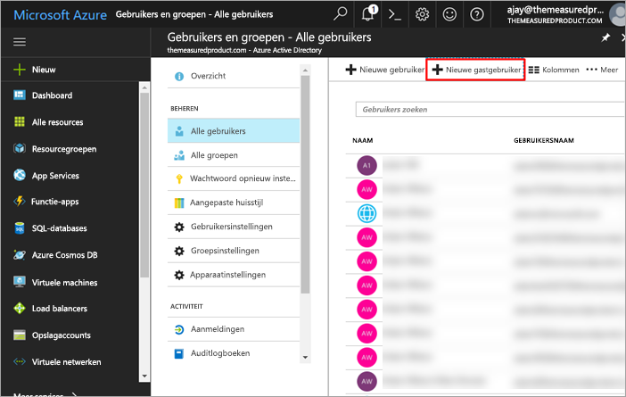
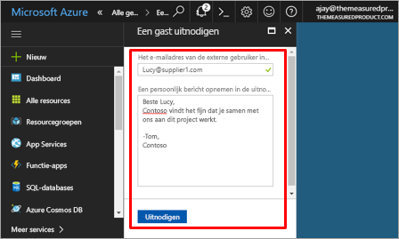
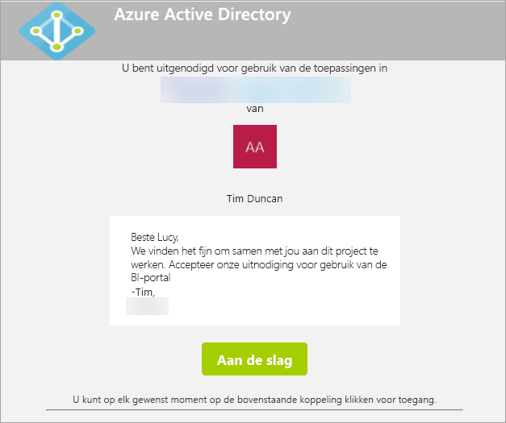
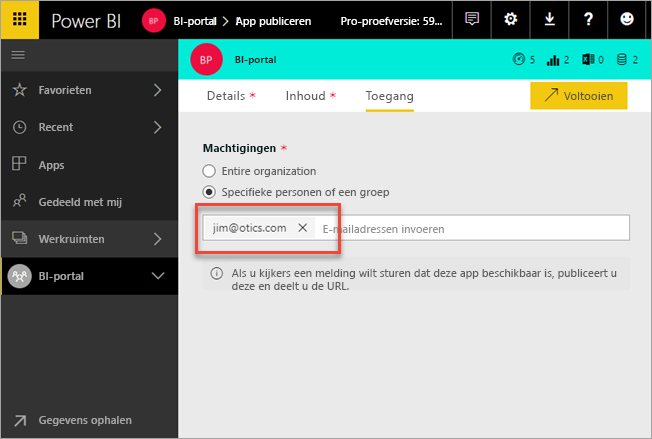
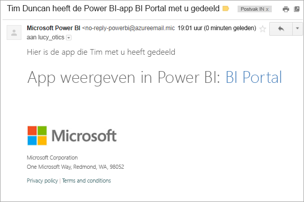
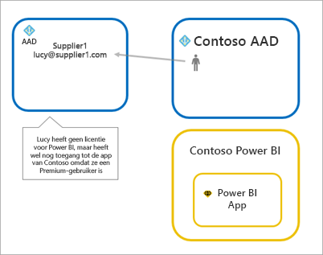
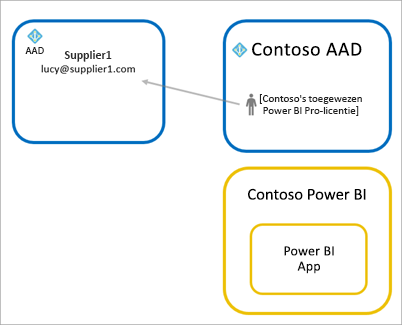
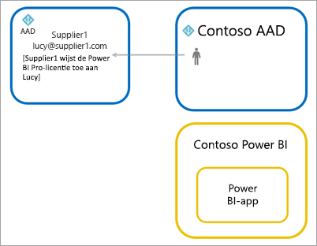

# Power BI-inhoud met Azure AD B2B distribueren naar externe gastgebruikers

Power BI kan worden geïntegreerd met Azure Active Directory Business-to-business (Azure AD B2B) voor een veilige distributie van Power BI-inhoud naar gastgebruikers buiten de organisatie, zonder de controle over de interne gegevens te verliezen.

> [!VIDEO https://www.youtube.com/embed/xxQWEQ1NnlY]

> [!NOTE]
> U moet de functie [Instellingen exporteren en delen](service-admin-portal.md#export-and-sharing-settings) **inschakelen** in de tenant-instellingen van de Power BI-beheerdersportal voordat u gastgebruikers uitnodigt.

> [!NOTE]
> Deze functie is momenteel niet beschikbaar met de mobiele Power BI-apps. Op een mobiel apparaat kunt u in een browser Power BI-inhoud weergeven die is gedeeld met Azure AD B2B. 

## Wie kunt u uitnodigen?

U kunt gastgebruikers uitnodigen die gebruikmaken van ongeacht welk e-mailadres, met inbegrip van persoonlijke accounts zoals gmail.com, outlook.com of hotmail.com. Deze worden in Azure B2B 'Sociale-id's' genoemd. Raadpleeg voor meer informatie [Azure B2B](https://docs.microsoft.com/azure/active-directory/active-directory-b2b-what-is-azure-ad-b2b).

## Gastgebruikers uitnodigen

Er zijn twee manieren om gastgebruikers uit te nodigen voor uw Power BI-tenant: geplande uitnodigingen en ad-hocuitnodigingen. Er hoeven alleen uitnodigingen te worden verstuurd wanneer een externe gebruiker voor het eerst wordt uitgenodigd voor uw organisatie.

### Geplande uitnodigingen

Een geplande uitnodiging wordt uitgevoerd in Microsoft Azure Portal in Azure AD of met behulp van PowerShell. Deze optie gebruikt u als u weet welke gebruikers moeten worden uitgenodigd. 

**Als u een gastgebruiker in de Azure AD-portal wilt maken, moet u een tenantbeheerder zijn.**

1. Ga naar [Azure Portal](https://portal.azure.com) en selecteer **Azure Active Directory**.

2. Ga naar **Gebruikers en groepen** > **Alle gebruikers** > **Nieuwe gastgebruiker**.

    

3. Geef het **e-mailadres** en het **persoonlijke bericht** op.

    

4. Selecteer **Uitnodigen**.

Als u meerdere gastgebruikers wilt uitnodigen, gebruikt u PowerShell. Zie [Azure Active Directory B2B-samenwerkingscode en voorbeelden van PowerShell](https://docs.microsoft.com/azure/active-directory/b2b/code-samples) voor meer informatie.

De gastgebruiker moet in de e-mailuitnodiging die is ontvangen, de optie **Aan de slag** selecteren. De gastgebruiker wordt vervolgens toegevoegd aan de tenant.

### Ad-hocuitnodigingen

Als u op een bepaald moment een uitnodiging wilt uitbrengen, voegt u de externe gebruiker toe aan uw dashboard of meldt u dit via de gebruikersinterface voor delen of uw app via de toegangspagina.

Hier volgt een voorbeeld van wat te doen wanneer u een externe gebruiker uitnodigt om een app te gebruiken.

De gastgebruiker ontvangt een e-mail met het bericht dat de app is gedeeld.

De gastgebruiker moet zich aanmelden met het e-mailadres van de organisatie. Zodra gastgebruiker zich heeft aangemeld, wordt deze gevraagd de uitnodiging te accepteren. Nadat de gastgebruiker zich heeft aangemeld, wordt deze omgeleid naar de app-inhoud. Maak een bladwijzer voor deze koppeling of bewaar de e-mail om terug te keren naar de app.

## Licentieverlening

De gastgebruiker moet over de juiste licenties beschikken om de gedeelde app te kunnen weergeven. Dit kan op drie manieren worden gerealiseerd.

### Power BI Premium gebruiken

Door de app-werkruimte toe te wijzen aan Power BI Premium-capaciteit, kan de gastgebruiker de app gebruiken zonder een licentie voor Power BI Pro. Met Power BI Premium kunnen apps ook profiteren van andere mogelijkheden, zoals van een verhoogde vernieuwingsfrequentie, toegewezen capaciteit en grote modellen.

### Een Power BI Pro-licentie toewijzen aan een gastgebruiker

Als u in uw tenant een Power BI Pro-licentie toewijst aan een gastgebruiker, kan die gastgebruiker de inhoud weergeven.

> [!NOTE]
> Een Power BI Pro-licentie uit uw tenant is alleen van toepassing op gastgebruikers wanneer ze zich toegang verschaffen tot inhoud in uw tenant.

### De gastgebruiker beschikt over een eigen Power BI Pro-licentie

De gastgebruiker beschikt al over een Power BI Pro-licentie die is toegewezen in hun eigen tenant.

## Overwegingen en beperkingen

* Wanneer u gastgebruikers uitnodigt die van persoonlijke e-mailaccounts gebruikmaken, zoals gmail.com, outlook.com of hotmail.com, kunt u deze [ingesloten video](https://docs.microsoft.com/azure/active-directory/active-directory-b2b-redemption-experience) bekijken om een voorbeeld te zien van hoe een gebruiker zich zou aanmelden.
* Externe B2B-gasten mogen alleen inhoud gebruiken. Externe B2B-gasten kunnen apps, dashboards en rapporten weergeven, gegevens exporteren en e-mailabonnementen instellen voor dashboards en rapporten. Ze hebben geen toegang tot werkruimten en kunnen hun eigen inhoud niet publiceren.
* Deze functie is momenteel niet beschikbaar met de mobiele Power BI-apps. Op een mobiel apparaat kunt u in een browser Power BI-inhoud weergeven die is gedeeld met Azure AD B2B.
* Deze functie is momenteel niet beschikbaar in het webonderdeel voor Power BI SharePoint Online-rapporten.

## Volgende stappen

Raadpleeg het [technische document](https://aka.ms/powerbi-b2b-whitepaper) voor meer informatie, inclusief informatie over hoe beveiliging op rijniveau werkt.

Zie [Wat is B2B-samenwerking van Azure AD?](https://docs.microsoft.com/azure/active-directory/active-directory-b2b-what-is-azure-ad-b2b) voor meer informatie over Azure Active Directory B2B.
