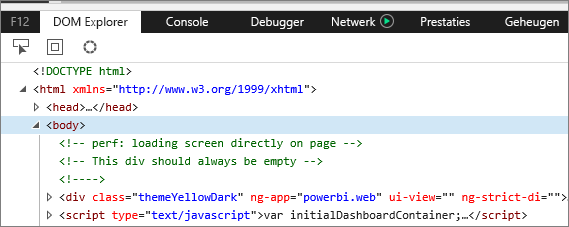
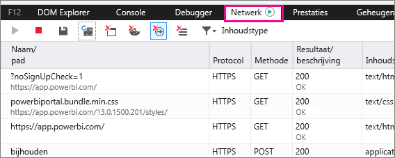
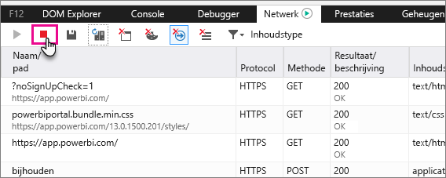
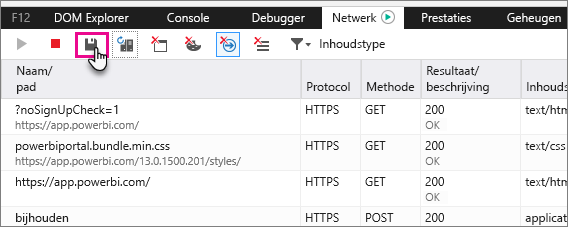

# Aanvullende diagnostische gegevens vastleggen
## Aanvullende diagnostische gegevens vastleggen voor Power BI
Deze instructies bieden twee mogelijke opties voor het handmatig verzamelen van aanvullende diagnostische gegevens van de Power BI-webclient.  Slechts een van deze opties moet worden gevolgd.

## Vastleggen van netwerk - Microsoft Edge en Internet Explorer
1. Ga naar [Power BI](https://app.powerbi.com) met Microsoft Edge of Internet Explorer.
2. Open de ontwikkelhulpprogramma's van Microsoft Edge door op F12 te drukken.
3. Hiermee opent u het venster voor ontwikkelhulpprogramma's: 
   
   
4. Ga naar het tabblad Netwerk. Hier wordt een lijst weergegeven met het verkeer dat al is vastgelegd. 
   
   
5. U kunt in het venster bladeren en elk probleem dat u mogelijk tegen bent gekomen reproduceren. U kunt het venster voor ontwikkelhulpprogramma's op elk gewenst moment tijdens de sessie verbergen door op F12 te drukken.
6. Als u wilt stoppen met het vastleggen, kunt u het rode vierkant selecteren op het tabblad Netwerk van het gedeelte voor ontwikkelhulpprogramma's.
   
   
7. Selecteer het pictogram van een diskette om te **exporteren als HAR**
   
   
8. Geef een bestandsnaam op en sla het HAR-bestand op.
   
    Het HAR-bestand bevat alle informatie over netwerkaanvragen tussen het browservenster en Power BI.  Dit is informatie zoals de activiteits-id's voor elke aanvraag, de exacte tijdstempel voor elke aanvraag en alle foutinformatie die wordt geretourneerd door de client.  Deze tracering bevat ook de gegevens die worden gebruikt voor het vullen van de visuele elementen die op het scherm worden weergegeven.
9. U kunt het HAR-bestand naar ondersteuning verzenden voor controle.

Nog vragen? [Misschien dat de Power BI-community het antwoord weet](http://community.powerbi.com/)

