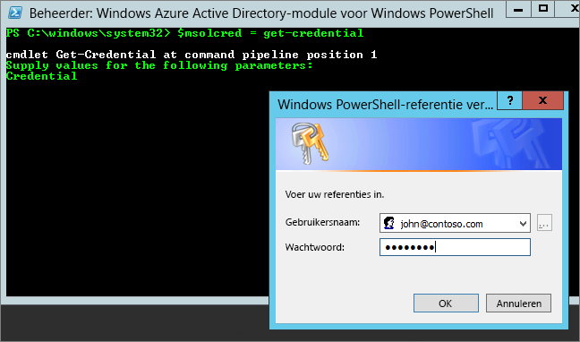

# <a name="administering-power-bi---frequently-asked-questions-faq"></a>Power BI beheren: veelgestelde vragen

Dit artikel bevat veelgestelde vragen over Power BI-beheer. Zie [Wat is Power BI beheer?](service-admin-administering-power-bi-in-your-organization.md) voor een overzicht van Power BI-beheer.

## <a name="whats-in-this-article"></a>In dit artikel

### <a name="sign-up-for-power-bi-section"></a>Registreren voor Power BI

* [PowerShell gebruiken](#using-powershell)
* [Hoe kunnen gebruikers zich registreren voor Power BI?](#how-do-users-sign-up-for-power-bi)
* [Hoe kunnen afzonderlijke gebruikers in mijn organisatie zich registreren?](#how-do-individual-users-in-my-organization-sign-up)
* [Hoe kan ik voorkomen dat gebruikers lid worden van mijn bestaande Office 365-tenant?](#how-can-i-prevent-users-from-joining-my-existing-office-365-tenant)
* [Hoe kan ik toestaan dat gebruikers lid worden van mijn bestaande Office 365-tenant?](#how-can-i-allow-users-to-join-my-existing-office-365-tenant)
* [Hoe kan ik controleren of blokkeren is ingeschakeld in de tenant?](#how-do-i-verify-if-i-have-the-block-on-in-the-tenant)
* [Hoe voorkom ik dat mijn bestaande gebruikers Power BI gaan gebruiken?](#how-can-i-prevent-my-existing-users-from-starting-to-use-power-bi)
* [Hoe kan ik mijn bestaande gebruikers toestaan zich te registreren voor Power BI?](#how-can-i-allow-my-existing-users-to-sign-up-for-power-bi)

### <a name="administration-of-power-bi-section"></a>Beheer van Power BI

* [Heeft dit invloed op hoe ik nu identiteiten voor gebruikers in mijn organisatie beheer?](#how-will-this-change-the-way-i-manage-identities-for-users-in-my-organization-today)
* [Hoe beheer ik Power BI?](#how-do-we-manage-power-bi)
* [Wat is het proces voor het beheren van een tenant die door Microsoft voor mijn gebruikers is gemaakt?](#what-is-the-process-to-manage-a-tenant-created-by-microsoft-for-my-users)
* [Kan ik beheren aan welke Office 365-tenant gebruikers worden toegevoegd, als ik meerdere domeinen heb?](#if-i-have-multiple-domains-can-i-control-the-office-365-tenant-that-users-are-added-to)
* [Hoe verwijder ik Power BI voor gebruikers die zich al hebben geregistreerd?](#how-do-i-remove-power-bi-for-users-that-already-signed-up)
* [Hoe weet ik wanneer nieuwe gebruikers lid zijn geworden van mijn tenants?](#how-do-i-know-when-new-users-have-joined-my-tenant)
* [Zijn er nog andere zaken waarop ik me moet voorbereiden?](#are-there-any-additional-things-i-should-be-prepared-for)
* [Waar bevindt mijn Power BI-tenant zich?](#where-is-my-power-bi-tenant-located)
* [Wat is de Power BI SLA (Service Level Agreement)?](#what-is-the-power-bi-sla)

### <a name="security-in-power-bi-section"></a>Beveiliging in Power BI

* [Voldoet Power BI aan nationale, regionale en branchespecifieke nalevingsvereisten?](#does-power-bi-meet-national-regional-and-industry-specific-compliance-requirements)
* [Hoe werkt beveiliging in Power BI?](#how-does-security-work-in-power-bi)

## <a name="sign-up-for-power-bi"></a>Registreren voor Power BI

### <a name="using-powershell"></a>PowerShell gebruiken

Voor sommige van de procedures in deze sectie zijn Windows PowerShell-scripts vereist. Als u niet bekend bent met PowerShell, is het raadzaam om eerst de handleiding [Aan de slag met Windows PowerShell](http://go.microsoft.com/fwlink/p/?LinkID=286814) door te nemen. Als u de scripts wilt uitvoeren, moet u eerst de meest recente 64-bits versie van [Azure Active Directory PowerShell for Graph](/powershell/azure/active-directory/) installeren.

### <a name="how-do-users-sign-up-for-power-bi"></a>Hoe kunnen gebruikers zich registreren voor Power BI?

Als beheerder kunt u zich registreren voor Power BI via de [Power BI-website](https://powerbi.microsoft.com) of [de pagina voor het kopen van services](https://admin.microsoft.com/AdminPortal/Home#/catalog) in het Office 365-beheercentrum. Als een beheerder zich voor Power BI registreert, kan diegene gebruikerslicenties toewijzen aan gebruikers die toegang nodig hebben.

Bovendien kunnen afzonderlijke gebruikers in uw organisatie zich mogelijk registreren voor Power BI via de [Power BI-website](https://powerbi.microsoft.com). Wanneer een gebruiker in uw organisatie zich registreert voor Power BI, krijgt die gebruiker automatisch een Power BI-licentie toegewezen. Meer informatie kunt u lezen in [Registreren voor Power BI als afzonderlijke gebruiker](service-self-service-signup-for-power-bi.md) en [Power BI-licenties in uw organisatie](service-admin-licensing-organization.md).

### <a name="how-do-individual-users-in-my-organization-sign-up"></a>Hoe kunnen afzonderlijke gebruikers in mijn organisatie zich registreren?

Er zijn drie scenario's die mogelijk van toepassing zijn op gebruikers in uw organisatie:

* **Scenario 1**: Uw organisatie heeft al een bestaande Office 365-omgeving en de gebruiker die zich registreert voor Power BI heeft al een Office 365-account.
    Als een gebruiker in dit scenario al een werk- of schoolaccount in de tenant heeft (bijvoorbeeld contoso.com) maar niet beschikt over Power BI, wordt het abonnement voor dat account geactiveerd door Microsoft. De gebruiker wordt vervolgens automatisch op de hoogte gesteld van het gebruik van de Power BI-service.

* **Scenario 2**: Uw organisatie heeft een bestaande Office 365-omgeving, maar de gebruiker die zich registreert voor Power BI heeft geen Office 365-account.
    In dit scenario heeft de gebruiker een e-mailadres in het domein van uw organisatie (bijvoorbeeld contoso.com), maar nog geen Office 365-account. In dit geval kan de gebruiker zich registreren voor Power BI, waarna die persoon automatisch een account krijgt. Hiermee krijgt de gebruiker toegang tot de Power BI-service. Als een werknemer genaamd Nancy bijvoorbeeld haar zakelijke e-mailadres (zoals nancy@contoso.com) gebruikt om zich te registreren, voegt Microsoft Nancy automatisch toe als gebruiker in de Office 365-omgeving van Contoso en wordt Power BI voor dat account geactiveerd.

* **Scenario 3**: Uw organisatie heeft nog geen Office 365-omgeving die is gekoppeld aan uw e-maildomein.
    Uw organisatie hoeft geen acties op het gebied van beheer uit te voeren om Power BI te gebruiken. Gebruikers worden toegevoegd aan een nieuwe gebruikersdirectory die alleen van toepassing is op clouddiensten en u kunt de rol van tenant-beheerder aannemen om de gebruikers te beheren.

> [!IMPORTANT]
> Als uw organisatie meerdere e-maildomeinen heeft en u alle e-mailadresextensies in dezelfde tenant wilt houden, voegt u alle e-mailadresdomeinen aan een Azure Active Directory-tenant toe voordat gebruikers zich registreren. Er is geen geautomatiseerd mechanisme om gebruikers over te plaatsen naar andere tenants als deze eenmaal zijn gemaakt. Voor meer informatie over dit proces bekijkt u [Kan ik beheren aan welke Office 365-tenant gebruikers worden toegevoegd, als ik meerdere domeinen heb?](#if-i-have-multiple-domains-can-i-control-the-office-365-tenant-that-users-are-added-to) verderop in dit artikel en [Een domein toevoegen aan Office 365](/office365/admin/setup/add-domain/).

### <a name="how-can-i-prevent-users-from-joining-my-existing-office-365-tenant"></a>Hoe kan ik voorkomen dat gebruikers lid worden van mijn bestaande Office 365-tenant?

Er zijn stappen die u als beheerder kunt uitvoeren om te voorkomen dat gebruikers lid worden van uw bestaande Office 365-tenant. Als u de toegang blokkeert, mislukken pogingen van gebruikers om zich te registreren en krijgen ze een bericht dat ze contact kunnen opnemen met de beheerder van hun organisatie. U hoeft dit proces niet te herhalen als u automatische distributie van licenties (zoals Office 365 voor onderwijs voor studenten, onderwijsmedewerkers en personeel) al hebt uitgeschakeld.

Gebruik het volgende PowerShell-script om te voorkomen dat nieuwe gebruikers lid worden van een beheerde tenant. [Meer informatie over PowerShell](#basic-powershell-information)

```powershell
$msolcred = get-credential
connect-msolservice -credential $msolcred

Set-MsolCompanySettings -AllowEmailVerifiedUsers $false
```

> [!NOTE]
> Het blokkeren van toegang voorkomt dat nieuwe gebruikers in uw organisatie zich kunnen registreren voor Power BI. Gebruikers die zich registreren voor Power BI voordat nieuwe registraties voor uw organisatie worden uitgeschakeld, behouden hun licentie. Als u een gebruiker wilt verwijderen, leest u [Hoe verwijder ik Power BI voor gebruikers die zich al hebben geregistreerd?](#how-do-i-remove-power-bi-for-users-that-already-signed-up) verderop in dit artikel.

### <a name="how-can-i-allow-users-to-join-my-existing-office-365-tenant"></a>Hoe kan ik toestaan dat gebruikers lid worden van mijn bestaande Office 365-tenant?

Gebruik het volgende PowerShell-script om toe te staan dat nieuwe gebruikers lid worden van een beheerde tenant. [Meer informatie over PowerShell](#basic-powershell-information)

```powershell
$msolcred = get-credential
connect-msolservice -credential $msolcred

Set-MsolCompanySettings -AllowEmailVerifiedUsers $true
```

### <a name="how-do-i-verify-if-i-have-the-block-on-in-the-tenant"></a>Hoe kan ik controleren of blokkeren is ingeschakeld in de tenant?

Gebruik het volgende PowerShell-script om instellingen te controleren. *AllowEmailVerifiedUsers* moet false zijn. [Meer informatie over PowerShell](#basic-powershell-information)

```powershell
$msolcred = get-credential
connect-msolservice -credential $msolcred

Get-MsolCompanyInformation | fl allow*
```

### <a name="how-can-i-prevent-my-existing-users-from-starting-to-use-power-bi"></a>Hoe voorkom ik dat mijn bestaande gebruikers Power BI gaan gebruiken?

De Azure AD-instelling waarmee dit wordt bepaald, is **AllowAdHocSubscriptions**. Bij de meeste tenants is deze instelling ingesteld op true, wat betekent dat de instelling is ingeschakeld. Als u Power BI hebt gekocht via een partner, kan deze instelling zijn ingesteld op false, wat betekent dat de instelling is uitgeschakeld.

Gebruik het volgende PowerShell-script om ad hoc-abonnementen uit te schakelen. [Meer informatie over PowerShell](#basic-powershell-information)

1. Meld u aan bij Azure Active Directory met uw Office 365-referenties. Met de eerste regel van het volgende PowerShell-script wordt u om uw referenties gevraagd. De tweede regel maakt verbinding met Azure Active Directory.

    ```powershell
     $msolcred = get-credential
     connect-msolservice -credential $msolcred
    ```

   

1. Nadat u bent aangemeld, voert u de volgende opdracht uit om te controleren hoe uw tenant momenteel is geconfigureerd.

    ```powershell
     Get-MsolCompanyInformation | fl AllowAdHocSubscriptions
    ```
1. Voer de volgende opdracht uit om **AllowAdHocSubscriptions** in te schakelen ($true) of uit te schakelen ($false).

    ```powershell
     Set-MsolCompanySettings -AllowAdHocSubscriptions $false
    ```

> [!NOTE]
> De vlag AllowAdHocSubscriptions wordt gebruikt voor het beheren van verschillende gebruikersmogelijkheden in uw organisatie, inclusief de mogelijkheid voor gebruikers om zich te registreren voor de Azure Rights Management-service. Het wijzigen van deze vlag heeft invloed op al deze mogelijkheden.

### <a name="how-can-i-allow-my-existing-users-to-sign-up-for-power-bi"></a>Hoe kan ik mijn bestaande gebruikers toestaan zich te registreren voor Power BI?

Als u wilt toestaan dat uw bestaande gebruikers zich registreren voor Power BI, voert u de opdracht uit die wordt vermeld voor de bovenstaande vraag, maar geeft u in de laatste stap true op in plaats van false.

## <a name="administration-of-power-bi"></a>Beheer van Power BI

### <a name="how-will-this-change-the-way-i-manage-identities-for-users-in-my-organization-today"></a>Heeft dit invloed op hoe ik nu identiteiten voor gebruikers in mijn organisatie beheer?

Er zijn drie scenario's die mogelijk van toepassing zijn op gebruikers in uw organisatie:

* **Scenario 1**: Als uw organisatie al een bestaande Office 365-omgeving heeft en alle gebruikers in uw organisatie Office 365-accounts hebben, verandert er niets aan het beheer van identiteiten.

* **Scenario 2**: Als uw organisatie al een bestaande Office 365-omgeving heeft, maar niet alle gebruikers in uw organisatie een Office 365-account hebben, maken we een gebruiker in de tenant en wijzen we licenties toe op basis van het werk- of school-e-mailadres van de gebruiker.

    Dit wil zeggen dat het aantal gebruikers dat u beheert, zal toenemen naarmate er meer gebruikers in uw organisatie zich registreren voor de service.

* **Scenario 3**: Als uw organisatie nog geen Office 365-omgeving aan uw e-maildomein heeft gekoppeld, verandert er niets aan uw identiteitsbeheer.

    Gebruikers worden toegevoegd aan een nieuwe gebruikersdirectory die alleen van toepassing is op clouddiensten en u kunt de rol van tenant-beheerder aannemen om de gebruikers te beheren.

### <a name="how-do-we-manage-power-bi"></a>Hoe beheer ik Power BI?

Power BI biedt een beheerportal waarmee u gebruiksstatistieken kunt bekijken, biedt een koppeling naar het Office 365-beheercentrum om gebruikers en groepen te beheren en biedt de mogelijkheid om instellingen voor de hele tenant te beheren.

Om toegang te krijgen tot het Power BI-beheerportal, moet uw account zijn ingesteld als een **Globale beheerder** in Office 365 of Azure Active Directory, of moet de rol van beheerder van de Power BI-service aan het account zijn toegewezen. Zie [Uitleg over de Power BI-beheerdersrol](service-admin-role.md) en [Power BI-beheerportal](service-admin-portal.md) voor meer informatie.

### <a name="what-is-the-process-to-manage-a-tenant-created-by-microsoft-for-my-users"></a>Wat is het proces voor het beheren van een tenant die door Microsoft voor mijn gebruikers is gemaakt?

Als een tenant is gemaakt door Microsoft, kunt u deze claimen en beheren met behulp van de volgende stappen:

1. Word lid van de tenant door u te registeren voor Power BI met een e-mailadresdomein dat overeenkomt met het tenantdomein dat u wilt beheren. Als Microsoft bijvoorbeeld de tenant contoso.com heeft gemaakt, wordt u lid van de tenant met een e-mailadres dat eindigt op @contoso.com.

1. Claim beheerrechten door te verifiëren dat u het domein bezit: zodra u lid bent van de tenant, kunt u uzelf de rol *Globale beheerder* geven door het eigendom van het domein te verifiëren. U kunt dit doen door de stappen in de [Office 365-documentatie](/office365/admin/misc/become-the-admin) te volgen.

### <a name="if-i-have-multiple-domains-can-i-control-the-office-365-tenant-that-users-are-added-to"></a>Kan ik beheren aan welke Office 365-tenant gebruikers worden toegevoegd, als ik meerdere domeinen heb?

Als u niets doet, wordt er een tenant gemaakt voor elk domein en subdomein dat hoort bij de e-mailadressen van uw gebruikers. Als u alle gebruikers wilt opnemen in dezelfde tenant, ongeacht de extensie van hun e-mailadres, maakt u van tevoren een tenant of gebruikt u een bestaande tenant en voegt u alle bestaande domeinen en subdomeinen toe die u in deze tenant wilt samenvoegen. Alle gebruikers met een e-mailadres dat eindigt op deze domeinen en subdomeinen, worden dan automatisch lid van de doel-tenant wanneer ze zich aanmelden.

> [!IMPORTANT]
> Er is geen ondersteuning voor een geautomatiseerd mechanisme om gebruikers over te plaatsen naar andere tenants als deze eenmaal zijn gemaakt. Zie [Add your users and domain to Office 365](/office365/admin/setup/add-domain/) (Uw gebruikers en domein toevoegen aan Office 365) voor meer informatie over het toevoegen van domeinen aan een enkele Office 365-tenant.

### <a name="how-do-i-remove-power-bi-for-users-that-already-signed-up"></a>Hoe verwijder ik Power BI voor gebruikers die zich al hebben geregistreerd?

Als een gebruiker zich heeft geregistreerd voor Power BI, maar u hem of haar geen toegang meer wilt geven tot Power BI, kunt u de Power BI-licentie voor die gebruiker verwijderen.

1. Ga naar het [Office 365-beheercentrum](https://admin.microsoft.com/AdminPortal/Home#/homepage).

1. Selecteer in de navigatiebalk **Gebruikers** > **Actieve gebruikers**.

1. Zoek de gebruiker waarvoor u de licentie wilt verwijderen en selecteer vervolgens de naam van die persoon.

    U kunt licentiebeheer voor gebruikers ook bulksgewijs uitvoeren. Als u dit wilt doen, selecteert u meerdere gebruikers en selecteert u **Productlicenties bewerken**.

1. Selecteer op de pagina met gebruikersgegevens **Bewerken** naast **Productlicenties**.

1. Stel **Power BI (gratis)** of **Power BI Pro** in op **Uit**, afhankelijk van welke licentie op het account is toegepast.

1. Selecteer **Opslaan**.

### <a name="how-do-i-know-when-new-users-have-joined-my-tenant"></a>Hoe weet ik wanneer nieuwe gebruikers lid zijn geworden van mijn tenants?

Gebruikers die lid zijn geworden van uw tenant als onderdeel van dit programma worden een unieke licentie toegewezen. U kunt hierop filteren in het beheerdashboard in het deelvenster met actieve gebruikers. Volg deze stappen voor het maken van deze nieuwe weergave.

1. Ga naar het [Office 365-beheercentrum](https://admin.microsoft.com/AdminPortal/Home#/homepage).

1. Selecteer in de navigatiebalk **Gebruikers** > **Actieve gebruikers**.

1. Selecteer **Aangepaste weergave toevoegen** in het menu **Weergaven**.

1. Geef de nieuwe weergave een naam en selecteer onder **Toegewezen productlicentie** **Power BI (gratis)** of **Power BI Pro**.

    U kunt slechts één licentie per weergave selecteren. Als u licenties voor zowel **Power BI (gratis)** als **Power BI Pro** hebt voor uw organisatie, kunt u twee weergaven maken.

1. Voer desgewenst nog andere voorwaarden in en selecteer vervolgens **Toevoegen**.

1. Zodra de nieuwe weergave is gemaakt, is deze beschikbaar via het menu **Weergaven**.

### <a name="are-there-any-additional-things-i-should-be-prepared-for"></a>Zijn er nog andere zaken waarop ik me moet voorbereiden?

U kunt een toename in aanvragen voor het opnieuw instellen van wachtwoorden ervaren. Zie [Reset a user's password](/office365/admin/add-users/reset-passwords) (Het wachtwoord van een gebruiker opnieuw instellen) voor meer informatie over dit proces.

U kunt een gebruiker uit uw tenant verwijderen via het standaardproces in het Office 365-beheercentrum. Als de gebruiker echter nog steeds een actief e-mailadres van uw organisatie heeft, kan die persoon opnieuw lid worden, tenzij u dit blokkeert voor alle gebruikers.

### <a name="where-is-my-power-bi-tenant-located"></a>Waar bevindt mijn Power BI-tenant zich?

Zie [Waar bevindt mijn Power BI-tenant zich?](service-admin-where-is-my-tenant-located.md) voor informatie over de gegevensregio waarin uw Power BI-tenant zich bevindt.

### <a name="what-is-the-power-bi-sla"></a>Wat is de SLA voor Power BI?

Raadpleeg het artikel [Licensing Terms and Documentation](http://www.microsoftvolumelicensing.com/DocumentSearch.aspx?Mode=3&DocumentTypeId=37) (Licentievoorwaarden en documentatie) in het gedeelte **Licensing** (Licentieverlening) van de website Microsoft Licensing voor meer informatie over de Power BI SLA (Service Level Agreement).

## <a name="security-in-power-bi"></a>Beveiliging in Power BI

### <a name="does-power-bi-meet-national-regional-and-industry-specific-compliance-requirements"></a>Voldoet Power BI aan nationale, regionale en branchespecifieke nalevingsvereisten?

Lees meer informatie over Power BI-naleving in het [Microsoft Vertrouwenscentrum](https://www.microsoft.com/en-us/TrustCenter/CloudServices/business-application-platform/default.aspx).

### <a name="how-does-security-work-in-power-bi"></a>Hoe werkt beveiliging in Power BI?

Power BI is gebouwd op basis van Office 365, dat op zijn beurt is gebaseerd op Azure-services zoals Azure Active Directory. Zie [Beveiliging van Power BI](service-admin-power-bi-security.md) voor een overzicht van Power BI-architectuur.

## <a name="next-steps"></a>Volgende stappen

[Power BI-beheerportal](service-admin-portal.md)  
[Understanding the Power BI admin role](service-admin-role.md) (Power BI-beheerdersrol)  
[Registreren voor Power BI via selfservice](service-self-service-signup-for-power-bi.md)  
[Purchasing Power BI Pro](service-admin-purchasing-power-bi-pro.md) (Power BI Pro kopen)  
[Wat is Power BI Premium?](service-premium.md)  
[Power BI Premium aanschaffen](service-admin-premium-purchase.md)  
[Technisch document over Power BI Premium](https://aka.ms/pbipremiumwhitepaper)  
[Uw groep beheren in Power BI en Office 365](service-manage-app-workspace-in-power-bi-and-office-365.md)  
[Office 365 user account management](/office365/servicedescriptions/office-365-platform-service-description/user-account-management/) (Beheer van Office 365-gebruikersaccounts)  
[Office 365 group management](/office365/admin/email/create-edit-or-delete-a-security-group/) (Beheer van Office 365-groepen)  

Hebt u nog vragen? [Misschien dat de Power BI-community het antwoord weet](http://community.powerbi.com/)
