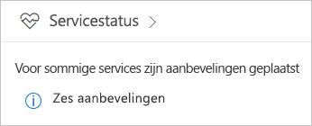
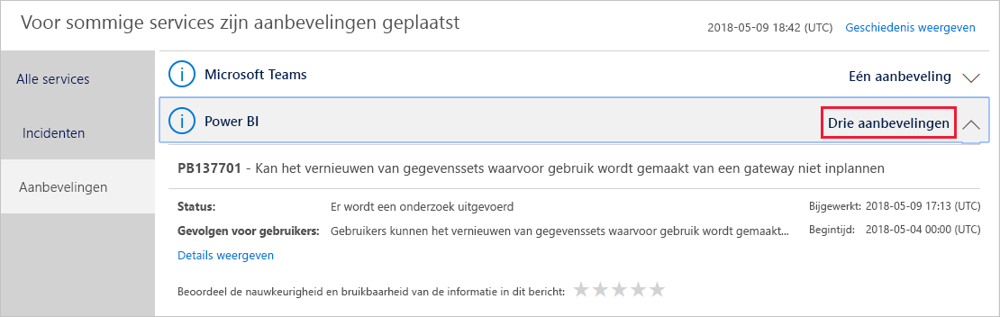
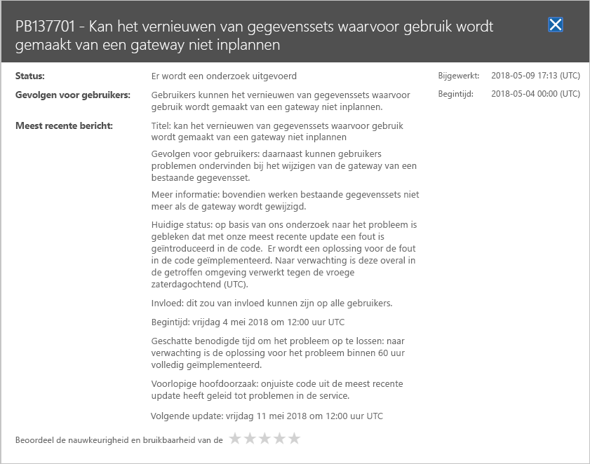

# Status van de Power BI-service in Office 365 bijhouden

Het Office 365-beheercentrum bevat belangrijk hulpprogramma's voor Power BI-beheerders. Daarnaast vindt u hier huidige en historische informatie over de status van de service. Voor toegang tot deze informatie hebt u de rol Power BI-servicebeheerder of globale beheerder van Office 365 nodig. Zie het Engelstalige artikel [Administrator roles related to Power BI](service-admin-administering-power-bi-in-your-organization.md#administrator-roles-related-to-power-bi) (Beheerdersrollen voor Power BI) voor meer informatie over rollen.

1. Meld u aan bij het [Office 365-beheercentrum](https://portal.office.com/adminportal).

1. Selecteer de tegel **Servicestatus**.

    

1. Selecteer **N adviesrapporten** of **N incidenten** in de huidige lijst en bekijk de resultaten. In de onderstaande afbeelding ziet u een van drie actieve adviesrapporten.

    

1. Selecteer **Details weergeven** voor een item als u meer informatie wilt weergeven. In de onderstaande afbeelding ziet u aanvullende informatie, zoals recente statusupdates.

    

    Schuif naar beneden om meer informatie te bekijken en sluit het deelvenster wanneer u klaar bent.

1. Als u historische informatie over alle services wilt weergeven, selecteert u **Geschiedenis weergeven** in de rechterbovenhoek van de hoofdlijst. Selecteer vervolgens **Afgelopen 7 dagen** of **Afgelopen 30 dagen**. Selecteer **Huidige status weergeven** om terug te gaan naar de huidige servicestatus.