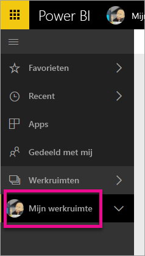
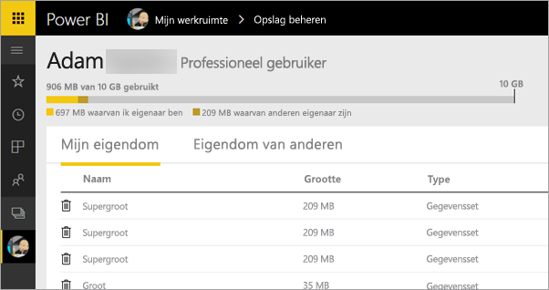
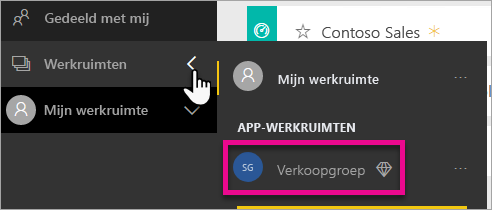
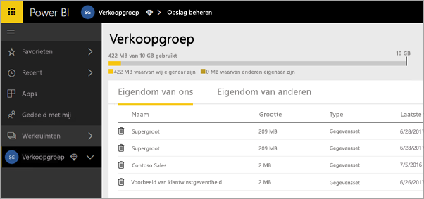
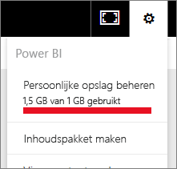
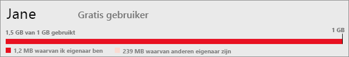
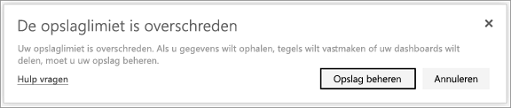

# Uw gegevensopslag beheren
Meer informatie over hoe u uw persoonlijke gegevensopslag, of opslag van de app-werkruimte, kunt beheren om ervoor te zorgen dat u rapporten en gegevenssets kunt blijven publiceren.

Gebruikers en app-werkruimten hebben hun eigen gegevenscapaciteit

* Gebruikers van gratis versies en Pro-versies hebben maximaal 10 GB gegevensopslag.
* Gebruikers van Pro-versies kunnen app-werkruimten maken, die elk maximaal 10 GB gegevensopslag hebben.

Op tenantniveau kan het totale gebruik niet 10 GB per Pro-gebruiker overschrijden over alle Pro-gebruikers van app-werkruimten in de tenant.

Meer informatie over andere functies van het [Power BI-prijsmodel](https://powerbi.microsoft.com/pricing).

Tot uw gegevensopslag behoren uw eigen gegevenssets en Excel-rapporten, en gegevenssets en rapporten die iemand met u heeft gedeeld. Gegevenssets zijn alle gegevensbronnen die u hebt geüpload of waarmee u verbinding hebt gemaakt, inclusief Power BI Desktop-bestanden en Excel-werkmappen die u gebruikt. Het volgende is ook opgenomen in uw gegevenscapaciteit.

* Excel-adresbereiken die zijn vastgemaakt aan dashboard.
* On-premises visualisaties van Reporting Services die zijn vastgemaakt aan een Power BI-dashboard.
* Geüploade afbeeldingen.

De grootte van een dashboard dat u deelt, is afhankelijk van waaraan het is vastgemaakt. Als u bijvoorbeeld items uit twee rapporten vastmaakt die deel uitmaken van twee verschillende gegevenssets, omvat de grootte beide gegevenssets.

<a name="manage"/>

## Items beheren waarvan u eigenaar bent
Zie hoeveel gegevensopslag u gebruikt in uw Power BI-account en beheer uw account.

1. Om uw eigen opslag te beheren, gaat u naar **Mijn werkruimte** in het navigatiedeelvenster links.
   
    
2. Selecteer het tandwielpictogram  in de rechterbovenhoek \> **Persoonlijke opslag beheren**.
   
    In de bovenste balk ziet u hoeveel u hebt gebruikt van uw opslaglimiet.
   
    
   
    De gegevenssets en rapporten worden gescheiden op twee tabbladen:
   
    **Items waarvan ik eigenaar ben:** dit zijn de rapporten en gegevenssets die u hebt geüpload naar uw Power BI-account, waaronder servicegegevenssets zoals Salesforce en Dynamics CRM.  
    **Items waarvan anderen eigenaar zijn:** anderen hebben deze rapporten en gegevenssets met u gedeeld.
3. Als u een gegevensset of rapport wilt verwijderen, selecteert u het prullenbakpictogram .

Bedenk dat u of iemand anders mogelijk rapporten en dashboards heeft die zijn gebaseerd op een gegevensset. Als u de gegevensset verwijdert, werken die rapporten en dashboards niet meer.

## Uw app-werkruimte beheren
1. Selecteer de pijl naast **Werkruimten** \> en selecteer de naam van de app-werkruimte.
   
    
2. Selecteer het tandwielpictogram  in de rechterbovenhoek \> **Persoonlijke opslag beheren**.
   
    In de bovenste balk ziet u hoeveel opslaglimiet van de groep is gebruikt.
   
    
   
    De gegevenssets en rapporten worden gescheiden op twee tabbladen:
   
    **Items waarvan wij eigenaar zijn:** dit zijn rapporten en gegevenssets die u of iemand anders heeft geüpload naar het Power BI-account van de groep, waaronder servicegegevenssets zoals Salesforce en Dynamics CRM.
    **Items waarvan anderen eigenaar zijn:** anderen hebben deze rapporten en gegevenssets met uw groep gedeeld.
3. Als u een gegevensset of rapport wilt verwijderen, selecteert u het prullenbakpictogram .
   
   > [!NOTE]
   > Elk lid, met bewerkingsmachtigingen, van een app-werkruimte is gemachtigd om gegevenssets en rapporten uit de app-werkruimte te verwijderen.
   > 
   > 

Bedenk dat u of iemand anders in de groep mogelijk rapporten en dashboards heeft die zijn gebaseerd op een gegevensset. Als u de gegevensset verwijdert, werken die rapporten en dashboards niet meer.

## Limieten voor de gegevensset
Er is een limiet van 1 GB per gegevensset die wordt geïmporteerd in Power BI. Als u ervoor hebt gekozen om de Excel-ervaring te houden, in plaats van de gegevens te importeren, bent u beperkt tot maximaal 250 MB voor de gegevensset.

## Wat er gebeurt wanneer u een limiet bereikt
Als u de gegevenscapaciteitslimiet bereikt, ziet u instructies in de service. 

Wanneer u het tandwielpictogram  selecteert, ziet u een rode balk die aangeeft dat u de limiet van uw gegevenscapaciteit hebt overschreden.

Dit wordt ook aangegeven in **Persoonlijke opslag beheren**.

 

 Wanneer u probeert een actie uit te voeren waardoor een limiet wordt bereikt, ziet u een waarschuwing waarin wordt aangegeven dat u de limiet hebt overschreden. U kunt uw opslag [beheren](#manage) om uw opslagruimte te verlagen en de limiet te omzeilen.

 

 Nog vragen? [Misschien dat de Power BI-community het antwoord weet](http://community.powerbi.com/)

