# Mobiele apps configureren met Microsoft Intune
Microsoft Intune stelt organisaties in staat hun apparaten en toepassingen te beheren. De mobiele toepassingen van Power BI voor iOS en Android kunt u integreren met Intune om de toepassing te beheren op uw apparaten en om de beveiliging te regelen. Met behulp van configuratieprofielen kunt u bijvoorbeeld een pincode voor toegang vereisen, beheren hoe gegevens door de toepassing worden verwerkt en zelfs toepassingsgegevens versleutelen wanneer de app niet wordt gebruikt.

<iframe width="560" height="315" src="https://www.youtube.com/embed/9HF-qsdQvHw?list=PLv2BtOtLblH1nPVPU2etFzTNmpz49dwXm" frameborder="0" allowfullscreen></iframe>

## Algemene configuratie van beheer van mobiele apparaten
Dit artikel is niet bedoeld als uitgebreide configuratiehandleiding voor Microsoft Intune. Als u nu pas de integratie met Intune gaat opzetten, zijn er een paar dingen die al moeten zijn ingesteld. [Meer informatie](https://technet.microsoft.com/library/jj676587.aspx)

Microsoft Intune kan naast een MDM-oplossing (beheer van mobiele apparaten) in Office 365 worden gebruikt. [Meer informatie](https://blogs.technet.microsoft.com/configmgrdogs/2016/01/04/microsoft-intune-co-existence-with-mdm-for-office-365/)

In dit artikel wordt ervan uitgegaan dat Intune correct is geconfigureerd en dat er apparaten zijn ingeschreven bij Intune. Als u ook een MDM-oplossing gebruikt, wordt het apparaat weergegeven als ingeschreven bij de MDM-oplossing, maar is het beschikbaar voor beheer in Intune.

> [!NOTE]
> Nadat uw organisatie Microsoft Intune MAM heeft geconfigureerd, wordt het vernieuwen van gegevens op de achtergrond uitgeschakeld wanneer u de mobiele Power BI-app gebruikt op een iOS- of Android-apparaat. De volgende keer dat u de app gebruikt, worden de gegevens vanuit de Power BI-service op internet vernieuwd.
> 
> 

## Stap 1: De URL voor de toepassing bepalen
Voordat we de toepassing in Intune gaan maken, moeten we de URL's voor de apps vaststellen. Voor iOS kan dit via iTunes. Voor Android gebruiken we hiervoor de pagina voor de mobiele Power BI-apps.

Sla de URL op, want u hebt deze nodig wanneer we de toepassing gaan maken.

### iOS
Als u de URL van de app wilt weten voor iOS, moeten we iTunes gebruiken.

1. Open iTunes.
2. Zoek naar *Power BI*.
3. **Microsoft Power BI** wordt als het goed is vermeld onder **iPhone-apps** en **iPad-apps**. Het maakt niet uit welke u kiest, want u krijgt dezelfde URL.
4. Selecteer de vervolgkeuzelijst **Ophalen** en selecteer **Kopieer koppeling** in de vervolgkeuzelijst.
   
    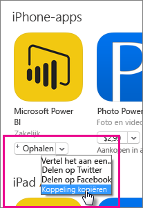

De koppeling moet er als volgt uitzien.

    https://itunes.apple.com/us/app/microsoft-power-bi/id929738808?mt=8

### Android
U kunt de URL naar Google Play verkrijgen via de [pagina voor mobiele Power BI-apps](https://powerbi.microsoft.com/mobile/). Als u op het pictogram **Download from Google Play** klikt, gaat u naar de pagina van de app. U kunt de URL nu uit de adresbalk van de browser kopiëren. De koppeling moet er als volgt uitzien.

    https://play.google.com/store/apps/details?id=com.microsoft.powerbim

## Stap 2: Een Mobile Application Management-beleid opstellen
Via het Mobile Application Management-beleid kunt u beveiliging afdwingen zoals het invoeren van een pincode om toegang te krijgen. U kunt een beleid opstellen in de Intune-portal. 

U kunt de toepassing of het beleid eerst maken. De volgorde waarin u dit doet, is niet van belang. Ze moeten alleen beide bestaan om de implementatiestap te kunnen uitvoeren.

1. Selecteer **Beleid** > **Configuratiebeleid**.
   
    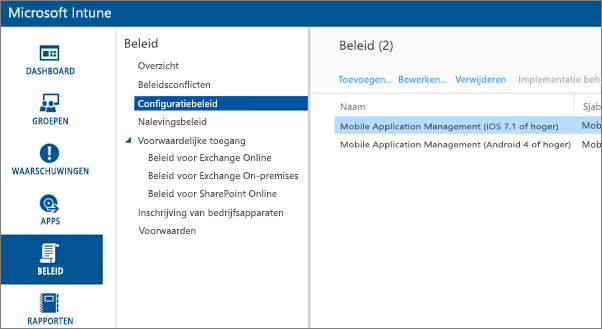
2. Selecteer **Toevoegen…**.
3. Onder **Software** kunt u Mobile Application Management selecteren voor Android of iOS. Om snel aan de slag te gaan, kunt u **Een aangepast beleid met de aanbevolen instellingen maken** selecteren of u kunt een aangepast beleid maken.
4. Bewerk het beleid om de beperkingen te configureren die u wilt instellen voor de toepassing.

## Stap 3: De toepassing maken
De toepassing is een verwijzing (ook wel pakket genoemd) die in Intune wordt opgeslagen voor implementatie. We moeten een toepassing maken en verwijzen naar de URL van de app die we eerder hebben opgehaald via Google Play of iTunes.

U kunt de toepassing of het beleid eerst maken. De volgorde waarin u dit doet, is niet van belang. Ze moeten alleen beide bestaan om de implementatiestap te kunnen uitvoeren.

1. Ga naar de Intune-portal en selecteer **Apps** in het menu links.
2. Selecteer **App toevoegen**. Het onderdeel de **Software toevoegen** wordt nu gestart.

### iOS
1. Selecteer **Beheerde iOS-app uit de App Store** in de vervolgkeuzelijst.
2. Voer de URL van de app uit [Stap 1](#step-1-get-the-url-for-the-application) in en selecteer **Volgende**.
   
    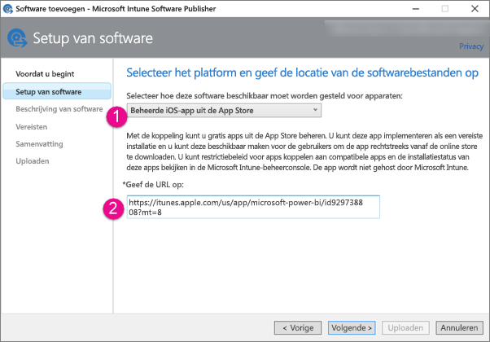
3. Geef waarden op voor **Uitgever**, **Naam** en **Beschrijving**. U kunt desgewenst ook een**pictogram** kiezen. **Categorie** is voor de bedrijfsportal-app. Selecteer **Volgende** als u klaar bent.
4. U kunt aangeven of u de app wilt publiceren als **Elke** (standaard), **iPad** of **iPhone**. Standaard wordt **Elke** weergegeven en dit werkt voor beide typen apparaten. De Power BI-app heeft dezelfde URL voor iPhone en iPad. Selecteer **Volgende**.
5. Selecteer **Uploaden**.

> [!NOTE]
> Het kan zijn dat de app pas wordt weergeven in de lijst met apps nadat u de pagina hebt vernieuwd. Klik op **Overzicht** en ga dan terug naar **Apps** om de pagina opnieuw te laden.
> 
> 

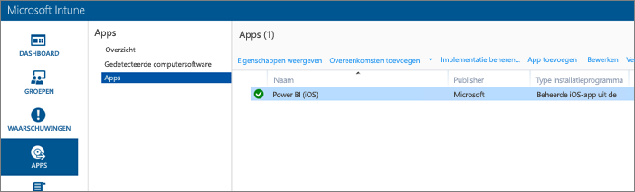

### Android
1. Selecteer **Externe koppeling** in de vervolgkeuzelijst.
2. Voer de URL van de app uit [Stap 1](#step-1-get-the-url-for-the-application) in en selecteer **Volgende**.
   
    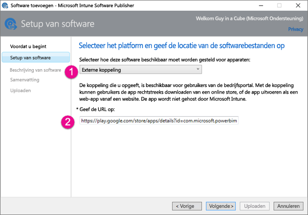
3. Geef waarden op voor **Uitgever**, **Naam** en **Beschrijving**. U kunt desgewenst ook een**pictogram** kiezen. **Categorie** is voor de bedrijfsportal-app. Selecteer **Volgende** als u klaar bent.
4. Selecteer **Uploaden**.

> [!NOTE]
> Het kan zijn dat de app pas wordt weergeven in de lijst met apps nadat u de pagina hebt vernieuwd. Klik op **Overzicht** en ga dan terug naar **Apps** om de pagina opnieuw te laden.
> 
> 

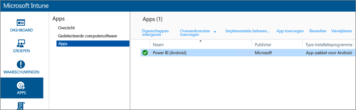

## Stap 4: De toepassing implementeren
Nadat u de toepassing hebt toegevoegd, moet u deze implementeren zodat uw eindgebruikers ermee aan de slag kunnen. Dit is de stap waarin u het beleid toepast dat u hebt gemaakt met de app.

### iOS
1. Selecteer de app die u hebt gemaakt op het scherm met apps. Selecteer vervolgens de koppeling **Implementatie beheren**.
   
    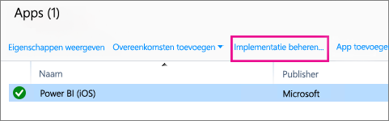
2. Op het scherm **Groepen selecteren** kunt u kiezen in welke groepen u deze app wilt implementeren. Selecteer **Volgende**.
3. Op het scherm **Implementatieactie** kunt u kiezen in welke groepen u deze app wilt implementeren. Selecteer **Beschikbare installatie** of **Vereiste installatie** om de app beschikbaar te maken in de bedrijfsportal, zodat gebruikers deze op aanvraag kunnen installeren. Selecteer **Volgende** als u een keuze hebt gemaakt.
   
    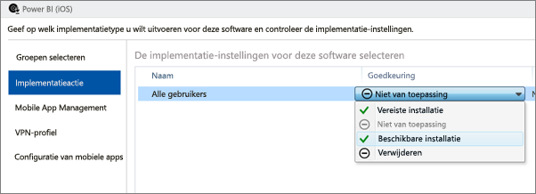
4. Op het scherm **Mobile App Management** kunt u het Mobile Application Management-beleid selecteren dat we hebben gemaakt in [Stap 2](#step-2-create-a-mobile-application-management-policy). Hier wordt standaard het beleid geselecteerd dat u hebt opgesteld, als dat het enige beschikbare iOS-beleid is. Selecteer **Volgende**.
   
    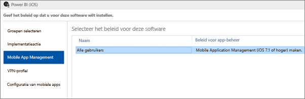
5. Op het scherm **VPN-profiel** kunt u een beleid selecteren, als er een beleid bestaat voor uw organisatie. De standaardinstelling is **Geen**. Selecteer **Volgende**.
6. Op het scherm **Configuratie van mobiele apps** kunt u een **app-configuratiebeleid** selecteren als u dat hebt gemaakt. De standaardinstelling is **Geen**. Dit is niet vereist. Selecteer **Voltooien**.

Nadat u de app hebt geïmplementeerd, wordt op de pagina met apps **Ja** weergegeven voor Geïmplementeerd.

### Android
1. Selecteer de app die u hebt gemaakt op het scherm met apps. Selecteer vervolgens de koppeling **Implementatie beheren**.
   
    
2. Op het scherm **Groepen selecteren** kunt u kiezen in welke groepen u deze app wilt implementeren. Selecteer **Volgende**.
3. Op het scherm **Implementatieactie** kunt u kiezen in welke groepen u deze app wilt implementeren. Selecteer **Beschikbare installatie** of **Vereiste installatie** om de app beschikbaar te maken in de bedrijfsportal, zodat gebruikers deze op aanvraag kunnen installeren. Selecteer **Volgende** als u een keuze hebt gemaakt.
   
    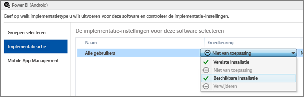
4. Op het scherm **Mobile App Management** kunt u het Mobile Application Management-beleid selecteren dat we hebben gemaakt in [Stap 2](#step-2-create-a-mobile-application-management-policy). Hier wordt standaard het beleid geselecteerd dat u hebt opgesteld, als dat het enige beschikbare Android-beleid is. Selecteer **Voltooien**.
   
    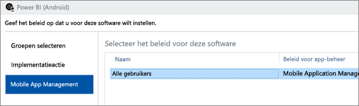

Nadat u de app hebt geïmplementeerd, wordt op de pagina met apps **Ja** weergegeven voor Geïmplementeerd.

## Stap 5: De toepassing op een apparaat installeren
U installeert de toepassing via de bedrijfsportal-app. Als u de bedrijfsportal nog niet hebt geïnstalleerd, kunt u deze downloaden via de App Store van iOS of Android. U moet de referenties van uw organisatie gebruiken om u aan te melden bij de bedrijfsportal.

1. Open de bedrijfsportal-app.
2. Als de Power BI-app niet wordt weergegeven als een aanbevolen app, selecteert u **Bedrijfsapps**.
   
    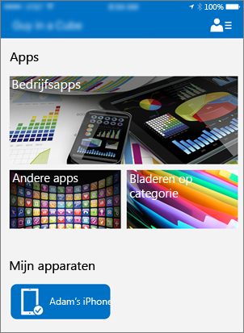
3. Selecteer de Power BI-app die u hebt geïmplementeerd.
   
    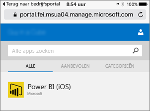
4. Selecteer **Installeren**.
   
    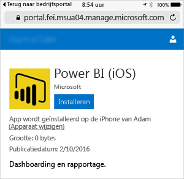
5. Als u iOS gebruikt, wordt de app naar uw apparaat gepusht. Selecteer **Installeer** in het dialoogvenster van de push-melding.
   
    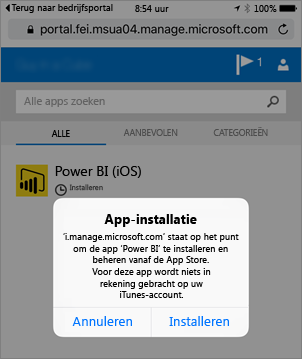

Nadat de app is geïnstalleerd, ziet u de status **Beheerd door uw bedrijf**. Als u toegang met een pincode hebt ingeschakeld, ziet u het volgende.

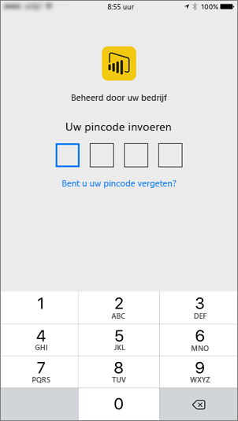

## Volgende stappen
[Mobile Application Management-beleid configureren en implementeren in de Microsoft Intune-console](https://technet.microsoft.com/library/dn878026.aspx)  
[Power BI-apps voor mobiele apparaten](mobile-apps-for-mobile-devices.md)  

Nog vragen? [Misschien dat de Power BI-community het antwoord weet](http://community.powerbi.com/)

