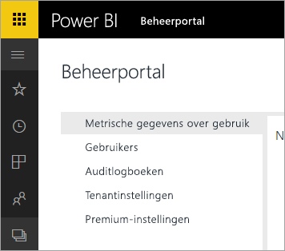

# Power BI voor Office 365 is buiten gebruik gesteld
Power BI voor Office 365, een eerdere versie van Power BI, is overgegaan naar de huidige versie van [Power BI](https://powerbi.microsoft.com). Gebruikers die eerder **Power BI voor Office 365** hebben gebruikt, kunnen de huidige versie van Power BI gebruiken. U vindt hier [meer informatie over Power BI](service-get-started.md).

## De beheerportal
U hebt geen toegang meer tot de beheerportal van **Power BI voor Office 365**. Beheerders kunnen de nieuwe [beheerportal](https://app.powerbi.com/admin-portal) gebruiken om de Power BI-abonnementen van hun organisatie te beheren.

Zie [Power BI-beheerportal](service-admin-portal.md) voor meer informatie.

## Volgende stappen
[Aan de slag met Power BI](service-get-started.md)

[Aan de slag met Power BI Desktop](desktop-getting-started.md)

[Power BI in uw organisatie beheren](service-admin-administering-power-bi-in-your-organization.md)