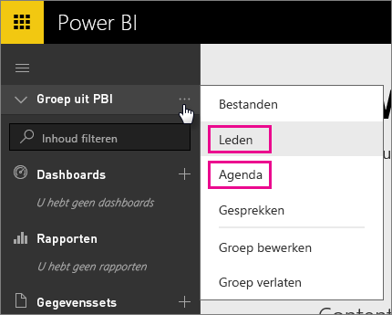
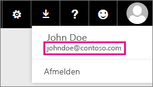

# Klanten met Office 365 Dedicated - bekende problemen
Power BI wordt nu ondersteund voor klanten met Office 365 Dedicated.  Als u een O365 Dedicated-klant bent, kunt u zich aanmelden met een account van deze tenant en Power BI gebruiken. Er zijn momenteel twee bekende problemen.

## Groepen
Bij het selecteren van **Leden** of **Agenda** in het contextmenu Groep, wordt u omgeleid naar de Mail-app.  **Bestanden** en **Conversaties** werken zoals verwacht.

## iPhone-app - aanmelden met een aangepast domein leidt tot een fout
Wanneer u zich op de iPhone-app aanmeldt met een aangepast domein, kan een fout optreden.

*Fout bij aanmelden*  
*Er is een onverwachte interne fout opgetreden. Probeer het opnieuw.*

U kunt dit tijdelijk oplossen door u aan te melden met het e-mailadres dat wordt weergegeven wanneer u op het gebruikerspictogram klikt binnen de Power BI-service in plaats van het aangepaste domein.

Nog vragen? [Misschien dat de Power BI-community het antwoord weet](http://community.powerbi.com/)

