# Power BI-beheerportal
De beheerportal bevat opties voor het beheer van tenants van Power BI in uw organisatie. De portal bevat onder andere metrische gegevens over gebruik, toegang tot het Office 365-beheercentrum en instellingen.

Het beheer van tenants van Power BI voor uw bedrijf loopt via de Power BI-beheerportal. Het beheerportal is toegankelijk voor alle gebruikers die globale beheerders zijn in Office 365 of die de rol van beheerder van Power BI-service hebben. Zie [Understanding the Power BI admin role](service-admin-role.md) (Power BI-beheerdersrol) voor meer informatie over de beheerdersrol voor de Power BI-service.

Alle gebruikers zien de optie **Beheerportal** als ze het tandwielpictogram kiezen. Gebruikers die geen beheerder zijn, zien alleen de sectie **Premium-instellingen**, met alleen de capaciteiten waarvoor ze over de vereiste rechten beschikken.

## Toegang krijgen tot de beheerportal
Om toegang te krijgen tot het Power BI-beheerportal, moet uw account zijn ingesteld als een **Globale beheerder**, in Office 365 of Azure Active Directory, of moet de rol van beheerder van de Power BI-service aan het account zijn toegewezen. Zie [Understanding the Power BI admin role](service-admin-role.md) (Power BI-beheerdersrol) voor meer informatie over de beheerdersrol voor de Power BI-service. Ga op de volgende manier te werk om de Power BI-beheerportal te openen.

1. Selecteer het tandwielpictogram in de rechterbovenhoek van de Power BI-service.
2. Selecteer **Beheerportal**.

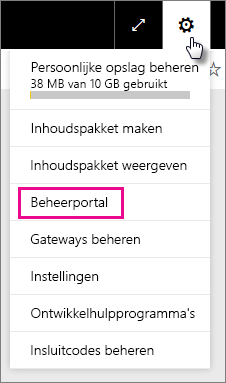

In de portal ziet u vijf tabbladen. Deze worden hieronder beschreven.

* [Metrische gegevens over gebruik](#usage-metrics)
* [Gebruikers](#users)
* [Auditlogboeken](#audit-logs)
* [Tenantinstellingen](#tenant-settings)
* [Premium-instellingen](#premium-settings)

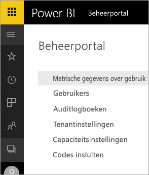

## Metrische gegevens over gebruik
Het eerste tabblad in het beheerportal is **Metrische gegevens over gebruik**. Het rapport Metrische gegevens over gebruik biedt u de mogelijkheid om het gebruik binnen Power BI te controleren voor uw organisatie. Daarnaast kunt u in het rapport zien welke gebruikers, en groepen, het actiefst zijn binnen Power BI voor uw organisatie.

> [!NOTE]
> De eerste keer dat u het dashboard opent, of als u het dashboard weergeeft nadat u het lange tijd niet hebt gebruikt, ziet u waarschijnlijk een melding dat het dashboard wordt geladen.
> 
> 

Als dat is gebeurd, ziet u twee secties met tegels. De eerste sectie bevat gebruiksgegevens voor individuele gebruikers en de tweede sectie vergelijkbare informatie voor groepen in uw organisatie.

Hier volgt een overzicht van wat u in elke tegel ziet:

* Unieke telling van alle dashboards, rapporten en gegevenssets in de werkruimte voor gebruikers
  
    
* Het meest gebruikte dashboard qua het aantal gebruikers dat er toegang tot heeft. Als u bijvoorbeeld een dashboard hebt dat u hebt gedeeld met drie gebruikers en u het dashboard ook hebt toegevoegd aan een inhoudspakket waarmee twee verschillende gebruikers verbinding hebben gemaakt, zou het aantal uitkomen op 6 (1 + 3 + 2)
  
    
* De meest populaire inhoud waarmee gebruikers verbinding hebben gemaakt. Het betreft hier alle inhoud die de gebruikers kunnen bereiken via het proces Gegevens ophalen, zoals SaaS-inhoudspakketten, organisatie-inhoudspakketten, bestanden of databases.
  
    
* Een weergave van de actiefste gebruikers op basis van hoeveel dashboards ze hebben, zowel dashboards die ze zelf hebben gemaakt en dashboards die met ze zijn gedeeld.
  
    
* Een weergave van de actiefste gebruikers op basis van de hoeveelheid rapporten die ze hebben.
  
    

De tweede sectie bevat hetzelfde type informatie, maar dan op basis van groepen. Hier kunt u zien welke groepen in uw organisatie het actiefst zijn en wat voor soort informatie ze gebruiken.

Aan de hand van deze informatie kunt u een goed beeld krijgen van hoe Power BI in uw organisatie wordt gebruikt. Daarnaast kunt u zien welke gebruikers, en groepen, zeer actief zijn in uw organisatie.

## Gebruikers
Het tweede tabblad in de beheerportal is **Gebruikers beheren**. Gebruikersbeheer voor Power BI wordt uitgevoerd in het Office 365-beheercentrum. Via deze sectie kunt u snel naar het gebied in Office 365 gaan voor het beheren van gebruikers, beheerders en groepen.

Wanneer u klikt op **Naar het beheercentrum van O365**, gaat u rechtstreeks naar de startpagina van het Office 365-beheercentrum, waar u de gebruikers van uw tenant kunt beheren.

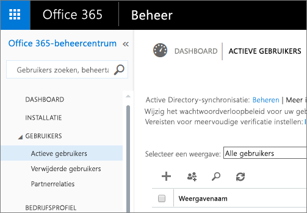

## Auditlogboeken
Het derde tabblad in de beheerportal is **Auditlogboeken**. De logboeken bevinden zich in het Beveiliging en compliancecentrum van Office 365. Via deze sectie kunt u snel toegang krijgen tot het desbetreffende gebied in Office 365. 

Meer informatie over auditlogboeken vindt u in [Auditing Power BI in your organization](service-admin-auditing.md) (Power BI controleren in uw organisatie).

## Tenantinstellingen
Het derde tabblad in de beheerportal is **Tenantinstellingen**. Via tenantinstellingen hebt u meer controle over welke functies beschikbaar worden gesteld aan uw organisatie. Als u zich zorgen maakt over gevoelige gegevens, zijn sommige van onze functies mogelijk niet geschikt voor uw organisatie, of misschien wilt u alleen een bepaalde functie beschikbaar stellen aan een specifieke groep. Als dat het geval is, kunt u functies uitschakelen in uw tenant.

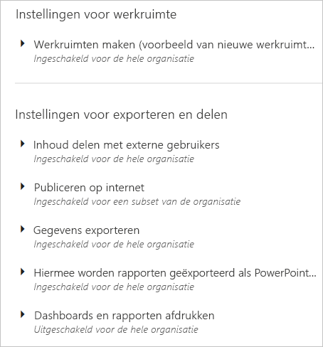

> [!NOTE]
> Het kan maximaal tien minuten duren voordat de instelling voor iedereen in uw tenant is doorgevoerd.
> 
> 

Instellingen kunnen drie statuswaarden hebben op basis van de instellingen die u hebt opgegeven.

### Uitgeschakeld voor de hele organisatie
U kunt een functie uitschakelen, zodat gebruikers deze niet kunnen gebruiken.

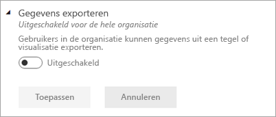

### Ingeschakeld voor de hele organisatie
U kunt een functie inschakelen voor de hele organisatie, zodat alle gebruikers toegang hebben tot die functie.

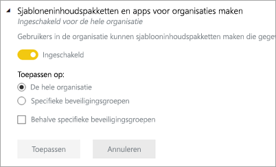

### Ingeschakeld voor een subset van de organisatie
U kunt een functie ook inschakelen voor een deel van uw organisatie. Dit kan op verschillende manieren. U kunt de functie inschakelen voor de hele organisatie, uitgezonderd voor een specifieke groep gebruikers.

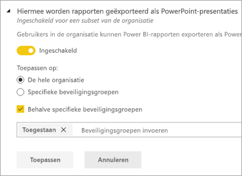

U kunt de functie ook alleen inschakelen voor een specifieke groep gebruikers en ook uitschakelen voor een andere groep gebruikers. Op deze manier kunt u ervoor zorgen dat bepaalde gebruikers geen toegang hebben tot de functie, zelfs niet als deel uitmaken van de groep die wel toegang heeft.

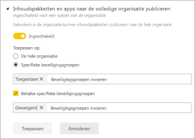

## Instellingen voor exporteren en delen
### Inhoud delen met externe gebruikers
Gebruikers in de organisatie kunnen dashboards delen met gebruikers buiten de organisatie.

### Publiceren op internet
Gebruikers in de organisatie kunnen rapporten op internet publiceren. [Meer informatie](service-publish-to-web.md)

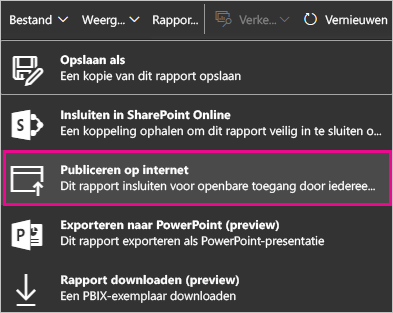

> [!NOTE]
> Deze instelling geldt voor de hele organisatie en kan niet worden beperkt tot specifieke groepen.
> 
> 

### Gegevens exporteren
Gebruikers in de organisatie kunnen gegevens uit een tegel of visualisatie exporteren. [Meer informatie](power-bi-visualization-export-data.md)

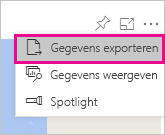

> [!NOTE]
> Als u **Gegevens exporteren** uitschakelt, hebben gebruikers ook geen toegang tot de functie **Analyseren in Excel** en kunnen ze ook de live-verbinding met de Power BI-service niet gebruiken.
> 
> 

### Hiermee worden rapporten geëxporteerd als PowerPoint-presentaties
Gebruikers in de organisatie kunnen Power BI-rapporten exporteren als PowerPoint-bestanden. [Meer informatie](service-publish-to-powerpoint.md)

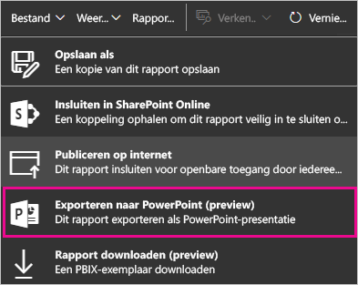

### Dashboards en rapporten afdrukken
Gebruikers in de organisatie kunnen dashboards en rapporten afdrukken. [Meer informatie](service-print.md)

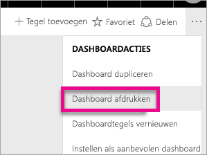

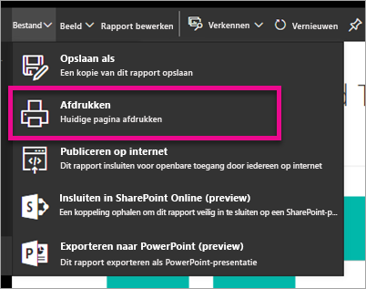

## Instellingen voor inhoudspakket en app
### Inhoudspakketten en apps naar de volledige organisatie publiceren
Gebruikers in de organisatie kunnen inhoudspakketten publiceren naar de hele organisatie.

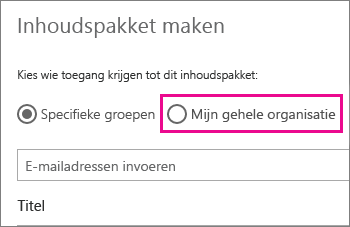

### Sjabloneninhoudspakketten en apps voor organisaties maken
Gebruikers in de organisatie kunnen sjablooninhoudspakketten maken die gegevenssets gebruiken die zijn gebaseerd op één gegevensbron in Power BI Desktop.

## Instellingen voor integratie
### Vragen over gegevens stellen met Cortana
Gebruikers in de organisatie kunnen vragen over hun gegevens stellen met behulp van Cortana.

> [!NOTE]
> Deze instelling geldt voor de hele organisatie en kan niet worden beperkt tot specifieke groepen.
> 
> 

### Analyseren in Excel gebruiken met on-premises gegevenssets
Gebruikers in de organisatie kunnen Excel gebruiken voor het weergeven van on-premises Power BI-gegevenssets en het werken met deze sets. [Meer informatie](service-analyze-in-excel.md)

> [!NOTE]
> Als u **Gegevens exporteren** uitschakelt, hebben gebruikers ook geen toegang tot de functie **Analyseren in Excel**.
> 
> 

### User ArcGIS Maps for Power BI (Preview)
Gebruikers in de organisatie kunnen de visualisatie ArcGIS Maps for Power BI (Preview) van Esri gebruiken. [Meer informatie](power-bi-visualization-arcgis.md)

## Instellingen voor R-visuals
### Interactie met visuele R-elementen en visuele R-elementen delen
Gebruikers in de organisatie kunnen interactie hebben met visuele elementen die zijn gemaakt met R scripts en deze elementen delen. [Meer informatie](service-r-visuals.md)

> [!NOTE]
> Deze instelling geldt voor de hele organisatie en kan niet worden beperkt tot specifieke groepen.
> 
> 

## Instellingen voor controle en gebruik
### Auditlogboeken voor het controleren van interne activiteiten en naleving maken
Gebruikers in de organisatie kunnen de auditfunctie gebruiken voor het controleren van acties die door andere gebruikers in de organisatie worden uitgevoerd in Power BI. [Meer informatie](service-admin-auditing.md)

Deze instelling moet worden ingeschakeld om vermeldingen te kunnen vastleggen in het auditlogboek.

> [!NOTE]
> Deze instelling geldt voor de hele organisatie en kan niet worden beperkt tot specifieke groepen.
> 
> 

## Instellingen voor dashboard
### Gegevensclassificatie voor dashboards
Gebruikers in de organisatie kunnen dashboards labelen met classificaties die het beveiligingsniveau van het dashboard aangeven. [Meer informatie](service-data-classification.md)

> [!NOTE]
> Deze instelling geldt voor de hele organisatie en kan niet worden beperkt tot specifieke groepen.
> 
> 

## Instellingen voor ontwikkelaars
### Inhoud in apps insluiten
Gebruikers in de organisatie kunnen Power BI-dashboards en rapporten insluiten in SaaS-toepassingen (Software as a Service). Als u deze instelling uitschakelt, kunnen gebruikers de REST API's niet gebruiken om inhoud van Power BI in te sluiten in hun toepassing.

## Premium-instellingen
Via het tabblad Premium-instellingen kunt u capaciteiten van Power BI Premium beheren die zijn gekocht voor uw organisatie. Alle gebruikers binnen uw organisatie zien het tabblad Premium-instellingen, maar ze zien alleen inhoud op het tabblad als ze zijn aangewezen als **Capaciteitsbeheerder** of als ze beschikken over toewijzingsmachtigingen. Als een gebruiker geen machtigingen heeft, zien ze het volgende bericht.

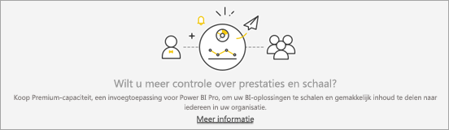

Zie [Power BI Premium beheren](service-admin-premium-manage.md) voor meer informatie over het beheren van Premium-instellingen.

## Volgende stappen
[Understanding the Power BI admin role](service-admin-role.md) (Power BI-beheerdersrol)  
[Auditing Power BI in your organization](service-admin-auditing.md) (Power BI controleren in uw organisatie)  
[Power BI Premium beheren](service-admin-premium-manage.md)  
[Power BI in uw organisatie beheren](service-admin-administering-power-bi-in-your-organization.md)  

Nog vragen? [Misschien dat de Power BI-community het antwoord weet](http://community.powerbi.com/)

