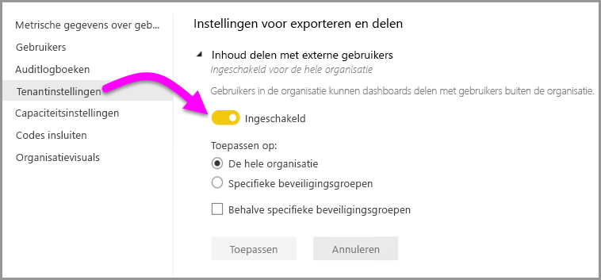
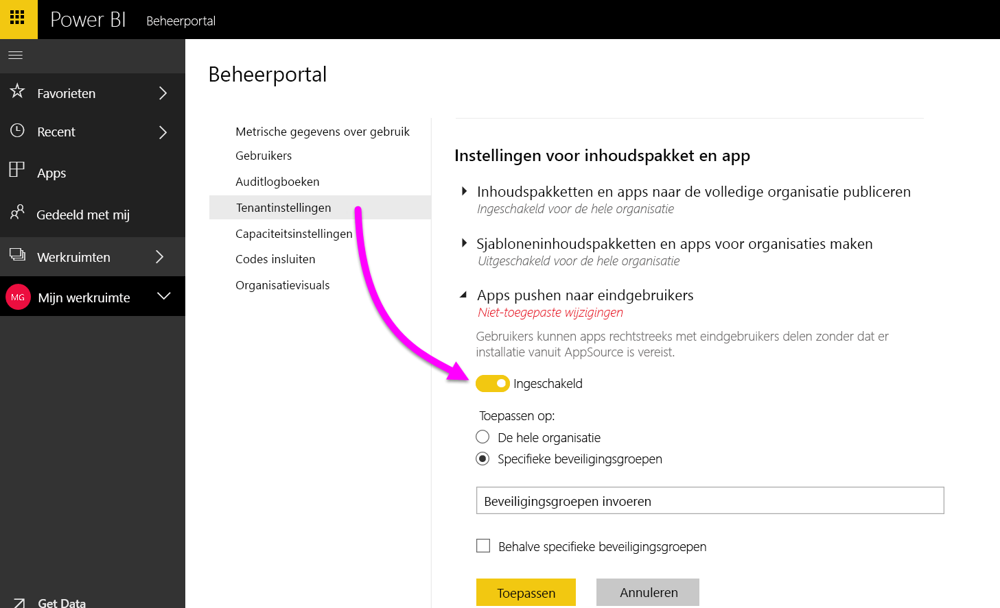
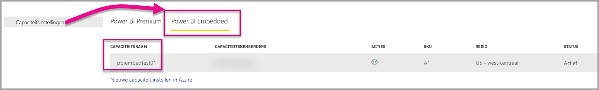
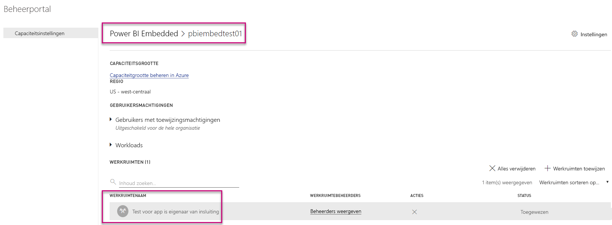
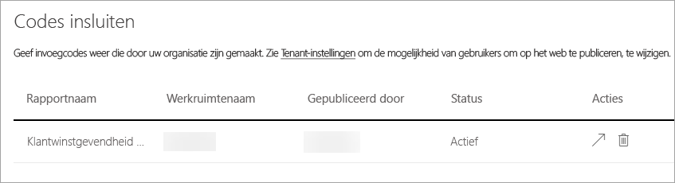
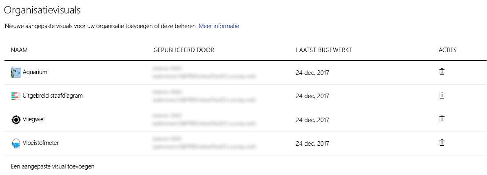
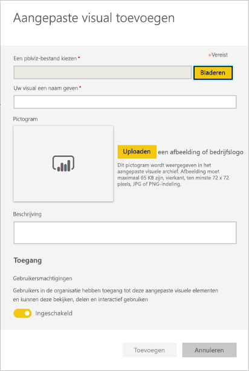

# Power BI-beheerportal

De beheerportal bevat opties voor het beheer van tenants van Power BI in uw organisatie. De portal bevat onder andere metrische gegevens over gebruik, toegang tot het Office 365-beheercentrum en instellingen.

Het beheer van tenants van Power BI voor uw bedrijf loopt via de Power BI-beheerportal. Het beheerportal is toegankelijk voor alle gebruikers die globale beheerders zijn in Office 365 of die de rol van beheerder van Power BI-service hebben. Zie [Understanding the Power BI admin role](service-admin-role.md) (Power BI-beheerdersrol) voor meer informatie over de beheerdersrol voor de Power BI-service.

Alle gebruikers kunnen de optie **Beheerportal** zien als ze het tandwielpictogram kiezen. Gebruikers die geen beheerder zijn, kunnen alleen de sectie **Premium-instellingen** zien, met alleen de capaciteiten waarvoor ze over de vereiste rechten beschikken.

## Toegang krijgen tot de beheerportal

Om toegang te krijgen tot het Power BI-beheerportal, moet uw account zijn ingesteld als een **Globale beheerder**, in Office 365 of Azure Active Directory, of moet de rol van beheerder van de Power BI-service aan het account zijn toegewezen. Zie [Understanding the Power BI admin role](service-admin-role.md) (Power BI-beheerdersrol) voor meer informatie over de beheerdersrol voor de Power BI-service. Ga op de volgende manier te werk om de Power BI-beheerportal te openen.

1. Selecteer het tandwielpictogram in de rechterbovenhoek van de Power BI-service.
2. Selecteer **Beheerportal**.

In de portal ziet u zes tabbladen. Deze worden hieronder beschreven.

* [Metrische gegevens over gebruik](#usage-metrics)
* [Gebruikers](#users)
* [Auditlogboeken](#audit-logs)
* [Tenantinstellingen](#tenant-settings)
* [Premium-instellingen](#premium-settings)
* [Codes insluiten](#embed-codes)
* [Organisatievisuals](#Organization-visuals)

## Metrische gegevens over gebruik
Het eerste tabblad in het beheerportal is **Metrische gegevens over gebruik**. Het rapport Metrische gegevens over gebruik biedt u de mogelijkheid om het gebruik binnen Power BI te controleren voor uw organisatie. Daarnaast kunt u in het rapport zien welke gebruikers, en groepen, het actiefst zijn binnen Power BI voor uw organisatie.

> [!NOTE]
> De eerste keer dat u het dashboard opent, of als u het dashboard weergeeft nadat u het lange tijd niet hebt gebruikt, ziet u waarschijnlijk een melding dat het dashboard wordt geladen.

Als dat is gebeurd, ziet u twee secties met tegels. De eerste sectie bevat gebruiksgegevens voor individuele gebruikers en de tweede sectie vergelijkbare informatie voor groepen in uw organisatie.

Hier volgt een overzicht van wat u in elke tegel kunt zien:

* Unieke telling van alle dashboards, rapporten en gegevenssets in de werkruimte voor gebruikers
  
    

* Het meest gebruikte dashboard qua het aantal gebruikers dat er toegang tot heeft. Als u bijvoorbeeld een dashboard hebt dat u hebt gedeeld met drie gebruikers en u het dashboard ook hebt toegevoegd aan een inhoudspakket waarmee twee verschillende gebruikers verbinding hebben gemaakt, zou het aantal uitkomen op 6 (1 + 3 + 2)
  
    

* De meest populaire inhoud waarmee gebruikers verbinding hebben gemaakt. Het betreft hier alle inhoud die de gebruikers kunnen bereiken via het proces Gegevens ophalen, zoals SaaS-inhoudspakketten, organisatie-inhoudspakketten, bestanden of databases.
  
    

* Een weergave van de actiefste gebruikers op basis van hoeveel dashboards ze hebben, zowel dashboards die ze zelf hebben gemaakt en dashboards die met ze zijn gedeeld.
  
    

* Een weergave van de actiefste gebruikers op basis van de hoeveelheid rapporten die ze hebben.
  
    

De tweede sectie bevat hetzelfde type informatie, maar dan op basis van groepen. Hier kunt u zien welke groepen in uw organisatie het actiefst zijn en wat voor soort informatie ze gebruiken.

Aan de hand van deze informatie kunt u een goed beeld krijgen van hoe Power BI in uw organisatie wordt gebruikt. Daarnaast kunt u zien welke gebruikers, en groepen, zeer actief zijn in uw organisatie.

## Gebruikers

Het tweede tabblad in de beheerportal is **Gebruikers beheren**. Gebruikersbeheer voor Power BI wordt uitgevoerd in het Office 365-beheercentrum. Via deze sectie kunt u snel naar het gebied in Office 365 gaan voor het beheren van gebruikers, beheerders en groepen.

Wanneer u klikt op **Naar het beheercentrum van O365**, gaat u rechtstreeks naar de startpagina van het Office 365-beheercentrum, waar u de gebruikers van uw tenant kunt beheren.

## Auditlogboeken

Het derde tabblad in de beheerportal is **Auditlogboeken**. De logboeken bevinden zich in het Beveiliging en compliancecentrum van Office 365. Via deze sectie kunt u snel toegang krijgen tot het desbetreffende gebied in Office 365.

Meer informatie over auditlogboeken vindt u in [Auditing Power BI in your organization](service-admin-auditing.md) (Power BI controleren in uw organisatie).

## Tenantinstellingen

Het derde tabblad in de beheerportal is **Tenantinstellingen**. Via tenantinstellingen hebt u meer controle over welke functies beschikbaar worden gesteld aan uw organisatie. Als u zich zorgen maakt over gevoelige gegevens, zijn sommige van onze functies mogelijk niet geschikt voor uw organisatie, of misschien wilt u alleen een bepaalde functie beschikbaar stellen aan een specifieke groep. Als dat het geval is, kunt u functies uitschakelen in uw tenant.

> [!NOTE]
> Het kan maximaal tien minuten duren voordat de instelling voor iedereen in uw tenant is doorgevoerd.

Instellingen kunnen drie statussen hebben:

* **Uitgeschakeld voor de hele organisatie**: u kunt een functie uitschakelen zodat gebruikers deze niet kunnen gebruiken.

    

* **Ingeschakeld voor de hele organisatie**: u kunt een functie inschakelen voor de hele organisatie zodat alle gebruikers toegang hebben tot die functie.

    

* **Ingeschakeld voor een subset van de organisatie**: u kunt een functie ook inschakelen voor een deel van uw organisatie. Dit kan op verschillende manieren. U kunt de functie inschakelen voor de hele organisatie, uitgezonderd voor een specifieke groep gebruikers.

    

    U kunt de functie ook alleen inschakelen voor een specifieke groep gebruikers en ook uitschakelen voor een andere groep gebruikers. Op deze manier kunt u ervoor zorgen dat bepaalde gebruikers geen toegang hebben tot de functie, zelfs niet als deel uitmaken van de groep die wel toegang heeft.

    

In de volgende secties ziet u een overzicht van de verschillende typen tenantinstellingen.

## Instellingen voor werkruimten

### Werkruimten maken (preview)
Gebruikers in de organisatie kunnen app-werkruimten maken om samen te werken aan dashboards, rapporten en andere inhoud.

Zie [Nieuwe werkruimten maken](service-create-the-new-workspaces.md) voor meer informatie.

## Instellingen voor exporteren en delen

### Inhoud delen met externe gebruikers

Gebruikers in de organisatie kunnen dashboards delen met gebruikers buiten de organisatie.

Hier is het bericht dat wordt weergegeven wanneer u deelt met een externe gebruiker.

### Publiceren op internet

Gebruikers in de organisatie kunnen rapporten op internet publiceren. [Meer informatie](service-publish-to-web.md)

Gebruikers kunnen verschillende opties in de gebruikersinterface zien op basis van de instelling voor publiceren naar het web.

|Functie |Ingeschakeld voor de hele organisatie |Uitgeschakeld voor de hele organisatie |Specifieke beveiligingsgroepen   |
|---------|---------|---------|---------|
|**Publiceren op internet** onder het menu **Bestand** van het rapport.|Ingeschakeld voor iedereen|Niet voor iedereen zichtbaar|Alleen zichtbaar voor gemachtigde gebruikers of groepen.|
|**Invoegcodes beheren** onder **Instellingen**|Ingeschakeld voor iedereen|Ingeschakeld voor iedereen|Ingeschakeld voor iedereen  Optie * **Verwijderen** alleen voor gemachtigde gebruikers of groepen. * **Ophalen van codes** ingeschakeld voor iedereen.|
|**Codes invoegen** binnen de beheerportal|De status geeft een van de volgende opties weer: * Actief * Niet ondersteund * Geblokkeerd|De status geeft **Uitgeschakeld** weer|De status geeft een van de volgende opties weer: * Actief * Niet ondersteund * Geblokkeerd  Als een gebruiker niet is geautoriseerd op basis van de tenantinstelling, wordt de status weergegeven als **geschonden**.|
|Bestaande gepubliceerde rapporten|Iedereen ingeschakeld|Iedereen uitgeschakeld|Rapporten blijven weergeven voor iedereen.|

### Gegevens exporteren

Gebruikers in de organisatie kunnen gegevens uit een tegel of visualisatie exporteren. [Meer informatie](power-bi-visualization-export-data.md)

> [!NOTE]
> Als u **Gegevens exporteren** uitschakelt, hebben gebruikers ook geen toegang tot de functie **Analyseren in Excel** en kunnen ze ook de live-verbinding met de Power BI-service niet gebruiken.

### Hiermee worden rapporten geëxporteerd als PowerPoint-presentaties

Gebruikers in de organisatie kunnen Power BI-rapporten exporteren als PowerPoint-bestanden. [Meer informatie](service-publish-to-powerpoint.md)

### Dashboards en rapporten afdrukken

Gebruikers in de organisatie kunnen dashboards en rapporten afdrukken. [Meer informatie](service-print.md)

## Instellingen voor inhoudspakket en app

### Inhoudspakketten en apps naar de volledige organisatie publiceren

Gebruikers in de organisatie kunnen inhoudspakketten publiceren naar de hele organisatie.

### Sjabloneninhoudspakketten en apps voor organisaties maken

Gebruikers in de organisatie kunnen sjablooninhoudspakketten maken die gegevenssets gebruiken die zijn gebaseerd op één gegevensbron in Power BI Desktop.

### Apps pushen naar eindgebruikers

De tenantbeheerder schakelt de optie voor het pushen van apps in **Tenantinstellingen** in.

   

U kunt de optie instellen op **Ingeschakeld** en vervolgens aangeven aan wie u deze mogelijkheid wilt toewijzen (hele organisatie of bepaalde beveiligingsgroepen).

> [!NOTE]
> Houd er rekening mee dat het even kan duren voordat wijzigingen in de tenantinstellingen van kracht worden.

Meer informatie over het [pushen van apps](service-create-distribute-apps.md#how-to-install-an-app-automatically-for-end-users).

## Instellingen voor integratie

### Vragen over gegevens stellen met Cortana

Gebruikers in de organisatie kunnen vragen over hun gegevens stellen met behulp van Cortana.

> [!NOTE]
> Deze instelling geldt voor de hele organisatie en kan niet worden beperkt tot specifieke groepen.

### Analyseren in Excel gebruiken met on-premises gegevenssets

Gebruikers in de organisatie kunnen Excel gebruiken voor het weergeven van on-premises Power BI-gegevenssets en het werken met deze sets. [Meer informatie](service-analyze-in-excel.md)

> [!NOTE]
> Als u **Gegevens exporteren** uitschakelt, hebben gebruikers ook geen toegang tot de functie **Analyseren in Excel**.

### ArcGIS Maps for Power BI gebruiken

Gebruikers in de organisatie kunnen de visualisatie ArcGIS Maps for Power BI, die is geleverd door Esri, gebruiken. [Meer informatie](power-bi-visualization-arcgis.md)

### Algemene zoekopdrachten voor Power BI gebruiken (preview-versie)

Gebruikers in de organisatie kunnen externe-zoekopdrachtfuncties gebruiken waarbij gebruik wordt gemaakt van Azure Search. Gebruikers kunnen bijvoorbeeld gebruikmaken van Cortana om belangrijke gegevens rechtstreeks op te halen uit Power BI-dashboards en -rapporten. [Meer informatie](service-cortana-intro.md)

## Instellingen voor aangepaste visuele elementen

### Aangepaste visuele elementen inschakelen voor de hele organisatie

Gebruikers in de organisatie kunnen aangepaste visuele elementen gebruiken en delen. [Meer informatie](power-bi-custom-visuals.md)

> [!NOTE]
> Deze instelling geldt voor de hele organisatie en kan niet worden beperkt tot specifieke groepen.

## Instellingen voor R-visuals

### Interactie met visuele R-elementen en visuele R-elementen delen

Gebruikers in de organisatie kunnen interactie hebben met visuele elementen die zijn gemaakt met R scripts en deze elementen delen. [Meer informatie](visuals/service-r-visuals.md)

> [!NOTE]
> Deze instelling geldt voor de hele organisatie en kan niet worden beperkt tot specifieke groepen.

## Instellingen voor controle en gebruik

### Auditlogboeken maken voor het controleren van interne activiteiten en naleving

Gebruikers in de organisatie kunnen de auditfunctie gebruiken voor het controleren van acties die door andere gebruikers in de organisatie worden uitgevoerd in Power BI. [Meer informatie](service-admin-auditing.md)

Deze instelling moet worden ingeschakeld om vermeldingen te kunnen vastleggen in het auditlogboek. Er kan een vertraging tot 48 uur bestaan tussen het inschakelen van de controlefunctie en het kunnen weergeven van controlegegevens. Als u niet direct gegevens ziet, controleert u de controlelogboeken op een later tijdstip. Er kan een vergelijkbare vertraging optreden tussen het ophalen van machtiging voor het weergeven van controlelogboeken en het kunnen openen van de logboeken.

> [!NOTE]
> Deze instelling geldt voor de hele organisatie en kan niet worden beperkt tot specifieke groepen.

### Metrische gegevens over het gebruik voor makers van inhoud
Gebruikers in de organisatie kunnen metrische gegevens weergeven over het gebruik van de dashboards en rapporten die ze hebben gemaakt. [Meer informatie](service-usage-metrics.md).

U kunt de optie instellen op **Ingeschakeld** en vervolgens aangeven wie de metrische gegevens over het gebruik mag zien (de hele organisatie of bepaalde beveiligingsgroepen).

> [!NOTE]
> Houd er rekening mee dat het even kan duren voordat wijzigingen in de tenantinstellingen van kracht worden.

### Gegevens per gebruiker in metrische gegevens over gebruik voor makers van inhoud
In metrische gegevens over het gebruik voor makers van inhoud zijn namen en e-mailadressen zichtbaar van gebruikers die inhoud openen. [Meer informatie](service-usage-metrics.md).

U kunt de optie instellen op **Ingeschakeld** en vervolgens aangeven wie de weergavenamen en e-mailadressen mag zien in de metrische gegevens over het gebruik (de hele organisatie of bepaalde beveiligingsgroepen).

Standaard wordt Gegevens per gebruiker ingeschakeld voor metrische gegevens over gebruik. Accountgegevens van makers van inhoud worden in het metrische rapport opgenomen. Als u deze informatie niet voor een bepaalde gebruiker of voor geen enkele gebruiker wilt opnemen, schakelt u de functie voor bepaalde beveiligingsgroepen of voor een hele organisatie uit. Accountgegevens worden dan in het rapport weergegeven als *Naamloos*.

> [!NOTE]
> Houd er rekening mee dat het even kan duren voordat wijzigingen in de tenantinstellingen van kracht worden.

## Instellingen voor dashboard

### Gegevensclassificatie voor dashboards

Gebruikers in de organisatie kunnen dashboards labelen met classificaties die het beveiligingsniveau van het dashboard aangeven. [Meer informatie](service-data-classification.md)

> [!NOTE]
> Deze instelling geldt voor de hele organisatie en kan niet worden beperkt tot specifieke groepen.

## Instellingen voor ontwikkelaars

### Inhoud in apps insluiten

Gebruikers in de organisatie kunnen Power BI-dashboards en rapporten insluiten in SaaS-toepassingen (Software as a Service). Als u deze instelling uitschakelt, kunnen gebruikers de REST API's niet gebruiken om inhoud van Power BI in hun toepassing in te sluiten.

## Capaciteitsinstellingen

### Premium-instellingen

Via het tabblad Premium-instellingen kunt u capaciteiten van Power BI Premium (Em of P SKU) beheren die voor uw organisatie zijn gekocht. Alle gebruikers binnen uw organisatie kunnen het tabblad Premium-instellingen zien, maar ze zien alleen inhoud op het tabblad als ze zijn aangewezen als **Capaciteitsbeheerder** of als ze beschikken over toewijzingsmachtigingen. Als een gebruiker geen machtigingen heeft, verschijnt het volgende bericht.

Zie [Power BI Premium beheren](service-admin-premium-manage.md) voor meer informatie over het beheren van Premium-instellingen.

### Power BI Embedded-instellingen

Via het tabblad Power BI Embedded-instellingen kunt u de capaciteiten van Power BI Embedded (A SKU) bekijken die u voor uw klant hebt aangeschaft. Aangezien u alleen A SKU's vanuit Azure kunt aanschaffen, kunt u [ingesloten capaciteiten in Azure beheren](developer/azure-pbie-create-capacity.md) vanuit de **Azure-portal**.

Zie [Wat is Power BI Embedded?](developer/azure-pbie-what-is-power-bi-embedded.md) voor meer informatie over het beheren van Power BI Embedded (A SKU)-instellingen.

## Codes insluiten

Als beheerder kunt u de invoegcodes weergeven die worden gegenereerd voor uw tenant. U kunt het rapport weergeven en de ingesloten code verwijderen om deze in te trekken.

## Organisatievisuals

In het tabblad organisatievisuals kunt u aangepaste visuals binnen uw organisatie implementeren en beheren, zodat u eenvoudig eigen aangepaste visuals in de organisatie kunt implementeren die door rapportauteurs gemakkelijk rechtstreeks vanuit Power BI Desktop kunnen worden ontdekt en geïmporteerd in hun rapporten.

De pagina toont alle aangepaste visuals die momenteel in de opslagplaats van de organisatie worden geïmplementeerd.

### Een nieuwe aangepaste visual toevoegen

Selecteer **Een aangepast visueel element toevoegen** om een aangepaste visual aan de lijst toe te voegen

> [!WARNING]
> Een aangepaste visual kan een code bevatten met beveiligings- of privacyrisico's. Zorg ervoor dat u de auteur en de bron van de aangepaste visual vertrouwt voordat u de visual in de opslagplaats van de organisatie implementeert.

Vul de velden in:

* Kies een .pbiviz-bestand (vereist): selecteer een aangepaste visual om te uploaden. Alleen versies van aangepaste API-visuals worden ondersteund (lees hier wat dit betekent).

Voordat u een aangepaste visual uploadt, moet u controleren of de beveiliging en privacy van die visual past bij de normen van uw organisatie. Meer informatie over beveiliging van aangepaste visuals.

* Geef een naam aan uw visual (vereist): geef een korte titel aan de visual zodat gebruikers van Power BI Desktop gemakkelijk begrijpen wat de visual doet.

* Pictogram (vereist): het pictogrambestand dat wordt weergegeven in de gebruikersinterface van Power BI Desktop.

* Beschrijving: een korte beschrijving van de visual zodat de gebruiker meer context heeft en weet waarvoor de visual is bedoeld.

Selecteer 'Toepassen' om de uploadaanvraag te starten. U ziet het nieuwe item in de lijst als de aanvraag is geslaagd. Als de aanvraag is mislukt, ziet u de bijbehorende foutmelding

### Een aangepaste visual verwijderen uit de lijst

Selecteer het prullenbakpictogram om de visual permanent te verwijderen uit de opslagplaats.
Belangrijk: verwijderen kan niet ongedaan worden gemaakt. Wanneer de visual is verwijderd, wordt deze onmiddellijk niet meer weergegeven in bestaande rapporten. Zelfs als u dezelfde visual opnieuw uploadt, vervangt de nieuwe visual de vorige die is verwijderd niet. Gebruikers moeten de nieuwe visual opnieuw importeren en het exemplaar vervangen dat in hun rapporten is opgenomen.

### Een aangepaste visual uit de lijst verwijderen

Als u de visual in de opslagplaats wilt uitschakelen, selecteert u het tandwielpictogram. In de sectie **Toegang** kunt u de aangepaste visual uitschakelen.

Als de visual is uitgeschakeld, wordt deze niet meer weergegeven in bestaande rapporten en wordt het onderstaande foutbericht weergegeven.

*Deze aangepaste visual is niet langer beschikbaar. Neem voor meer informatie contact op met uw beheerder.*

Visuals met een bladwijzer werken echter nog steeds.

Na elke update of wijziging door een beheerder, moeten gebruikers van Power BI Desktop de toepassing opnieuw starten of de browser in de Power BI-service vernieuwen om de updates te kunnen zien.

### Een visual bijwerken

Als u een visual in de opslagplaats wilt bijwerken omdat er een nieuwe versie van de visual is (bijvoorbeeld bugfixes, nieuwe functionaliteit, enzovoort), selecteer dan het pictogram **Bijwerken** en upload het nieuwe bestand. Zorg ervoor dat de id van de visual ongewijzigd blijft. Het nieuwe bestand vervangt het vorige bestand voor alle rapporten in de hele organisatie. Vervang echter niet de vorige versie als de nieuwe versie van de visual een verbruiks- of gegevensstructuur van de vorige versie van de visual kan verbreken. In plaats daarvan moet u een nieuwe vermelding maken voor de nieuwe versie van de visual. Voeg bijvoorbeeld een nieuw versienummer (versie X.X) toe aan de titel van de nieuwe vermelde visual. Op deze manier is het duidelijk dat dit dezelfde visual is, alleen met een bijgewerkt versienummer, zodat bestaande rapporten hun functionaliteit niet verbreken. Zorg er weer voor dat de id van de visual ongewijzigd blijft. De volgende keer dat gebruikers toegang hebben tot de opslagplaats van de organisatie vanuit Power BI Desktop, kunnen ze de nieuwe versie importeren, waarbij wordt gevraagd om de huidige versie in hun rapport te vervangen.

## Volgende stappen

[Understanding the Power BI admin role](service-admin-role.md) (Power BI-beheerdersrol)  
[Auditing Power BI in your organization](service-admin-auditing.md) (Power BI controleren in uw organisatie)  
[Power BI Premium beheren](service-admin-premium-manage.md)  
[Power BI in uw organisatie beheren](service-admin-administering-power-bi-in-your-organization.md)  

Nog vragen? [Misschien dat de Power BI-community het antwoord weet](http://community.powerbi.com/)
