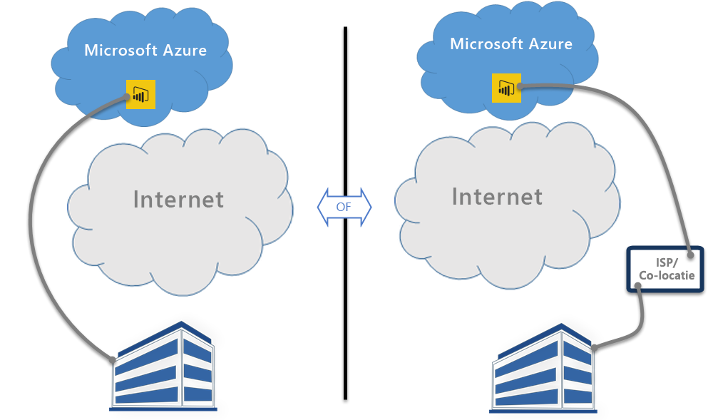

# Power BI en ExpressRoute
Met **Power BI** en **ExpressRoute** kunt u een verbinding via een particulier netwerk opzetten tussen uw organisatie en Power BI (of met behulp van de co-locatievoorziening van een internetprovider), om zo internet te omzeilen en uw gevoelige gegevens en verbindingen van Power BI beter te beveiligen.

**ExpressRoute** is een Azure-service waarmee u particuliere verbindingen kunt opzetten tussen Azure-datacenters (waarin Power BI zich bevindt) en uw on-premises infrastructuur, of particuliere verbindingen tussen Azure-datacenters en uw co-locatieomgeving.

U kunt hier [meer informatie lezen over ExpressRoute](https://azure.microsoft.com/services/expressroute/) of hoe u [zich aanmeldt](https://azure.microsoft.com/pricing/details/expressroute/).

> [!NOTE]
> Power BI wordt ondersteund in de modus voor openbare peering, zoals wordt beschreven in deze sectie [Veelgestelde vragen](https://docs.microsoft.com/azure/expressroute/expressroute-faqs).
> 
> 

## Uitzonderingen voor Power BI ExpressRoute
Power BI is compatibel met ExpressRoute, met een paar uitzonderingen waarin Power BI gegevens ophaalt of verstuurt via het openbare internet. Deze specifieke uitzonderingen betreffen vaak statische gegevens, zoals configuratiebestanden voor een browser die worden gedownload van het dichtstbijzijnde CDN-knooppunt **(Content Delivery Network)**. Er zijn enkele algemene uitzonderingen die gelden voor Power BI in zijn geheel en er zijn enkele uitzonderingen die gelden voor een bepaalde service of functie. In de volgende secties worden de verschillende uitzonderingen uitvoerig beschreven.

### Algemene uitzonderingen voor Power BI en ExpressRoute
Een uitzondering op **Power BI** en **ExpressRoute** betekent dat de gegevens die worden verzonden naar of van Power BI via het openbare internet lopen in plaats van via de persoonlijke ExpressRoute-verbinding.

Dit zijn de twee algemene uitzonderingen voor Power BI in combinatie met ExpressRoute:

* Statische bestanden die worden gedownload van een **CDN (Content Delivery Network)** en websites
* **Telemetriegegevens** die worden verzonden via het openbare internet

Power BI gebruikt verschillende **CDN's (Content Delivery Networks)** of websites om de benodigde statische inhoud en bestanden op een efficiënte manier via het openbare internet te distribueren naar gebruikers op basis van geografische landinstelling. Deze statische bestanden omvatten productdownloads (zoals **Power BI Desktop**, **on-premises gegevensgateway** of **Power BI-inhoudspakketten** van verschillende onafhankelijke serviceproviders), browserconfiguratiebestanden die worden gebruikt om volgende verbindingen met Power BI te initiëren en tot stand te brengen, evenals de eerste, beveiligde Power BI-aanmeldingspagina. De feitelijke referenties worden alleen via ExpressRoute verzonden.   

Bepaalde **telemetriegegevens** worden ook verzonden via het openbare internet en via ExpressRoute. Voorbeelden van telemetriegegevens zijn gebruiksstatistieken en vergelijkbare gegevens, die worden verzonden naar services die worden gebruikt voor het monitoren van gebruik en activiteit.

### Power BI SaaS-toepassing en ExpressRoute
Wanneer een gebruiker een verbinding wil opzetten met de Power BI-service (via powerbi.com of via Cortana), worden deze onderdelen opgehaald van een CDN of van websites, die zijn verbonden met het openbare Internet: de startpagina en aanmeldingspagina van Power BI, en de statische bestanden die de browser voorbereiden voor verbinding en communicatie met Power BI.

Wanneer de aanmelding tot stand is gebracht, vinden volgende interacties met Power BI-gegevens plaats via ExpressRoute, met uitzondering van bepaalde onderdelen en services die afhankelijk zijn van gegevens op het openbare internet:

* **Visuele elementen voor kaarten** vereisen verbinding en gegevensuitwisseling met de Virtual Earth-service van Bing of met de service voor geocodering van Bing, die beide tot stand worden gebracht via het openbare internet.
* Power BI-integratie met **Cortana** vereist toegang tot Bing via het openbare internet.
* Wanneer **aangepaste koppelingen** worden toegevoegd door een gebruiker, zoals een afbeeldingswidget of een video, vraagt Power BI gegevens aan op basis van de koppeling die is opgegeven door de gebruiker. Deze koppeling hoeft niet per se gebruik te maken van ExpressRoute.
* Gebruikers kunnen **feedback naar Power BI** versturen die bestaat uit tekst (en desgewenst afbeeldingen) via het mechanisme voor feedback User Voice, dat het openbare internet gebruikt voor verzending.
* De **inhoudsprovider Bing Nieuws** downloadt inhoud uit Bing met behulp van het openbare internet.
* Als er verbinding wordt gemaakt met **apps** (bijvoorbeeld inhoudspakketten), moeten gebruikers vaak referenties en instellingen invoeren met behulp van pagina's die worden geleverd door de SaaS-provider. Deze pagina's kunnen gebruikmaken van ExpressRoute, maar dat hoeft niet.

| Gebruikersactiviteit | Bestemming |
| --- | --- |
| Startpagina (vóór aanmelding) |`maxcdn.bootstrapcdn.com ; ajax.aspnetcdn.com ; netdna.bootstrapcdn.com ; cdn.optimizely.com; google-analytics.com ` |
| Aanmelden |`*.mktoresp.com ; *.aadcdn.microsoftonline-p.com ; *.msecnd.com ; *.localytics.com ; ajax.aspnetcdn.com` |
| Dashboard, rapport, beheer van gegevensset (inclusief kaarten en geocodering) |`*.localytics.com ; *.virtualearth.net ; platform.bing.com; powerbi.microsoft.com; c.microsoft.com; app.powerbi.com; *.powerbi.com; dc.services.visualstudio.com ` |
| Ondersteuning |`support.powerbi.com ; powerbi.uservoice.com ; go.microsoft.com ` |

### Power BI Desktop en ExpressRoute
Power BI Desktop is ook compatibel met ExpressRoute, met een paar uitzonderingen die in de volgende lijst worden beschreven:

* **Updatemeldingen**, die worden gebruikt om vast te stellen of gebruikers beschikken over de nieuwste versie van Power BI Desktop, worden verstuurd via het openbare internet.
* Bepaalde **telemetriegegevens** worden verzonden via het openbare internet.
* **Visuele elementen voor kaarten** vereisen verbinding en gegevensuitwisseling met de **Virtual Earth-service van Bing** of met **de service voor geocodering van Bing**, die beide tot stand worden gebracht via het openbare internet.
* De optie **Gegevens ophalen** in combinatie met verschillende gegevensbronnen, zoals **Web** of externe aanbieders van SaaS-toepassingen, loopt via het openbare internet.

### Power BI PaaS en ExpressRoute
Power BI biedt API's en andere platformfuncties waarmee ontwikkelaars aangepaste Power BI-oplossingen en -apps kunnen maken. Naast de eerder besproken telemetriegegevens en CDN-gegevens, worden de volgende services gebruikt bij het verzenden van Power BI PaaS-gegevens via het openbare internet:

| PaaS-activiteit | Aanvullende bestemmingen die worden gebruikt |
| --- | --- |
| Openbaar insluiten (telemetrie) |`c1.microsoft.com` |
| Aangepaste visuele elementen (CDN) |`*.azureedge.net` |

Sommige **aangepaste visuele elementen** worden gemaakt door derden, andere door Microsoft. Deze elementen kunnen worden uitgewisseld via ExpressRoute, maar dat hoeft niet.

### Mobiele Power BI-apps en ExpressRoute
Het gebruik van mobiele Power BI-apps valt buiten het bereik van dit document.  

### On-premises gegevensgateway en ExpressRoute
Wanneer een **on-premises gegevensgateway** wordt gebruikt met Power BI, wordt ExpressRoute gebruikt voor gegevensoverdracht, met uitzondering van de gebruikersactiviteiten die worden beschreven in de sectie **Power BI SaaS-toepassing en ExpressRoute** eerder in dit onderwerp.  

