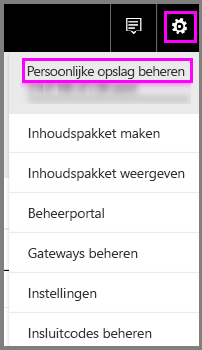
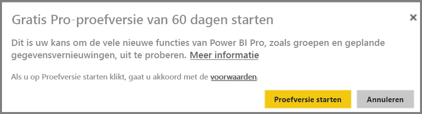
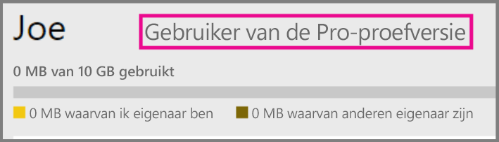
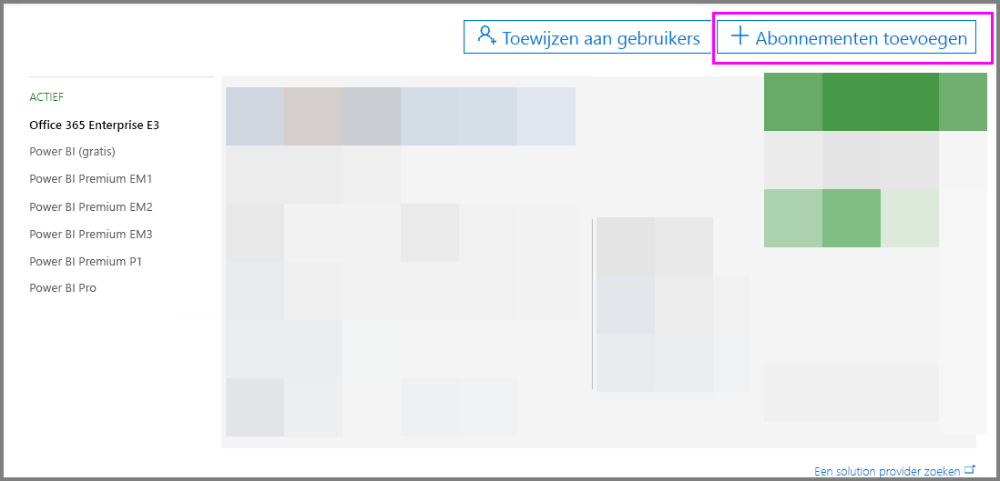

# Power BI Pro in uw organisatie

Power BI Pro is een betaalde licentie waarbij de gebruiker over nieuwe functies kan beschikken. Power BI Pro-licenties zijn geschikt voor een team dat informatie wil delen en wil samenwerken met anderen, zodat op basis van de gegevens gefundeerde beslissingen kunnen worden genomen.  Elk teamlid dat gedeelde Power BI-inhoud maakt of bekijkt, moet over een Pro-licentie beschikken, tenzij de inhoud is gekoppeld aan een toegewezen capaciteit die gebruikmaakt van Power BI Premium.

Voor de volgende functies is een licentie voor Power BI Pro vereist:

* **Gegevens analyseren in Excel of Power BI Desktop**: gebruik Excel of Power BI Desktop om een gegevensset die is gepubliceerd in Power BI te bekijken of te gebruiken. Zie [Analyseren in Excel](service-analyze-in-excel.md) voor meer informatie.

* **Dashboards delen en samenwerken met werkruimten**: in Power BI-werkruimten kunt u op dashboards, en in rapporten en gegevenssets samenwerken met collega's. Zie [Samenwerken in de werkruimte van uw Power BI-app](service-collaborate-power-bi-workspace.md) voor meer informatie.

* **Gedeelde inhoud bekijken**: Pro-gebruikers kunnen dashboards en rapporten bekijken die met hen worden gedeeld, met dashboards en rapporten werken die met hen worden gedeeld en dashboards en rapporten die met hen worden gedeeld opnieuw delen (indien toegestaan). Een Pro-gebruiker kan deze dashboards en rapporten echter niet bewerken. Zie [Uw Power BI-dashboards en -rapporten delen met collega's en anderen](service-share-dashboards.md) voor meer informatie.

* **Inhoud integreren met Microsoft Teams**: u kunt een Power BI-tabblad toevoegen in een Microsoft Teams-kanaal (MS Teams). Door MS Teams worden automatisch alle rapporten in de werkruimte gedetecteerd. Zie [Power BI teams up with Microsoft Teams (Power BI gebruiken met Microsoft Teams)](https://powerbi.microsoft.com/en-us/blog/power-bi-teams-up-with-microsoft-teams/) voor meer informatie. 

## Power BI Pro-proefversie van 60 dagen voor individuele klanten

Nadat u zich hebt aangemeld voor een gratis account, kunt u Pro desgewenst 60 dagen gratis uitproberen. U hebt dan toegang tot alle functies van het Pro-abonnement voor de duur van de proefversie. Power BI Pro heeft alle functies van de gratis versie van Power BI, plus aanvullende functies voor delen en samenwerking. Meer informatie vindt u op de [pagina met prijzen van Power BI](https://powerbi.microsoft.com/en-us/pricing/). Als u Power BI Pro gedurende 60 dagen gratis wilt uitproberen, meldt u zich aan bij Power BI en probeert u een van de volgende Power BI Pro-functies.

* [Een werkruimte maken](service-create-distribute-apps.md)
* [Een dashboard delen](service-share-dashboards.md)

Wanneer u een van deze functies probeert uit te voeren, wordt u gevraagd een gratis proefversie te starten. U kunt de proefversie ook kiezen door het tandwielpictogram en vervolgens Persoonlijke opslag beheren te selecteren. Selecteer vervolgens aan de rechterkant Pro gratis uitproberen.

   
    
   

Daarna kunt u Proefversie starten selecteren.

   

> [!NOTE]
> Gebruikers die ervoor kiezen om op deze manier de proefversie van Power BI Pro te activeren, worden in het Office 365-beheerportal niet weergegeven als gebruikers van de proefversie van Power BI Pro (maar als gebruikers van de gratis versie van Power BI). Ze worden echter wel weergegeven als gebruikers van de Power BI Pro-proefversie op de pagina voor het beheren van de opslag in Power BI.
>

> [!NOTE]
> Als u IT-beheerder bent en u wilt Power BI-proeflicenties voor meerdere gebruikers in uw organisatie verkrijgen en implementeren zonder dat gebruikers de gebruiksvoorwaarden voor de proefversie afzonderlijk hoeven te accepteren, kunt u zich registreren voor een Power BI Pro-proefabonnement. U moet globale beheerder of factureringsbeheerder van Office 365 zijn of een nieuwe tenant maken om uzelf te registreren voor een proefabonnement. Zie [Purchasing Power BI Pro](service-admin-purchasing-power-bi-pro.md) (Power BI Pro kopen) voor meer informatie.
>

Wanneer u zich in de service bevindt, kunt u vervolgens controleren of u inderdaad een Pro-proefaccount hebt door naar het tandwielpictogram te gaan en vervolgens Persoonlijke opslag beheren te selecteren.

   

## Proefabonnement in Office 365

U kunt Power BI Pro gebruiken met een proefabonnement voor uw organisatie. Zodra u het abonnement hebt, kunt u licenties voor Power BI Pro toewijzen aan uw gebruikers. Zie [Licenties toewijzen aan gebruikers in Office 365](https://support.office.com/en-us/article/assign-licenses-to-users-in-office-365-for-business-997596b5-4173-4627-b915-36abac6786dc?ui=en-US&rs=en-US&ad=US) voor meer informatie over het toewijzen van licenties.

> [!NOTE]
> Er geldt een limiet van één proefabonnement per tenant. Dit betekent dat als iemand anders uw organisatie al heeft aangemeld voor het proefabonnement, u op deze manier geen kennis meer kunt maken met Power BI Pro. Als u hier hulp bij nodig hebt, kunt u contact opnemen met [ondersteuning voor zakelijke producten](https://support.office.microsoft.com/en-us/article/contact-support-for-business-products-admin-help-32a17ca7-6fa0-4870-8a8d-e25ba4ccfd4b?CorrelationId=552bbf37-214f-4202-80cb-b94240dcd671&ui=en-US&rs=en-US&ad=US).
>

Voer de volgende stappen uit om in het bezit te komen van een Office 365-proefabonnement:

1. Ga naar het [Office 365-beheercentrum](https://portal.office.com/adminportal/home#/homepage).
2. Selecteer in het linkernavigatiedeelvenster Facturering en klik vervolgens op Abonnementen.

   

3. Selecteer aan de rechterkant Abonnementen toevoegen.

   

4. Wijs onder Andere abonnementen het beletselteken (...) voor Power BI Pro aan en selecteer Gratis proefabonnement starten.

    

5. Selecteer Nu proberen op het scherm voor het bevestigen van de bestelling.
6. Selecteer Doorgaan in het ontvangstbewijs.

## Power BI Pro kopen

U kunt Power BI Pro aanschaffen via Microsoft Office 365 of via een gecertificeerde Microsoft-partner. Zie [Power BI Pro aanschaffen](service-admin-purchasing-power-bi-pro.md) voor meer informatie over het aanschaffen van Power BI Pro.

## Volgende stappen
[Registreren voor Power BI via selfservice](service-admin-signing-up-for-power-bi-with-a-new-office-365-trial.md)
 
[Power BI (free) in your organization](service-admin-service-free-in-your-organization.md) (Power BI (gratis) in uw organisatie)
 
[Purchasing Power BI Pro](service-admin-purchasing-power-bi-pro.md) (Power BI Pro kopen)
 
[De verlengde Pro-proefversie activeren](service-extended-pro-trial.md)
 
[Power BI Pro-licenties toewijzen](service-admin-assigning-power-bi-pro-licenses.md)
 
[Power BI Premium - wat is het?](service-admin-premium-manage.md)
 
[Power BI Premium aanschaffen](service-admin-premium-purchase.md)
 
[Technisch document over Power BI Premium](https://aka.ms/pbipremiumwhitepaper)

Nog vragen? [Misschien dat de Power BI-community het antwoord weet](https://community.powerbi.com/)