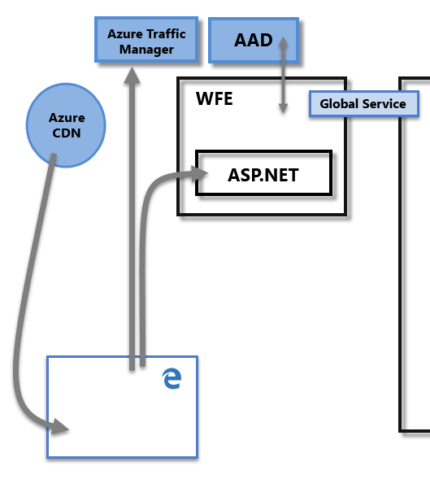
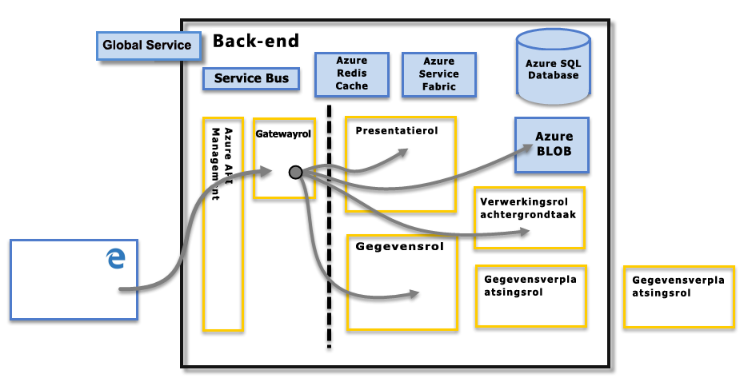

# Beveiliging van Power BI
[Download het witboek Beveiliging van Power BI](http://go.microsoft.com/fwlink/?LinkId=829185) voor een gedetailleerde uitleg van Power BI-beveiliging:

De Power BI-service is gebaseerd op **Azure**, een cloudcomputinginfrastructuur en -platform van Microsoft. De Power BI-service-architectuur is gebaseerd op twee clusters: het cluster Web Front End (**WFE**) en het cluster **Back-End**. Het cluster WFE beheert de eerste verbinding en verificatie met de Power BI-service. Eenmaal geverifieerd, verwerkt de Back-End alle daaropvolgende gebruikersinteracties. Power BI maakt gebruik van Azure Active Directory (AAD) om gebruikers-id's op te slaan en beheren en beheert de opslag van gegevens en metagegevens met respectievelijk Azure Blob en Azure SQL Database.

## Architectuur van Power BI
Elke Power BI-implementatie bestaat uit twee clusters: een **WFE**-cluster (Web Front End) en een **Back-End**cluster.

Het cluster **WFE** beheert het eerste verbindings- en verificatieproces voor Power BI. Het maakt hierbij gebruik van AAD om clients te verifiëren en tokens te leveren voor volgende clientverbindingen met de Power BI-service. Power BI gebruikt ook de **Azure Traffic Manager** (ATM) om gebruikersverkeer te leiden naar het dichtstbijzijnde datacentrum, dat wordt bepaald door het DNS-record van de client die probeert verbinding te maken, voor het verificatieproces en om statische inhoud en bestanden te downloaden. Power BI gebruikt het **Azure Content Delivery Network** (CDN) om de benodigde statische inhoud en bestanden op een efficiënte manier te distribueren naar gebruikers op basis van geografische landinstelling.

Via het cluster **Back-End** communiceren geverifieerde clients met de Power BI-service. Het cluster **Back-End** beheert visualisaties, gebruikersdashboards, gegevenssets, rapporten, gegevensopslag, gegevensverbindingen, het vernieuwen van gegevens en andere aspecten van de interactie met de Power BI-service. De **Gatewayrol** fungeert als een gateway tussen aanvragen van gebruikers en de Power BI-service. Gebruikers werken niet rechtstreeks met rollen, behalve met de **Gatewayrol**. **Azure API Management** gaat uiteindelijk de **Gatewayrol** vervullen.

> [!IMPORTANT]
> Het is belangrijk om aan te geven dat alleen **Azure API Management** (APIM) en **Gateway** (GW)-rollen toegankelijk zijn via het openbare internet. Ze bieden verificatie, autorisatie, DDoS-beveiliging, beperking, taakverdeling, routering en andere mogelijkheden.
> 
> 

## Beveiliging voor gegevensopslag
Power BI maakt gebruik van twee primaire opslagplaatsen om gegevens op te slaan en te beheren: gegevens van gebruikers die zijn geüpload worden meestal verzonden naar **Azure BLOB**-opslag. Alle metagegevens, alsmede artefacten voor het systeem zelf, worden opgeslagen in  **Azure SQL Database**.

De stippellijn in de bovenstaande afbeelding van het cluster **Back-End** verduidelijkt de grens tussen de enige twee onderdelen die toegankelijk zijn voor gebruikers (links van de stippellijn) en de rollen die alleen toegankelijk zijn voor het systeem. Wanneer een geverifieerde gebruiker verbinding maakt met de Power BI-Service, wordt de verbinding en elke aanvraag van de client geaccepteerd en beheerd door de **Gatewayrol** (wordt op termijn verwerkt door **Azure API Management**), die vervolgens namens de gebruiker communiceert met de rest van de Power BI-Service. Wanneer een client bijvoorbeeld probeert een dashboard weer te geven, accepteert de **Gatewayrol** die aanvraag en stuurt vervolgens afzonderlijk een aanvraag naar de **Presentatierol** om de gegevens op te halen die de browser nodig heeft om het dashboard weer te geven.

## Verificatie van de gebruiker
Power BI maakt gebruik van Azure Active Directory ([AAD](http://azure.microsoft.com/services/active-directory/)) om gebruikers te verifiëren die zich aanmelden bij de Power BI-service en gebruikt vervolgens de Power BI-aanmeldingsreferenties wanneer een gebruiker probeert resources te openen waarvoor verificatie is vereist. Gebruikers melden zich aan bij de Power BI-service met het e-mailadres dat is gebruikt om hun Power BI-account in te stellen; Power BI gebruikt dat aanmeldadres als de *effectieve gebruikersnaam* die wordt doorgegeven aan bronnen wanneer een gebruiker probeert verbinding maken met gegevens. De *effectieve gebruikersnaam* wordt vervolgens toegewezen aan een *User Principal Name* ([UPN](https://msdn.microsoft.com/library/windows/desktop/aa380525\(v=vs.85\).aspx)) en omgezet naar het bijbehorende Windows-domeinaccount, op basis waarvan de verificatie moet worden toegepast.

Voor organisaties die zakelijke e-mailadressen gebruikten voor aanmelding bij Power BI (zoals <em>david@contoso.com</em>), is de toewijzing van *effectieve gebruikersnaam* naar UPN eenvoudig. Voor organisaties die geen zakelijke e-mailadressen gebruikten voor aanmelding bij Power BI (zoals <em>david@contoso.onmicrosoft.com</em>), is voor toewijzing tussen AAD en on-premises referenties vereist dat [adreslijstsynchronisatie](https://technet.microsoft.com/library/jj573653.aspx) goed werkt.

De platformbeveiliging voor Power BI omvat ook de multitenant-omgevingsbeveiliging, netwerkbeveiliging en de mogelijkheid om extra op AAD gebaseerde beveiligingsmaatregelen toe te voegen.

## Gegevens- en servicebeveiliging
Raadpleeg het [Vertrouwenscentrum van Microsoft](https://www.microsoft.com/trustcenter) voor meer informatie.

Zoals eerder in dit artikel werd beschreven, wordt de Power BI-aanmelding van een gebruiker gebruikt door on-premises Active Directory-servers om toe te wijzen aan een UPN voor referenties. Het is echter **belangrijk** om op te merken dat gebruikers verantwoordelijk zijn voor de gegevens die ze delen: als een gebruiker met haar referenties verbinding maakt met gegevensbronnen, en vervolgens een rapport (of dashboard of gegevensset) op basis van die gegevens deelt, zijn gebruikers met wie het dashboard is gedeeld, niet geverifieerd tegen de oorspronkelijke gegevensbron en hebben ze toegang tot het rapport.

Een uitzondering vormt verbindingen met **SQL Server Analysis Services** met behulp van de **on-premises gegevensgateway**; dashboards worden in de cache geplaatst in Power BI, maar toegang tot onderliggende rapporten of gegevenssets start verificatie voor de gebruiker die probeert het rapport (of de gegevensset) te openen en toegang wordt alleen verleend als de gebruiker voldoende machtigingen heeft om toegang te krijgen tot de gegevens. Zie [Deep dive - On-premises gegevensgateway](service-gateway-onprem-indepth.md) voor meer informatie.

