# Capaciteiten in Power BI Premium en Power BI Embedded beheren
Meer informatie over het beheren van Power BI Premium- en Power BI Embedded-capaciteiten, die toegewezen resources voor uw inhoud bieden.

De capaciteit is vormt het hart van de Power BI Premium- en Power BI Embedded-aanbiedingen.

## Wat is capaciteit?
De capaciteit is de set resources die is exclusief voor u is gereserveerd. Wanneer u over capaciteit beschikt, betekent dit dat u dashboards, rapporten en gegevenssets kunt publiceren voor gebruikers binnen uw organisatie zonder dat u licenties voor ze hoeft aan te schaffen. Daarnaast garandeert u zodoende betrouwbare en consistente prestaties voor de inhoud die in de capaciteit wordt gehost.

Capaciteit is volledig transparant voor uw eindgebruikers. Ze kunnen Power BI of uw toepassing gewoon op de gebruikelijke manier blijven gebruiken. Ze hoeven er geen rekening mee te houden dat bepaalde (of alle) inhoud wordt gehost in uw toegewezen capaciteit. Voor uw gebruikers werkt als exact hetzelfde als voorheen.

[!INCLUDE [powerbi-premium-illustration](./includes/powerbi-premium-illustration.md)]

Zie [Wat is Power BI Premium?](service-premium.md) voor meer informatie.

## Capaciteit kopen
Als u wilt profiteren van de toegewezen capaciteit, moet u een abonnement voor Power BI Premium in het Office 365-beheercentrum aanschaffen of een Power BI Embedded-resource in Microsoft Azure Portal maken. Raadpleeg de volgende artikelen voor meer informatie:

* **Power BI Premium:** [Power BI Premium aanschaffen](service-admin-premium-purchase.md)
* **Power BI Embedded:** [Create Power BI Embedded capacity in the Azure portal](https://docs.microsoft.com/en-us/azure/power-bi-embedded/create-capacity) (Power BI Embedded-capaciteit maken in Azure Portal)

Bij de aankoop van Power BI Premium-SKU's ontvangt uw tenant het overeenkomstige aantal v cores dat nodig is om capaciteiten uit te voeren. Als u bijvoorbeeld Power BI Premium P3 SKU koopt, ontvangt de tenant 32 v-cores.

> [!NOTE]
> U hebt 30 dagen volledige toegang nadat uw abonnement is beëindigd. Daarna krijgt uw inhoud een gedeelde capaciteit. Modellen van > 1 GB worden niet ondersteund met een reguliere gedeelde licentie.
>

## Capaciteitsbeheerders
> [!NOTE]
> Capaciteitsbeheerders, voor Power BI Embedded-capaciteit, worden gedefinieerd in Microsoft Azure Portal.
>
>

Wanneer u als capaciteitsbeheerder wordt toegewezen aan een capaciteit, hebt u de volledige controle over de capaciteit en de bijbehorende beheerfuncties. U kunt via de beheerportal van Power BI meer capaciteitsbeheerders toevoegen (alleen Power BI Premium) of gebruikers machtigingen voor capaciteitstoewijzingen geven. U kunt bulksgewijs capaciteit aan werkruimten toewijzen en de metrische gegevens over het gebruik van een capaciteit weergeven.

Elke capaciteit heeft zijn eigen beheerders. Als u een capaciteitsbeheerder definieert voor een capaciteit, betekent dit niet dat deze toegang heeft tot alle capaciteiten in uw organisatie. Capaciteitsbeheerders hebben niet standaard toegang tot alle Power BI-beheergedeelten, zoals metrische gegevens over het gebruik, auditlogboeken of tenantinstellingen. Capaciteitsbeheerders beschikken ook niet over machtigingen om nieuwe capaciteiten in te stellen of de SKU van bestaande capaciteiten te wijzigen. Alleen globale beheerders of Power BI-servicebeheerders hebben toegang tot deze items.

Alle globale beheerders van Office 365 en Power BI-beheerders zijn automatisch capaciteitsbeheerders van zowel de Power BI Premium- als Power BI Embedded-capaciteit.

## Capaciteit beheren
Nadat u capaciteitsknooppunten in Office 365 hebt aangeschaft, moet u een nieuwe capaciteit instellen. Dit doet u via de [Power BI-beheerportal](service-admin-portal.md). In de beheerportal ziet u een sectie met de naam **Capaciteitsinstellingen**. Hier beheert u Power BI Premium-capaciteiten voor uw organisatie.

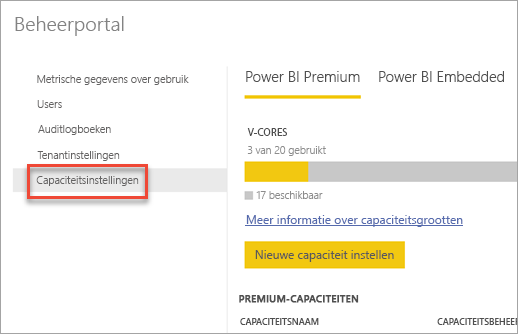

Als u **Capaciteitsinstellingen** selecteert, wordt standaard het scherm voor capaciteitsbeheer in Power BI Premium weergegeven.

### Een nieuwe capaciteit instellen (Power BI Premium)
Het aantal v-cores reflecteert het aantal gebruikte v-cores en het aantal beschikbare v-cores om capaciteiten mee te maken. Het aantal beschikbare v-cores voor uw organisatie is gebaseerd op de Premium-SKU's die u hebt aangeschaft. Als u bijvoorbeeld een P3 en P2 aanschaft, resulteert dit in 48 beschikbare kernen: 32 voor P3 en 16 voor P2.

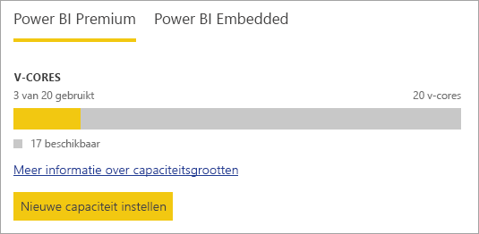

Als u v-cores beschikbaar hebt, stelt u als volgt de nieuwe capaciteit in:

1. Selecteer **Nieuwe capaciteit instellen**.
2. Geef een **naam** voor de capaciteit op.
3. Definieer wie de capaciteitsbeheerder voor deze capaciteit is.

    Capaciteitsbeheerders hoeven geen Power BI-beheerder of globale beheerder van Office 365 te zijn. Zie [Power BI Premium-capaciteitsbeheerders](#capacity-admins) voor meer informatie.
4. Selecteer de grootte van uw capaciteit. Welke opties beschikbaar zijn, is afhankelijk van het aantal beschikbare v-cores. U kunt geen een optie selecteren die groter is dan het aantal beschikbare v-cores.

    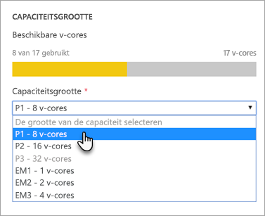
5. Selecteer **Instellen**.

    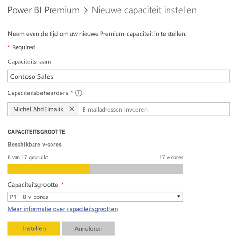

Capaciteitsbeheerders, evenals Power BI-beheerders globale beheerders van Office 365, kunnen de capaciteit vervolgens bekijken in de beheerportal.

### Capaciteitsinstellingen
In het scherm voor het beheren van de Premium-capaciteit kunt u onder Acties het **tandwielpictogram (instellingen)** selecteren. Hier kunt u de naam van een capaciteit wijzigen of een capaciteit verwijderen. Hier kunt u ook zien wie de servicebeheerders zijn, wat de SKU of de grootte van de capaciteit is en in welke regio de capaciteit zich bevindt.

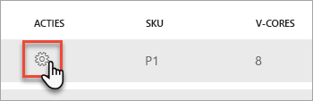

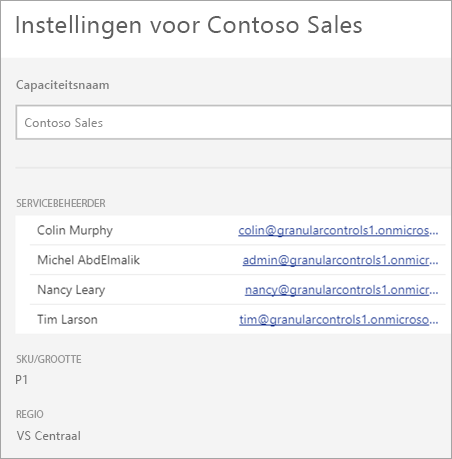

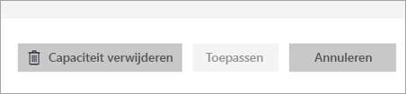

> [!NOTE]
> De capaciteitsinstellingen voor Power BI Embedded worden beheerd in Microsoft Azure Portal.
>
>

### De capaciteitsgrootte wijzigen (Power BI Premium)
Power BI-beheerders en globale beheerders van Office 365 kunnen de Power BI Premium-capaciteitsgrootte wijzigen door **Capaciteitsgrootte wijzigen** te selecteren. Capaciteitsbeheerders die geen Power BI-beheerder of globale beheerder van Office 365 zijn, beschikken niet over deze optie.

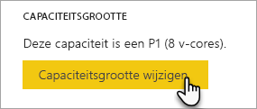

In het scherm **Capaciteitsgrootte wijzigen** kunt u, als u over de beschikbare resources beschikt, een upgrade of downgrade voor de capaciteitsgrootte uitvoeren. Beheerders kunnen naar wens knooppunten maken en verwijderen en de grootte van de knooppunten wijzigen, zolang ze maar over het vereiste aantal v-cores beschikken.

U kunt P SKU's niet downgraden naar PSKU's. U kunt de muisaanwijzer over uitgeschakelde opties bewegen voor een uitleg.

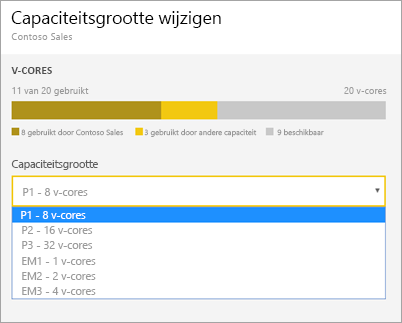

### Capaciteitstoewijzing
U kunt een capaciteit beheren door de naam van de capaciteit te selecteren. Wanneer u de naam selecteert, wordt het scherm voor capaciteitsbeheer weergegeven.

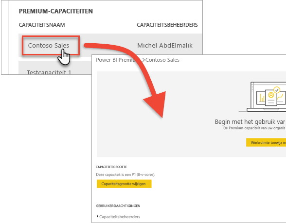

Als er geen werkruimten zijn toegewezen aan de capaciteit, wordt er een bericht weergegeven waarin u de mogelijkheid wordt geboden om **werkruimten toe te wijzen**.

#### Gebruikersmachtigingen
U kunt aanvullende **capaciteitsbeheerders** voor Power BI Premium-capaciteiten toewijzen. Daarnaast kunt u gebruikers toewijzen die over **machtigingen voor capaciteitstoewijzingen** beschikken. Gebruikers die over toewijzingsmachtigingen beschikken, kunnen een app-werkruimte aan de capaciteit toewijzen als ze een beheerder van deze werkruimte zijn. Ze kunnen ook hun persoonlijke *Mijn werkruimte* toewijzen aan de capaciteit. Gebruikers met toewijzingsmachtigingen hebben geen toegang tot de beheerportal.

> [!NOTE]
> Voor Power BI Embedded-capaciteit worden de capaciteitsbeheerders toewezen in Microsoft Azure Portal.
>
>

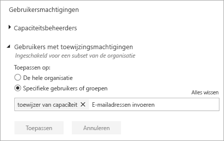

## Metingen voor gebruik (Power BI Premium)
Voor elke capaciteit kunt u metingen voor het gebruik van de CPU, het geheugen, geheugenthrashing en directe query zien. Het is raadzaam om deze metrische gegevens goed in de gaten te houden om ervoor te zorgen dat uw gebruikers goede prestaties bij uw capaciteit ervaren:

> [!NOTE]
> Het capaciteitsgebruik van Power BI Embedded wordt bewaakt in de Azure Portal.

| Metrische gegevens | Beschrijving |
| --- | --- |
| CPU |Aantal keer dat CPU-gebruik 80% of meer was. |
| Geheugenthrashing |De geheugendruk van uw back-endkernen. Met deze gegevens wordt aangegeven hoe vaak gegevenssets uit het geheugen zijn verwijderd vanwege de geheugendruk door het gebruik van meerdere gegevenssets. |
| Memory Usage |Gemiddeld geheugengebruik, in gigabytes (GB). |
| DQ/s | Aantal keer dat het aantal DirectQuery- en liveverbindingen 80% van de limiet heeft overschreden.     * We beperken het totale aantal query's per seconde voor DirectQuery en liveverbindingen.  * De limieten zijn 30/s voor P1, 60/s voor P2 en 120/s voor P3.   * De query's voor DirectQuery en liveverbindingen tellen beide een zwaar voor de bovenstaande limiet. Als u één seconde bijvoorbeeld 15 DirectQuery-query's en 15 query's voor een liveverbinding hebt, is u limiet bereikt.  * Dit geldt ook voor on-premises- en cloudverbindingen. |

Metrische gegevens geven het gebruik van de afgelopen week aan.  Als u een weergave met meer details wilt zien van de metrische gegevens, klikt u hiervoor op een van de samenvattingstegels.  Hiermee gaat u naar de gedetailleerde diagrammen voor elk van de metrische gegevens voor uw Premium-capaciteit.  Deze grafieken worden voor de afgelopen week per uur samengevat en kunnen helpen bij het isoleren wanneer u mogelijk specifieke, prestatiegerelateerde evenementen hebt gehad in uw Premium-capaciteit.  

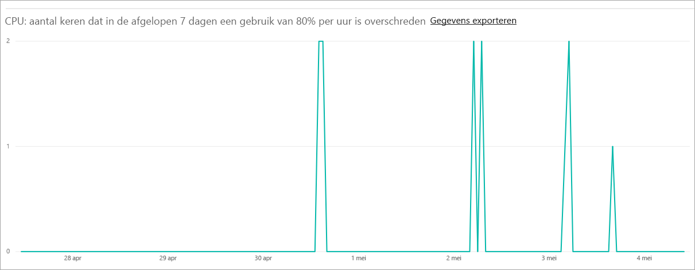

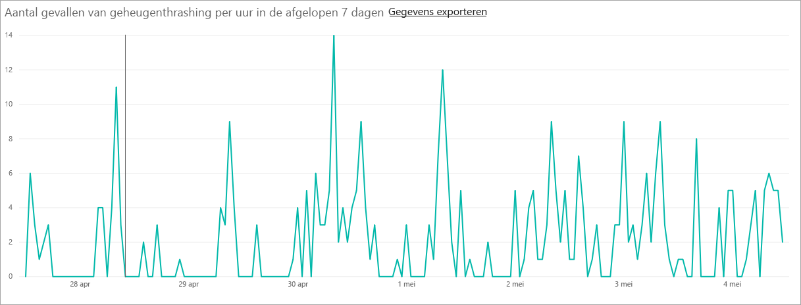

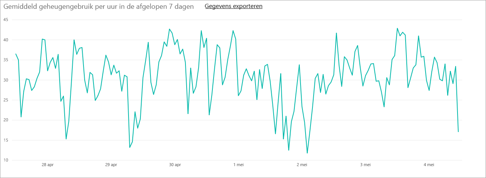

U kunt ook de onderliggende gegevens voor elk van de metrische gegevens exporteren naar een csv-bestand.  Deze export biedt u gedetailleerde informatie voor elke dag van de afgelopen week, in stappen van drie minuten.

## Werkruimte toewijzen aan een capaciteit
Er zijn enkele manieren waarop een werkruimte kan worden toegewezen aan een capaciteit.

### Capaciteitsbeheer in de beheerportal
Capaciteitsbeheerders, maar ook Power BI-beheerders en globale beheerders van voor Office 365, kunnen bulksgewijs werkruimten toewijzen in de beheerportalsectie voor het beheren van Premium-capaciteit. Wanneer u een capaciteit beheert, kunt u in de sectie **Werkruimten** werkruimten toewijzen.

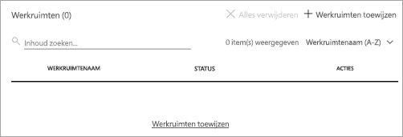

1. Selecteer **Werkruimten toewijzen**. Deze optie is op meerdere locaties beschikbaar en voert altijd dezelfde taak uit.
2. Selecteer **Alle werkruimten van de organisatie** of **Specifieke werkruimten per gebruiker**.

   | Selectie | Beschrijving |
   | --- | --- |
   | **Alle werkruimten van de organisatie** |Als u alle werkruimten van de organisatie toewijst aan Premium-capaciteit, wordt alle app-werkruimten en Mijn werkruimten in uw organisatie toegewezen aan deze Premium-capaciteit. Daarnaast beschikken alle huidige en toekomstige gebruikers over de machtiging om afzonderlijke werkruimten aan deze capaciteit toe te wijzen. |
   | **Specifiek werkruimten op gebruiker** |Wanneer u werkruimten toewijst per gebruiker of groep, worden alle werkruimten die eigendom zijn van deze gebruikers, toegewezen aan Premium-capaciteit, met inbegrip van de persoonlijke werkruimte van de gebruiker. Deze gebruikers krijgen automatisch machtigingen om werkruimten toe te wijzen. Dit geldt ook voor werkruimten die al zijn toegewezen aan een andere capaciteit. |
3. Selecteer **Toepassen**.

Met deze optie kunt u geen specifieke werkruimten toewijzen aan een capaciteit.

### Instellingen voor een app-werkruimte
U kunt ook een app-werkruimte toewijzen aan een Premium-capaciteit via de instellingen voor de desbetreffende werkruimte. Ga als volgt te werk om een app-werkruimte aan een premium-capacity toe te wijzen:

Als u een werkruimte wilt overzetten naar capaciteit, moet u over beheerdersmachtigingen voor de desbetreffende werkruimte en machtigingen voor capaciteitstoewijzing voor de desbetreffende capaciteit beschikken. Houd er rekening mee dat werkruimtebeheerders altijd een werkruimte uit de Premium-capaciteit kunnen verwijderen.

1. Bewerk een app-werkruimte door achtereenvolgens het **beletselteken (...)** en **Werkruimte bewerken** te selecteren.

    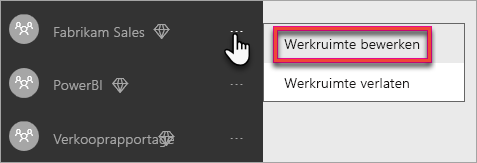
2. Vouw in **Werkruimte bewerken** de optie **Geavanceerd** uit.
3. Als u machtigingen voor capaciteitstoewijzingen hebt ontvangen voor een capaciteit, beschikt u over de mogelijkheid om de optie **Premium** in te schakelen voor deze werkruimte.
4. Selecteer de capaciteit die u wilt toewijzen aan deze app-werkruimte.

    
5. Selecteer **Opslaan**.

Zodra de werkruimte is opgeslagen, wordt de werkruimte en alle bijbehorende inhoud overgezet naar een Premium capaciteit, zonder dat de eindgebruikers hier iets van merken.

## Wat betekent een Premium-capaciteit voor gebruikers
Meestal hoeven gebruikers niet eens te weten dat ze zich in een Premium-capaciteit bevinden. Hun dashboards en rapporten werken gewoon. Als visuele hint wordt er een ruitvormig pictogram naast werkruimten in een Premium-capaciteit weergegeven.

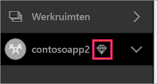

## Productcode van Power BI Report Server
U vindt de productcode van Power BI Report Server op het tabblad **Capaciteitsinstellingen** in de Power BI-beheerportal. Deze is alleen beschikbaar voor algemene beheerders of gebruikers die de rol Power BI-servicebeheerder toegewezen hebben gekregen en als u een Power BI Premium-SKU hebt gekocht.

Als u **Power BI Report Server-sleutel** selecteert, wordt een dialoogvenster weergeven met uw productcode. U kunt deze kopiëren en gebruiken bij de installatie.

Zie [Power BI Report Server installeren](report-server/install-report-server.md) voor meer informatie.

## Volgende stappen
Deel gepubliceerde apps met gratis gebruikers wanneer u de werkruimte aan een Premium-capaciteit toewijst. Zie [Een app maken en distribueren in Power BI](service-create-distribute-apps.md) voor meer informatie.

Nog vragen? [Misschien dat de Power BI-community het antwoord weet](http://community.powerbi.com/)
