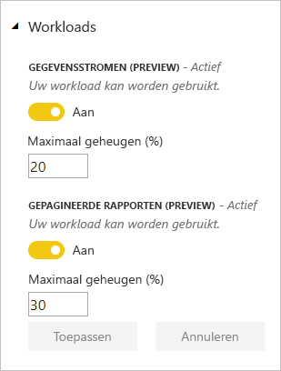
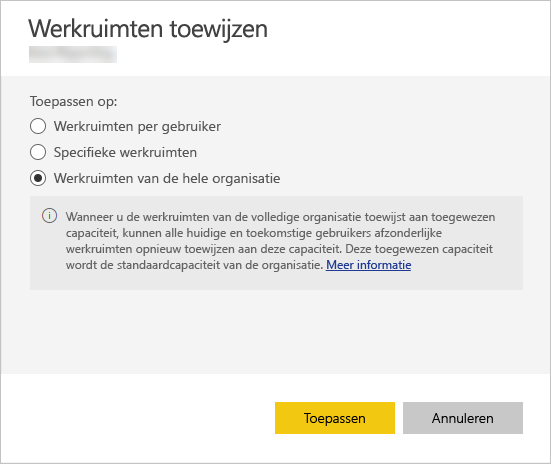

# Capaciteiten in Power BI Premium en Power BI Embedded beheren

Meer informatie over het beheren van Power BI Premium- en Power BI Embedded-capaciteiten, die toegewezen resources voor uw inhoud bieden.

## Wat is capaciteit?

*Capaciteit* vormt het hart van de Power BI Premium- en Power BI Embedded-aanbiedingen. Capaciteit is de set resources die is gereserveerd voor exclusief gebruik door uw organisatie. Wanneer u over toegewezen capaciteit beschikt, kunt u dashboards, rapporten en gegevenssets publiceren voor gebruikers binnen uw organisatie zonder dat u een licentie per gebruiker voor hen hoeft aan te schaffen. Daarnaast krijgt u betrouwbare en consistente prestaties voor de inhoud die in capaciteit wordt gehost. Zie [Wat is Power BI Premium?](service-premium.md) voor meer informatie.

### Capaciteitsbeheerders

Wanneer u als *capaciteitsbeheerder* wordt toegewezen aan een capaciteit, hebt u de volledige controle over de capaciteit en de bijbehorende beheerfuncties. U kunt via de beheerportal van Power BI meer capaciteitsbeheerders toevoegen of gebruikers machtigingen voor capaciteitstoewijzingen geven. U kunt bulksgewijs capaciteit aan werkruimten toewijzen en de metrische gegevens over het gebruik van een capaciteit weergeven.

> [!NOTE]
> Capaciteitsbeheerders voor Power BI Embedded worden gedefinieerd in Microsoft Azure Portal.

Elke capaciteit heeft zijn eigen beheerders. Als u een capaciteitsbeheerder toewijst aan één capaciteit, heeft deze daarmee geen toegang tot alle capaciteiten in uw organisatie. Capaciteitsbeheerders hebben niet standaard toegang tot alle Power BI-beheergedeelten, zoals metrische gegevens over het gebruik, auditlogboeken of tenantinstellingen. Capaciteitsbeheerders beschikken ook niet over machtigingen om nieuwe capaciteiten in te stellen of de SKU van bestaande capaciteiten te wijzigen. Alleen Office 365-hoofdbeheerders of Power BI-servicebeheerders hebben toegang tot deze items.

Alle Office 365-hoofdbeheerders en Power BI-servicebeheerders zijn automatisch capaciteitsbeheerders van zowel Power BI Premium- als Power BI Embedded-capaciteit.

## Capaciteit kopen

Als u wilt profiteren van toegewezen capaciteit, moet u Power BI Premium aanschaffen in het Office 365-beheercentrum of een Power BI Embedded-resource maken in Microsoft Azure Portal. Raadpleeg voor meer informatie de volgende artikelen:

* **Power BI Premium:** [Power BI Premium aanschaffen](service-admin-premium-purchase.md)

* **Power BI Embedded:** [Power BI Embedded-capaciteit maken in de Azure-portal](https://docs.microsoft.com/azure/power-bi-embedded/create-capacity)

Bij de aankoop van Power BI Premium- of ingesloten SKU’s krijgt uw tenant het overeenkomstige aantal v-cores dat nodig is voor gebruik in actieve capaciteiten. Als u bijvoorbeeld Power BI Premium P3 SKU koopt, ontvangt de tenant 32 v-cores. Zie [Premium-capaciteitsknooppunten](service-premium.md#premium-capacity-nodes) voor meer informatie over SKU’s.

## Wat betekent een Premium-capaciteit voor gebruikers

Meestal hoeven gebruikers niet eens te weten dat ze zich in een Premium-capaciteit bevinden. Hun dashboards en rapporten werken gewoon. Als visuele hint wordt naast werkruimten in een Premium-capaciteit een ruitvormig pictogram weergegeven.

## Workloads configureren

De standaardconfiguratie is dat capaciteiten voor Power BI Premium en Power BI Embedded alleen de workload ondersteunen die is gekoppeld aan het uitvoeren van Power BI-query's in de cloud. We bieden nu preview-ondersteuning voor twee extra workloads: **Gepagineerde rapporten** en **Gegevensstromen**. Zie [Workloads in Premium-capaciteit](service-premium.md#workloads-in-premium-capacity) voor meer informatie.

Volg deze stappen om workloads in te schakelen in de Power BI-beheerportal.

1. Selecteer onder **Instellingen voor capaciteit** een capaciteit.

1. Vouw **Workloads** uit onder **MEER OPTIES**.

1. Schakel een of meer workloads in en stel een waarde in voor **Maximaal geheugen**.

    

1. Selecteer **Toepassen**.

## Capaciteitsgebruik bewaken

Power BI bevat een app voor het bewaken van het capaciteitsgebruik. Zie [Capaciteiten van Power BI Premium in uw organisatie bewaken](service-admin-premium-monitor-capacity.md) voor meer informatie.

## Capaciteit beheren

Nadat u capaciteitsknooppunten in Office 365 hebt aangeschaft, stelt u de capaciteit in de Power BI-beheerportal in. U beheert Power BI Premium-capaciteiten in de sectie **Capaciteitsinstellingen** van de portal.

U beheert een capaciteit door de naam van de capaciteit te selecteren. Vervolgens wordt het scherm voor capaciteitsbeheer weergegeven.

Als er geen werkruimten zijn toegewezen aan de capaciteit, wordt een bericht weergegeven over [het toewijzen van een werkruimte aan de capaciteit](#assign-a-workspace-to-a-capacity).

### Een nieuwe capaciteit instellen (Power BI Premium)

In de beheerportal wordt het aantal *virtuele kernen* (v-cores) weergegeven dat u hebt gebruikt en dat nog beschikbaar is. Het totale aantal v-cores is gebaseerd op de Premium-SKU's die u hebt aangeschaft. Als u bijvoorbeeld een P3 en P2 aanschaft, resulteert dit in 48 beschikbare kernen: 32 voor de P3 en 16 voor de P2.

Als u beschikbare v-cores hebt, stelt u met de volgende stappen de nieuwe capaciteit in.

1. Selecteer **Nieuwe capaciteit instellen**.

1. Geef een naam op voor de capaciteit.

1. Definieer wie de beheerder voor deze capaciteit is.

1. Selecteer de grootte van uw capaciteit. Welke opties beschikbaar zijn, is afhankelijk van het aantal beschikbare v-cores. U kunt geen een optie selecteren die groter is dan het aantal beschikbare v-cores.

    

1. Selecteer **Instellen**.

    

Capaciteitsbeheerders, evenals Power BI-beheerders en Office 365-hoofdbeheerders, kunnen de capaciteit vervolgens bekijken in de beheerportal.

### Capaciteitsinstellingen

1. In het scherm voor het beheren van de Premium-capaciteit kunt u onder **Acties** het **tandwielpictogram** selecteren om instellingen te bekijken en bij te werken. 

    

1. U kunt zien wie de servicebeheerders zijn, wat de SKU of de grootte van de capaciteit is en in welke regio de capaciteit zich bevindt.

    

1. U kunt ook de naam van een capaciteit wijzigen of een capaciteit verwijderen.

    

> [!NOTE]
> De capaciteitsinstellingen voor Power BI Embedded worden beheerd in Microsoft Azure Portal.

### Capaciteitsgrootte wijzigen

Power BI-beheerders en Office 365-hoofdbeheerders kunnen Power BI Premium-capaciteit wijzigen. Capaciteitsbeheerders die geen Power BI-beheerder of Office 365-hoofdbeheerder zijn, beschikken niet over deze optie.

1. Selecteer **Capaciteitsgrootte wijzigen**.

    

1. Op het scherm **Capaciteitsgrootte wijzigen** upgradet of downgradet u de capaciteit.

    

    Beheerders kunnen naar wens knooppunten maken en verwijderen en de grootte van de knooppunten wijzigen, zolang ze maar over het vereiste aantal v-cores beschikken.

    U kunt P SKU's niet downgraden naar EM SKU's. U kunt de muisaanwijzer over uitgeschakelde opties bewegen voor een uitleg.

### Gebruikersrechten beheren

U kunt extra capaciteitsbeheerders toewijzen en gebruikers toewijzen die beschikken over machtigingen voor *capaciteitstoewijzing*. Gebruikers die over toewijzingsmachtigingen beschikken, kunnen een app-werkruimte aan een capaciteit toewijzen als ze een beheerder van deze werkruimte zijn. Ze kunnen ook hun persoonlijke *Mijn werkruimte* toewijzen aan de capaciteit. Gebruikers met toewijzingsmachtigingen hebben geen toegang tot de beheerportal.

> [!NOTE]
> Capaciteitsbeheerders voor Power BI Embedded worden gedefinieerd in Microsoft Azure Portal.

Vouw onder **Gebruikersmachtigingen** de optie **Gebruikers met toewijzingsmachtigingen** uit en voeg vervolgens naar behoefte gebruikers of groepen toe.

## Werkruimte toewijzen aan een capaciteit

Er zijn twee manieren om een werkruimte toe te wijzen aan een capaciteit: vanuit de beheerportal en vanuit een app-werkruimte.

### Toewijzen vanuit de beheerportal

Capaciteitsbeheerders, maar ook Power BI-beheerders en Office 365-hoofdbeheerders, kunnen bulksgewijs werkruimten toewijzen in de sectie voor het beheren van Premium-capaciteit in de beheerportal. Wanneer u een capaciteit beheert, kunt u in de sectie **Werkruimten** werkruimten toewijzen.

1. Selecteer **Werkruimten toewijzen**. Deze optie is op meerdere plekken beschikbaar.

1. Selecteer een optie voor **Toepassen op**.

    

   | Selectie | Beschrijving |
   | --- | --- |
   | **Werkruimten per gebruiker** | Wanneer u werkruimten toewijst per gebruiker of groep, worden alle werkruimten die eigendom zijn van deze gebruikers, toegewezen aan Premium-capaciteit, met inbegrip van de persoonlijke werkruimte van de gebruiker. Deze gebruikers krijgen automatisch machtigingen om werkruimten toe te wijzen. Dit geldt ook voor werkruimten die al zijn toegewezen aan een andere capaciteit. |
   | **Specifieke werkruimten** | Voer de naam in van een specifieke werkruimte die u wilt toewijzen aan de geselecteerde capaciteit. |
   | **Alle werkruimten van de organisatie** | Als u alle werkruimten van de organisatie toewijst aan Premium-capaciteit, worden alle app-werkruimten en Mijn werkruimten in uw organisatie toegewezen aan deze Premium-capaciteit. Daarnaast beschikken alle huidige en toekomstige gebruikers over de machtiging om afzonderlijke werkruimten aan deze capaciteit toe te wijzen. |
   | | |

1. Selecteer **Toepassen**.

### Toewijzen vanuit instellingen voor een app-werkruimte

U kunt ook een app-werkruimte toewijzen aan een Premium-capaciteit via de instellingen voor de desbetreffende werkruimte. Als u een werkruimte wilt overzetten naar een capaciteit, moet u over beheerdersmachtigingen voor die werkruimte en ook over machtigingen voor capaciteitstoewijzing voor die capaciteit beschikken. Houd er rekening mee dat werkruimtebeheerders altijd een werkruimte uit Premium-capaciteit kunnen verwijderen.

1. Bewerk een app-werkruimte door achtereenvolgens het beletselteken **(. . .)** en **Werkruimte bewerken** te selecteren.

    

1. Vouw onder **Werkruimte bewerken** de optie **Geavanceerd** uit.

1. Selecteer de capaciteit die u wilt toewijzen aan deze app-werkruimte.

    

1. Selecteer **Opslaan**.

Na het opslaan wordt de werkruimte met alle bijbehorende inhoud overgezet naar Premium capaciteit, zonder dat de eindgebruikers hier iets van merken.

## Productcode van Power BI Report Server

U vindt de productcode van Power BI Report Server op het tabblad **Capaciteitsinstellingen** in de Power BI-beheerportal. Deze is alleen beschikbaar voor algemene beheerders of gebruikers die de rol Power BI-servicebeheerder toegewezen hebben gekregen en als u een Power BI Premium-SKU hebt gekocht.

Als u **Power BI Report Server-sleutel** selecteert, wordt een dialoogvenster weergeven met uw productcode. U kunt deze kopiëren en gebruiken bij de installatie.

Zie [Power BI Report Server installeren](report-server/install-report-server.md) voor meer informatie.

## Volgende stappen

Gepubliceerde apps met gebruikers delen Zie [Een app maken en distribueren in Power BI](service-create-distribute-apps.md) voor meer informatie.

Nog vragen? [Misschien dat de Power BI-community het antwoord weet](http://community.powerbi.com/)
