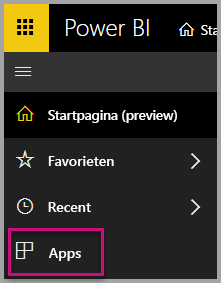
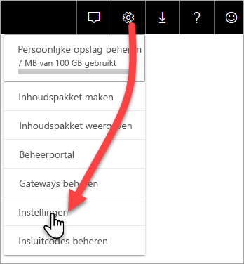
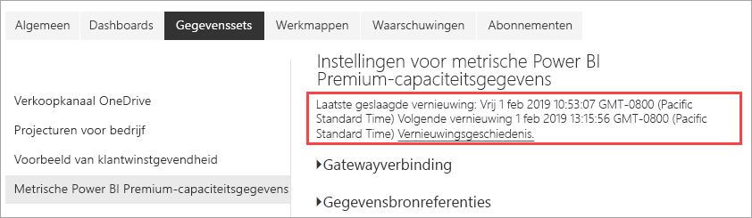
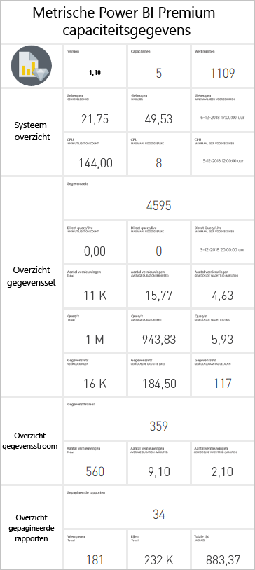
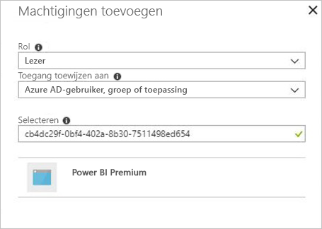

# Premium-capaciteiten bewaken met de app

Bewaking van uw capaciteiten is essentieel voor het nemen van gefundeerde beslissingen over hoe u uw Premium-capaciteitsresources het beste kunt gebruiken. U kunt de capaciteiten bewaken in de beheerportal of met de **Power BI Premium Capacity Metrics**-app. In dit artikel wordt het gebruik van de Premium Capacity Metrics-app beschreven. De app biedt de meest uitgebreide informatie over hoe uw capaciteiten presteren. Voor een algemener overzicht van de metrische gegevens over het gemiddelde gebruik in de afgelopen zeven dagen, kunt u de beheerportal gebruiken. Zie [Premium-capaciteiten bewaken in de beheerportal](service-admin-premium-monitor-portal.md) voor meer informatie over het bewaken in de portal.

De app wordt regelmatig bijgewerkt met nieuwe functies en functionaliteit. Zorg ervoor dat u de meest recente versie gebruikt.   
**De recentste versie van de app is 1.10.1.2 (22 februari 2019)**.   
Als er al een eerdere versie van de app is geïnstalleerd, is het raadzaam deze uit uw apps te verwijderen en vervolgens op CTRL+F5 te drukken om te vernieuwen. 

## De app installeren

U kunt rechtstreeks naar [Premium Capacity Metrics-app](https://app.powerbi.com/groups/me/getapps/services/capacitymetrics) gaan of deze net als andere apps in Power BI installeren.

1. Klik in Power BI op **Apps**.   
    

2. Klik aan de rechterkant op **Apps downloaden**.
3. Zoek in de categorie **Apps** naar **Power BI Premium Capacity Metrics-app**.
4. Meld u aan om de app te installeren.

Een ogenblik geduld. Het duurt een paar minuten om te installeren en metrische gegevens te vernieuwen. Als u in de app lege metrische gegevens ziet, drukt u op F5 om uw browser te vernieuwen.

## Vernieuwingsgeschiedenis van app ophalen

Als u wilt controleren wanneer de Premium Capacity Metrics-app voor het laatst is vernieuwd, klikt u op **Instellingen** > **Gegevenssets** > **Power BI Premium Capacity Metrics** > **Vernieuwingsgeschiedenis**. 

De laatste vernieuwing wordt weergegeven. U kunt ook op **Vernieuwingsgeschiedenis** klikken om geplande vernieuwingen en vernieuwingen op aanvraag weer te geven.

## Capaciteiten bewaken met de app

Als de app is geïnstalleerd, kunt u metrische gegevens voor de capaciteiten in uw organisatie zien. De app biedt een [dashboard](#Dashboard) met samenvattingen van metrische gegevens en gedetailleerde [rapporten](#Reports) met metrische gegevens.

### Dashboard

Klik in **Dashboards** op **Metrische Power BI Premium-capaciteitsgegevens** om een dashboard weer te geven dat belangrijke metrische gegevens samenvat over capaciteiten waarvan u beheerder bent. Er wordt een dashboard weergegeven.

Het dashboard bevat de volgende metrische gegevens:

#### Boven

| Metrische gegevens | Beschrijving |
| --- | --- |
| Versie | Appversie. | 
| Capaciteiten | Aantal capaciteiten waarvan u beheerder bent. | 
| Werkruimten | Aantal werkruimten in de capaciteiten waarvoor metrische gegevens worden gerapporteerd.|
|||

#### Systeemoverzicht

| Metrische gegevens | Beschrijving |
| --- | --- |
| CPU Highest Utilization Capacity (hoogste gebruikscapaciteit van de CPU) | Capaciteit met het maximaal aantal keer dat de CPU 80% van de drempelwaarden overschreed gedurende de afgelopen zeven dagen. |
| CPU Highest Utilization Count (hoogste gebruikshoeveelheid van de CPU) | Aantal keer dat de CPU 80% van de drempelwaarden overschreed gedurende de afgelopen zeven dagen. | 
| Memory Max Utilization Capacity (maximale gebruikscapaciteit van het geheugen) | Capaciteit met het maximale aantal keer dat de maximale geheugenlimiet is bereikt gedurende de afgelopen zeven dagen, opgesplitst in buckets van drie minuten.  |
| Memory Max Utilization Count (maximale gebruikshoeveelheid van het geheugen)| Aantal keer dat de genoemde capaciteit de maximale geheugenlimiet heeft bereikt gedurende de afgelopen zeven dagen, opgesplitst in buckets van drie minuten. |
|||

#### Overzicht gegevensset

| Metrische gegevens | Beschrijving |
| --- | --- |
| Gegevenssets | Totaal aantal gegevenssets in alle werkruimten in uw capaciteiten.|
| Datasets Average Size (MB) (gemiddelde grootte van gegevenssets in MB) | Gemiddelde grootte van gegevenssets in alle werkruimten in uw capaciteiten.|  
| Datasets Average Loaded Count (gemiddeld aantal geladen gegevenssets) | Gemiddeld aantal gegevenssets dat in het geheugen is geladen. |  
| Datasets - Average Active Dataset (%) (gegevenssets - gemiddelde actieve gegevensset in procenten)| Gemiddelde actieve gegevenssets in de afgelopen zeven dagen. Een gegevensset wordt als actief gedefinieerd als de gebruiker de afgelopen drie minuten met de visuals heeft gecommuniceerd. |
| CPU - Datasets Max (%) (CPU - max. gegevenssets in procenten)| Maximaal CPU-verbruik door de workload van gegevenssets in de afgelopen zeven dagen. |
| CPU - Datasets Average (%) (CPU - gemiddelde gegevenssets in procenten)| Gemiddeld CPU-verbruik door de workload van gegevenssets in de afgelopen zeven dagen. |
| Memory - Datasets Average (GB) (geheugen - gemiddelde gegevenssets in GB) | Gemiddeld geheugenverbruik door de workload van gegevenssets in de afgelopen zeven dagen. |
| Memory - Datasets Max (GB) (geheugen - max. gegevenssets in GB) | Max. geheugenverbruik door de workload van gegevenssets in de afgelopen zeven dagen.|
| Datasets Evictions (gegevenssetverwijderingen) | Totaal aantal gegevenssets dat wegens geheugendruk is verwijderd. |
| DirectQuery/Live High Utilization Count (hoge gebruikshoeveelheid van DirectQuery/live-verbindingen)| Aantal keer dat DirectQuery/live-verbindingen 80% van de drempelwaarden overschreed gedurende de afgelopen zeven dagen, opgesplitst in buckets van drie minuten. |
| DirectQuery/Live Max Utilization Count (maximale gebruikshoeveelheid van DirectQuery/live-verbindingen)| Tijden waarop DirectQuery/live-verbindingen de 80% meestal overschreed gedurende de afgelopen zeven dagen, opgesplitst in buckets van één uur. |
| DirectQuery/Live Max High Utilization (maximaal hoog gebruik van DirectQuery/live-verbindingen) | Het maximale aantal keer dat DirectQuery/live-verbindingen 80% van de drempelwaarden overschreed gedurende de afgelopen zeven dagen, opgesplitst in buckets van drie minuten.|
| DirectQuery/Live Max Occurred Time (maximale frequentietijd van DirectQuery/live-verbindingen) | Lokaal tijdstip waarop DirectQuery/live-verbindingen de 80% het vaakst in één uur heeft overschreden. |
| Refreshes Total (totaal aantal vernieuwingen) | Totaal aantal vernieuwingen gedurende de afgelopen zeven dagen. |
| Refresh Reliability (%) (procentuele betrouwbaarheid van vernieuwen) | Aantal geslaagde vernieuwingen gedeeld door het totale aantal vernieuwingen gedurende de afgelopen zeven dagen. |
| Refreshes Average Duration (Minutes) (gemiddelde duur van vernieuwingen in minuten) | De gemiddelde tijd die nodig is om een vernieuwing te voltooien. |
| Refreshes Average Wait Time (Minutes) (gemiddelde wachttijd voor vernieuwingen in minuten)| De gemiddelde tijd die nodig is voordat het vernieuwen begint. |
| Queries Total (totaal aantal query 's) |  Totaal aantal uitgevoerde query's gedurende de afgelopen zeven dagen. |
| Queries Total Wait Count (totaal aantal query's in wachtrij) | Totaal aantal query's die moesten wachten voordat ze konden worden uitgevoerd. |
| Queries Average Duration (MS) (gemiddelde queryduur in ms) | De gemiddelde tijd die nodig is om query's te voltooien. |
| Queries Average Wait Time (MS) (gemiddelde querywachttijd in ms) | De gemiddelde tijd dat query's op systeemresources moesten wachten voordat ze werden uitgevoerd. |
|||

#### Overzicht gegevensstroom

| Metrische gegevens | Beschrijving |
| --- | --- |
| Gegevensstromen |  Totaal aantal gegevensstromen in alle werkruimten in uw capaciteiten.|
| Refreshes Total (totaal aantal vernieuwingen) | Totaal aantal vernieuwingen gedurende de afgelopen zeven dagen.|  
| Refreshes Average Duration (Minutes) (gemiddelde duur van vernieuwingen in minuten) | De tijd die nodig is om vernieuwingen te voltooien. |
| Refreshes Average Wait Times (Minutes) (gemiddelde wachttijden voor vernieuwingen in minuten) | De vertraging tussen de geplande tijd en het daadwerkelijke begin van de vernieuwing.|
| CPU - Dataflows Max (%) (CPU- max. gegevensstromen in procenten) | Maximaal CPU-verbruik door de workload van gegevensstromen in de afgelopen zeven dagen. |
| CPU - Dataflows Average (%) (CPU - gemiddelde gegevensstromen in procenten) | Gemiddeld CPU-verbruik door de workload van gegevensstromen in de afgelopen zeven dagen. |
| Memory - Dataflows Max (GB) (geheugen - max. gegevensstromen in procenten) | Maximaal geheugenverbruik door de workload van gegevensstromen in de afgelopen zeven dagen. |
| Memory - Dataflows Average (GB) (geheugen - gemiddelde gegevensstromen in GB) | Gemiddeld geheugenverbruik door de workload van gegevensstromen in de afgelopen zeven dagen. |
|||

#### Overzicht gepagineerde rapporten

| Metrische gegevens | Beschrijving |
| --- | --- |
| Gepagineerde rapporten |  Totaal aantal gepagineerde rapporten in alle werkruimten in uw capaciteiten. |
| Views Total (totaal aantal weergaven) | Totaal aantal keer dat alle rapporten door gebruikers zijn bekeken. | 
| Rows Total (totaal aantal rijen) | Totaal aantal gegevensrijen in alle rapporten.|
| Totale tijd | Totale tijd die nodig is voor alle fasen van alle rapporten (gegevens ophalen, verwerken en weergeven), in milliseconden. |
| CPU - Paginated Reports Max (%) (CPU - max. aantal gepagineerde rapporten in procenten) | Maximaal CPU-verbruik door de workload van gepagineerde rapporten in de afgelopen zeven dagen. |
| CPU - Paginated Reports Average (%) (CPU- gemiddeld aantal gepagineerde rapporten in procenten) | Gemiddeld CPU-verbruik door de workload van gepagineerde rapporten in de afgelopen zeven dagen. |
| Memory - Paginated Reports Max (GB) (Geheugen - maximaal aantal gepagineerde rapporten in GB) | Maximaal geheugenverbruik door de workload van gepagineerde rapporten in de afgelopen zeven dagen. |
| Memory - Paginated Reports Average (GB) (geheugen - gemiddeld aantal gepagineerde rapporten in GB) | Gemiddeld geheugenverbruik door de workload van gepagineerde rapporten in de afgelopen zeven dagen. |
|||

### Rapporten

Rapporten bevatten gedetailleerdere metrische gegevens. Om rapporten te bekijken voor capaciteiten waarvoor u beheerder bent, klikt u in **Rapporten** op **Metrische Power BI Premium-capaciteitsgegevens**. Of klik vanaf het dashboard op een metrische cel om naar het onderliggende rapport te gaan. 

Onderaan het rapport bevinden zich vijf *tabbladen*:

[**Gegevenssets**](#datasets): bevat gedetailleerde metrische gegevens over de status van de Power BI-gegevenssets in de capaciteiten.   
[**Gepagineerde rapporten**](#paginated-reports): bevat gedetailleerde metrische gegevens over de status van de gepagineerde rapporten in de capaciteiten.   
[**Gegevensstromen**](#dataflows): bevat gedetailleerde metrische vernieuwingsgegevens voor gegevensstromen in de capaciteiten.   
[**Resourceverbruik**](#resource-consumption): bevat gedetailleerde metrische gegevens over de resource, inclusief hoog geheugen- en CPU-verbruik.    
[**Id's en info**](#ids-and-info): namen, id's en eigenaren van capaciteiten, werkruimten en workloads.

Vanaf elk tabblad opent u een pagina waar u metrische gegevens kunt filteren op basis van capaciteit en datumbereik. Als u er geen filters zijn geselecteerd, worden in het rapport alleen de metrische gegevens van afgelopen week weergegeven voor alle capaciteiten waarvoor metrische gegevens worden gerapporteerd. 

### Gegevenssets

De pagina Gegevenssets heeft verschillende *gebieden*, waaronder **Vernieuwingen**, **Queryduur**, **Querywachttijden**, en **Gegevenssets**. Gebruik de knoppen bovenaan de pagina om naar andere gedeelten te navigeren.

#### Vernieuwingengebied

| Rapportsectie | Metrische gegevens |
| --- | --- |
| Aantal vernieuwingen |  Totaal aantal: het totale aantal vernieuwingen voor elke gegevensset.   Betrouwbaarheid: het percentage vernieuwingen dat is voltooid voor elke gegevensset.   Gemiddelde wachttijd: de gemiddelde vertraging tussen de geplande tijd en het begin van een vernieuwing voor de gegevensset, in minuten.   Maximale wachttijd: de maximale wachttijd voor de gegevensset, in minuten.   Gemiddelde duur: de gemiddelde duur van een vernieuwing voor de gegevensset, in minuten.   Maximale duur: de duur van de langst lopende vernieuwing voor de gegevensset, in minuten. |
| Top 5 gegevenssets op Gemiddelde duur in minuten |  De vijf gegevenssets met de langste gemiddelde vernieuwingsduur, in minuten. |
| Top 5 gegevenssets op Gemiddelde wachttijd in minuten |  De vijf gegevenssets met de langste gemiddelde wachttijd, in minuten. |
| Aantal vernieuwingen en geheugenverbruik per uur (GB) |  Geslaagde en mislukte pogingen en geheugenverbruik, opgesplitst in buckets van één uur, vermeld in de lokale tijd. |
| Gemiddelde wachttijden voor vernieuwen per uur, in minuten |  De gemiddelde wachttijd voor vernieuwen, opgesplitst in buckets van één uur, vermeld in de lokale tijd. Meerdere pieken met een lange wachttijd duiden erop dat de limiet van de capaciteit wordt bereikt. |
|  |  |

#### Het gebied Queryduur

| Rapportsectie | Metrische gegevens |
| --- | --- |
| Queryduur |  Gegevens in deze sectie zijn opgedeeld in gegevenssets, werkruimten en buckets van één uur, in de afgelopen zeven dagen.   Totaal: het totale aantal query's dat wordt uitgevoerd voor de gegevensset.   Gemiddeld: de gemiddelde queryduur voor de gegevensset, in milliseconden   Maximaal: de duur van de langst lopende query in de gegevensset, in milliseconden.|
| Queryduurdistributie |  Het histogram voor de queryduur wordt verzameld per queryduur (in milliseconden) in de volgende categorieën: intervallen van <= 30 ms, 30 - 100 ms, 100 - 300 ms, 300 ms - 1 sec, 1 sec - 3 sec, 3 sec - 10 sec, 10 sec - 30 sec en > 30 seconden. Een lange queryduur en lange wachttijden geven aan dat de capaciteit overbelast raakt. Het kan ook betekenen dat een enkele gegevensset problemen veroorzaakt en dat verder onderzoek nodig is. |
| Top 5 gegevenssets op Gemiddelde duur |  De vijf gegevenssets met de langste gemiddelde queryduur, in minuten. |
| Queryduurdistributies per uur |  Aantal query's en gemiddelde duur (in milliseconden) in vergelijking met het geheugenverbruik in GB, opgesplitst in buckets van één uur, vermeld in de lokale tijd. |
| DirectQuery/live-verbindingen (gebruik > 80%) |  Het aantal keer dat een DirectQuery of live-verbinding het CPU-gebruik van 80% heeft overschreden, opgesplitst in buckets van één uur, vermeld in de lokale tijd. |
|  |  |

#### Het gebied Querywachttijden

| Rapportsectie | Metrische gegevens |
| --- | --- |
| Querywachttijden |  Gegevens in deze sectie zijn opgedeeld in gegevenssets, werkruimten en buckets van één uur, in de afgelopen zeven dagen.   Totaal: het totale aantal query's dat wordt uitgevoerd voor de gegevensset.   Aantal in wachtrij: het aantal query's in de gegevensset dat, vóór uitvoering, moest wachten op systeemresources.   Gemiddeld: de gemiddelde querywachtduur voor de gegevensset, in milliseconden.   Maximaal: de duur van de langst wachtende query in de gegevensset, in milliseconden.|
| Top 5 gegevenssets op Gemiddelde wachttijd |  De vijf gegevenssets met de langste gemiddelde wachttijd voor het uitvoeren van een query, in milliseconden. |
| Wachttijddistributies |  Het histogram voor de queryduur wordt verzameld per queryduur (in milliseconden) in de volgende categorieën: intervallen van <= 50 ms, 50 - 100 ms, 100 - 200 ms, 200 - 400 ms, 400 ms - 1 sec, 1 sec - 5 sec en  > 5 seconden. |
| Aantal wachtquery's en tijden per uur |  Aantal wachtquery's en gemiddelde duur (in milliseconden) in vergelijking met het geheugenverbruik in GB, opgesplitst in buckets van één uur, vermeld in de lokale tijd. |
|  |  |

#### Het gebied gegevenssets

| **Rapportsectie** | **Metrische gegevens** |
| --- | --- |
| Grootten gegevenssets  |  Maximale grootte: de maximale grootte van de gegevensset in MB voor de periode die wordt weergegeven. |
| Aantal verwijderingen van gegevenssets |  Totaal: het totale aantal *verwijderingen* van gegevenssets voor elke capaciteit. Wanneer een capaciteit geheugendruk ervaart, worden via het knooppunt een of meer gegevenssets uit het geheugen verwijderd. Gegevenssets die niet actief zijn (waarvoor op dat moment geen query- of vernieuwingsbewerkingen worden uitgevoerd) worden het eerst verwijderd. Vervolgens wordt de volgorde van verwijderen gebaseerd op een meting van 'minst recentelijk gebruikt' (least recently used, LRU).|
| Aantal gegevenssets dat per uur wordt geladen |  Aantal gegevenssets dat in het geheugen wordt geladen versus geheugenverbruik in GB, opgesplitst in buckets van één uur, vermeld in de lokale tijd. |
| Verwijderingen en geheugenverbruik van gegevenssets per uur |  Verwijderingen van gegevenssets versus geheugenverbruik in GB, opgesplitst in buckets van één uur, vermeld in de lokale tijd. |
| Percentages gebruikt geheugen |  Totaal aantal actieve gegevenssets in het geheugen als percentage van het totale geheugen. Met het verschil tussen Actief en Alle wordt bepaald welke gegevenssets kunnen worden verwijderd. Per uur weergegeven, voor de afgelopen zeven dagen. |
|  |  |

### Gepagineerde rapporten

| **Rapportsectie** | **Metrische gegevens** |
| --- | --- |
| Algemeen gebruik |  Totaal aantal weergaven: het aantal keer dat een rapport is bekeken door gebruikers.   Aantal rijen: het aantal rijen met gegevens in het rapport.   Ophalen (gemiddelde): de gemiddelde tijd die het kost om gegevens voor het rapport op te halen, in milliseconden. Als dit lang duurt, kan dit duiden op langzame query's of andere problemen met gegevensbronnen.    Verwerken (gemiddelde): de gemiddelde tijd die het kost om gegevens voor een rapport te verwerken, in milliseconden.  Weergeven (gemiddelde): de gemiddelde tijd die het kost om een rapport weer te geven in de browser, in milliseconden.   Totale tijd: de tijd die het kost om alle fasen van een rapport te doorlopen, in milliseconden. |
| Belangrijkste 5 rapporten op Gemiddelde tijd voor gegevens ophalen |  De vijf rapporten met de langste gemiddelde tijd voor gegevens ophalen, in milliseconden. |
| Belangrijkste 5 rapporten op Gemiddelde verwerkingstijd voor rapport |  De vijf rapporten met de langste gemiddelde verwerkingstijd voor het rapport, in milliseconden. |
| Resultaten per uur |  Geslaagde en mislukte pogingen en geheugenverbruik, opgesplitst in buckets van één uur, vermeld in de lokale tijd. |
| Duur per uur |  Ophalen van gegevens versus de tijd voor verwerken en weergeven, opgesplitst in buckets van één uur, vermeld in de lokale tijd. |
|  |  |

### Gegevensstromen

| **Rapportsectie** | **Metrische gegevens** |
| --- | --- |
| Aantal vernieuwingen |  Totaal: totaal aantal vernieuwingen voor elke gegevensstroom.   Betrouwbaarheid: het percentage vernieuwingen dat is voltooid voor elke gegevensstroom.   Gemiddelde wachttijd: de gemiddelde vertraging tussen de geplande tijd en het begin van een vernieuwing voor de gegevensstroom, in minuten.   Maximale wachttijd: de maximale wachttijd voor de gegevensstroom, in minuten.   Gemiddelde duur: de gemiddelde duur van een vernieuwing voor de gegevensstroom, in minuten.   Maximale duur: de duur van de langst lopende vernieuwing voor de gegevensstroom, in minuten. |
| Belangrijkste 5 gegevensstromen op Gemiddelde vernieuwingsduur |  De vijf gegevensstromen met de langste gemiddelde vernieuwingsduur, in minuten. |
| Belangrijkste 5 gegevensstromen op Gemiddelde wachttijd |  De vijf gegevensstromen met de langste gemiddelde wachttijd, in minuten. |
| Gemiddelde wachttijd per uur voor vernieuwen |  De gemiddelde wachttijd voor vernieuwen, opgesplitst in buckets van één uur, vermeld in de lokale tijd. Meerdere pieken met een lange wachttijd duiden erop dat de limiet van de capaciteit wordt bereikt. |
| Aantal vernieuwingen en geheugenverbruik per uur |  Geslaagde en mislukte pogingen en geheugenverbruik, opgesplitst in buckets van één uur, vermeld in de lokale tijd. |
|  |  |

### Resourceverbruik

| **Rapportsectie** | **Metrische gegevens** |
| --- | --- |
| CPU-verbruik |  Gebruik per workload als een percentage van de totale CPU-capaciteit. Per uur weergegeven, voor de afgelopen zeven dagen. |
| Geheugenverbruik |  Geheugengebruik in GB per workload (ononderbroken lijnen) overlapt met de workloadlimieten (stippellijn). Per uur weergegeven, voor de afgelopen zeven dagen. |
|  |  |

### Id's en info

Het tabblad **Id's en info** bevat gebieden voor **Capaciteiten**, **Werkruimten**, **Gegevenssets**, **Gepagineerde rapporten** en **Gegevensstromen**.

#### Het gebied Capaciteiten

| Rapportsectie | Metrische gegevens |
| --- | --- |
| SKU- en workloadgegevens | SKU- en workloadinstellingen voor de capaciteit. |
| Beheerders | Namen van beheerders voor de capaciteit. |
|||

#### Het gebied Werkruimten

| Rapportsectie | Metrische gegevens |
| --- | --- |
| Werkruimten | Namen en id's voor alle werkruimten. |
|||

#### Het gebied gegevenssets

| Rapportsectie | Metrische gegevens |
| --- | --- |
| Gegevenssets | Werkruimtenamen en id's voor alle gegevenssets. |
|||

#### Het gebied Gepagineerde rapporten

| Rapportsectie | Metrische gegevens |
| --- | --- |
| Gepagineerde rapporten | Namen, werkruimtenamen en id's voor alle gepagineerde rapporten. |
|||

#### Het gebied Gegevensstromen

| Rapportsectie | Metrische gegevens |
| --- | --- |
| Gegevensstromen | Gegevensstroomnamen, werkruimtenamen en id's voor alle gegevensstromen. |
|||

## Power BI Embedded-capaciteit bewaken

U kunt de Power BI Premium Capacity Metrics-app gebruiken om *A SKU*-capaciteiten in Power BI Embedded te bewaken. Deze capaciteiten worden in het rapport weergegeven als u een beheerder van de capaciteit bent. U kunt het rapport echter niet vernieuwen, tenzij u bepaalde machtigingen verleent aan Power BI op uw A SKU's:

1. Open uw capaciteit in de Azure-portal.

1. Klik op **Toegangsbeheer (IAM)** en voeg vervolgens de app **Power BI Premium** aan de lezersrol toe. Als u de app niet op naam kunt vinden, kunt u deze ook op client-id toevoegen:`cb4dc29f-0bf4-402a-8b30-7511498ed654`.

    

> [!NOTE]
> U kunt capaciteitsgebruik van Power BI Embedded bewaken met de app of in de Azure-portal, maar niet in de Power BI-beheerportal.

## Volgende stappen

> [!div class="nextstepaction"]
> [Resourcebeheer en optimalisatie van Power BI Premium-capaciteit](service-premium-understand-how-it-works.md)
