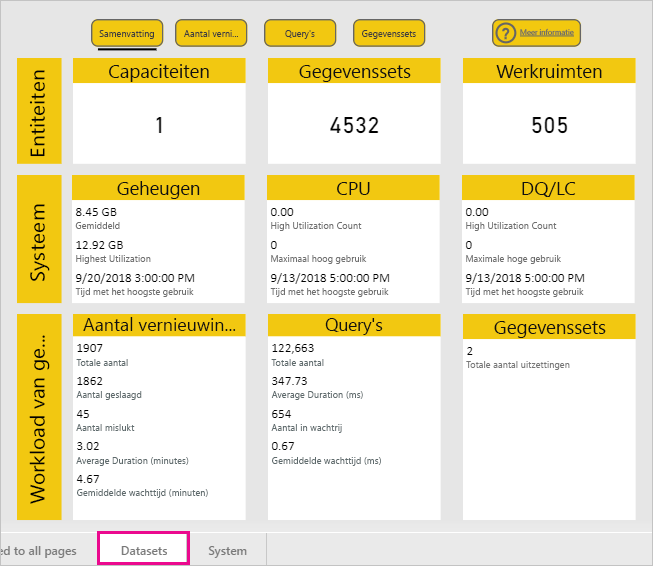
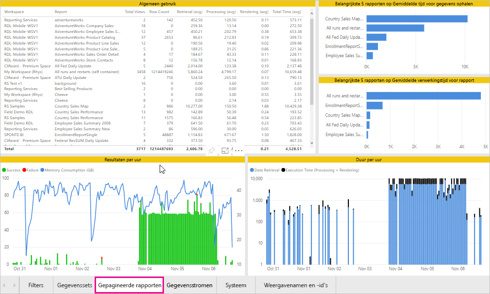
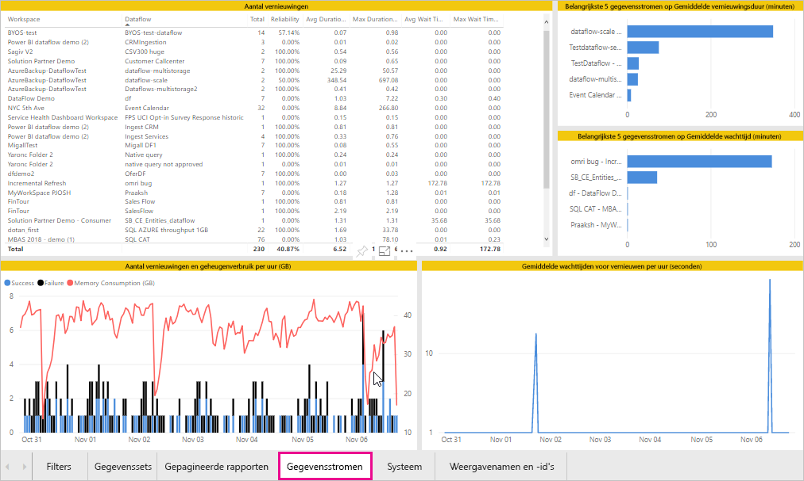
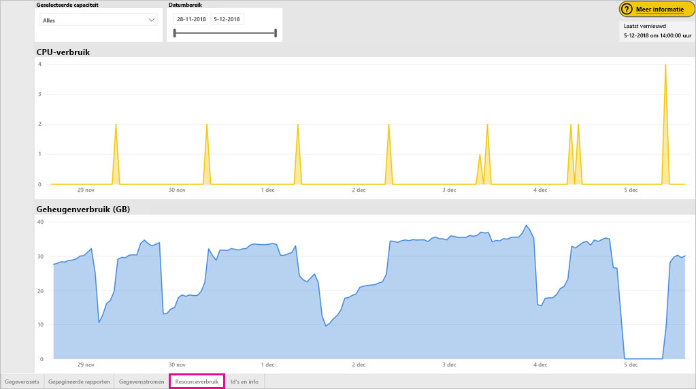
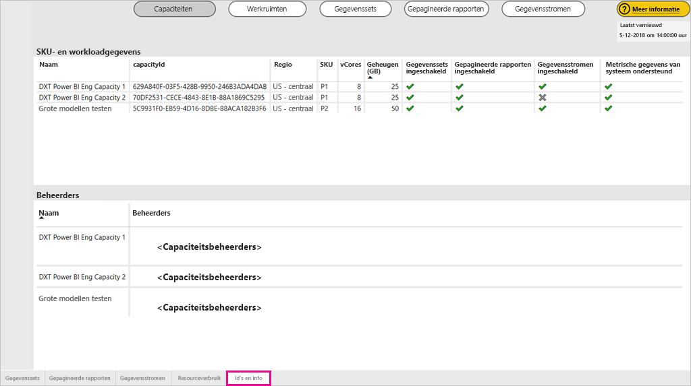
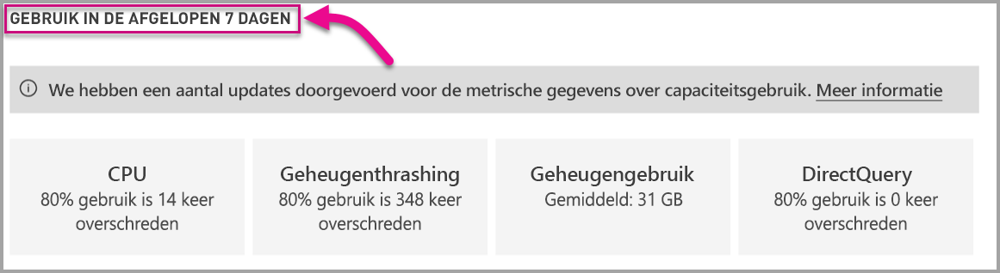

# Power BI Premium en Power BI Embedded-capaciteiten bewaken

In dit artikel vindt u een overzicht van het bewaken van de metrische gegevens voor uw Power BI Premium-capaciteiten. Het bewaken van het capaciteitsgebruik biedt een geïnformeerde benadering voor het beheren van uw capaciteiten.

U kunt de capaciteit bewaken met de app Power BI Premium Capacity Metrics of via de beheerportal. We raden de app aan omdat deze meer detail biedt. Dit artikel behandelt echte beide opties.

**De huidige versie van de app is 1.10 (uitgebracht op 13 december 2018).**

.

<iframe width="560" height="315" src="https://www.youtube.com/embed/UgsjMbhi_Bk?rel=0&amp;showinfo=0" frameborder="0" allowfullscreen></iframe>

## De app Premium Capacity Metrics installeren

U kunt rechtstreeks naar de [app Premium Capacity Metrics](https://app.powerbi.com/groups/me/getapps/services/capacitymetrics) gaan of deze net als andere apps in Power BI installeren.

1. Klik in Power BI op **Apps**.

    

1. Klik aan de rechterkant op **Apps downloaden**.

1. Zoek in de categorie **Apps** naar **Power BI Premium Capacity Metrics-app**.

1. Meld u aan om de app te installeren.

Als de app is geïnstalleerd, kunt u metrische gegevens over de capaciteiten in uw organisatie zien. Laten we eens kijken naar enkele belangrijke metrische gegevens die beschikbaar zijn.

## De Metrics-app gebruiken

### Dashboard met metrische gegevens

Als u de app opent, ziet u eerst een dashboard met een overzicht van alle capaciteiten waarvoor u beheerdersrechten bezit.

Het dashboard bevat de volgende metrische gegevens.

| **Rapportsectie** | **Metrische gegevens** |
| --- | --- |
| **Systeemoverzicht** | * Versie van de toepassing  * Het aantal capaciteiten waarvan u beheerder bent  * Het aantal werkruimten in de capaciteiten waarvoor metrische gegevens worden gerapporteerd  * Het gemiddelde geheugengebruik in GB gedurende de afgelopen zeven dagen  * Het maximale geheugengebruik in GB gedurende de afgelopen zeven dagen  * Het lokale tijdstip waarop het maximale geheugengebruik is opgetreden  * Het aantal keren waarop de CPU 80% van de drempelwaarden overschreed gedurende de afgelopen zeven dagen, gesplitst in buckets van drie minuten  * De tijden waarop de CPU de 80% meestal overschreed gedurende de afgelopen zeven dagen, gesplitst in buckets van één uur  * Het lokale tijdstip waarop de CPU de 80% het vaakst in één uur heeft overschreden |
| **Overzicht gegevensset** | * Het totale aantal gegevenssets in alle werkruimten in uw capaciteiten  * Het aantal keren dat DirectQuery/live-verbindingen 80% van de drempelwaarden overschreed gedurende de afgelopen zeven dagen, gesplitst in buckets van drie minuten  * De tijden waarop DirectQuery/live-verbindingen de 80% meestal overschreed gedurende de afgelopen zeven dagen, gesplitst in buckets van één uur  * Het lokale tijdstip waarop DirectQuery/live-verbindingen de 80% het vaakst in één uur heeft overschreden  * Het totale aantal vernieuwingen gedurende de afgelopen zeven dagen  * De gemiddelde wachttijd voor vernieuwen: de gemiddelde vertraging tussen de geplande tijd en het daadwerkelijke vernieuwen, in minuten  * De gemiddelde vernieuwingsduur: de tijd om het vernieuwen te voltooien, in minuten  * Het totale aantal uitgevoerde query's gedurende de afgelopen zeven dagen  * Gemiddelde querywachttijd: de tijd dat een query heeft gewacht op systeemresources alvorens aan de uitvoering te beginnen, in milliseconden  * Gemiddelde queryduur: de tijd om de query uit te voeren, in milliseconden  * Het totale aantal modellen dat wegens geheugendruk is verwijderd  * Gemiddelde grootte van gegevenssets   * Gemiddeld aantal gegevenssets die in het geheugen zijn geladen |
| **Overzicht gegevensstroom** | * Het totale aantal gegevensstromen in alle werkruimten in uw capaciteiten  * Het totale aantal vernieuwingen gedurende de afgelopen zeven dagen  * De gemiddelde wachttijd voor vernieuwen: de gemiddelde vertraging tussen de geplande tijd en het daadwerkelijke vernieuwen, in minuten  * De gemiddelde vernieuwingsduur: de tijd om het vernieuwen te voltooien, in minuten |
| **Overzicht gepagineerde rapporten** | * Het totale aantal gepagineerde rapporten in alle werkruimten in uw capaciteiten  * Het totale aantal keer dat alle rapporten door gebruikers zijn bekeken  * Het totale aantal rijen gegevens in alle rapporten  * De totale tijd die nodig is voor alle fasen van alle rapporten (gegevens ophalen, verwerken en weergeven), in milliseconden |
|  |  |

### Rapport voor metrische gegevens

Klik op het dashboard om naar het onderliggende rapport te gaan. Het rapport heeft vijf tabbladen die in de volgende secties gedetailleerder worden beschreven.

* **Gegevenssets**: gedetailleerde metrische gegevens over de status van de Power BI-gegevenssets in de capaciteiten.

* **Gepagineerde rapporten**: gedetailleerde metrische gegevens over de status van de gepagineerde rapporten in de capaciteiten.

* **Gegevensstromen**: gedetailleerde metrische gegevens voor vernieuwen in de capaciteiten.

* **Resourceverbruik**: metrische gegevens over de totale capaciteit, inclusief hoog geheugen- en CPU-verbruik.

* **Id's en info**: namen, id's en eigenaren van capaciteiten, werkruimten en workloads.

U kunt op elk tabblad de metrische gegevens filteren op basis van capaciteit en datumbereik. Als u er geen filters zijn geselecteerd, worden in het rapport alleen de metrische gegevens van afgelopen week weergegeven voor alle capaciteiten waarvoor metrische gegevens worden gerapporteerd.

#### Tabblad Gegevenssets

Gebruik de knoppen bovenaan het tabblad **Gegevenssets** om naar andere gedeelten te navigeren: **Samenvatting**, **Vernieuwingen**, **Queryduur**, **Wachten op query** en **Gegevenssets**.

##### Vernieuwingengebied

Het **Vernieuwingengebied** bevat de volgende metrische gegevens.

| **Rapportsectie** | **Metrische gegevens** |
| --- | --- |
| **Betrouwbaarheid van vernieuwen** | * Totale aantal: het totale aantal vernieuwingen voor elke gegevensset  * Betrouwbaarheid: het percentage vernieuwingen dat is voltooid voor elke gegevensset  * Gemiddelde wachttijd: de gemiddelde vertraging tussen de geplande tijd en het begin van een vernieuwing voor de gegevensset, in minuten  * Maximale wachttijd: de maximale wachttijd voor de gegevensset, in minuten   * Gemiddelde duur: de gemiddelde duur van een vernieuwing voor de gegevensset, in minuten  * Maximale duur: de duur van de langst lopende vernieuwing voor de gegevensset, in minuten |
| **Belangrijkste 5 gegevenssets op Gemiddelde vernieuwingsduur** | * De vijf gegevenssets met de langste gemiddelde vernieuwingsduur, in minuten |
| **Belangrijkste 5 gegevenssets op Gemiddelde wachttijd** | * De vijf gegevenssets met de langste gemiddelde wachttijd, in minuten |
| **Gemiddelde wachttijden voor vernieuwen per uur** | * De gemiddelde wachttijd voor vernieuwen, opgesplitst in buckets van één uur, vermeld in de lokale tijd. Meerdere pieken met een lange wachttijd duiden erop dat de limiet van de capaciteit wordt bereikt. |
| **Aantal vernieuwingen en geheugenverbruik per uur** | * Geslaagde en mislukte pogingen, en geheugenverbruik, opgesplitst in buckets van één uur, vermeld in de lokale tijd |
|  |  |

##### Het gebied Queryduur

Het gebied **Queryduur** bevat de volgende metrische gegevens.

| **Rapportsectie** | **Metrische gegevens** |
| --- | --- |
| **Queryduur** | * Gegevens in deze sectie zijn opgedeeld in gegevenssets, werkruimten en buckets van één uur, in de afgelopen zeven dagen  * Totaal: het totale aantal query's dat wordt uitgevoerd voor de gegevensset  * Gemiddeld: de gemiddelde queryduur voor de gegevensset, in milliseconden  * Maximaal: de duur van de langst lopende query in de gegevensset, in milliseconden|
| **Queryduurdistributie** | * Het histogram voor de queryduur wordt verzameld per queryduur (in milliseconden) in de volgende categorieën: intervallen van <= 30 ms, 30 - 100 ms, 100 - 300 ms, 300 ms - 1 sec, 1 sec - 3 sec, 3 sec - 10 sec, 10 sec - 30 sec en > 30 seconden. Een lange queryduur en lange wachttijden geven aan dat de capaciteit overbelast raakt. Het kan ook betekenen dat een enkele gegevensset problemen veroorzaakt en dat verder onderzoek nodig is. |
| **Belangrijkste 5 gegevenssets op Gemiddelde duur** | * De vijf gegevenssets met de langste gemiddelde queryduur, in minuten |
| **DirectQuery/liveverbindingen (gebruik > 80%)** | * Het aantal keer dat een DirectQuery of liveverbinding het gebruik van 80% heeft overschreden, opgesplitst in buckets van één uur, vermeld in de lokale tijd |
| **Queryduurdistributies per uur** | * Aantal query's en gemiddelde duur (in milliseconden) in vergelijking met het geheugenverbruik in GB, opgesplitst in buckets van één uur, vermeld in de lokale tijd |
|  |  |

##### Het gebied Querywachttijden

Het gebied **Querywachttijden** bevat de volgende metrische gegevens.

| **Rapportsectie** | **Metrische gegevens** |
| --- | --- |
| **Querywachttijden** | * Gegevens in deze sectie zijn opgedeeld in gegevenssets, werkruimten en buckets van één uur, in de afgelopen zeven dagen  * Totaal: het totale aantal query's dat wordt uitgevoerd voor de gegevensset  * Aantal wachtquery's: het aantal query's in de gegevensset dat, vóór uitvoering, moest wachten op systeemresources   * Gemiddeld: de gemiddelde querywachtduur voor de gegevensset, in milliseconden  * Maximaal: de duur van de langst wachtende query in de gegevensset, in milliseconden|
| **Wachttijddistributie** | * Het histogram voor de queryduur wordt verzameld per queryduur (in milliseconden) in de volgende categorieën: intervallen van <= 50 ms, 50 - 100 ms, 100 - 200 ms, 200 - 400 ms, 400 ms - 1 sec, 1 sec - 5 sec en  > 5 seconden |
| **Belangrijkste 5 gegevenssets op Gemiddelde wachttijd** | * De vijf gegevenssets met de langste gemiddelde wachttijd voor het uitvoeren van een query, in milliseconden |
| **Aantal wachtquery's en tijden per uur** | * Aantal wachtquery's en gemiddelde duur (in milliseconden) in vergelijking met het geheugenverbruik in GB, opgesplitst in buckets van één uur, vermeld in de lokale tijd |
|  |  |

##### Het gebied gegevenssets

Het gebied **Gegevenssets** bevat de volgende metrische gegevens.

| **Rapportsectie** | **Metrische gegevens** |
| --- | --- |
| **Aantal verwijderingen van gegevenssets** | * Totaal: het totale aantal *verwijderingen* van gegevenssets voor elke capaciteit. Wanneer een capaciteit geheugendruk ervaart, worden via het knooppunt een of meer gegevenssets uit het geheugen verwijderd. Gegevenssets die niet actief zijn (waarvoor op dat moment geen query- of vernieuwingsbewerkingen worden uitgevoerd) worden het eerst verwijderd. Vervolgens wordt de volgorde van verwijderen gebaseerd op een meting van 'minst recentelijk gebruikt' (least recently used, LRU).|
| **Verwijderingen en geheugenverbruik van gegevenssets per uur** | * Verwijderingen van gegevenssets versus geheugenverbruik in GB, opgesplitst in buckets van één uur, vermeld in de lokale tijd |
| **Aantal gegevenssets dat per uur wordt geladen** | * Het aantal gegevenssets dat in het geheugen wordt geladen versus geheugenverbruik in GB, opgesplitst in buckets van één uur, vermeld in de lokale tijd |
| **Gegevensgrootten**  | * Maximale grootte: de maximale grootte van de gegevensset in MB voor de periode die wordt weergegeven |
|  |  |

#### Tabblad Gepagineerde rapporten

Op het tabblad **Gepagineerde rapporten** worden gedetailleerde metrische gegevens weergegeven over de status van de gepagineerde rapporten in uw capaciteiten.

Het tabblad **Gepagineerde rapporten** bevat de volgende metrische gegevens.

| **Rapportsectie** | **Metrische gegevens** |
| --- | --- |
| **Algemene gebruik** | * Totaal aantal weergaven: het aantal keer dat een rapport is bekeken door gebruikers  * Aantal rijen: het aantal rijen met gegevens in het rapport  * Ophalen (gemiddelde): de gemiddelde tijd die het kost om gegevens voor het rapport op te halen, in milliseconden. Als dit lang duurt, kan dit duiden op langzame query's of andere problemen met gegevensbronnen.   * Verwerken (gemiddelde): de gemiddelde tijd die het kost om gegevens voor een rapport te verwerken, in milliseconden * Weergeven (gemiddelde): de gemiddelde tijd die het kost om een rapport weer te geven in de browser, in milliseconden  * Totale tijd: de tijd die het kost om alle fasen van een rapport te doorlopen, in milliseconden|
| **Belangrijkste 5 rapporten op Gemiddelde tijd voor gegevens ophalen** | * De vijf rapporten met de langste gemiddelde tijd voor gegevens ophalen, in milliseconden |
| **Belangrijkste 5 rapporten op Gemiddelde verwerkingstijd voor rapport** | * De vijf rapporten met de langste gemiddelde verwerkingstijd voor het rapport, in milliseconden |
| **Duur per uur** | * Ophalen van gegevens versus de tijd voor verwerken en weergeven, gesplitst in buckets van één uur, vermeld in de lokale tijd |
| **Resultaten per uur** | * Geslaagde en mislukte pogingen, en geheugenverbruik, opgesplitst in buckets van één uur, vermeld in de lokale tijd |
|  |  |

#### Tabblad Gegevensstromen

Op het tabblad **Gegevensstromen** worden gedetailleerde metrische gegevens weergegeven voor gegevensstromen in uw capaciteiten.

Het tabblad **Gegevensstromen** bevat de volgende metrische gegevens.

| **Rapportsectie** | **Metrische gegevens** |
| --- | --- |
| **Vernieuwen** | * Totaal: totaal aantal vernieuwingen voor elke gegevensstroom  * Betrouwbaarheid: het percentage vernieuwingen dat is voltooid voor elke gegevensstroom  * Gemiddelde wachttijd: de gemiddelde vertraging tussen de geplande tijd en het begin van een vernieuwing voor de gegevensstroom, in minuten  * Maximale wachttijd: de maximale wachttijd voor de gegevensstroom, in minuten   * Gemiddelde duur: de gemiddelde duur van een vernieuwing voor de gegevensstroom, in minuten  * Maximale duur: de duur van de langst lopende vernieuwing voor de gegevensstroom, in minuten |
| **Belangrijkste 5 gegevensstromen op Gemiddelde vernieuwingsduur** | * De vijf gegevensstromen met de langste gemiddelde vernieuwingsduur, in minuten |
| **Belangrijkste 5 gegevensstromen op Gemiddelde wachttijd** | * De vijf gegevensstromen met de langste gemiddelde wachttijd, in minuten |
| **Gemiddelde wachttijden voor vernieuwen per uur** | * De gemiddelde wachttijd voor vernieuwen, opgesplitst in buckets van één uur, vermeld in de lokale tijd. Meerdere pieken met een lange wachttijd duiden erop dat de limiet van de capaciteit wordt bereikt. |
| **Aantal vernieuwingen en geheugenverbruik per uur** | * Geslaagde en mislukte pogingen, en geheugenverbruik, opgesplitst in buckets van één uur, vermeld in de lokale tijd |
|  |  |

#### Tabblad Resourceverbruik

Op het tabblad **Resourceverbruik** worden het CPU- en geheugenverbruik weergegeven van alle capaciteiten en workloads.

Het tabblad **Resourceverbruik** bevat de volgende metrische gegevens.

| **Rapportsectie** | **Metrische gegevens** |
| --- | --- |
| **CPU-verbruik** | * Het aantal keren waarop de CPU 80% van de drempelwaarden overschreed gedurende de afgelopen zeven dagen, gesplitst in buckets van drie minuten |
| **Geheugenverbruik** | * Geheugenverbruik in de afgelopen zeven dagen, gesplitst in buckets van drie minuten |
|  |  |

#### Tabblad Id's en info

Het tabblad **Id's en info** bevat de namen, id's en eigenaren van de capaciteiten, werkruimten en workloads.

## Power BI Embedded-capaciteit bewaken

U kunt ook de app Power BI Premium Capacity Metrics gebruiken om *A SKU*-capaciteiten in Power BI Embedded te bewaken. Deze capaciteiten worden in het rapport weergegeven als u een beheerder van de capaciteit bent. U kunt het rapport echter niet vernieuwen, tenzij u bepaalde machtigingen verleent aan Power BI op uw A SKU's:

1. Open uw capaciteit in de Azure-portal.

1. Klik op **Toegangsbeheer (IAM)** en voeg de app Power BI Premium aan de lezersrol toe. Als u de app niet op naam kunt vinden, kunt u deze ook op client-id toevoegen: cb4dc29f-0bf4-402a-8b30-7511498ed654.

    

> [!NOTE]
> U kunt capaciteitsgebruik van Power BI Embedded bewaken met de app of in de Azure-portal, maar niet in de Power BI-beheerportal.

## Eenvoudige bewaking in de beheerportal

Het gebied **Capaciteitsinstellingen** van de beheerportal bevat vier meters waarmee de geplaatste belastingen en de door uw capaciteit gebruikte resources gedurende de afgelopen zeven dagen worden gemeten. Deze vier tegels werken volgens met tijdvensters van een uur, waarin wordt aangegeven hoeveel uren gedurende de afgelopen zeven dagen de desbetreffende meting meer dan 80% aangaf. Deze meting geeft en potentiële afname van de eindgebruikerservaring aan.

| **Meting** | **Beschrijving** |
| --- | --- |
| CPU |Aantal keer dat CPU-gebruik 80% of meer was. |
| Geheugenthrashing |De geheugendruk van uw back-endkernen. Met deze gegevens wordt aangegeven hoe vaak gegevenssets uit het geheugen zijn verwijderd vanwege de geheugendruk door het gebruik van meerdere gegevenssets. |
| Geheugengebruik |Gemiddeld geheugengebruik, in gigabytes (GB). |
| DQ/s | Aantal keer dat het aantal DirectQuery- en liveverbindingen 80% van de limiet heeft overschreden.   * We beperken het totale aantal query's per seconde voor DirectQuery en live-verbindingen. * De grenswaarden zijn 30/s voor P1, 60/s voor P2 en 120/s voor P3. * De query's voor DirectQuery en liveverbindingen tellen beide een zwaar voor de bovenstaande limiet. Als u gedurende één seconde bijvoorbeeld 15 DirectQuery's en 15 live-verbindingen hebt, is de grenswaarde bereikt * Dit geldt ook voor on-premises- en cloudverbindingen. |
|  |  |

Metrische gegevens geven het gebruik van de afgelopen week aan.  Als u een weergave met meer details wilt zien van de metrische gegevens, klikt u hiervoor op een van de samenvattingstegels.  Hiermee gaat u naar de gedetailleerde diagrammen voor elk van de metrische gegevens voor uw Premium-capaciteit. In het volgende diagram worden de details voor de CPU-meting getoond.

Deze grafieken worden voor de afgelopen week per uur samengevat en kunnen helpen bij het isoleren wanneer u mogelijk specifieke, prestatiegerelateerde evenementen hebt gehad in uw Premium-capaciteit.

U kunt ook de onderliggende gegevens voor elk van de metrische gegevens exporteren naar een csv-bestand.  Deze export biedt u gedetailleerde informatie voor elke dag van de afgelopen week, in stappen van drie minuten.

## Volgende stappen

U hebt geleerd hoe u Power BI Premium-capaciteiten kunt bewaken. U kunt nu meer leren over het optimaliseren van capaciteiten.

> [!div class="nextstepaction"]
> [Resourcebeheer en optimalisatie van Power BI Premium-capaciteit](service-premium-understand-how-it-works.md)
