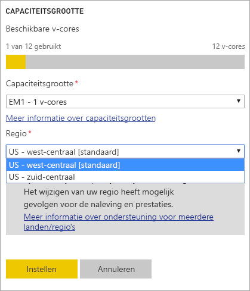
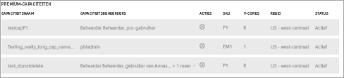

# Ondersteuning voor Multi-Geo voor Power BI Premium (preview-versie)

Ondersteuning voor meerdere geografische gebieden is een functie van Power BI Premium waarmee multinationale klanten kunnen inspelen op regionale en branchespecifieke vereisten of vereisten ten aanzien van de opslaglocatie van organisatiegegevens. Als een klant van Power BI Premium kunt u inhoud implementeren naar datacenters in andere regio's dan de basisregio van de Power BI-tenant. Een geografisch gebied kan meer dan één regio omvatten. De Verenigde Staten is bijvoorbeeld een geografische gebied, terwijl US - west-centraal en US - zuid-centraal regio's zijn in de Verenigde Staten. U kunt aangeven dat u inhoud wilt distribueren naar een van de volgende geografische gebieden:

- Verenigde Staten
- Canada
- Verenigd Koninkrijk
- Brazilië
- Europa
- Japan
- India
- Azië en Stille Oceaan
- Australië

Ondersteuning voor meerdere geografische gebieden is niet beschikbaar voor Power BI Duitsland, Power BI China uitgevoerd door 21Vianet of Power BI voor de Amerikaanse overheid.

Multi-Geo is nu ook beschikbaar in Power BI Embedded. Lees meer op [Ondersteuning voor Multi-Geo in Power BI Embedded (preview-versie)](developer/embedded-multi-geo.md).

## Meerdere geografische gebieden gebruiken

Voor een nieuwe capaciteit kunt u de ondersteuning voor meerdere geografische gebieden inschakelen door in de vervolgkeuzelijst een andere regio te selecteren dan de standaardregio.  Voor elke beschikbare capaciteit wordt aangegeven in welke regio zich deze momenteel bevindt, zoals **US - west-centraal**.

Nadat u een capaciteit hebt gemaakt, blijft deze in die regio aanwezig. Voor alle gemaakte werkruimten geldt dat inhoud voor die ruimten wordt opgeslagen in die regio. U kunt werkruimten van de ene naar de andere regio migreren via de vervolgkeuzelijst in het scherm met werkruimte instellingen.

U ziet dit bericht om de wijziging te bevestigen.

Het is op dit moment niet nodig om de gatewayreferenties opnieuw in te stellen tijdens een migratie.  Nadat deze zijn opgeslagen in de regio van de Premium-capaciteit, moet u ze tijdens de migratie opnieuw instellen.

Tijdens de migratie kunnen bepaalde bewerkingen mislukken, zoals het publiceren van nieuwe gegevenssets of een geplande gegevensvernieuwing.  

De volgende items worden opgeslagen in de Premium-regio als ondersteuning voor meerdere geografische gebieden is ingeschakeld:

- Modellen (ABF-bestanden) voor importeren en DirectQuery-gegevenssets
- Query-cache
- R-afbeeldingen

Deze items blijven opgeslagen in de basisregio van de tenant:

- Push-gegevenssets
- Excel-werkmappen
- Metagegevens van dashboards/rapporten, zoals namen van tegels en tegelquery's
- Servicebussen voor gatewayquery's of geplande vernieuwingstaken
- Machtigingen
- Referenties van gegevenssets

## Capaciteitsregio's bekijken

In de beheerportal kunt u alle capaciteiten voor uw Power BI-tenant bekijken, evenals de regio's waar ze zich momenteel in bevinden.

 

## Regio wijzigen voor bestaande inhoud

Als u de regio voor bestaande inhoud moet wijzigen, hebt u twee mogelijkheden.

- Maak een tweede capaciteit en verplaats werkruimten. Gratis gebruikers merken niets van uitval, op voorwaarde dat de tenant over reserve-v-cores beschikt.
- Als het maken van een tweede capaciteit geen optie is, kunt u de inhoud tijdelijk vanuit Premium terug verplaatsen naar een gedeelde capaciteit. U hebt dan geen extra v-cores nodig, maar gratis gebruikers krijgen wel te maken met wat uitvaltijd.

## Inhoud niet meer onderbrengen in meerdere geografische gebieden  

U kunt er op twee manieren voor zorgen dat werkruimten niet meer worden opgeslagen in Multi-Geo-capaciteit:

- Verwijder de huidige capaciteit waarin de werkruimte zich bevindt.  Hierdoor wordt de werkruimte terug verplaatst naar gedeelde capaciteit in de basisregio.
- Migreer afzonderlijke werkruimten terug naar Premium-capaciteit in de basistenant.

## Beperkingen en overwegingen

- Controleer of alle verplaatsingen tussen regio's voldoen aan alle nalevingsvereisten van uw bedrijf en de overheid voordat u de gegevensoverdracht daadwerkelijk start.
- Een in de cache opgeslagen query in een verafgelegen regio blijft in die regio wanneer de query niet wordt gebruikt. Andere gegevens die onderweg zijn kunnen echter heen en weer worden verplaatst tussen meerdere geografische gebieden.
- Bij het verplaatsen van gegevens van de ene naar de andere regio in een omgeving met ondersteuning voor meerdere geografische gebieden, kunnen de brongegevens gedurende maximaal 30 dagen aanwezig blijven in de regio van waaruit de gegevens zijn verplaatst. Gedurende die periode hebben eindgebruikers geen toegang tot de gegevens. De gegevens worden gedurende deze periode van 30 dagen verwijderd uit deze regio en vernietigd.
- Ondersteuning voor meerdere geografische gebieden resulteert over het algemeen niet in betere prestaties. Het laden van rapporten en dashboards vereist namelijk nog steeds dat er aanvragen voor metagegevens worden verstuurd naar de basisregio.
- De functie [gegevensstromen](service-dataflows-overview.md) (preview-versie) wordt momenteel niet ondersteund in Multi-Geo.

## Volgende stappen

- [Power BI Premium: Wat is het?](service-premium.md)
- [Multi-Geo voor capaciteiten van Power BI Embedded](developer/embedded-multi-geo.md)

Hebt u nog vragen? [Misschien dat de Power BI-community het antwoord weet](http://community.powerbi.com/)
