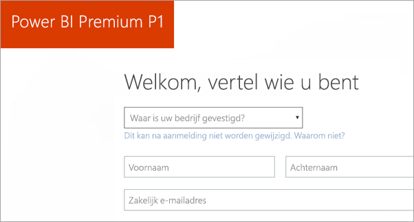
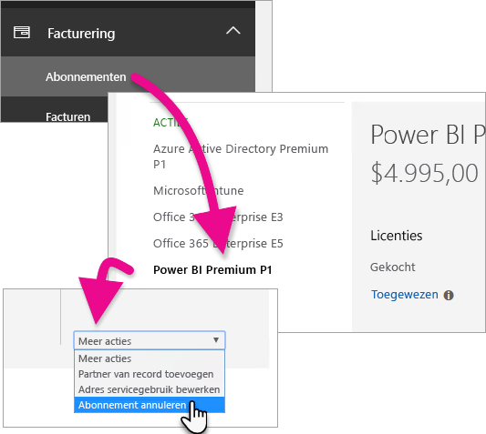
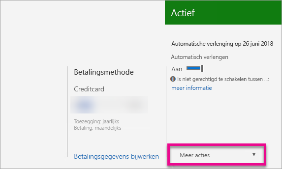

# Power BI Premium aanschaffen
Lees hoe u Power BI Premium-capaciteit voor uw hele organisatie koopt.

<iframe width="640" height="360" src="https://www.youtube.com/embed/NkvYs5Qp4iA?rel=0&amp;showinfo=0" frameborder="0" allowfullscreen></iframe>

U kunt een Power BI Premium-capaciteitsknooppunt kopen via het Office 365-beheercentrum. U kunt ook een combinatie van SKU's voor Premium-capaciteit (P1 tot en met P3) binnen uw organisatie hebben. Deze bieden verschillende resourcemogelijkheden.

Zie [Power BI Premium - wat is het?](service-premium.md) voor meer informatie over wat Power BI Premium is. Op de [Power BI-pagina met prijzen](https://powerbi.microsoft.com/pricing/) kunt u de huidige prijzen voor Power BI zien. U kunt ook de kosten voor Power BI Premium plannen met behulp van de [Power BI Premium-rekenmachine](https://powerbi.microsoft.com/calculator/).

> [!IMPORTANT]
> Auteurs van inhoud hebben ook als u Power BI Premium koopt nog steeds een Power BI Pro-licentie nodig.
> 
> 

## Een nieuwe tenant maken met Power BI Premium P1
Als u geen bestaande tenant hebt en een tenant wilt maken, kunt u op hetzelfde moment Power BI Premium aanschaffen. Met de volgende koppeling gaat u stapsgewijs door het proces voor het maken van een nieuwe tenant voor gebruik met Office 365 en kunt u Power BI Premium aanschaffen. U moet een Power BI Pro-licentie voor een gebruiker kopen nadat de tenant is gemaakt. Wanneer u een tenant maakt, wordt u automatisch de globale beheerder voor de tenant.

Ga naar de [Power BI Premium P1-aanbieding](https://signup.microsoft.com/Signup?OfferId=b3ec5615-cc11-48de-967d-8d79f7cb0af1) als u tot aankoop wilt overgaan.

## Een Power BI Premium-capaciteit voor een bestaande organisatie kopen
Als u een bestaande organisatie hebt, moet u een globale of factureringsbeheerder zijn om abonnementen en licenties te kunnen kopen. Zie [Over Office 365-beheerdersrollen](https://support.office.com/article/About-Office-365-admin-roles-da585eea-f576-4f55-a1e0-87090b6aaa9d) voor meer informatie.

Als u Premium-capaciteit wilt kopen, moet u het volgende doen.

1. Selecteer in de Power BI-service **Kiezer voor Office 365-apps** > **Beheer**. U kunt ook naar het Office 365-beheercentrum bladeren. U gaat daarvoor naar https://portal.office.com waarna u **Beheer** selecteert.
   
    
2. Selecteer **Facturering** > **Services aanschaffen**.
3. Zoek onder **Andere abonnementen** naar Power BI Premium-aanbiedingen. Hiermee worden P1 tot en met P3, EM3 en P1 (maandelijks) weergegeven.
4. Beweeg de muisaanwijzer over het **beletselteken (...)** en selecteer vervolgens **Nu kopen**.
   
    
5. Volg de stappen om de aankoop te voltooien.

U kunt ook de volgende koppelingen selecteren om rechtstreeks naar de aankooppagina's van die items te gaan. Zie [Power BI Premium - wat is het?](service-premium.md#premiumskus) voor meer informatie over deze SKU's.

Als u een Power BI Premium SKU wilt kopen, ***moet u een globale of factureringsbeheerder*** binnen uw tenant zijn. Als u geen beheerder bent, wordt met de onderstaande koppelingen een foutmelding weergegeven.

| Koppelingen voor rechtstreekse aankoop |
| --- |
| [EM3 SKU (maandelijks)](https://portal.office.com/commerce/completeorder.aspx?OfferId=4004702D-749C-4F74-BF47-3048F1833780&adminportal=1) |
| [P1 SKU](https://portal.office.com/commerce/completeorder.aspx?OfferId=b3ec5615-cc11-48de-967d-8d79f7cb0af1&adminportal=1) |
| [P1 SKU (maandelijks)](https://portal.office.com/commerce/completeorder.aspx?OfferId=E4C8EDD3-74A1-4D42-A738-C647972FBE81&adminportal=1) |
| [P2 SKU](https://portal.office.com/commerce/completeorder.aspx?OfferId=062F2AA7-B4BC-4B0E-980F-2072102D8605&adminportal=1) |
| [P3 SKU](https://portal.office.com/commerce/completeorder.aspx?OfferId=40c7d673-375c-42a1-84ca-f993a524fed0&adminportal=1) |

Nadat u de aankoop hebt voltooid, wordt op het scherm Services aanschaffen weergegeven dat het item is gekocht en actief is.

U kunt deze capaciteit nu in het Power BI-beheercentrum beheren. Zie [Power BI Premium beheren](service-admin-premium-manage.md) voor meer informatie.

## Meer capaciteit kopen
Wanneer u zich in de sectie **Premium-instellingen** van de Power BI-beheerportal bevindt, ziet u een knop **Meer kopen** als u een beheerder bent. Met deze knop gaat u naar de Office 365-portal. In het Office 365-beheercentrum kunt u het volgende doen.

1. Selecteer **Facturering** > **Services aanschaffen**.
2. Zoek het Power BI Premium-item waarvan u meer wilt kopen, onder **Andere abonnementen**.
3. Beweeg de muisaanwijzer over het **beletselteken (...)** en selecteer vervolgens **Aantal licenties wijzigen**.
   
    
4. Geef op hoeveel exemplaren u voor dit item wilt hebben. Selecteer vervolgens **Verzenden** wanneer u klaar bent.
   
   > [!IMPORTANT]
   > Als u **Verzenden** hebt gekozen, worden er kosten bij de geregistreerde creditcard in rekening gebracht.
   > 
   > 

Op de pagina **Services aanschaffen** wordt aangegeven hoeveel exemplaren u hebt. In de Power BI-beheerportal wordt onder **Capaciteitsinstellingen** bij de beschikbare v-cores de nieuw gekochte capaciteit weergegeven.

U kunt deze capaciteit nu in het Power BI-beheercentrum beheren. Zie [Power BI Premium beheren](service-admin-premium-manage.md) voor meer informatie.

## Uw abonnement annuleren
U kunt uw abonnement vanuit het Office 365-beheercentrum annuleren. Als u uw Premium-abonnement wilt annuleren, gaat u als volgt te werk.

1. Blader naar het Office 365-beheercentrum.
2. Selecteer **Facturering** > **Abonnementen**.
3. Selecteer uw Power BI Premium-abonnement in de lijst.
4. Selecteer in de vervolgkeuzelijst **Meer acties** de optie **Abonnement annuleren**.
   
    
5. Op de pagina **Abonnement annuleren** wordt aangegeven of u wel of niet verantwoordelijk bent voor [de kosten voor vroegtijdige beëindiging](https://support.office.com/article/early-termination-fees-6487d4de-401a-466f-8bc3-c0beb5cc40d3). Op deze pagina kunt u ook lezen wanneer de gegevens voor het abonnement worden verwijderd.
6. Lees de informatie en selecteer **Abonnement annuleren** als u wilt doorgaan.

## Volgende stappen
[Pagina met Power BI-prijzen](https://powerbi.microsoft.com/pricing/)  
[Power BI Premium-rekenmachine](https://powerbi.microsoft.com/calculator/)  
[Power BI Premium - wat is het?](service-premium.md)  
[Power BI Premium beheren](service-admin-premium-manage.md)  
[Veelgestelde vragen over Power BI Premium](service-premium-faq.md)  
[Releaseopmerkingen bij Power BI Premium](service-premium-release-notes.md)  
[Technisch document over Microsoft Power BI Premium](https://aka.ms/pbipremiumwhitepaper)  
[Een technisch document over een Power BI-implementatie voor de onderneming plannen](https://aka.ms/pbienterprisedeploy)  
[Power BI-beheerportal](service-admin-portal.md)  
[Power BI in uw organisatie beheren](service-admin-administering-power-bi-in-your-organization.md)  

Nog vragen? [Misschien dat de Power BI-community het antwoord weet](http://community.powerbi.com/)

