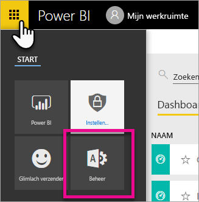
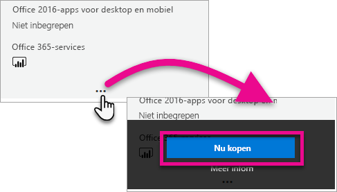
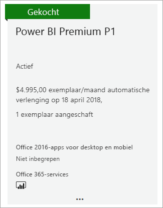
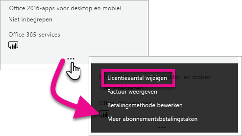
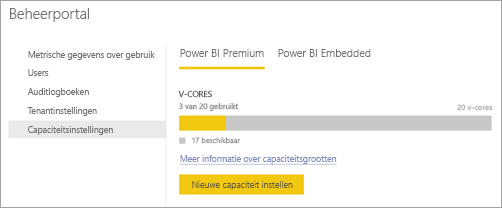

# Power BI Premium aanschaffen

> [!NOTE]
> Dit artikel wordt momenteel bijgewerkt met beschrijvingen van nieuwe functies, meer informatie en betere leesbaarheid. 

In dit artikel wordt beschreven hoe u Power BI Premium-capaciteit (P1-P3) voor uw hele organisatie koopt. U koopt Power BI Premium-capaciteit in het Office 365-beheercentrum en u beheert uw capaciteiten in de Power BI-beheerportal. Zie de [pagina met Power BI-prijzen](https://powerbi.microsoft.com/pricing/) en de [Power BI Premium-rekenmachine](https://powerbi.microsoft.com/calculator/) voor informatie over de huidige prijzen en de planning.

Ook als uw organisatie gebruikmaakt van Power BI Premium hebben makers van inhoud een Power BI Pro-licentie nodig. Zorg ervoor dat u ten minste één Power BI Pro-licentie voor uw organisatie koopt.

Als een Premium-abonnement verloopt, houdt u dertig dagen volledige toegang tot uw capaciteit. Daarna keert uw inhoud terug naar een gedeelde capaciteit. Modellen groter dan 1 GB worden niet ondersteund in gedeelde capaciteit.

## Een nieuwe tenant maken met Power BI Premium P1

Als u geen bestaande tenant hebt en een tenant wilt maken, kunt u op hetzelfde moment Power BI Premium aanschaffen. Met de volgende koppeling gaat u stapsgewijs door het proces voor het maken van een nieuwe tenant en kunt u Power BI Premium aanschaffen: [Power BI Premium P1-aanbieding](https://signup.microsoft.com/Signup?OfferId=b3ec5615-cc11-48de-967d-8d79f7cb0af1). Wanneer u een tenant maakt, wordt aan u automatisch de rol van Office 365-hoofdbeheerder voor die tenant toegewezen.

## Een Power BI Premium-capaciteit voor een bestaande organisatie kopen

Als u een bestaande organisatie (tenant) hebt, moet u de rol van Office 365-hoofdbeheerder of financieel medewerker hebben om abonnementen en licenties te kunnen aanschaffen. Zie [Over Office 365-beheerdersrollen](https://support.office.com/article/About-Office-365-admin-roles-da585eea-f576-4f55-a1e0-87090b6aaa9d) voor meer informatie.

Volg deze stappen om een Premium-capaciteit aan te schaffen.

1. Selecteer in de Power BI-service de optie Kiezer voor Office 365-apps en vervolgens **Beheerder**.

    

    U kunt ook naar het Office 365-beheercentrum bladeren. U gaat daarvoor naar https://portal.office.com waarna u **Beheer** selecteert.

1. Selecteer **Facturering** > **Services aanschaffen**.

1. Zoek onder **Andere abonnementen** naar Power BI Premium-aanbiedingen. Hiermee worden P1 tot en met P3, EM3 en P1 (maandelijks) weergegeven.

1. Beweeg de muisaanwijzer over het beletselteken **(. . .)** en selecteer vervolgens **Nu kopen**.

    

1. Volg de stappen om de aankoop te voltooien.

Nadat u de aankoop hebt voltooid, wordt op de pagina **Services aanschaffen** weergegeven dat het item is gekocht en actief is.

## Meer capaciteiten kopen

Nu u over een capaciteit beschikt, kunt u er naar behoefte meer aan toevoegen. U kunt elke gewenste combinatie van SKU's voor Premium-capaciteit (P1 tot en met P3) binnen uw organisatie gebruiken. De verschillende SKU’s bieden verschillende resourcemogelijkheden.

1. Selecteer in het Office 365-beheercentrum **Facturering** > **Services aanschaffen**.

1. Zoek het Power BI Premium-item waarvan u meer wilt kopen, onder **Andere abonnementen**.

1. Beweeg de muisaanwijzer over het **beletselteken (...)** en selecteer vervolgens **Aantal licenties wijzigen**.

    

1. Geef op hoeveel exemplaren u voor dit item wilt hebben. Selecteer vervolgens **Verzenden** wanneer u klaar bent.

   > [!IMPORTANT]
   > Bij het selecteren van **Verzenden** worden de kosten in rekening gebracht via de geregistreerde creditcard.

Op de pagina **Services aanschaffen** wordt aangegeven hoeveel exemplaren u hebt. In de Power BI-beheerportal wordt onder **Capaciteitsinstellingen** bij de beschikbare v-cores de nieuw gekochte capaciteit weergegeven.

## Uw abonnement annuleren

U kunt uw abonnement vanuit het Office 365-beheercentrum annuleren. Als u uw Premium-abonnement wilt annuleren, gaat u als volgt te werk.

1. Blader naar het Office 365-beheercentrum.

1. Selecteer **Facturering** > **Abonnementen**.

1. Selecteer uw Power BI Premium-abonnement in de lijst.

1. Selecteer **Meer acties** > **Abonnement annuleren**.

1. Op de pagina **Abonnement annuleren** wordt aangegeven of u wel of niet verantwoordelijk bent voor [de kosten voor vroegtijdige beëindiging](https://support.office.com/article/early-termination-fees-6487d4de-401a-466f-8bc3-c0beb5cc40d3). Op deze pagina kunt u ook lezen wanneer de gegevens voor het abonnement worden verwijderd.

1. Lees de informatie en selecteer **Abonnement annuleren** als u wilt doorgaan.

## Volgende stappen

[Pagina met Power BI-prijzen](https://powerbi.microsoft.com/pricing/)
[Power BI Premium-rekenmachine](https://powerbi.microsoft.com/calculator/)
[Wat is Power BI Premium?](service-premium.md)
[Veelgestelde vragen over power BI Premium](service-premium-faq.md)
[Technisch document over Microsoft Power BI Premium](https://aka.ms/pbipremiumwhitepaper)
[Technisch document over het plannen van een Power BI Enterprise-implementatie](https://aka.ms/pbienterprisedeploy)

Hebt u nog vragen? [Misschien dat de Power BI-community het antwoord weet](http://community.powerbi.com/)