# Power BI Pro-licenties kopen en toewijzen

Power BI Pro is een afzonderlijke licentie waarmee toegang kan worden verkregen tot alle inhoud en mogelijkheden in de Power BI-service, inclusief de mogelijkheid voor het delen van inhoud en samenwerken met andere Pro-gebruikers. Alleen Pro-gebruikers kunnen inhoud naar app-werkruimten publiceren en deze inhoud gebruiken, dashboards delen en zich abonneren op dashboards en rapporten. Zie [Power BI Free vs Pro](service-features-license-type.md) voor meer informatie.

In dit artikel wordt eerst uitgelegd hoe u Power BI Pro-licenties kunt kopen in Office 365. Vervolgens worden de twee opties besproken die u hebt om deze licenties toe te wijzen aan afzonderlijke gebruikers: Office 365 en Azure (u moet een van deze opties kiezen).

## Vereisten

U moet lid zijn van de rol [**Globale beheerder** of **Factureringsbeheerder**](https://support.office.com/article/about-office-365-admin-roles-da585eea-f576-4f55-a1e0-87090b6aaa9d) in Office 365.

Als u licenties wilt toewijzen in Azure, moet u eigenaar zijn van het Azure-abonnement dat Power BI gebruikt voor zoekacties in Active Directory.

## Licenties kopen in Office 365

Voer de volgende stappen uit om Power BI Pro-licenties te kopen:

1. Open het [Office 365-beheercentrum](https://portal.office.com/adminportal/home#/homepage).

2. Selecteer in het linkernavigatievenster **Facturering** > **Abonnementen**.

    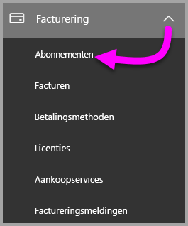

3. Klik op **Abonnementen toevoegen** in de rechterbovenhoek van de pagina **Abonnementen**.

    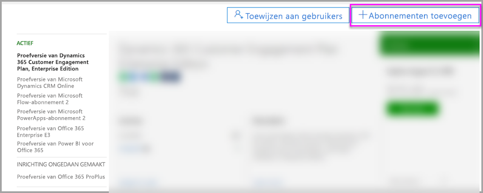

4. Zoek de gewenste aanbieding voor een abonnement:

    Selecteer onder **Enterprise Suite** de optie **Office 365 Enterprise E5**.

    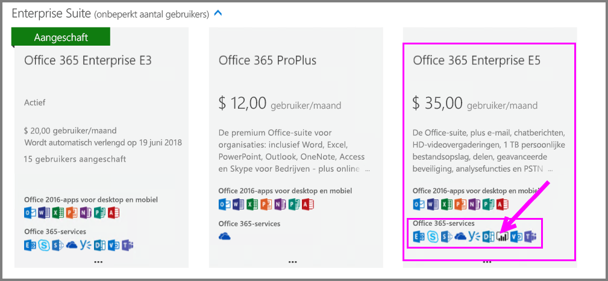

    Selecteer onder **Overige abonnementen** de optie **Power BI Pro**.

    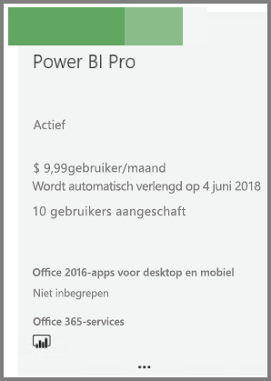

5. Wijs de weglatingstekens (**. . .**) aan voor het gewenste abonnement en selecteer **Nu kopen**.

    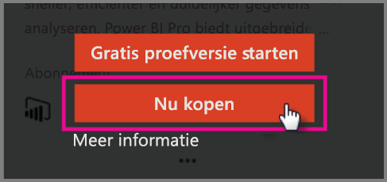

6. Kies desgewenst voor **Maandelijks betalen** of **Voor een volledig jaar betalen**.

7. Onder **Voor hoeveel gebruikers?** voert u het gewenste aantal licenties in. Vervolgens selecteert u **Nu uitchecken** om de transactie te voltooien.

8. Controleer of het gekochte abonnement nu op de pagina **Abonnementen** wordt vermeld.

   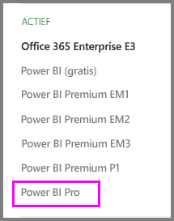

9. Als u na de initiële aankoop meer licenties wilt toevoegen, selecteert u **Power BI Pro** op de pagina **Abonnementen** en selecteert u vervolgens **Licenties toevoegen/verwijderen**.

## Licenties toewijzen in Office 365

Voer de volgende stappen uit om Power BI Pro-licenties toe te wijzen aan afzonderlijke gebruikersaccounts:

1. Open het [Office 365-beheercentrum](https://portal.office.com/adminportal/home#/homepage).

2. Vouw **Gebruikers** uit in het linkernavigatiedeelvenster en selecteer **Actieve gebruikers**.

    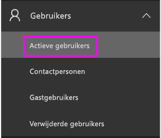

3. Selecteer een gebruiker en selecteer vervolgens **Bewerken** onder **Productlicenties**.

    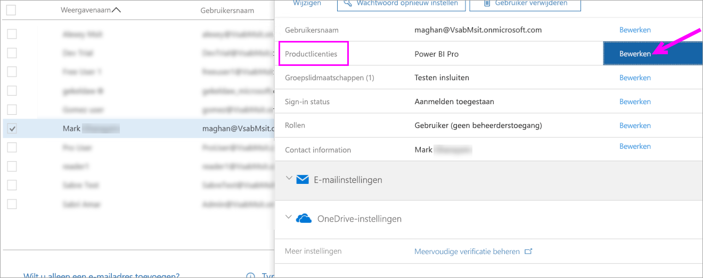

4. Zet de instelling onder **Power BI Pro** op **Aan** en selecteer vervolgens **Opslaan**.

    

5. Controleer onder **Status** voor het geselecteerde account of de Power BI Pro-licentie is toegewezen.

    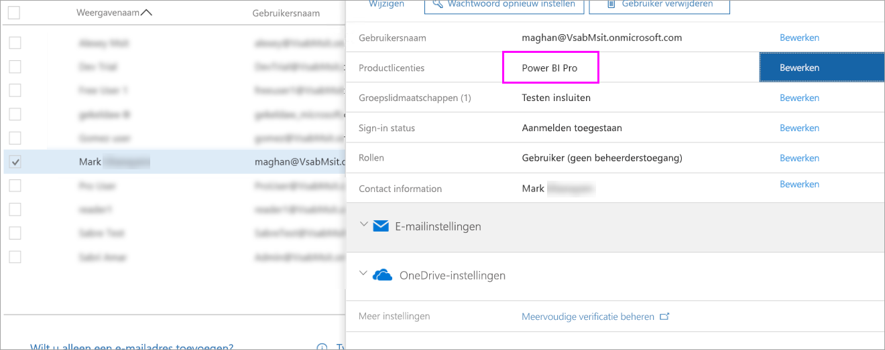

## Licenties toewijzen in Azure

Voer de volgende stappen uit om Power BI Pro-licenties toe te wijzen aan afzonderlijke gebruikersaccounts:

1. Open [Azure Portal](https://ms.portal.azure.com/#@microsoft.onmicrosoft.com/dashboard/private/39bc3cf7-31a4-43f6-954c-f2d69ca2f0).

2. Selecteer in de linkernavigatiebalk **Azure Active Directory**.

    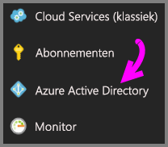

3. Selecteer onder **Azure Active Directory** de optie **Licenties**.

    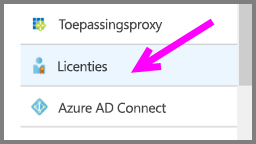

4. Selecteer onder **Licenties** de optie **Alle producten**. Selecteer vervolgens **Power BI Pro** om de lijst met gebruikers weer te geven die beschikken over een licentie.

    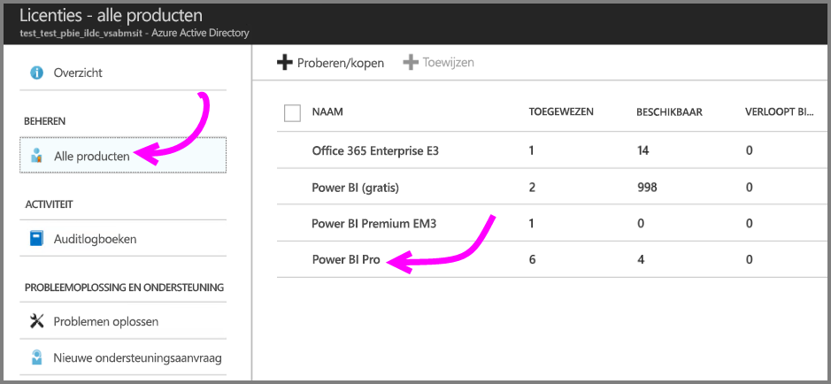

5. Selecteer **Toewijzen** om een Power BI Pro-licentie toe te voegen aan een extra gebruikersaccount.

    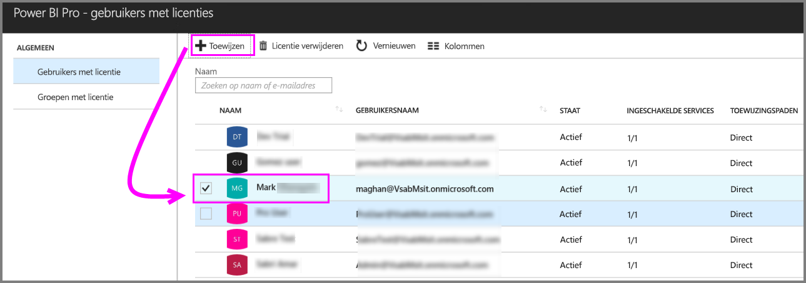

## Volgende stappen

Nu u licenties hebt toegewezen, kunt u meer te weten komen over Power BI Pro.

[Power BI-licenties in uw organisatie](service-admin-licensing-organization.md)

[Power BI-gebruikers vinden die zijn aangemeld](service-admin-access-usage.md)

Hebt u nog vragen? [Misschien dat de Power BI-community het antwoord weet](https://community.powerbi.com/)
