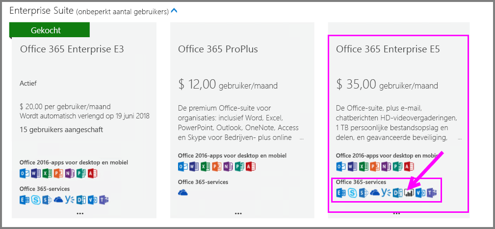
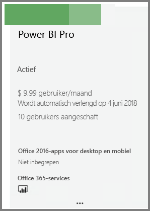
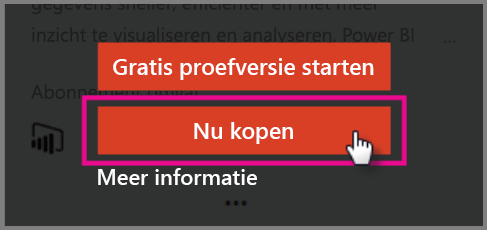

# Snelstart: Power BI Pro-licenties kopen

Power BI Pro is een afzonderlijke licentie waarmee toegang kan worden verkregen tot alle inhoud en mogelijkheden in de Power BI-service, inclusief de mogelijkheid voor het delen van inhoud en samenwerken met andere Pro-gebruikers. Alleen Pro-gebruikers kunnen inhoud naar app-werkruimten publiceren en deze inhoud gebruiken, dashboards delen en zich abonneren op dashboards en rapporten. In dit artikel wordt uitgelegd hoe u Power BI Pro-licenties in Office 365 kunt kopen.

## Vereisten

U moet lid zijn van de rol [**Globale beheerder** of **Factureringsbeheerder**](https://support.office.com/article/about-office-365-admin-roles-da585eea-f576-4f55-a1e0-87090b6aaa9d?ui=en-US&rs=en-US&ad=US) in Office 365. 

## Power BI Pro-licenties kopen via Office 365

Voer de volgende stappen uit om Power BI Pro-licenties te kopen:

1. Open het [Office 365-beheercentrum](https://portal.office.com/adminportal/home#/homepage).

2. Selecteer in het linkernavigatievenster **Facturering** > **Abonnementen**.

    

3. Klik op **Abonnementen toevoegen** in de rechterbovenhoek van de pagina **Abonnementen**.

    

4. Zoek de gewenste aanbieding voor een abonnement:

    Selecteer onder **Enterprise Suite** de optie **Office 365 Enterprise E5**.

    

    Selecteer onder **Overige abonnementen** de optie **Power BI Pro**.

    

5. Wijs de weglatingstekens (…) aan voor het gewenste abonnement en selecteer **Nu kopen**.

    

6. Kies desgewenst voor **Maandelijks betalen** of **Voor een volledig jaar betalen**.

7. Onder **Voor hoeveel gebruikers?** voert u het gewenste aantal licenties in. Vervolgens selecteert u **Nu uitchecken** om de transactie te voltooien.

8. Controleer of het gekochte abonnement nu op de pagina **Abonnementen** wordt vermeld.

   

9. Als u na de initiële aankoop meer licenties wilt toevoegen, selecteert u **Power BI Pro** op de pagina **Abonnementen** en selecteert u vervolgens **Licenties toevoegen/verwijderen**.

## Volgende stappen

Nu u licenties hebt gekocht, kunt u deze toewijzen aan gebruikers in uw tenant.

[Licenties toewijzen aan gebruikers in Office 365](service-admin-assigning-power-bi-pro-licenses.md)

[Licenties toewijzen aan gebruikers in Azure](service-admin-assigning-power-bi-pro-licenses-azure.md)

[BI-prijzen](https://powerbi.microsoft.com/en-us/pricing/)
