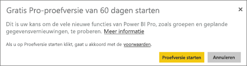
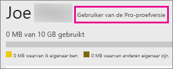

# Power BI Pro kopen
Power BI Pro is bedoeld voor gebruikers die rapporten publiceren, dashboards delen, samenwerken met collega's in werkruimten en deelnemen aan andere gerelateerde activiteiten, zoals:

* Gegevens analyseren in Excel of Power BI Desktop
* Delen met ondersteuning voor Excel Web App
* Dashboards delen en samenwerken met app-werkruimten
* Gedeelde inhoud weergeven
* Inhoud integreren met Microsoft Teams

IT-beheerders hebben een aantal mogelijkheden om Power BI Pro te gebruiken in uw organisatie. U kunt Power BI Pro kopen rechtstreeks kopen via het Office 365-beheercentrum of via uw Microsoft-vertegenwoordiger of -partner. In dit artikel kijken we eerst naar de twee verschillende evaluatieversies die beschikbaar zijn voor Power BI Pro. Daarna besteden we aandacht aan het kopen van het product als een organisatie.

Zie [Wat is Power BI Premium?](service-premium.md) voor meer informatie over Power BI Premium en wat de positie van Power BI Pro is in het Premium-aanbod.

## Prijzen
Zie het [prijsoverzicht voor Power BI](https://powerbi.microsoft.com/pricing/) (Engelstalig) voor actuele informatie over prijzen voor Power BI Pro en een overzicht van de beschikbare functies in elke versie.

## Proefversie van Power BI Pro voor 60 dagen kiezen in service
Nadat u zich hebt aangemeld voor een gratis account, kunt u Pro desgewenst 60 dagen gratis uitproberen. U hebt dan toegang tot alle functies van het Pro-abonnement voor de duur van de proefversie. Power BI Pro heeft alle functies van de gratis versie van Power BI, plus aanvullende functies voor delen en samenwerking. Meer informatie vindt u op de [pagina met prijzen van Power BI](https://powerbi.microsoft.com/pricing). Als u Power BI Pro gedurende 60 dagen gratis wilt uitproberen, meldt u zich aan bij Power BI en probeert u een van deze Power BI Pro functies:

* [Een app-werkruimte maken](service-create-distribute-apps.md)
* [Een dashboard delen](service-share-dashboards.md)

Wanneer u een van deze functies probeert uit te voeren, wordt u gevraagd een gratis proefversie te starten. U kunt de proefversie ook kiezen door het tandwielpictogram te selecteren en vervolgens **Persoonlijke opslag beheren** te selecteren. Selecteer vervolgens **Pro gratis uitproberen** aan de rechterkant.

Daarna kunt u selecteren **Proefversie starten** selecteren.

> [!NOTE]
> Gebruikers die ervoor kiezen om op deze manier de proefversie van Power BI Pro te activeren, worden in het Office 365-beheerportal niet weergegeven als gebruikers van de proefversie van Power BI Pro (maar als gebruikers van de gratis versie van Power BI). Ze worden echter wel weergegeven als gebruikers van de Power BI Pro-proefversie op de pagina **Opslag beheren** in Power BI.

> [!NOTE]
> Als u IT-beheerder bent en u wilt Power BI-proefabonnementlicenties voor meerdere gebruikers in uw organisatie verkrijgen en implementeren zonder dat afzonderlijke gebruikers gebruikersvoorwaarden hoeven te accepteren, kunt u zich registreren voor een [proefabonnement voor Power BI](https://portal.office.com/Signup/MainSignup15.aspx?OfferId=d59682f3-3e3b-4686-9c00-7c7c1c736085&dl=POWER_BI_PRO). U moet globale beheerder of factureringsbeheerder van Office 365 zijn of een nieuwe tenant maken om uzelf te registreren voor een proefabonnement. Zie [Purchasing Power BI Pro](service-admin-purchasing-power-bi-pro.md) (Power BI Pro kopen) voor meer informatie.

> [!NOTE]
> Met de beschikbaarheid van Power BI Premium, en de wijzigingen van de gratis aanbieding van Power BI op 1 juni 2017, is het mogelijk dat u in aanmerking komt voor een verlengde Pro-proefversie. Zie [Extended Pro Trial activation](service-extended-pro-trial.md) (De verlengde Pro-proefversie activeren) voor meer informatie.

### Uw account controleren in de service
Wanneer u zich in de service bevindt, kunt u controleren of u inderdaad een proefabonnement van Pro hebt door eerst het *tandwielpictogram* te selecteren en vervolgens **Persoonlijke opslag beheren**.

## Proefabonnement in Office 365
U kunt Power BI Pro gebruiken met een proefabonnement voor uw organisatie. Zodra u het abonnement hebt, kunt u licenties voor Power BI Pro toewijzen aan uw gebruikers. Zie [Licenties toewijzen aan gebruikers in Office 365](https://support.office.com/article/Assign-or-unassign-licenses-for-Office-365-for-business-997596b5-4173-4627-b915-36abac6786dc) voor meer informatie over het toewijzen van licenties.

> [!NOTE]
> Er geldt een limiet van één proefabonnement per tenant. Dit betekent dat als iemand anders uw organisatie al heeft aangemeld voor het proefabonnement, u op deze manier geen kennis meer kunt maken met Power BI Pro. Als u hier hulp bij nodig hebt, kunt u contact opnemen met [ondersteuning voor zakelijke producten](https://support.office.microsoft.com/article/Contact-Office-365-for-business-support-Admin-Help-32a17ca7-6fa0-4870-8a8d-e25ba4ccfd4b?CorrelationId=552bbf37-214f-4202-80cb-b94240dcd671&ui=en-US&rs=en-US&ad=US#BKMK_call_support).
> 

1. Ga naar het [Office 365-beheercentrum](https://portal.office.com/admin/default.aspx).
2. Selecteer aan de linkerkant Facturering > Abonnementen.
3. Selecteer + Abonnementen toevoegen aan de rechterkant.
4. Wijs onder Andere abonnementen het beletselteken (...) voor Power BI Pro aan en selecteer Gratis proefabonnement starten.
   
    
5. Selecteer op het bevestigingsscherm Nu uitproberen.
6. Selecteer Doorgaan in het ontvangstbewijs.

Onder **Facturering** > **Abonnementen** ziet u **Proefabonnement Power BI Pro** met 25 beschikbare licenties. Dit is een evaluatieversie die één maand geldig is.

### Uw account controleren in de service
Wanneer u zich in de service bevindt, kunt u controleren of u inderdaad een Pro-account hebt door eerst het **tandwielpictogram** te selecteren en vervolgens **Persoonlijke opslag beheren**. Er wordt dan nergens vermeld dat het hier om een proefabonnement of evaluatieversie gaat.

## Abonnement kopen in Office 365
U kunt Power BI Pro kopen voor uw organisatie via het Office 365-beheercentrum. Zodra u het abonnement hebt, kunt u licenties voor Power BI Pro toewijzen aan uw gebruikers. Zie [Licenties toewijzen aan gebruikers in Office 365](https://support.office.com/article/Assign-or-unassign-licenses-for-Office-365-for-business-997596b5-4173-4627-b915-36abac6786dc) voor meer informatie over het toewijzen van licenties.

1. Ga naar het [Office 365-beheercentrum](https://portal.office.com/admin/default.aspx).
2. Selecteer aan de linkerkant Facturering > Abonnementen.
3. Selecteer + Abonnementen toevoegen aan de rechterkant.
4. Wijs onder Andere abonnementen het beletselteken (...) voor Power BI Pro aan en selecteer Nu kopen.
   
    
5. Voer het gewenste aantal licenties in en selecteer vervolgens Bestelling plaatsen of Toevoegen aan winkelwagen.
   
   > [!NOTE]
   > U kunt desgewenst op een later tijdstip meer licenties toevoegen.
   > 
   > 
6. Geef de benodigde gegevens op om te betalen.

> [!NOTE]
> Als u al werkt met de proefversie van Power BI Pro, gaat u rechtstreeks naar het scherm voor het invoeren van het gewenste aantal licenties.
> 
> 

Onder **Facturering** > **Abonnementen** wordt **Power BI Pro** vermeld. Als u later meer licenties wilt toevoegen, gaat u terug naar **Abonnementen toevoegen** en selecteert u **Aantal licenties wijzigen**.

### Uw account controleren in de service
Wanneer u zich in de service bevindt, kunt u controleren of u inderdaad een Pro-account hebt door eerst het **tandwielpictogram** te selecteren en vervolgens **Persoonlijke opslag beheren**.

## Respijtperiode
Er is een respijtperiode van 30 dagen na het verstrijken van een licentie voor Power BI Pro. 

Power BI Pro heeft dezelfde levenscyclus van abonnementen als Office 365. Zie [Wat gebeurt er met mijn gegevens en toegang wanneer mijn abonnement op Office 365 voor bedrijven eindigt?](https://support.office.com/en-us/article/What-happens-to-my-data-and-access-when-my-Office-365-for-business-subscription-ends-4436582f-211a-45ec-b72e-33647f97d8a3) voor meer informatie.

## Volgende stappen
[Registreren voor Power BI via selfservice](service-self-service-signup-for-power-bi.md)  
[Power BI (free) in your organization](service-admin-service-free-in-your-organization.md) (Power BI (gratis) in uw organisatie)  
[De verlengde Pro-proefversie activeren](service-extended-pro-trial.md)  
[Wat is Power BI Premium?](service-premium.md)  
[Power BI Premium aanschaffen](service-admin-premium-purchase.md)  
[Technisch document over Power BI Premium](https://aka.ms/pbipremiumwhitepaper)  

Nog vragen? [Misschien dat de Power BI-community het antwoord weet](http://community.powerbi.com/)

