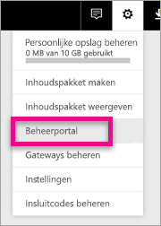
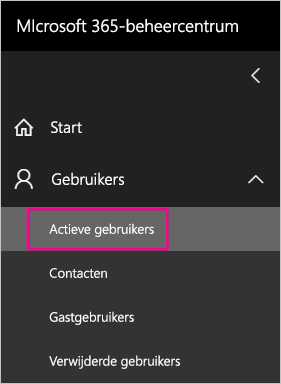
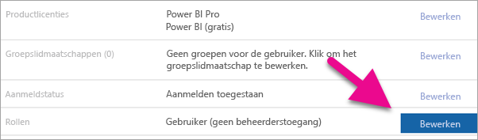
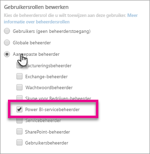
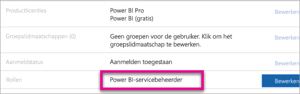

# <a name="understanding-the-power-bi-admin-role"></a>Uitleg over de Power BI-beheerdersrol
Meer informatie over het gebruik van de Power BI-beheerdersrol binnen uw organisatie.

<iframe width="640" height="360" src="https://www.youtube.com/embed/PQRbdJgEm3k?showinfo=0" frameborder="0" allowfullscreen></iframe>

De beheerdersrol van de Power BI-service kan worden toegewezen aan gebruikers die toegang tot de Power BI-beheerportal moeten hebben, maar geen andere beheerderstoegang voor Office 365 nodig hebben. Bijvoorbeeld de globale beheerdersrol. Het is bedoeld voor degenen die belast zijn met het beheer van Power BI voor hun organisatie.

Office 365-beheerders kunnen gebruikers toewijzen als Power BI-beheerders binnen het Office 365-beheercentrum of via PowerShell script. Wanneer een gebruiker is toegewezen, heeft deze persoon toegang tot de [Power BI-beheerportal](service-admin-portal.md). Daar heeft hij toegang tot tenantbrede gebruiksgegevens en kan het tenantbrede gebruik van Power BI-functies beheren.



## <a name="using-the-office-365-admin-center-to-assign-a-role"></a>Office 365-beheercentrum gebruiken voor het toewijzen van een rol
U kunt het volgende doen om de gebruikers toe te wijzen aan de beheerdersrol van Power BI binnen het Office 365-beheercentrum.

1. Blader naar het Office 365-beheercentrum en selecteer **Gebruikers** > **Actieve gebruikers**.
   
    
2. Selecteer de gebruiker aan wie u de rol wilt toewijzen.
3. Selecteer **Bewerken** voor rollen.
   
    
4. Selecteer **Aangepaste beheerder** > **Power BI-servicebeheerder**
   
    
5. Selecteer **Opslaan**.

U ziet **Power BI-servicebeheerder** staan voor de rol van die gebruiker. Zij hebben nu toegang tot de [Power BI-beheerportal](service-admin-portal.md).



## <a name="using-powershell-to-assign-a-role"></a>PowerShell gebruiken om een rol toe te wijzen
Om de PowerShell-opdracht uit te voeren, moet u de Azure Active Directory PowerShell-module hebben geïnstalleerd.

### <a name="download-azure-ad-powershell-module"></a>Azure AD PowerShell-module downloaden
[Download de Azure Active Directory PowerShell versie 2](https://github.com/Azure/azure-docs-powershell-azuread/blob/master/Azure%20AD%20Cmdlets/AzureAD/index.md)

[Download de Azure Active Directory PowerShell versie 1.1.166.0 GA](http://connect.microsoft.com/site1164/Downloads/DownloadDetails.aspx?DownloadID=59185)

### <a name="command-to-add-role-to-member"></a>Opdracht geven om rol toe te voegen aan lid
**Azure AD PowerShell v2 opdracht**

U moet de **ObjectId** voor de **Power BI-servicebeheerdersrol** ophalen. U kunt [Get-AzureADDirectoryRole](https://docs.microsoft.com/powershell/azuread/v2/get-azureaddirectoryrole) uitvoeren om de **ObjectId** op te halen

```
PS C:\Windows\system32> Get-AzureADDirectoryRole

ObjectId                             DisplayName                        Description
--------                             -----------                        -----------
00f79122-c45d-436d-8d4a-2c0c6ca246bf Power BI Service Administrator     Full access in the Power BI Service.
250d1222-4bc0-4b4b-8466-5d5765d14af9 Helpdesk Administrator             Helpdesk Administrator has access to perform..
3ddec257-efdc-423d-9d24-b7cf29e0c86b Directory Synchronization Accounts Directory Synchronization Accounts
50daa576-896c-4bf3-a84e-1d9d1875c7a7 Company Administrator              Company Administrator role has full access t..
6a452384-6eb9-4793-8782-f4e7313b4dfd Device Administrators              Device Administrators
9900b7db-35d9-4e56-a8e3-c5026cac3a11 AdHoc License Administrator        Allows access manage AdHoc license.
a3631cce-16ce-47a3-bbe1-79b9774a0570 Directory Readers                  Allows access to various read only tasks in ..
f727e2f3-0829-41a7-8c5c-5af83c37f57b Email Verified User Creator        Allows creation of new email verified users.
```

In dit geval is de objectId van de rol 00f79122-c45d-436d-8d4a-2c0c6ca246bf.

U moet ook de **ObjectID** van de gebruiker weten. U vindt deze door het uitvoeren van [Get-AzureADUser](https://docs.microsoft.com/powershell/azuread/v2/get-azureaduser).

```
PS C:\Windows\system32> Get-AzureADUser -SearchString 'tim@contoso.com'

ObjectId                             DisplayName UserPrincipalName      UserType
--------                             ----------- -----------------      --------
6a2bfca2-98ba-413a-be61-6e4bbb8b8a4c Tim         tim@contoso.com        Member
```

U moet [Add-AzureADDirectoryRoleMember](https://docs.microsoft.com/powershell/azuread/v2/add-azureaddirectoryrolemember) uitvoeren om het lid aan de rol toe te voegen.

| Parameter | Beschrijving |
| --- | --- |
| ObjectId |De ObjectId van de rol. |
| RefObjectId |De ObjectId van het lid. |

```
Add-AzureADDirectoryRoleMember -ObjectId 00f79122-c45d-436d-8d4a-2c0c6ca246bf -RefObjectId 6a2bfca2-98ba-413a-be61-6e4bbb8b8a4c
```

**Azure AD PowerShell v1 opdracht**

Als u wilt een lid toevoegen aan een rol met de Azure AD-v1-cmdlets, moet u de opdracht [Add-MsolRoleMember](https://docs.microsoft.com/powershell/msonline/v1/add-msolrolemember) uitvoeren.

```
Add-MsolRoleMember -RoleMemberEmailAddress "tim@contoso.com" -RoleName "Power BI Service Administrator"
```

## <a name="limitations-and-considerations"></a>Beperkingen en overwegingen
De beheerdersrol van Power BI-service biedt geen toegang tot het volgende.

* Mogelijkheid om gebruikers en licenties in het Office 365-beheercentrum te wijzigen
* Toegang tot de auditlogboeken. Zie voor meer informatie [Auditing gebruiken binnen uw organisatie](service-admin-auditing.md).

## <a name="next-steps"></a>Volgende stappen
[Power BI-beheerportal](service-admin-portal.md)  
[Add-AzureADDirectoryRoleMember](https://docs.microsoft.com/powershell/azuread/v2/add-azureaddirectoryrolemember)  
[Add-MsolRoleMember](https://docs.microsoft.com/powershell/msonline/v1/add-msolrolemember)  
[Power BI controleren in uw organisatie](service-admin-auditing.md)  
[Power BI in uw organisatie beheren](service-admin-administering-power-bi-in-your-organization.md)  

Nog vragen? [Misschien dat de Power BI-community het antwoord weet](http://community.powerbi.com/)

