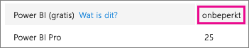
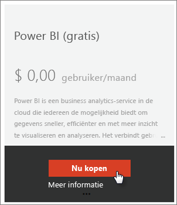
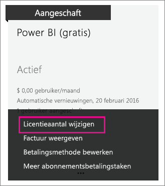

# Power BI (gratis) voor uw organisatie
In dit artikel wordt behandeld hoe de aanbieding van Power BI (gratis) binnen uw organisatie kan worden gebruikt. Een organisatie betekent dat u een tenant hebt en gebruikers en services in die tenant kunt beheren. Als beheerder kunt u de toewijzing van licenties beheren of kunt u toestaan dat gebruikers zich registreren als een persoon. Ook komt de licentie voor Power BI (gratis) aan bod en wordt beschreven hoe u de persoonlijke registratie kunt beheren.

## Persoonlijke registratie versus licentietoewijzing
Gebruikers in uw organisatie kunnen op twee verschillende manieren toegang krijgen tot Power BI. Ze kunnen zich persoonlijk registreren voor Power BI of u kunt een Power BI-licentie aan gebruikers toewijzen in de Office 365-beheerportal.

Als u toestaat dat gebruikers zich persoonlijk kunnen registreren, betekent dat dat u als beheerder van de organisatie niets hoeft te doen, omdat de geïnteresseerde gebruikers zichzelf gratis kunnen registreren.

Als u meer controle wilt, kunt u persoonlijke registraties blokkeren en zelf Power BI-licenties toewijzen in het Office 365-beheercentrum. Op die manier kunt u precies aangeven wie toegang tot welke services binnen uw organisatie heeft. Dit is ook een handige optie voor auditsituaties waarin u precies moet weten wie wat kan gebruiken.

## Het onbeperkte licentieblok ophalen
In het Office 365-beheercentrum wordt onder **Facturering** > **Licenties** al of niet Power BI (gratis) met onbeperkte licenties weergegeven.

Dit licentieblok wordt weergegeven na de eerste keer dat iemand zich als persoon voor Power BI heeft geregistreerd. Tijdens dat proces wordt dit licentieblok aan uw organisatie gekoppeld en wordt er een licentie toegewezen aan de gebruiker die zich registreert.

Als u het persoonlijk registreren blokkeert en er zich niemand heeft geregistreerd, ziet u dit licentieblok niet. U kunt ofwel toestaan dat gebruikers zich persoonlijk kunnen registreren en één gebruiker zich laten registreren, of u kunt gratis licenties ophalen via de Office 365-stroom Abonnement toevoegen die hierna wordt behandeld.

Als het licentieblok voor Power BI (gratis) beschikbaar is, kunt u deze licenties toewijzen aan uw gebruikers. Zie [Licenties toewijzen aan gebruikers in Office 365](https://support.office.com/article/Assign-or-unassign-licenses-for-Office-365-for-business-997596b5-4173-4627-b915-36abac6786dc) voor meer informatie over het toewijzen van licenties.

## Gratis licenties ophalen via Abonnement toevoegen in Office 365
1. Ga naar het [Office 365-beheercentrum](https://portal.office.com/admin/default.aspx).
2. Selecteer in het linkernavigatievenster **Facturering** > **Abonnementen**.
3. Selecteer **Abonnementen toevoegen +** aan de rechterkant.
4. Wijs onder Andere abonnementen het **beletselteken (...)** voor Power BI (gratis) aan en selecteer **Nu kopen**.
   
    
5. Voer het gewenste aantal licenties in en selecteer vervolgens **Nu afrekenen** of **Toevoegen aan winkelwagen**.
   
   > [!NOTE]
   > U kunt desgewenst op een later tijdstip meer licenties toevoegen.
   > 
   > 
6. Geef de benodigde gegevens in de stroom voor het afrekenen op.

Op deze manier koopt u niets, ook al moet u uw creditcardgegevens voor facturering invoeren of aangeven dat u een factuur wilt krijgen.

Als u later besluit dat u meer licenties wilt toevoegen, kunt u naar **Abonnementen toevoegen** teruggaan en vervolgens **Aantal licenties wijzigen** voor Power BI (gratis) selecteren.

U kunt deze licenties nu aan uw gebruikers toewijzen. Zie [Licenties toewijzen aan gebruikers in Office 365](https://support.office.com/article/Assign-or-unassign-licenses-for-Office-365-for-business-997596b5-4173-4627-b915-36abac6786dc) voor meer informatie over het toewijzen van licenties.

## Persoonlijke gebruikersregistraties in- of uitschakelen in Azure Active Directory
Als beheerder kunt u ervoor kiezen persoonlijke gebruikersregistraties als onderdeel van Azure Active Directory (AAD) in of uit te schakelen. Als u weet hoe u de AAD PowerShell-opdrachten moet gebruiken, kunt u zelf ad-hocabonnementen in- of uitschakelen. [Meer informatie](https://technet.microsoft.com/library/jj151815.aspx)

De AAD-instelling waarmee dit wordt bepaald, is **AllowAdHocSubscriptions**. Bij de meeste tenants is deze instelling ingesteld op waar, wat betekent dat de optie is ingeschakeld. Als u Power BI hebt aangeschaft via een partner, kan deze instelling zijn ingesteld op onwaar, wat betekent dat de optie is uitgeschakeld.

1. U moet zich eerst aanmelden bij Azure Active Directory met uw Office 365-referenties. In de eerste regel wordt naar uw referenties gevraagd. De tweede regel maakt verbinding met Azure Active Directory.
   
     $msolcred = get-credential   connect-msolservice -credential $msolcred
   
   
2. Nadat u bent aangemeld, kunt u de volgende opdracht geven om te controleren waarvoor uw tenant momenteel is geconfigureerd.
   
     Get-MsolCompanyInformation | fl AllowAdHocSubscriptions
3. U kunt met deze opdracht AllowAdHocSubscriptions inschakelen ($true) of uitschakelen ($false).
   
     Set-MsolCompanySettings -AllowAdHocSubscriptions $true

> [!NOTE]
> Deze blokkering voorkomt dat nieuwe gebruikers in uw organisatie zich registreren voor Power BI. Gebruikers die zich registreren voor Power BI voordat nieuwe registraties voor uw organisatie worden uitgeschakeld, behouden hun licentie.
> 
> 

## Volgende stappen
[Registreren voor Power BI via selfservice](service-self-service-signup-for-power-bi.md)  
[Power BI Pro kopen](service-admin-purchasing-power-bi-pro.md)  
[Registreren voor Power BI (gratis) met een aangepaste Azure Active Directory-tenant](developer/create-an-azure-active-directory-tenant.md)  
[Power BI Premium - wat is het?](service-premium.md)  
[Technisch document over Power BI Premium](https://aka.ms/pbipremiumwhitepaper)  

Nog vragen? [Misschien dat de Power BI-community het antwoord weet](http://community.powerbi.com/)

