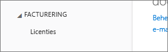

# Kan Power BI niet toevoegen aan een abonnement voor een Office 365-partner
Met Office 365 kunnen bedrijven Office 365 gebundeld en geïntegreerd met hun eigen oplossingen verkopen en eindklanten één aanspreekpunt bieden voor inkopen, facturering en ondersteuning.

Als u van plan bent Power BI naast uw Office 365-abonnement aan te schaffen, kunt u het beste contact opnemen met uw partner. Als uw partner geen Power BI biedt, kunt u verschillende opties overwegen.

1. U kunt de service via een ander kanaal kopen, dat wil zeggen rechtstreeks van Microsoft of van een andere partner. Deze optie is niet beschikbaar voor alle klanten, dit is afhankelijk van hun relatie met de partner. U kunt dit controleren door naar de **Office 365-beheerportal,**  > **Facturering** > **Abonnementen** te gaan. Als u **abonnementen** ziet, kunt u de service rechtstreeks bij Microsoft aanschaffen of u kunt contact opnemen met een partner die Power BI aanbiedt.
   
    
2. Als er geen **abonnementen** vermeld staan onder **Facturering**, kunt u niet rechtstreeks bij Microsoft of een andere partner kopen. 
   
   

Als u Power BI niet rechtstreeks kunt kopen, hebt u toch een aantal opties, afhankelijk van het type Power BI-abonnement waarin u geïnteresseerd bent.

[Power BI (gratis)](#power-bi-free)

[Power BI Pro en Premium](#power-bi-pro)

## Power BI (gratis)
Als u tevreden bent met het gratis aanbod voor Power BI, kunt u zich aanmelden voor de gratis service. Standaard zijn individuele aanmeldingen, ook wel ad-hoc-abonnementen genoemd, uitgeschakeld. Wanneer u zich aanmeldt voor Power BI, ziet u een bericht dat uw IT-afdeling de aanmelding voor Microsoft Power BI heeft uitgeschakeld.

    Your IT department has turned off signup for Microsoft Power BI.

Als u ad-hoc-abonnementen wilt inschakelen, kunt u contact opnemen met uw partner en vragen om deze te activeren. Als u een beheerder van uw tenant bent en weet hoe u met Azure Active Directory PowerShell-opdrachten moet werken, kunt u zelf ad-hoc-abonnementen inschakelen. [Meer informatie](https://technet.microsoft.com/library/jj151815.aspx)

1. U moet zich eerst aanmelden bij Azure Active Directory met uw Office 365-referenties. In de eerste regel wordt naar uw referenties gevraagd. De tweede regel maakt verbinding met Azure Active Directory.
   
        $msolcred = get-credential
        connect-msolservice -credential $msolcred
   
    
2. Als u bent aangemeld, kunt u de volgende opdracht opgeven om gratis aanmeldingen in te schakelen.
   
        Set-MsolCompanySettings -AllowAdHocSubscriptions $true

## Power BI Pro en Premium
Als u een abonnement op Power BI Pro of Power BI Premium wilt kopen, moet u samen met uw partner samenwerken nagaan welke opties u hebt.

* Uw partner stemt ermee in om Power BI toe te voegen aan hun portfolio zodat u van hen kunt kopen.
* Uw partner kan overstappen naar een model waarbij u Power BI rechtstreeks bij Microsoft of een andere partner die Power BI aanbiedt, kunt kopen.

In deze video worden Office 365-syndicatie en de aanschaf van Power BI behandeld:

<iframe width="560" height="315" src="https://www.youtube.com/embed/C357phT94A8" frameborder="0" allowfullscreen></iframe>

## Volgende stappen
[Azure AD beheren met Windows PowerShell](https://technet.microsoft.com/library/jj151815.aspx)  
[Power BI Premium - wat is het?](service-premium.md)

Nog vragen? [Misschien dat de Power BI-community het antwoord weet](http://community.powerbi.com/)

