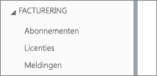
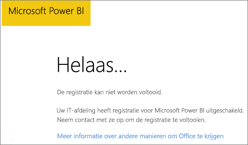
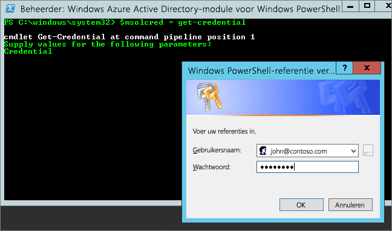

# <a name="unable-to-add-power-bi-to-office-365-partner-subscription"></a>Kan Power BI niet toevoegen aan een abonnement voor een Office 365-partner

Met Office 365 kunnen bedrijven Office 365 gebundeld en geïntegreerd met hun eigen oplossingen verkopen en eindklanten één aanspreekpunt bieden voor inkopen, facturering en ondersteuning.

Als u van plan bent om Power BI naast uw Office 365-abonnement aan te schaffen, kunt u het beste contact opnemen met uw partner. Als uw partner op dit moment geen Power BI aanbiedt, hebt u verschillende opties om dit te bereiken.

# <a name="work-with-your-partner-to-purchase-power-bi"></a>Samenwerken met uw partner om Power BI aan te schaffen

Als u een abonnement op Power BI Pro of Power BI Premium wilt kopen, werk dan samen met uw partner om na te gaan welke opties u hebt:

* Uw partner stemt ermee in om Power BI toe te voegen aan hun portfolio zodat u van hen kunt kopen.

* Uw partner kan overstappen naar een model waarbij u Power BI rechtstreeks bij Microsoft of een andere partner die Power BI aanbiedt, kunt kopen.

# <a name="purchase-from-microsoft-or-another-channel"></a>Aanschaffen via Microsoft of een ander kanaal

Afhankelijk van de relatie met uw partner kunt u Power BI rechtstreeks aanschaffen via Microsoft of een andere partner. U kunt controleren of u Power BI-abonnementen kunt toevoegen in de Office 365-beheerportal (vereist lidmaatschap met de rol van globale beheerder of factureringsbeheerder).

1. Ga naar de [Office 365-beheerportal](https://admin.microsoft.com/AdminPortal/Home#/homepage).

1. Open **Facturering** in het menu links:

    * Als u **Abonnementen** ziet, kunt u de service rechtstreeks bij Microsoft aanschaffen of contact opnemen met een andere partner die Power BI aanbiedt.

        

    * Als **Abonnementen** niet wordt weergegeven, kunt u Power BI niet rechtstreeks aanschaffen bij Microsoft of een andere partner.

Als uw partner geen Power BI aanbiedt en u het niet rechtstreeks kunt aanschaffen bij Microsoft of een andere partner, kunt u zich registreren voor een gratis proefversie.

## <a name="sign-up-for-a-free-trial"></a>Aanmelden voor een gratis proefversie

U kunt zich aanmelden voor een gratis proefversie van Power BI Pro. Als u Power BI Pro aan het einde van de proefperiode niet aanschaft, hebt u nog steeds een gratis licentie die veel functies van Power BI biedt. Zie [Gratis versie van Power BI versus Power BI Pro](service-features-license-type.md) voor meer informatie.

### <a name="enable-ad-hoc-subscriptions"></a>Ad-hoc-abonnementen inschakelen

Standaard zijn individuele aanmeldingen, ook wel ad-hoc-abonnementen genoemd, uitgeschakeld. In dit geval ziet u het volgende bericht wanneer u probeert om u te registreren: *Uw IT-afdeling heeft registratie voor Microsoft Power BI uitgeschakeld*.



Als u ad-hoc-abonnementen wilt inschakelen, kunt u contact opnemen met uw partner en vragen om deze te activeren. Als u een beheerder van uw tenant bent en weet hoe u Azure Active Directory PowerShell-opdrachten gebruikt, kunt u zelf ad-hoc-abonnementen inschakelen. [Azure Active Directory PowerShell voor Graph](/powershell/azure/active-directory/install-adv2/)

1. Meld u met uw Office 365-referenties aan bij Azure Active Directory. Op de eerste regel van het script hieronder wordt u om uw referenties gevraagd. De tweede regel maakt verbinding met Azure Active Directory.

    ```powershell
    $msolcred = get-credential
    connect-msolservice -credential $msolcred
    ```

    

1. Wanneer u bent aangemeld, voert u de volgende opdracht uit om de huidige instelling voor `AllowAdHocSubscriptions` te controleren.

    ```powershell
    Get-MsolCompanyInformation
    ```

1. Voer de volgende opdracht uit om gratis aanmeldingen in te schakelen.

    ```powershell
    Set-MsolCompanySettings -AllowAdHocSubscriptions $true
    ```

## <a name="next-steps"></a>Volgende stappen

[Power BI-licenties in uw organisatie](service-admin-licensing-organization.md)

Hebt u nog vragen? [Misschien dat de Power BI-community het antwoord weet](http://community.powerbi.com/)