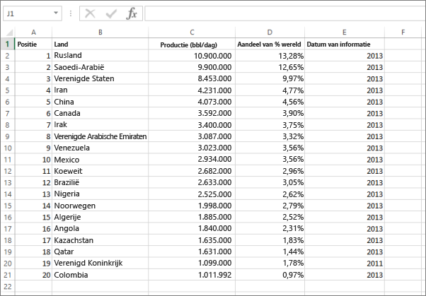
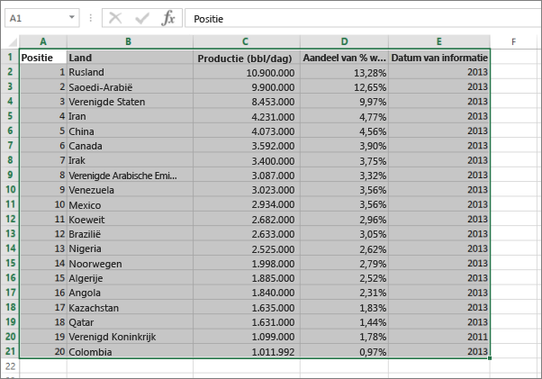
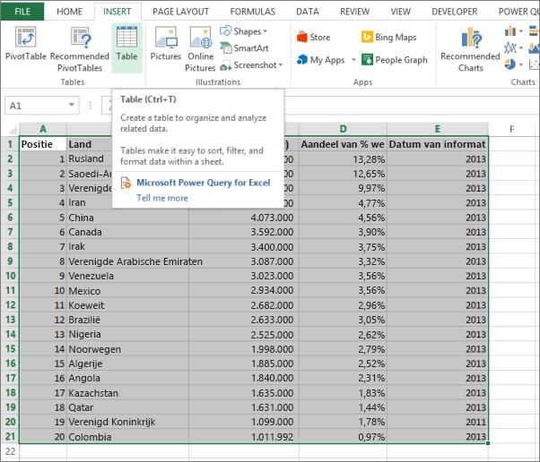
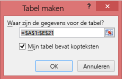
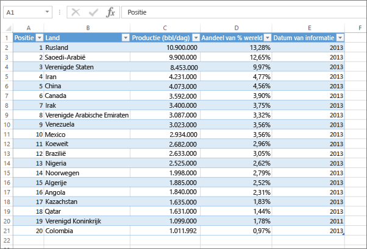

# Fout: kan geen gegevens vinden in uw Excel-werkmap

>[!NOTE]
>Dit artikel is van toepassing op Excel 2007 en hoger.

Wanneer u een Excel-werkmap in Power BI importeert, wordt mogelijk de volgende fout weergegeven:

*Fout: kan geen gegevens vinden in uw Excel-werkmap. De opmaak van uw gegevens is mogelijk onjuist. U moet uw werkmap bewerken in Excel en ze vervolgens opnieuw importeren.*

## Snelle oplossing
1. Bewerk uw werkmap in Excel.
2. Selecteer het celbereik met uw gegevens. De eerste rij moet de kolomkoppen (kolomnamen) bevatten.
3. Druk op **Ctrl + T** om een tabel te maken.
4. Sla uw werkmap op.
5. Ga terug naar Power BI en importeer de werkmap of, als u in Excel 2016 werkt en u de werkmap hebt opgeslagen in OneDrive voor Bedrijven, klik in Excel op Bestand > Publiceren.

## Details
### Oorzaak
In Excel kunt u een **tabel** van een celbereik maken, waardoor u gemakkelijker gegevens kunt sorteren, filteren en opmaken.

Wanneer u een Excel-werkmap importeert, worden deze tabellen door Power BI gezocht en geïmporteerd in een gegevensset. Als er geen tabellen worden gevonden, wordt dit foutbericht weergegeven.

### Oplossing
1. Open uw werkmap in Excel. 
    >[!NOTE]
    >De afbeeldingen die hier worden getoond zijn van Excel 2013. Als u een andere versie gebruikt, ziet alles er misschien net iets anders uit, maar zijn de stappen hetzelfde.
    
    
2. Selecteer het celbereik met uw gegevens. De eerste rij moet de kolomkoppen (kolomnamen) bevatten:
   
    
3. Klik in het lint op het tabblad **Invoegen** op **Tabel**. (Of druk op de snelkoppeling **Ctrl + T**.)
   
    
4. Het volgende dialoogvenster wordt weergegeven. Zorg ervoor dat het selectievakje **Mijn tabel bevat kopteksten** is ingeschakeld en selecteer **OK**:
   
    
5. Uw gegevens zijn nu opgemaakt als een tabel:
   
    
6. Sla uw werkmap op.
7. Ga terug naar bij Power BI. Selecteer Gegevens ophalen onder in het linkernavigatievenster.
   
    
8. In Selecteer in het vak **Bestanden** de optie **Ophalen**.
   
    
9. Importeer uw Excel-werkmap opnieuw. Deze keer moet de import de tabel vinden en slagen.
   
    Als het importeren nog steeds mislukt, kunt u ons dat laten weten door in het menu Help op ** Community ** te klikken:
   
    
