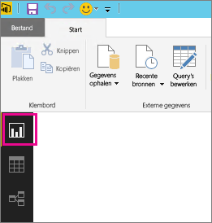
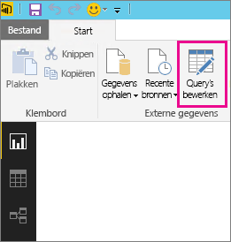
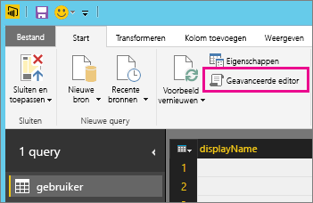
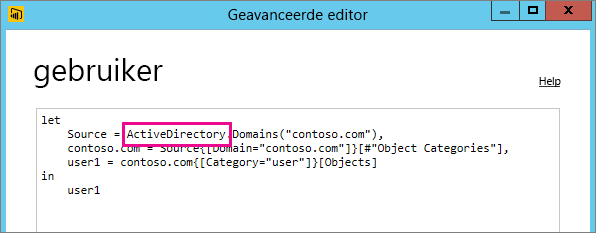

# Problemen oplossen met een gegevensbron waarvoor vernieuwen niet wordt ondersteund
Mogelijk wordt er een fout weergegeven wanneer u een gegevensset probeert te configureren voor een geplande vernieuwing.

        You cannot schedule refresh for this dataset because it gets data from sources that currently don’t support refresh.

Dit gebeurt wanneer de gegevensbron die u hebt gebruikt in Power BI Desktop de vernieuwingsbewerking niet ondersteunt. U moet de gegevensbron zoeken die u gebruikt en aan de hand van de lijst met ondersteunde gegevensbronnen in [Gegevens vernieuwen in Power BI](refresh-data.md) controleren of de gegevensbron wordt ondersteund. 

## De gegevensbron zoeken
Als u niet zeker weet welke gegevensbron is gebruikt, kunt u dit controleren door de volgende stappen uit te voeren in Power BI Desktop.  

1. Zorg ervoor dat u het deelvenster **Rapport** weergeeft in Power BI Desktop.  
   
2. Selecteer **Query's bewerken** in het lint.  
   
3. Selecteer **Geavanceerde editor**.  
   
4. Noteer de provider die wordt vermeld voor de bron.  In dit voorbeeld is de provider Active Directory.  
   
5. Controleer in [Gegevens vernieuwen in Power BI](refresh-data.md) of de provider voorkomt op de lijst met ondersteunde gegevensbronnen.  U zult zien dat Active Directory geen ondersteunde gegevensbron is en dus niet kan worden vernieuwd.  

## Volgende stappen
[Gegevens vernieuwen](refresh-data.md)  
[Power BI Gateway - Personal](personal-gateway.md)  
[On-premises gegevensgateway](service-gateway-onprem.md)  
[Problemen met de on-premises gegevensgateway oplossen](service-gateway-onprem-tshoot.md)  
[Problemen met Power BI Gateway - Personal oplossen](service-admin-troubleshooting-power-bi-personal-gateway.md)  

Hebt u nog vragen? [Misschien dat de Power BI-community het antwoord weet](http://community.powerbi.com/)

