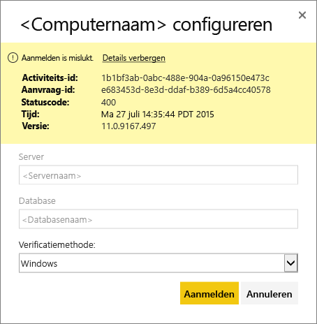
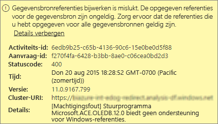
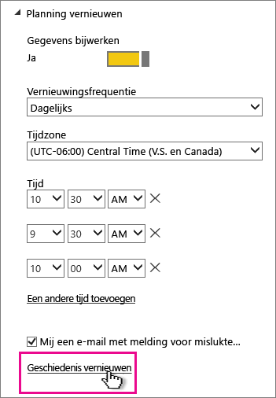
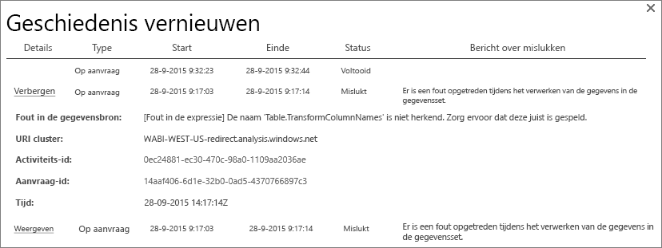
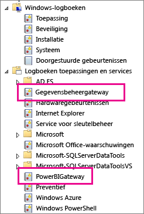
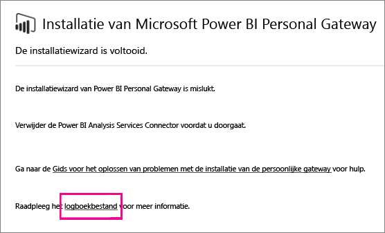
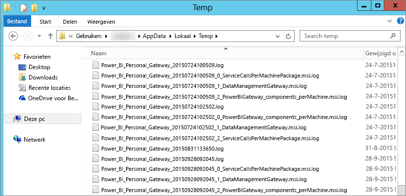

# Problemen met Power BI Gateway - Personal oplossen
In dit artikel worden enkele veelvoorkomende problemen behandeld die kunnen optreden bij het gebruik van Power BI Gateway - Personal.

> [!NOTE]
> De huidige versie van de gateway voor persoonlijk gebruik is de **On-premises gegevensgateway (persoonlijk)**. Werk uw installatie bij om deze versie te gebruiken.
> 
> 

## Bijwerken naar de nieuwste versie
Er kunnen zich allerlei problemen voordoen als de gatewayversie verouderd is.  Het is een goede en gangbare praktijk om ervoor te zorgen dat u de nieuwste versie gebruikt.  Als u de gateway een maand of langer niet hebt bijgewerkt, kunt u overwegen om de nieuwste versie van de gateway te installeren en te kijken of het probleem zich nog steeds voordoet.

## Installatie
**Persoonlijke gateway is 64-bits**. Als uw computer 32-bits is, kunt u de persoonlijke gateway niet installeren. Het besturingssysteem moet 64-bits zijn. U moet een 64-bits versie van Windows installeren of de persoonlijke gateway installeren op een 64-bits machine.

**Persoonlijke gateway kan niet als een service worden geïnstalleerd, ook al bent u een lokale beheerder voor de computer**. De installatie kan mislukken als de gebruiker zich in de lokale groep Administrators van de computer bevindt, maar Groepsbeleid niet toestaat dat deze gebruikersnaam zich mag aanmelden als een service.  Zorg ervoor dat in Groepsbeleid het aanmelden van een gebruiker als een service is toegestaan. Er wordt gewerkt aan een oplossing voor dit probleem. [Meer informatie](https://technet.microsoft.com/library/cc739424.aspx)

**Time-out tijdens bewerking**. Dit is gebruikelijk als de computer (fysieke machine of virtuele machine) waarop u de persoonlijke gateway installeert, een processor met één kern heeft. Sluit alle toepassingen af en beëindig alle niet-essentiële processen en probeer de installatie vervolgens opnieuw.

**Data Management Gateway of Analysis Services-Connector kan niet worden geïnstalleerd op dezelfde computer als de persoonlijke gateway**. Als er al een Analysis Services Connector of Data Management Gateway is geïnstalleerd, moet u de connector of de gateway eerst verwijderen en vervolgens proberen om de persoonlijke gateway te installeren.

> [!NOTE]
> Als er zich een probleem voordoet tijdens de installatie, kunnen de installatielogboeken informatie geven voor het oplossen van het probleem. Zie [Installatielogboeken](#SetupLogs) voor meer informatie.
> 
> 

 **Proxyconfiguratie**. Er kunnen zich problemen voordoen met de configuratie van de persoonlijke gateway als in uw omgeving het gebruik van een proxy vereist is. Meer informatie over het configureren van proxygegevens kunt u lezen in [Configuring proxy settings for the on-premises data gateway](service-gateway-proxy.md) (Proxy-instellingen configureren voor Power BI-gateways).

## Vernieuwen van gegevens plannen
**Fout: De referenties die zijn opgeslagen in de cloud ontbreken.**

U kunt een fout van deze strekking krijgen in Instellingen voor \<gegevensset\> als u een vernieuwing hebt gepland en vervolgens de persoonlijke gateway hebt verwijderd en opnieuw hebt geïnstalleerd. Wanneer u een persoonlijke gateway verwijdert, worden de referenties voor de gegevensbron van een gegevensset die is geconfigureerd voor vernieuwen, verwijderd uit de Power BI-service.

**Oplossing:** Ga in Power BI naar de instellingen voor het vernieuwen van een gegevensset. Klik in Gegevensbronnen beheren, voor elke gegevensbron met een fout, op Referenties bewerken en meldt u opnieuw aan bij de gegevensbron.

**Fout: De opgegeven referenties voor de gegevensset zijn ongeldig. Werk de referenties bij via een vernieuwingsbewerking of in het dialoogvenster Instellingen voor gegevensbron om door te gaan.**

**Oplossing**: Als u een bericht over referenties krijgt, kan dit het volgende betekenen:

* Zorg ervoor dat de gebruikersnamen en wachtwoorden voor aanmelding bij gegevensbronnen up-to-date zijn. Ga in Power BI naar de instellingen voor het vernieuwen van de gegevensset. Klik in Gegevensbronnen beheren op Referenties bewerken om de referenties voor de gegevensbron bij te werken.
* Mashups tussen een cloudbron en een on-premises bron, in één query, worden niet vernieuwd in de persoonlijke gateway als een van de bronnen OAuth gebruikt voor verificatie. Een voorbeeld hiervan is een mashup tussen CRM Online en een lokale SQL-server. Dit werkt niet omdat voor CRM Online OAuth vereist is.
  
  Dit is een bekend probleem en er wordt gewerkt aan een oplossing. Een tijdelijke oplossing voor het probleem is een afzonderlijke query te maken voor de cloudbron en de on-premises bron en deze vervolgens te combineren met behulp van een samenvoeg- of toevoegquery.

**Fout: Niet-ondersteunde gegevensbron.**

**Oplossing:** Als u een bericht over een niet-ondersteunde gegevensbron krijgt in het venster met instellingen voor gepland vernieuwen, kan dit het volgende betekenen: 

* De gegevensbron wordt momenteel niet ondersteund voor vernieuwen in Power BI. 
* De Excel-werkmap bevat geen gegevensmodel, alleen werkbladgegevens. Power BI ondersteunt momenteel alleen vernieuwen als de geüploade Excel-werkmap een gegevensmodel bevat. Wanneer u gegevens in Excel importeert met behulp van Power Query, vergeet dan niet om de optie te kiezen voor het laden van gegevens in het gegevensmodel. Hierdoor worden er gegevens geïmporteerd in een gegevensmodel. 

**Fout: [Kan gegevens niet combineren] &lt;queryonderdeel&gt;/&lt;...&gt;/&lt;...&gt; wil toegang tot gegevensbronnen met privacyniveaus die niet samen kunnen worden gebruikt. Bouw deze gegevenscombinatie opnieuw.**

**Oplossing**: Een fout van deze strekking is het gevolg van privacyniveaubeperkingen en de soorten gegevensbronnen die u gebruikt.

**Fout: Fout in gegevensbron: de waarde '\[tabel\]' kan niet worden geconverteerd naar type tabel.**

**Oplossing**: Een fout van deze strekking is het gevolg van privacyniveaubeperkingen en de soorten gegevensbronnen die u gebruikt.

**Fout: Er is onvoldoende ruimte voor deze rij.**

Dit gebeurt als een enkele rij groter is dan 4 MB. U moet bepalen om welke rij uit de gegevensbron het gaat en deze wegfilteren of kleiner maken.

## Gegevensbronnen
**Ontbrekende gegevensprovider**. De persoonlijke gateway is er alleen in 64-bits. De gateway vereist dat een 64-bits versie van de gegevensproviders is geïnstalleerd op dezelfde computer als waarop de persoonlijke gateway is geïnstalleerd. Als de gegevensbron in de gegevensset bijvoorbeeld Microsoft Access is, moet u de 64-bits ACE-provider installeren op de computer waarop u de persoonlijke gateway hebt geïnstalleerd.  

>[!NOTE]
>Als u 32-bits Excel hebt, kunt u geen 64-bits ACE-provider installeren op dezelfde computer.

**Windows-verificatie wordt niet ondersteund voor Access-database**. Power BI ondersteunt momenteel alleen anonieme verificatie voor tot Access-databases. We werken aan het ondersteunen van Windows-verificatie voor Access-databases.

**Aanmeldingsfout bij invoeren van referenties voor een gegevensbron**. Als u een fout van deze strekking krijgt bij het invoeren van Windows-referenties voor een gegevensbron, gebruikt u mogelijk nog steeds een oudere versie van de persoonlijke gateway. [Installeer de nieuwste versie van Power BI Gateway - Personal](https://powerbi.microsoft.com/gateway/).

  

**Fout: Aanmeldingsfout bij selecteren van Windows-verificatie voor een gegevensbron met behulp van ACE OLEDB**. Als u de onderstaande fout krijgt bij het invoeren van referenties voor een gegevensbron die een ACE OLEDB-provider gebruikt:

Power BI ondersteunt momenteel geen Windows-verificatie voor een gegevensbron met ACE OLEDB-provider.

**Oplossing:** U kunt deze fout omzeilen door anonieme verificatie in te schakelen. Voor oudere ACE OLE DB-providers zijn anonieme referenties gelijk aan Windows-referenties.

## Tegels vernieuwen
Als u een fout ziet over het vernieuwen van tegels in een dashboard, raadpleegt u het volgende artikel.

[Problemen met tegelfouten oplossen](refresh-troubleshooting-tile-errors.md)

## Hulpmiddelen voor probleemoplossing
### Geschiedenis vernieuwen
De optie **Geschiedenis vernieuwen** kan helpen om te zien welke fouten zijn opgetreden. Daarnaast kan deze optie nuttige gegevens bieden als u een ondersteuningsaanvraag wilt aanmaken. U kunt zowel geplande vernieuwingen als vernieuwingen op aanvraag bekijken. U krijgt als volgt toegang tot de optie **Geschiedenis vernieuwen**.

1. Ga in het navigatiedeelvenster van Power BI naar **Gegevenssets**, selecteer een gegevensset &gt; Menu openen &gt; **Vernieuwen plannen**.
   
2. Selecteer in het venster **Instellingen voor...** &gt; **Vernieuwen plannen** en selecteer **Geschiedenis vernieuwen**.  
   
   
   

### Gebeurtenislogboeken
Er zijn verschillende gebeurtenislogboeken die informatie kunnen bieden. De eerste twee, **Data Management Gateway** en **PowerBIGateway**, zijn beschikbaar als u een beheerder bent van de computer.  Als u geen beheerder bent, en u de persoonlijke gateway gebruikt, ziet u de logboekvermeldingen in het logboek **Toepassing**.

De logboeken **Data Management Gateway** en **PowerBIGateway** staan onder **Logboeken Toepassingen en Services**.

### Traceren met Fiddler
[Fiddler](http://www.telerik.com/fiddler) is een gratis hulpprogramma van Telerik dat HTTP-verkeer controleert.  U kunt hiermee het verkeer tussen de Power BI-service en de clientcomputer bekijken. Het programma kan fouten en verwante informatie weergeven.

### Installatielogboeken
Als de installatie van de **persoonlijke gateway** mislukt, ziet u een koppeling om het installatielogboek weer te geven. Hier kunt u misschien details van de fout vinden. Dit zijn logboeken van Windows Installer, ook wel MSI-logboeken genoemd. Deze logboeken kunnen nogal ingewikkeld zijn en moeilijk te lezen. De resulterende fout staat meestal onderaan, maar het bepalen van de oorzaak van de fout is niet eenvoudig. Deze kan namelijk ook het gevolg zijn van fouten in een ander logboek of van een fout die eerder in het logboek staat.

U kunt ook naar de **map Temp** (%temp%) gaan en bestanden zoeken die beginnen met **Power\_BI\_**.

> [!NOTE]
> Als u naar %temp% gaat, komt u misschien terecht in een submap van Temp.  De **Power\_BI\_**-bestanden staan in de hoofdmap van de map Temp.  U moet mogelijk een of twee niveaus omhoog.
> 
> 

## Volgende stappen
[Configuring proxy settings for the on-premises data gateway](service-gateway-proxy.md) (Proxy-instellingen voor de on-premises gegevensgateway configureren)  
[Data refresh in Power BI](refresh-data.md) (Gegevens vernieuwen in Power BI)  
[Power BI Gateway - Personal](service-gateway-personal-mode.md)  
[Problemen met tegelfouten oplossen](refresh-troubleshooting-tile-errors.md)  
[Problemen met de on-premises gegevensgateway oplossen](service-gateway-onprem-tshoot.md)  
Hebt u nog vragen? [Misschien dat de Power BI-community het antwoord weet](http://community.powerbi.com/)

