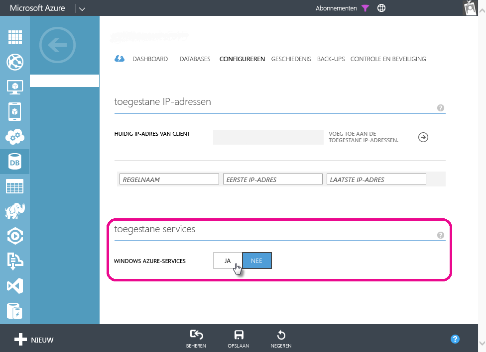

# Problemen met een geplande vernieuwing voor Azure SQL-databases oplossen in Power BI
Voor gedetailleerde stappen voor het instellen van de geplande vernieuwing, kunt u [Gegevens vernieuwen in Power BI](refresh-data.md) raadplegen.

Als u tijdens het instellen van de geplande vernieuwing voor Azure SQL een fout met foutcode 400 krijgt bij het bewerken van de referenties, probeert u het volgende om de juiste firewallregel in te stellen:

1. Meld u aan bij de Azure Management Portal
2. Ga naar de Azure SQL-server waarvoor u de vernieuwing wilt configureren
3. Schakel 'Windows Azure-services' in het gedeelte Toegestane services in

  

Hebt u nog vragen? [Misschien dat de Power BI-community het antwoord weet](http://community.powerbi.com/)

