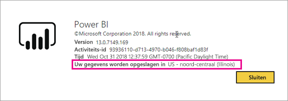
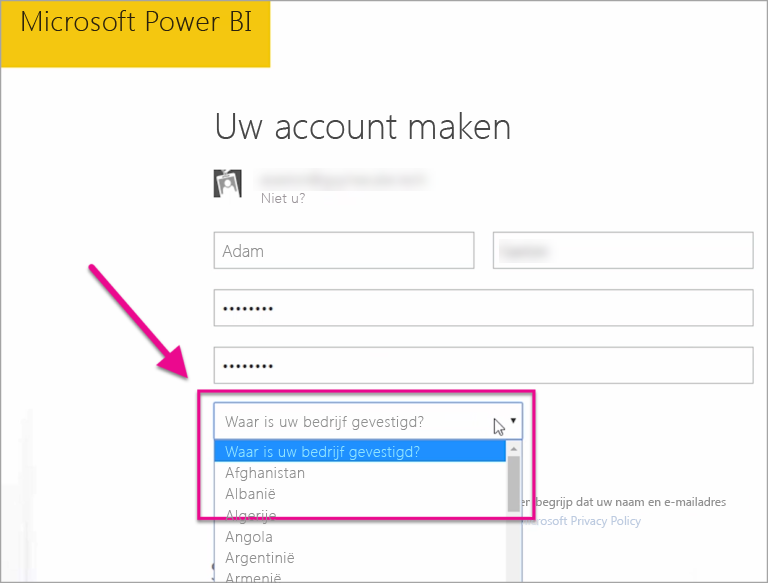

# Waar bevindt mijn Power BI-tenant zich?

<iframe width="560" height="315" src="https://www.youtube.com/embed/0fOxaHJPvdM?showinfo=0" frameborder="0" allowfullscreen></iframe>

Informatie over waar uw Power BI-tenant zich bevindt en hoe deze locatie wordt geselecteerd. Het is belangrijk om bekend te zijn met de locatie omdat deze van invloed kan zijn op interacties met de service.

## Bepalen waar uw Power BI-tenant zich bevindt

Volg deze stappen om vast te stellen in welke regio uw tenant zich bevindt.

1. Selecteer in de Power BI-service in het bovenste menu Help (**?**) en vervolgens **Over Power BI**.

1. Kijk naar de waarde naast **Uw gegevens worden opgeslagen in**. Dit is de regio waar uw tenant zich bevindt.

    

## Hoe de gegevensregio wordt geselecteerd

Het gegevensgebied is gebaseerd op het land dat u selecteert bij het maken van de tenant. Dit geldt voor de registratie voor zowel Office 365 als Power BI, aangezien deze informatie wordt gedeeld. Als dit een nieuwe tenant is, selecteert u het juiste land uit de lijst wanneer u zich registreert.

Power BI kiest een gegevensgebied het dichtst in de buurt van deze selectie, waarmee wordt bepaald waar gegevens voor uw tenant worden opgeslagen.

> [!IMPORTANT]
> U kunt deze selectie niet wijzigen nadat u de tenant hebt gemaakt.

Hebt u nog vragen? [Misschien dat de Power BI-community het antwoord weet](http://community.powerbi.com/)

