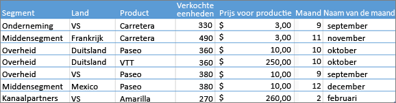
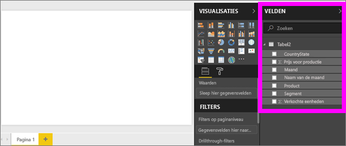
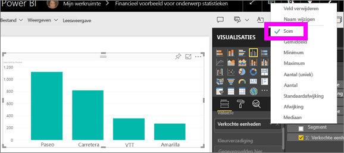
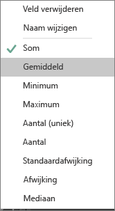
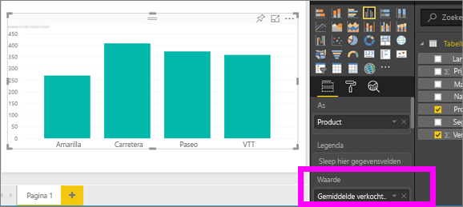
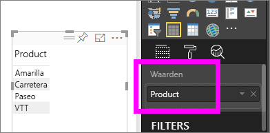
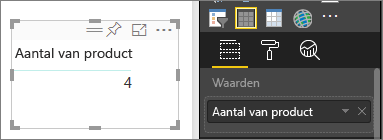
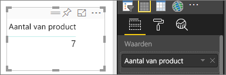
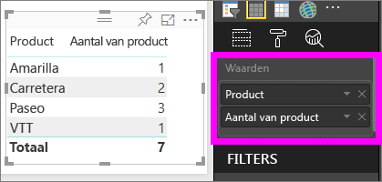

# Aggregaties in Power BI-visualisaties
## Wat is een statistische functie?
Soms wilt u de waarden in uw gegevens rekenkundig combineren. De rekenkundige bewerking kan de som, het gemiddelde, het maximum, het aantal, enzovoort zijn. Wanneer u waarden in uw gegevens combineert, wordt dit *aggregeren* genoemd. Het resultaat van die rekenkundige bewerking is een *aggregatie*. 

Wanneer Power BI-service en Power BI Desktop visualisaties maken, kunnen ze uw gegevens aggregeren. De aggregatie is vaak net wat u nodig hebt, maar soms wilt u de waarden op een andere manier aggregeren.  Bijvoorbeeld een som versus een gemiddelde. Er zijn verschillende manieren om de aggregatie die in een visualisatie wordt gebruikt, te beheren en wijzigen.

Laten we eerst kijken naar de *typen* gegevens, omdat het type gegevens bepaalt hoe, en of, het kan worden geaggregeerd.

## Typen gegevens
De meeste gegevenssets hebben meer dan één type gegevens. Op het meest eenvoudige niveau zijn de gegevens numeriek of niet. Numerieke gegevens kunnen worden geaggregeerd met behulp van een som, gemiddelde, aantal, minimum, afwijking en nog veel meer. Zelfs tekstgegevens, vaak *categorische* gegevens genoemd, kunnen worden geaggregeerd. Als u probeert categorische velden te aggregeren (door in een bucket met alleen numerieke waarden, zoals **Waarden** of **Tooltips** te plaatsen), telt Power BI hoeveel keer elke categorie voorkomt of telt het programma het aantal unieke instanties van een categorie. En speciale typen gegevens, zoals datums, hebben een aantal opties voor aggregeren: eerste, laatste, eerste en laatste. 

In het voorbeeld hieronder:
- zijn **Verkochte eenheden** en **Productieprijs** kolommen die numerieke gegevens bevatten
-  bevatten **Segment**, **Land**, **Product**, **Maand** en **Naam van de maand** categorische gegevens

   

Wanneer u een visualisatie maakt in Power BI, worden numerieke velden geaggregeerd (de standaardwaarde is *som*) via een categorisch veld.  Bijvoorbeeld 'Verkochte eenheden ***per Product***', 'Verkochte eenheden ***per maand***' en 'Productieprijs ***per segment***'. Sommige numerieke velden worden ook wel **metingen** genoemd. U kunt metingen eenvoudig herkennen in de Power BI-rapporteditor -- in de lijst Velden worden metingen weergegeven met het symbool ∑. Ga naar [De rapporteditor... een rondleiding](service-the-report-editor-take-a-tour.md) voor meer informatie.

## Waarom werken de statische functies niet zoals ik wil?
Wanneer u met statische functies in Power BI werkt, kan dit wel eens verwarrend zijn. Mogelijk hebt u een numeriek veld en kunt u de statische functie niet wijzigen in Power BI. Of misschien hebt u een veld, zoals een jaar, en wilt u dit niet aggregeren, omdat u alleen wilt tellen hoe vaak het jaar voorkomt.

De oorzaak van het probleem ligt meestal in de manier waarop het veld is gedefinieerd in de gegevensset. Mogelijk is het veld gedefinieerd als tekst en kan het daarom niet worden opgeteld of kan er geen gemiddelde worden berekend. Helaas kan [alleen de eigenaar van de gegevensset wijzigen hoe een veld is gecategoriseerd](desktop-measures.md). Dus als u eigenaarsmachtigingen hebt voor de gegevensset, in Desktop of het programma dat is gebruikt om de gegevensset te maken (bijvoorbeeld Excel), kunt u dit probleem oplossen. Anders moet u contact opnemen met de eigenaar van de gegevensset voor hulp.  

Aan het eind van dit artikel is een speciale sectie, **Aandachtspunten en probleemoplossing**, toegevoegd om de verwarring weg te nemen.  Als hier geen antwoord op uw vraag kunt vinden, stelt u de vraag in het [Power BI Community-forum](http://community.powerbi.com) voor een snelle, rechtstreekse reactie van het Power BI-team.

## Wijzigen hoe een numeriek veld wordt samengevoegd
Stel u hebt een diagram waarin de verkochte eenheden voor de verschillende producten wordt opgesomd, maar u hebt liever het gemiddelde. 

1. Maak een grafiek die een categorie en een meting gebruikt. In dit voorbeeld gebruiken we Verkochte eenheden per product.  Power BI maakt standaard een grafiek die de verkochte eenheden (meting in de bron Waarde) voor elk product (categorie in de bron As) totaliseert.

   

2. Klik in het deelvenster Visualisaties met de rechtermuisknop op de meting en selecteer het type aggregatie dat u nodig hebt. In dit geval selecteren we Gemiddelde. Als u de benodigde aggregatie niet ziet, raadpleegt u 'Aandachtspunten en het oplossen van problemen' hieronder.  
   
   
   
   > [!NOTE]
   > De beschikbare opties in de vervolgkeuzelijst variëren, afhankelijk van 1) het geselecteerde veld en 2) de wijze waarop het veld door de eigenaar van de gegevensset is gecategoriseerd.
   > 
3. De visualisatie gebruikt nu geaggregeerd op gemiddelde.

   

##    Manieren om uw gegevens te aggregeren

Enkele opties die beschikbaar zijn voor de aggregatie van een veld:

* **Niet samenvatten**. Wanneer u deze optie kiest, wordt elke waarde in dat veld afzonderlijk verwerkt en niet samengevat. Dit wordt vaak gebruikt als er een numerieke kolom bevatten die niet mogen worden opgeteld.
* **Som**. Hiermee worden alle waarden in het veld opgeteld.
* **Gemiddelde**. Hiermee wordt het rekenkundige gemiddelde van de waarden berekend.
* **Minimum**. Geeft de kleinste waarde.
* **Maximum**. Geeft de grootste waarde.
* **Aantal (niet leeg)**. Hiermee wordt het aantal (niet-lege) waarden in het veld geteld.
* **Aantal (uniek)**. Hiermee wordt het aantal verschillende waarden in het veld geteld.
* **Standaarddeviatie**.
* **Afwijking**.
* **Mediaan**.  Hiermee wordt de mediaanwaarde (middelste waarde) weergegeven. Dit is de waarde met hetzelfde aantal boven- als onderliggende items.  Als er 2 medianen zijn, wordt het gemiddelde hiervan genomen in Power BI.

Neem bijvoorbeeld de volgende gegevens:

| Land | Bedrag |
|:--- |:--- |
| VS |100 |
| VK |150 |
| Canada |100 |
| Duitsland |125 |
| Frankrijk | |
| Japan |125 |
| Australië |150 |

Dit voorbeeld geeft de volgende resultaten:

* **Niet samenvatten**: elke waarde wordt afzonderlijk weergegeven
* **Som**: 750
* **Gemiddelde**: 125
* **Maximum**:  150
* **Minimum**: 100
* **Aantal (niet leeg)**: 6
* **Aantal (uniek)**: 4
* **Standaarddeviatie** 20,4124145...
* **Afwijking**: 416,666...
* **Mediaan**: 125

## Een statistische functie maken met een categorieveld (tekst)
U kunt ook een niet-numeriek veld aggregeren. Als u bijvoorbeeld een veld Productnaam hebt, kunt u dit toevoegen als een waarde en vervolgens instellen op **Aantal**, **Uniek aantal**, **Eerste** of **Laatste**. 

1. In dit voorbeeld hebben we het veld **Product** naar de bron Waarden gesleept. De bron Waarden wordt meestal gebruikt voor numerieke velden. Power BI herkent dat dit een tekstveld is, stelt de statistische functie in op **Geen aggregatie** en geeft ons een tabel met één kolom.
   
   
2. Als we de aggregatie van de standaardwaarde **Niet samenvatten** wijzigen in **Aantal (uniek)**, wordt het aantal verschillende ketens in Power BI geteld. Er zijn in dit geval 4.
   
   
3. En als we de aggregatie wijzigen in **Aantal**, wordt het totale aantal in Power BI geteld. In dit geval zijn er 7 vermeldingen voor **Product**. 
   
   

4. Door hetzelfde veld (in dit geval **Product**) naar de bron Waarden te slepen en de standaardaggregatie **Niet samenvatten** te laten staan, geeft Power BI een uitsplitsing van het aantal op product.

   

## Aandachtspunten en probleemoplossing
V: Waarom beschik ik niet over de optie **Niet samenvatten**?

A: Het veld dat u hebt geselecteerd, is waarschijnlijk een berekende meting of geavanceerde meting gemaakt in Excel of in [Power BI Desktop](desktop-measures.md). Elk berekende meting heeft een eigen in code vastgelegde formule. U kunt de gebruikte aggregatie niet wijzigen.  Als het bijvoorbeeld een som is, kan deze alleen een som zijn. *Berekende metingen* worden in de lijst Velden weergegeven met het calculatorsymbool.

V: Mijn veld **is** numeriek, waarom kan ik alleen kiezen uit **Aantal** en **Uniek aantal**?

A1: Waarschijnlijk heeft de eigenaar van de gegevensset het veld per ongeluk of bewust *niet* geclassificeerd als een getal. Als een gegevensset bijvoorbeeld het veld **Jaar** bevat, kan de eigenaar van de gegevensset dat veld categoriseren als tekst, omdat het veld **Jaar** naar alle waarschijnlijkheid eerder wordt geteld (bijvoorbeeld het aantal mensen dat geboren is in 1974) dan dat het veld wordt opgeteld of dat er een gemiddelde van wordt genomen. Als u de eigenaar bent, kunt u de gegevensset openen in Power BI Desktop en het tabblad **Model maken** gebruiken om het gegevenstype te wijzigen.  

A2: Als er een rekenmachinepictogram voor het veld wordt weergegeven, betekent dit dat het veld een *berekende meting* bevat. Elke berekende meting heeft een eigen in code vastgelegde formule die alleen kan worden gewijzigd door de eigenaar van een gegevensset. De berekening die wordt gebruikt, is mogelijk een eenvoudige aggregatie zoals een gemiddelde of som, maar er kunnen ook complexe berekeningen worden gebruikt. zoals een percentage voor de bijdrage aan de bovenliggende categorie of het voorlopige totaal vanaf het begin van het jaar. De resultaten worden niet opgeteld of gemiddeld in Power BI. In plaats daarvan wordt elk gegevenspunt opnieuw berekend (aan de hand van de in code vastgelegde formule).

A3: Een andere mogelijkheid is dat u het veld in een *bucket* hebt geplaatst waarin alleen categorische waarden zijn toegestaan.  In dat geval beschikt u alleen over de opties Aantal en Uniek aantal.

A4: En een derde mogelijkheid is dat u het veld gebruikt voor een as. Er wordt in Power BI bijvoorbeeld één staaf voor elke afzonderlijke waarde weergegeven op de as van een staafdiagram. De veldwaarden worden niet samengevoegd. 

>[!NOTE]
>Spreidingsdiagrammen vormen een uitzondering op deze regel. Deze diagrammen *vereisen* geaggregeerde waarden voor de x- en y-as.

V: Ik heb een spreidingsdiagram en ik wil *niet* dat mijn veld wordt geaggregeerd.  Hoe doe ik dit?

A: Voeg het veld toe aan de bucket **Details** en niet aan de bucket van de x- of y-as.

V: Wanneer ik een numeriek veld aan een visualisatie toevoeg, wordt meestal de som weergegeven, maar soms wordt ook het gemiddelde, het aantal of een andere aggregatie weergegeven.  Waarom is de standaardaggregatie niet altijd hetzelfde?

A: Eigenaren van gegevenssets hebben de mogelijkheid om de standaardsamenvatting voor elk veld in te stellen. Als u eigenaar van een gegevensset bent, kunt u de standaardsamenvatting wijzigen op het tabblad **Modelleren** van Power BI Desktop.

V: Ik ben de eigenaar van een gegevensset en ik wil er voor zorgen dat een veld nooit wordt samengevoegd.

A: In Power BI Desktop kunt u op het tabblad **Modelleren** de optie **Gegevenstype** instellen op **Tekst**.

V: De optie **Niet samenvatten** wordt niet weergegeven in de vervolgkeuzelijst.

A: Verwijder het veld en voeg het vervolgens opnieuw toe.

Nog vragen? [Misschien dat de Power BI-community het antwoord weet](http://community.powerbi.com/)

