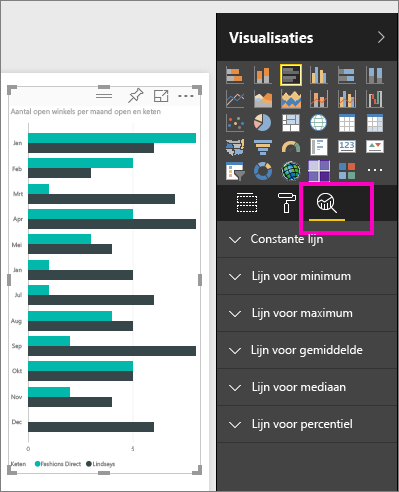
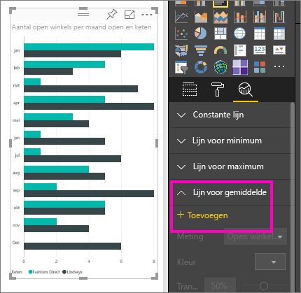
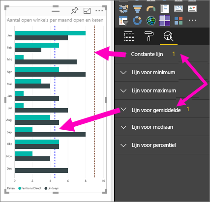
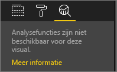

# Het deelvenster Analyse in de Power BI-service
Met het deelvenster **Analyse** in de **Power BI-service** kunt u dynamische *referentielijnen* toevoegen aan visualisaties en de aandacht vestigen op belangrijke trends of inzichten.

> [!NOTE]
> Het deelvenster **Analyse** wordt alleen weergegeven wanneer u een visueel element op het rapportcanvas selecteert.
> 
> 

## Het deelvenster Analyse gebruiken
Met het deelvenster **Analyse** kunt u de volgende soorten dynamische referentielijnen maken (niet alle lijnen zijn beschikbaar voor alle soorten visuals):

* Constante lijn voor de X-as
* Constante lijn voor de Y-as
* Lijn voor minimum
* Lijn voor maximum
* Lijn voor gemiddelde
* Lijn voor mediaan
* Lijn voor percentiel

In de volgende secties ziet u hoe u het deelvenster **Analyse** en dynamische referentielijnen kunt gebruiken in uw visualisaties.

Voer de volgende stappen uit als u de beschikbare dynamische referentielijnen voor een visual wilt weergeven:

1. Selecteer of maak een visual en selecteer vervolgens het pictogram **Analyse** in het deelvenster **Visualisaties**.
2. Selecteer de pijl-omlaag voor het type lijn dat u wilt maken om de bijbehorende opties uit te breiden. In dit geval selecteren we **Lijn voor gemiddelde**.
   
   
3. U voegt een nieuwe lijn toe door **+ Toevoegen** te selecteren. U kunt vervolgens een naam voor de lijn opgeven door te dubbelklikken op het tekstvak en daarna de naam te typen.
   
   U beschikt over allerlei opties voor de lijn, zoals *kleur*, *transparantie*, *stijl* en *positie* (ten opzichte van de gegevenselementen van de visual) selecteren en aangeven of een label moet worden toegevoegd. En wat belangrijker is, u kunt selecteren op welke **meting** in de visual u de lijn wilt baseren door de vervolgkeuzelijst **Meting** te selecteren. Deze wordt automatisch gevuld met gegevenselementen uit de visual. In dit geval selecteren we *Aantal open winkels* als meting, voegen we het label *Gem. aantal open winkel* toe en passen we enkele van de andere opties toe aan zoals hieronder wordt weergegeven.
   
   
4. Als u een gegevenslabel wilt weergeven, stelt u de schuifknop **Gegevenslabel** in op Aan. Als u doet dit, krijgt u allerlei extra opties voor uw gegevenslabel.
5. Let op het getal dat naast het item **Lijn voor gemiddelde** in het deelvenster **Analyse** wordt weergegeven. Zo weet u hoeveel dynamische lijnen de visual momenteel bevat en van welk type. Als we een **constante lijn** met een doelaantal van negen winkels toevoegen, ziet u dat het deelvenster **Analyse** dat we nu ook een **Constant constante lijn** als referentielijn hebben toegepast op deze visual.
   
   
   
   Als op de visual die u hebt geselecteerd (in dit geval een **kaart**) geen dynamische referentielijnen kunnen worden toegepast, ziet u het volgende wanneer u het deelvenster **Analyse** selecteert.
   
   

Er zijn allerlei interessante inzichten die u kunt benadrukken door dynamische referentielijnen te maken met het deelvenster **Analyse**.

We plannen meer functies en mogelijkheden, zoals uitbreiden op welke visuele elementen dynamische referentielijnen kunnen worden toegepast, dus kom regelmatig terug om te kijken wat er nieuw is.

## Beperkingen
De mogelijkheid om dynamische referentielijnen te gebruiken is gebaseerd op het type visual dat wordt gebruikt. In de volgende lijst wordt aangegeven welke dynamische lijnen momenteel beschikbaar zijn voor welke visuele elementen:

Volledig gebruik van dynamische lijnen is beschikbaar voor de volgende visuals:

* Vlakdiagram
* Lijndiagram
* Spreidingsdiagram
* Gegroepeerd kolomdiagram
* Gegroepeerd staafdiagram

De volgende visuals kunnen alleen een *constante lijn* uit het deelvenster **Analyse** gebruiken:

* Gestapeld vlakdiagram
* Gestapeld staafdiagram
* Gestapeld kolomdiagram
* 100% gestapeld staafdiagram
* 100% gestapeld kolomdiagram

Voor de volgende visuals is een *trendlijn* momenteel de enige optie:

* Niet-gestapeld lijndiagram
* Gegroepeerd kolomdiagram

Tot slot kunnen voor niet-Cartesische visuals momenteel geen dynamische lijnen uit het deelvenster **Analyse** worden toegepast, zoals:

* Matrix
* Cirkeldiagram
* Ringdiagram
* Tabel

## Volgende stappen
[Het deelvenster Analyse in Power BI Desktop](desktop-analytics-pane.md)

Nog vragen? [Misschien dat de Power BI-community het antwoord weet](http://community.powerbi.com/)

