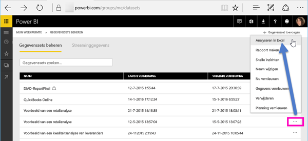
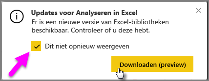
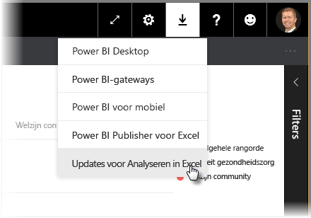
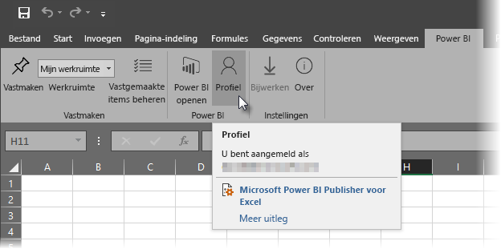
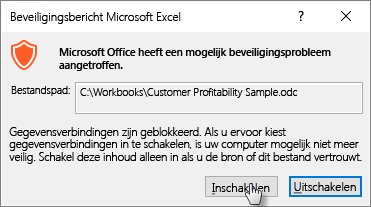
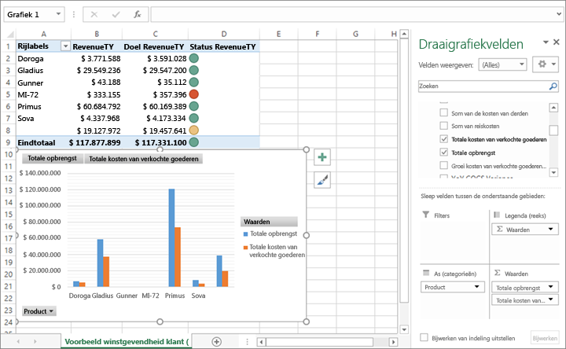

# Analyseren in Excel
In bepaalde situaties wilt u misschien Excel gebruiken om een gegevensset in Power BI te bekijken en er acties op uit te voeren. Dat kan met **Analyseren in Excel**. U kunt ook draaitabel-, grafiek- en slicer-functies gebruiken in Excel op basis van de gegevensset in Power BI.

## Vereisten
Er zijn enkele vereisten voor het gebruik van **Analyseren in Excel**:

* **Analyseren in Excel** wordt ondersteund voor Microsoft Excel 2010 SP1 of hoger.
* Excel-draaitabellen bieden geen ondersteuning voor aggregatie van numerieke velden met slepen en neerzetten. Uw gegevensset in Power BI *moet vooraf gedefinieerde metingen hebben*.
* Sommige organisaties hebben mogelijk groepsbeleidregels ingesteld die voorkomen dat de vereiste **Analyseren in Excel**-updates naar Excel worden geïnstalleerd. Als het niet lukt om de updates te installeren, vraagt u dit na bij uw beheerder.
* Voor **Analyseren in Excel** is een Pro-licentie vereist. Als u meer wilt weten over de verschillen in functionaliteit tussen verschillende licenties, kunt u eens kijken naar [Power BI-functies per licentietype](service-features-license-type.md). 

## Hoe werkt het?
Wanneer u **Analyseren in Excel** selecteert vanuit het menu met het weglatingsteken (...) dat is gekoppeld aan een gegevensset of rapport in **Power BI**, maakt Power BI een .ODC-bestand dat vanuit de browser naar uw computer wordt gedownload.

Wanneer u het bestand opent in Excel, wordt er een lege **Draaitabel**- en **Velden**-lijst weergegeven met de tabellen, velden en metingen uit de Power BI-gegevensset. U kunt draaitabellen en grafieken maken en de gegevensset analyseren, net zoals bij een lokale gegevensset in Excel.

Het .ODC-bestand heeft een MSOLAP-verbindingsreeks die is verbonden met uw gegevensset in Power BI. Wanneer u de gegevens analyseert of ermee werkt, vraagt Excel die gegevensset op in Power BI en worden de resultaten naar Excel geretourneerd. Als de gegevensset is verbonden met een live gegevensbron met behulp van DirectQuery, vraagt Power BI de gegevensbron op en retourneert Power BI de resultaten naar Excel.

**Analyseren in Excel** is heel handig voor gegevenssets en rapporten die zijn verbonden met *Tabellaire analyseservices* of *multidimensionale* databases, of vanuit Power BI Desktop-bestanden of Excel-werkmappen met gegevensmodellen met modelmaten die zijn gemaakt met behulp van Data Analysis Expressions (DAX).

## Aan de slag met Analyseren in Excel
Selecteer het menu met het weglatingsteken (...) naast een rapport of gegevensset in Power BI en selecteer in het menu dat wordt weergegeven **Analyseren in Excel**.

### Excel-updates installeren
Wanneer u **Analyseren in Excel** voor het eerst gebruikt, moet u updates naar de Excel-bibliotheken installeren. U wordt gevraagd om Excel-updates te downloaden en uit te voeren (hiermee start u de installatie van het Windows-installatiepakket *SQL_AS_OLEDDB.msi*). Met dit pakket wordt **Microsoft AS OLE DB-provider voor SQL Server 2016 RC0 (preview)** geïnstalleerd.

> [!NOTE]
> Schakel het selectievakje voor **Dit niet opnieuw weergeven** in in het dialoogvenster **Excel-updates installeren**. U hoeft de update slechts één keer te installeren.
> 
> 

Als u de Excel-updates voor **Analyseren in Excel** toch opnieuw moet installeren, kunt u de update downloaden via het pictogram **Downloaden** in Power BI, zoals in de volgende afbeelding wordt weergegeven.

### Aanmelden bij Power BI
Hoewel u bent aangemeld bij Power BI in uw browser, kunt u de eerste keer dat u een nieuw .ODC-bestand in Excel opent worden gevraagd om u aan te melden bij Power BI met uw Power BI-account. Hiermee wordt de verbinding van Excel met Power BI geverifieerd.

### Gebruikers met meerdere Power BI-accounts
Sommige gebruikers hebben meerdere Power BI-account. Bij deze gebruikers kan het voorkomen dat ze zijn aangemeld bij Power BI met het ene account, maar dat een ander account toegang heeft tot de gegevensset die in Analyseren in Excel wordt gebruikt. In dergelijke situaties kan er een **Verboden**-fout worden weergegeven of mislukt het aanmelden wanneer u probeert om een gegevensset te openen die in een Analyseren in Excel-werkmap wordt gebruikt.

U krijgt de mogelijkheid om u opnieuw aan te melden. U kunt nu het Power BI-account gebruiken dat toegang heeft tot de gegevensset die door Analyseren in Excel wordt geopend. U kunt ook in het **Power BI**-tabblad van Excel **Profiel**selecteren. Hier kunt u zien met welk account u momenteel bent aangemeld en op een koppeling klikken waarmee u zich kunt afmelden (en u vervolgens aanmelden met een ander account).

### Gegevensverbindingen inschakelen
U wordt gevraagd de bestandsnaam en het pad voor het ODC-bestand te controleren en vervolgens **Inschakelen** te selecteren, zodat uw Power BI-gegevens in Excel kunnen worden geanalyseerd.

> [!NOTE]
> Beheerders voor Power BI-tenants kunnen de *Power BI-beheerportal* gebruiken om het gebruik van **Analyseren in Excel** met on-premises gegevenssets die zijn ondergebracht in AS-databases (Analysis Services) uit te schakelen. Wanneer deze optie is uitgeschakeld, is **Analyseren in Excel** niet beschikbaar voor AS-databases, maar kan de functie wel worden gebruikt voor andere gegevenssets.
> 
> 

## Analyseren maar
Nu Excel is geopend en u een lege draaitabel hebt, kunt u allerlei analyses met uw Power BI-gegevensset uitvoeren. Net als bij andere lokale werkmappen, kunt u met Analyseren in Excel draaitabellen en grafieken maken, gegevens uit andere bronnen toevoegen, enzovoort. Daarnaast kunt u verschillende werkbladen met allerlei soorten weergaven van uw gegevens maken.

> [!NOTE]
> Belangrijk: als u **Analyseren in Excel** gebruikt, worden alle gegevens op detailniveau zichtbaar voor alle gebruikers met een machtiging voor de gegevensset.
> 
> 

## Opslaan
U kunt deze werkmap die is verbonden met een Power BI-gegevensset net als elke andere werkmap opslaan. U kunt de werkmap echter niet publiceren of opnieuw importeren in Power BI, omdat u alleen werkmappen kunt publiceren of importeren in Power BI die gegevens in tabellen hebben, of die een gegevensmodel hebben. Aangezien de nieuwe werkmap een verbinding met de gegevensset in Power BI heeft, zou publiceren of importeren in Power BI continu worden herhaald.

## Delen
Wanneer uw werkmap is opgeslagen, kunt u deze delen met andere Power BI-gebruikers in uw organisatie.

Wanneer gebruikers met wie u de werkmap hebt gedeeld deze openen, zien ze uw draaitabellen en gegevens van het moment dat de werkmap voor het laatst werd opgeslagen, wat mogelijk niet de nieuwste versie van de gegevens is. Gebruikers kunnen de knop **Vernieuwen** in het lint **Gegevens** gebruiken om de nieuwste gegevens weer te geven. Omdat de werkmap is verbonden met een gegevensset in Power BI, moeten gebruikers bij het vernieuwen van de werkmap zich aanmelden bij Power BI. De eerste keer dat ze via deze methode proberen bij te werken, moeten ze de Excel-updates installeren.

Gebruikers moeten de gegevensset vernieuwen, en vernieuwen voor externe verbindingen wordt niet ondersteund in Excel Online. Daarom is het raadzaam dat gebruikers de werkmap op hun computer openen in de bureaubladversie van Excel.

## Problemen oplossen
Wanneer u Analyseren in Excel gebruikt, krijgt u mogelijk een onverwacht resultaat of werkt de functie niet zoals verwacht. [Deze pagina bevat oplossingen voor algemene problemen bij het gebruik van Analyseren in Excel](desktop-troubleshooting-analyze-in-excel.md)