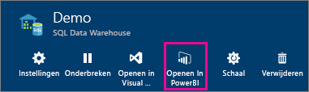
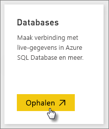
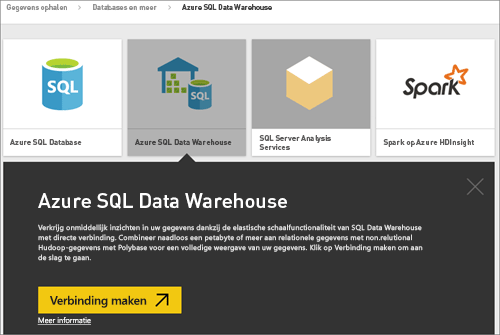
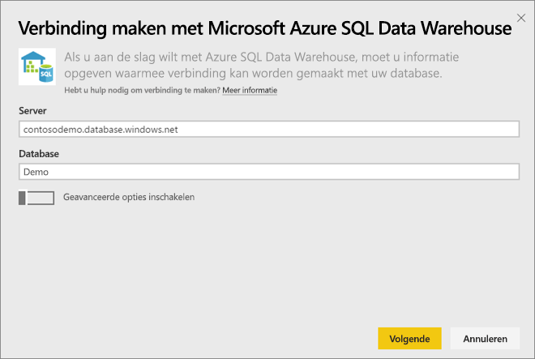
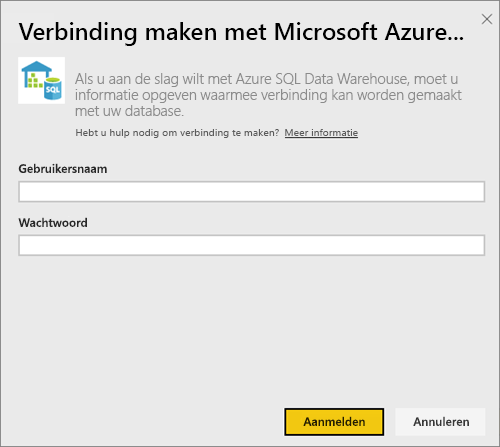
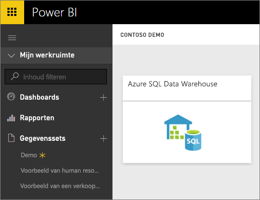
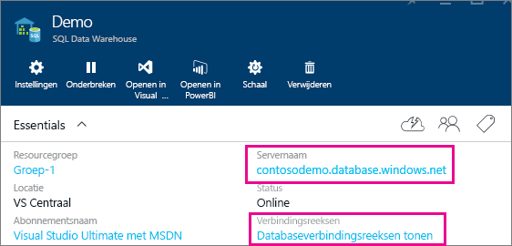

# Azure SQL Data Warehouse met DirectQuery
Door het gebruik van Azure SQL Data Warehouse in combinatie DirectQuery kunt u dynamische rapporten maken op basis van gegevens en metrische gegevens die al beschikbaar zijn in Azure SQL Data Warehouse. Met DirectQuery worden in realtime query’s teruggestuurd naar Azure SQL Database Warehouse wanneer u de gegevens in de rapportweergave verkent. Dit, in combinatie met de schaal van SQL Data Warehouse, biedt gebruikers de mogelijkheid om in enkele minuten dynamische rapporten te maken op basis van terabytes aan gegevens. Bovendien kunnen gebruikers met de introductie van de knop **Openen in Power BI** rechtstreeks via Power BI verbinding maken met hun SQL Data Warehouse, zonder dat ze de informatie handmatig hoeven op te geven.

Als u de SQL Data Warehouse-connector gebruikt:

* Geef de volledige servernaam op wanneer u verbinding maakt (zie hieronder voor meer informatie).
* Zorg ervoor dat de firewallregels voor de server zijn ingesteld op Toegang tot Azure-services toestaan.
* Voor elke actie, zoals het selecteren van een kolom of het toevoegen van een filter, wordt er rechtstreeks een query terug naar de database verzonden.
* Tegels worden ongeveer elke 15 minuten vernieuwd zonder dat hier een schema voor hoeft te worden ingesteld.  Dit kan worden aangepast in de geavanceerde instellingen wanneer u verbinding maakt.
* Q&A is niet beschikbaar voor DirectQuery-gegevenssets.
* Wijzigingen in het schema worden niet automatisch doorgevoerd.

Deze beperkingen en opmerkingen kunnen veranderen, aangezien we de ervaring voortdurend proberen te verbeteren. De stappen om verbinding te maken, worden hieronder beschreven.

## De knop Openen in Power BI gebruiken
De eenvoudigste manier om tussen SQL Data Warehouse en Power BI te schakelen is met de knop **Openen in Power BI** in Azure Preview Portal. Met deze knop kunt u probleemloos nieuwe dashboards in Power BI maken.

1. Ga naar uw instantie van SQL Data Warehouse in Azure Preview Portal om aan de slag te gaan. SQL Data Warehouse is op dit moment alleen beschikbaar in Azure Preview Portal.
2. Klik op de knop **Openen in Power BI**.
   
    
3. Als we u niet rechtstreeks kunnen aanmelden of als u geen Power BI-account hebt, moet u zich aanmelden.
4. U wordt omgeleid naar SQL Data Warehouse-verbindingspagina met daarop de informatie uit SQL Data Warehouse. Geef uw referenties op en klik op Verbinden om verbinding te maken.

## Verbinding maken via Power BI
SQL Data Warehouse wordt ook vermeld op de Power BI-pagina Gegevens ophalen. 

1. Selecteer **Gegevens ophalen** linksonder in het navigatievenster.  
   
    
2. Selecteer in **Databases** de optie **Ophalen**.
   
    
3. Selecteer **SQL Data Warehouse** \> **Verbinden**.
   
    
4. Voer de benodigde informatie om verbinding te maken. In de onderstaande sectie **Parameters zoeken** wordt uitgelegd waar u deze gegevens kunt vinden in Azure Portal.
   
    
   
    
   
    
   
   > [!NOTE]
   > De gebruikersnaam is een gebruiker die is gedefinieerd in uw instantie van Azure SQL Data Warehouse.
   > 
   > 
5. Zoom in op de gegevensset door de nieuwe tegel of de nieuw gemaakte gegevensset, aangeduid met sterretje, te selecteren. Deze gegevensset heeft dezelfde naam als uw database.
   
    
6. U kunt alle tabellen en kolommen verkennen. Als u een kolom selecteert, wordt er een query teruggestuurd naar de bron en wordt uw visual op dynamische wijze gemaakt. Filters worden ook terugvertaald in query's naar uw datawarehouse. Deze visuals kunnen worden opgeslagen in een nieuw rapport en weer worden vastgemaakt aan uw dashboard.
   
    

## Parameterwaarden zoeken
De volledige servernaam en databasenaam vindt u in Azure Preview Portal. SQL Data Warehouse is op dit moment alleen beschikbaar in Azure Preview Portal.

## Volgende stappen
[Aan de slag met Power BI](service-get-started.md)  
[Gegevens ophalen voor Power BI](service-get-data.md)  
[Azure SQL Data Warehouse](https://azure.microsoft.com/en-us/documentation/services/sql-data-warehouse/)  
Nog vragen? [Misschien dat de Power BI-community het antwoord weet](http://community.powerbi.com/)

