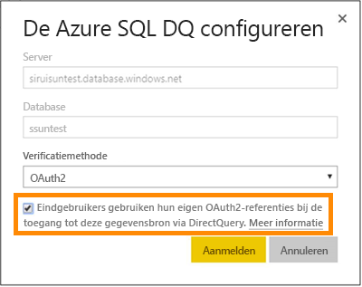
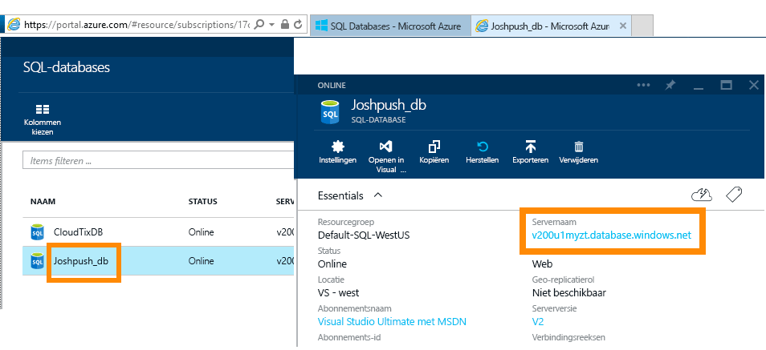
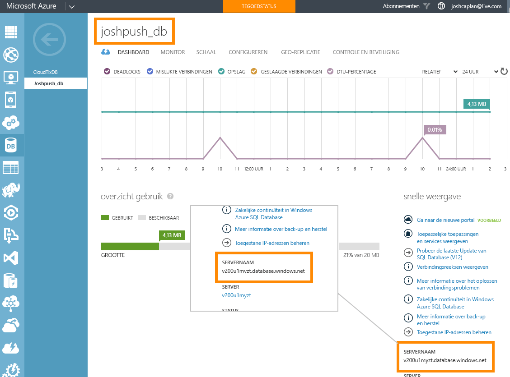

# Azure SQL Database met DirectQuery
Ontdek hoe u rechtstreeks verbinding met Azure SQL Database maakt en rapporten kunt maken waarin dynamische gegevens worden gebruikt. U kunt uw gegevens in de bron in plaats van Power BI bewaren.

Met DirectQuery worden query’s teruggestuurd naar Azure SQL Database wanneer u de gegevens in de rapportweergave verkent. Deze ervaring wordt aangeraden voor gebruikers die vertrouwd zijn met de databases en entiteiten waarmee ze verbinding maken.

**Opmerkingen:**

* Geef de volledige servernaam op wanneer u verbinding maakt (zie hieronder voor meer informatie).
* Zorg ervoor dat de firewallregels voor de database zijn ingesteld op [Toegang tot Azure-services toestaan](https://msdn.microsoft.com/library/azure/ee621782.aspx).
* Voor elke actie, zoals het selecteren van een kolom of het toevoegen van een filter, wordt er een query terug naar de database gestuurd.
* Tegels worden om het uur vernieuwd (vernieuwen hoeft niet te worden gepland). Dit kan worden aangepast in de geavanceerde instellingen wanneer u verbinding maakt.
* Q&A is niet beschikbaar voor DirectQuery-gegevenssets.
* Wijzigingen in het schema worden niet automatisch doorgevoerd

Deze beperkingen en opmerkingen kunnen veranderen, aangezien we de ervaring voortdurend proberen te verbeteren. De stappen om verbinding te maken, worden hieronder beschreven. 

## Power BI Desktop en DirectQuery
Als u verbinding met Azure SQL Database via DirectQuery, moet u Power BI Desktop gebruiken. Deze benadering biedt extra flexibiliteit en mogelijkheden. Rapporten die zijn gemaakt met Power BI Desktop, kunnen vervolgens worden gepubliceerd naar de Power BI-service. Meer informatie over hoe u verbinding maakt met [Azure SQL Database via DirectQuery](desktop-use-directquery.md) vindt u in Power BI Desktop. 

## Eenmalige aanmelding

Nadat u een Azure SQL DirectQuery-gegevensset naar de service hebt gepubliceerd, kunt u eenmalige aanmelding (SSO) via Azure Active Directory (Azure AD) OAuth2 inschakelen voor uw eindgebruikers. 

Als u eenmalige aanmelding wilt inschakelen, gaat u naar de instellingen voor de gegevensset. Open het tabblad **Gegevensbronnen** en schakel het vakje voor eenmalige aanmelding in.

Wanneer de optie voor eenmalige aanmelding is ingeschakeld en uw gebruikers toegang hebben tot rapporten die op de gegevensbron zijn gebouwd, verzendt Power BI hun geverifieerde Azure AD-referenties in de query's naar de Azure SQL-database. Hierdoor kan Power BI rekening houden met de beveiligingsinstellingen die op het niveau van de gegevensbronnen zijn geconfigureerd.

De optie voor eenmalige aanmelding heeft effect op alle gegevenssets die gebruikmaken van deze gegevensbron. Het heeft geen invloed op de verificatiemethode die wordt gebruikt om scenario's te importeren.

## Parameterwaarden zoeken
De volledige servernaam en databasenaam vindt u in Azure Portal.

## Volgende stappen
[DirectQuery in Power BI Desktop gebruiken](desktop-use-directquery.md)  
[Aan de slag met Power BI](service-get-started.md)  
[Gegevens ophalen voor Power BI](service-get-data.md)  
Nog vragen? [Misschien dat de Power BI-community het antwoord weet](http://community.powerbi.com/)
