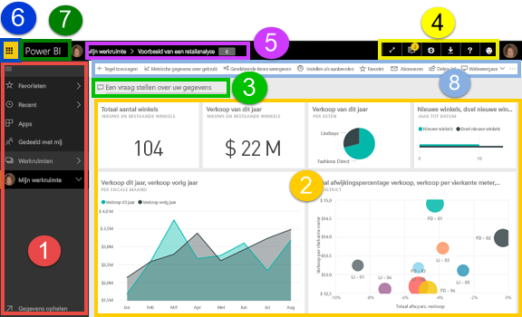
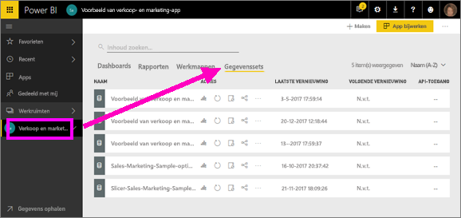
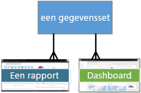
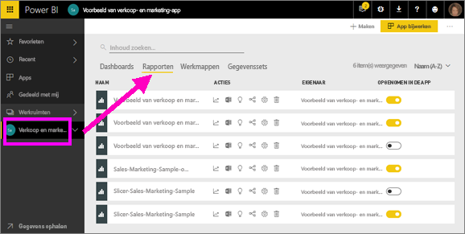
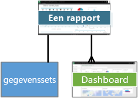
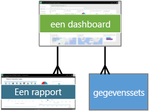
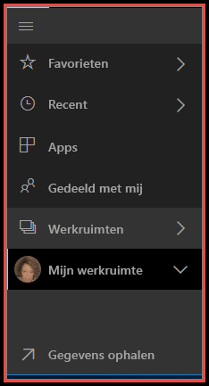
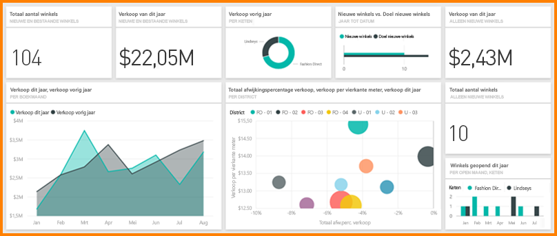

# Power BI - basisconcepten van de Power BI-service

In dit artikel wordt ervan uitgegaan dat u al bent [aangemeld voor de Power BI-service](service-self-service-signup-for-power-bi.md) en [enkele gegevens hebt toegevoegd](service-get-data.md).

Wanneer u de Power BI-service opent, ziet u dat er een ***dashboard*** wordt weergegeven. Dashboards zijn de elementen waarmee de Power BI-service zich onderscheidt van Power BI Desktop.

De belangrijkste functies in de gebruikersinterface van de Power BI-service:

1. navigatiedeelvenster (linkernavigatie)
2. canvas (in dit geval een dashboard met tegels)
3. Q&A-vragenvak
4. pictogramknoppen, inclusief help en feedback
5. dashboardtitel (navigatiepad, oftewel ‘breadcrumbs’)
6. Startprogramma voor de Office 365-app
7. Knop voor de startpagina van Power BI
8. Gelabelde pictogramknoppen

Meer informatie hierover volgt later, maar laten we eerst enkele concepten van Power BI bekijken.

U kunt ook eerst deze video bekijken voordat u de rest van dit artikel leest.  In de video bespreekt Will de basisconcepten aan de hand van een rondleiding door de Power BI-service.

<iframe width="560" height="315" src="https://www.youtube.com/embed/B2vd4MQrz4M" frameborder="0" allowfullscreen></iframe>

## Power BI-concepten
De vier primaire bouwstenen van Power BI zijn: ***dashboards***, ***rapporten***, ***werkmappen*** en ***gegevenssets***. Deze zijn ingedeeld in ***werkruimten***. Het is belangrijk om te begrijpen hoe werkruimten werken voordat we ons verdiepen in de vier bouwblokken. Laten we dus bij het begin beginnen. 

## Werkruimten
Werkruimten zijn containers voor dashboards, rapporten, werkmappen en gegevenssets in Power BI. Er zijn twee soorten werkruimten: **Mijn werkruimte* en app-werkruimten. Wat is een *app* nu precies? Een *Power BI*-app is een verzameling dashboards en rapporten die is gebouwd om belangrijke metrische gegevens voor uw organisatie te leveren. Apps zijn interactief maar kunnen niet worden bewerkt 

- *Mijn werkruimte* is de persoonlijke werkruimte voor elke klant van Power BI om met hun eigen inhoud te kunnen werken. Alleen u hebt toegang tot uw Mijn werkruimte. Als u inhoud wilt delen, kunt u dat op verschillende manieren doen: maak een app-werkruimte waar u de inhoud in een *app* combineert en maak deze werkruimte beschikbaar voor anderen in uw organisatie. Of maak een app-werkruimte en geef collega’s toegang tot die werkruimte zodat u inhoud kunt delen en kunt samenwerken.     
-  *App-werkruimten* worden gebruikt om te samen te werken en inhoud te delen met collega’s. Het is ook de plek om apps voor uw organisatie te maken, publiceren en beheren. U kunt ze beschouwen als tijdelijke locaties en containers voor de inhoud die straks een Power BI-app zullen vormen. U kunt collega's toevoegen aan uw app-werkruimten en samenwerken aan dashboards, rapporten, werkmappen en gegevenssets. Alle leden van de app-werkruimte hebben een Power BI Pro-licentie nodig, maar appconsumenten (de collega's die toegang tot de apps hebben) hoeven niet per se over Pro-licenties te beschikken.  

Raadpleeg het gedeelte **Uw werk delen** in de inhoudsopgave voor meer informatie, beginnende bij [Hoe kan ik samenwerken en dashboards en rapporten delen](service-how-to-collaborate-distribute-dashboards-reports.md).

Laten we het nu hebben over de bouwblokken van Power BI. U kunt geen dashboards of rapporten maken zonder gegevens (u kunt uiteraard een lege dashboards en rapporten maken, maar deze zijn pas bruikbaar wanneer ze gegevens bevatten). Laten we beginnen met **gegevenssets**.

## Gegevenssets
Een *gegevensset* is een verzameling gegevens die u *importeert* of waar u *verbinding* mee maakt. Met Power BI kunt u diverse soorten gegevenssets importeren of hier verbinding mee maken en alle gegevens samen te brengen op één locatie.  

Gegevenssets zijn gekoppeld aan *werkruimten* en één gegevensset kan deel uitmaken van veel werkruimten. Wanneer u een werkruimte opent, worden de bijbehorende gegevenssets vermeld op het tabblad **Gegevenssets**. Elke vermelde gegevensset vertegenwoordigt één bron van gegevens, bijvoorbeeld een Excel-werkmap in OneDrive, een on-premises SSAS-gegevensset in tabelvorm of een Salesforce-gegevensset. Er worden diverse verschillende gegevensbronnen ondersteund en er worden voortdurend nieuwe bronnen toegevoegd. [Zie de lijst met typen gegevenssets die kunnen worden gebruikt met Power BI](service-get-data.md).

In het onderstaande voorbeeld heb ik de app-werkruimte 'Verkoop en marketing' geselecteerd en op het tabblad **Gegevenssets** geklikt.

**Eén** dataset

* kan herhaaldelijk worden gebruikt in een of in veel werkruimten.
* kan worden in tal van verschillende rapporten.
* De visualisatie uit die ene gegevensset kunnen worden weergegeven op een groot aantal verschillende dashboards.
  
  

Als u [verbinding met een gegevensset wilt maken of een gegevensset wilt importeren](service-get-data.md), selecteert u **Gegevens ophalen** (onderaan de linkernavigatiebalk) of selecteert u **+ Maken > Gegevensset** (in de rechterbovenhoek). Volg de instructies om verbinding te maken met de specifieke bron of om deze te importeren en de gegevensset aan de actieve werkruimte toe te voegen. Nieuwe gegevenssets zijn gemarkeerd met een geel sterretje. Uw werkzaamheden in Power BI zijn niet van invloed op de onderliggende gegevensset. Deze blijft ongewijzigd.

Als u [deel uitmaakt van een ***app-werkruimte***](service-collaborate-power-bi-workspace.md), zijn de gegevenssets die worden toegevoegd door een lid van de werkruimte ook beschikbaar voor de andere leden van de werkruimte.

U kunt gegevenssets vernieuwen, een andere naam geven, verkennen en verwijderen. U kunt een gegevensset gebruiken om een nieuw rapport maken of door [snelle inzichten](service-insights.md) uit te voeren.  Als u wilt zien welke rapporten en dashboards al een gegevensset gebruiken, selecteert u **Verwante items weergeven**. Selecteer een gegevensset om deze te verkennen In werkelijkheid opent de gegevensset in de rapporteditor, waar u de gegevens echt kunt doorspitten en visualisaties kunt maken. Laten we doorgaan met het volgende onderwerp: rapporten.

### Dieper graven
* [Power BI Premium - wat is het?](service-premium.md)
* [Gegevens ophalen voor Power BI](service-get-data.md)
* [Voorbeeldgegevenssets voor Power BI](sample-datasets.md)

## Rapporten
Een Power BI-rapport bestaat uit een of meer pagina's met visualisaties (grafieken en diagrammen zoals lijndiagrammen, cirkeldiagrammen treemaps en nog veel meer). Visualisaties worden ook wel ***visuals*** genoemd. Alle visualisaties in een rapport zijn afkomstig uit één gegevensset. U kunt compleet nieuwe rapporten maken in Power BI, rapporten importeren met dashboards die collega's met u hebben gedeeld, maar u kunt ook rapporten maken wanneer u verbinding maakt met gegevenssets in Excel, Power BI Desktop, databases, SaaS-toepassingen en [apps](service-get-data.md).  Als u bijvoorbeeld verbinding maakt met een Excel-werkmap die Power View-werkbladen bevat, wordt er een rapport in Power BI gemaakt op basis van die werkbladen. En als u verbinding met een SaaS-toepassing maakt, wordt er een vooraf samengestelde rapport in Power BI geïmporteerd.

U kunt in twee modi met rapporten werken: in de [leesweergave en de bewerkingsweergave](service-reading-view-and-editing-view.md).  Alleen de persoon die het rapport heeft gemaakt, mede-eigenaren en diegenen waaraan een machtiging is verleend, hebben toegang tot alle verken-, ontwerp- en deelmogelijkheden die in de ***bewerkingsweergave*** voor dat rapport worden geboden. De personen met wie het rapport wordt gedeeld, kunnen het rapport verkennen en gebruiken in de ***leesweergave***.   

Wanneer u een werkruimte opent, worden de bijbehorende rapporten vermeld op het tabblad **Rapporten**. Elk rapport dat wordt vermeld, vertegenwoordigt een of meer pagina's met visualisaties die zijn gebaseerd op een van de onderliggende gegevenssets. Selecteer een rapport om het te openen. 

Wanneer u een app opent, krijgt u een dashboard te zien.  Voer toegang tot een onderliggend rapport, selecteert u een dashboardtegel (hierover later meer) die vanuit een rapport is vastgemaakt. Houd er rekening mee dat niet alle tegels vanuit rapporten zijn vastgemaakt. Mogelijk moet u dus op een aantal tegels klikken om een rapport te vinden. 

Het rapport wordt standaard geopend in de leesweergave.  Selecteer **Rapport bewerken** om het rapport te openen in bewerkweergave (als u over de benodigde machtigingen beschikt). 

In het onderstaande voorbeeld heb ik de app-werkruimte 'Verkoop en marketing' geselecteerd en op het tabblad **Rapporten** geklikt.

**Eén** rapport

* is opgenomen in één werkruimte
* kan worden gekoppeld aan meerdere dashboards in die werkruimte (tegels die zijn vastgemaakt vanuit dat rapport, kunnen worden weergegeven in meerdere dashboards).
* kan worden gemaakt van gegevens uit één gegevensset. (Een kleine uitzondering hierop is dat Power BI Desktop meer dan één gegevensset in één rapport kan combineren en dat dat rapport kan worden geïmporteerd in Power BI.)
  
  

### Dieper graven
* [Rapporten in de Power BI-service en Power BI Desktop](service-reports.md)
* [Rapporten in de mobiele Power BI-apps](mobile-reports-in-the-mobile-apps.md)

## Dashboards
Een *dashboard* is iets wat u maakt **in de Power BI-service** of iets wat een collega maakt **in de Power BI-service** en met u deelt. Het dashboard bestaat uit één canvas dat nul of meer tegels en widgets bevat. Elke tegel die vanuit een rapport of vanuit [Q&A](power-bi-q-and-a.md) is vastgemaakt, geeft één [visualisatie](power-bi-report-visualizations.md) weer die is gemaakt van een gegevensset en die is vastgemaakt aan het dashboard. Volledige rapportpagina's kunnen ook als één tegel worden vastgemaakt aan een dashboard. Er zijn tal van manieren om tegels aan uw dashboard toe te voegen. Teveel om in dit overzichtsonderwerp te bespreken. Zie [Dashboardtegels in Power BI](service-dashboard-tiles.md) voor meer informatie. 

Waarom zou ik dashboards willen maken?  Hier volgen slechts enkele van de redenen:

* U kunt in één oogopslag alle benodigde informatie weergeven om een beslissing te nemen.
* U kunt de belangrijkste informatie over uw bedrijf bewaken
* U kunt er met dashboards voor zorgen dat alle collega's hetzelfde voor ogen hebben en allemaal dezelfde informatie weergeven en gebruiken.
* U kunt met dashboards de status van een bedrijf, product, afdelingen of marketingcampagne, enzovoort in de gaten houden.
* U kunt een gepersonaliseerde weergave van een groter dashboard maken met alle metrische gegevens die voor u belangrijk zijn

Wanneer u een werkruimte opent, worden de bijbehorende dashboards vermeld op het tabblad **Dashboards**. Selecteer een dashboard om het te openen. Wanneer u een app opent, krijgt u een dashboard te zien.  Elk dashboard vertegenwoordigt een aangepaste weergave of een subset van de onderliggende gegevensset(s).  Als u de eigenaar van het dashboard bent, hebt u ook bewerktoegang tot de onderliggende gegevensset(s) en rapporten.  Als het dashboard met u is gedeeld, kunt u interactief met het dashboard en eventuele onderliggende rapporten werken, maar u kunt geen wijzigingen opslaan.

Er zijn veel verschillende manieren waarop u of een collega [een dashboard kan delen](service-share-dashboards.md). U hebt Power BI Pro nodig om dashboard te kunnen delen, maar mogelijk ook om een gedeeld dashboard weer te geven.

> [!NOTE]
> In de sectie Dashboards met tegels vindt u meer informatie over vastmaken en tegels.
> 

**Eén** dashboard

* is gekoppeld aan één werkruimte
* kan visualisaties weergeven uit diverse gegevenssets,
* uit verschillende rapporten en
* en kan visualisaties weergeven die zijn vastgemaakt vanuit andere hulpprogramma's (bijvoorbeeld Excel).
  
  

### Dieper graven
* [Maak een nieuw, leeg dashboard en haal vervolgens een aantal gegevens op](service-dashboard-create.md) .
* [Een dashboard dupliceren](service-dashboard-copy.md) 
* [Een telefoonweergave van een dashboard maken](service-create-dashboard-mobile-phone-view.md)

## Werkmappen
Werkmappen zijn een speciaal type gegevensset. Als u het bovenstaande gedeelte over **gegevenssets** hebt gelezen, weet u vrijwel alles wat u over werkmappen moet weten. Maar u vraagt zich misschien af waarom Power BI een Excel-werkmap in sommige gevallen als een **gegevensset** en op andere momenten als een **werkmap** classificeert. 

Als u de optie **Gegevens ophalen** gebruikt met Excel-bestanden, hebt u de mogelijkheid om het bestand te *Importeren* of om *verbinding te maken* met het bestand. Wanneer u de optie Verbinden kiest, wordt uw werkmap weergegeven in Power BI, precies zoals in Excel Online. Maar anders dan in Excel Online hebt u een aantal handige functies waarmee u elementen uit uw werkbladen direct aan uw dashboards kunt vastmaken.

U kunt uw werkmap niet in Power BI bewerken. Maar als u wijzigingen wilt aanbrengen, kunt u op Bewerken klikken en uw werkmap vervolgens bewerken in Excel Online of openen in Excel op uw computer. Eventuele wijzigingen worden opgeslagen in de werkmap op OneDrive.

### Dieper graven
* [Gegevens ophalen uit Excel-werkmappen](service-excel-workbook-files.md)
* [Vanuit Excel publiceren naar Power BI](service-publish-from-excel.md)

## Mijn werkruimte
We hebben werkruimten en bouwstenen besproken. Laten we de Power BI-interface en de onderdelen van de bestemmingspagina voor de Power BI-service eens nader bekijken.

### 1. **Navigatiedeelvenster** (linkernavigatie)
Gebruik het navigatiedeelvenster om werkruimten te zoeken en tussen werkruimten en de Power BI-bouwblokken te schakelen: dashboards, rapporten, werkboeken en gegevenssets.  

  

* Selecteer **Gegevens ophalen** om [gegevenssets, rapporten en dashboards toe te voegen aan Power BI](service-get-data.md).
* U kunt de navigatiebalk uitvouwen of samenvouwen met dit pictogram .
* Open of beheer uw favoriete inhoud door **Favorieten** te selecteren.
* Bekijk en open de laatst bezochte inhoud door **Recent** te selecteren.
* Bekijk, open of verwijder een app door **Apps** te selecteren.
* Heeft een collega inhoud met u gedeeld? Selecteer **Gedeeld met mij** om die inhoud te zoeken en te sorteren om te vinden wat u nodig hebt.
* Toon en open uw werkruimen door **Werkruimten** te selecteren.

Eén klik

* op een pictogram of kop om in de inhoudsweergave te openen
* op een pijl naar rechts (>) om een uitvouwmenu te openen voor Favorieten, Recent en Werkruimten. 
* op een dubbele punthaak () om de doorbladerbare lijst **Mijn werkruimte** met dashboards, rapporten, werkboeken en gegevenssets weer te geven.
* een gegevensset verkennen

### 2. **Canvas** 
Omdat we een dashboard hebben geopend, worden in het tekengebied visualisatietegels weergegeven. Als we bijvoorbeeld de rapporteditor hadden geopend, zou in het tekengebied een rapportpagina worden weergegeven. 

Dashboards bestaan uit [tegels](service-dashboard-tiles.md).  Tegels worden gemaakt in een rapport in de bewerkweergave, in Q&A of in andere dashboards en kunnen worden vastgemaakt vanuit Excel, SSRS en meer. Een speciaal type tegel, een [widget](service-dashboard-add-widget.md), wordt rechtstreeks aan het dashboard toegevoegd. De tegels die worden weergegeven op een dashboard, daar bewust neergezet door een maker of eigenaar van een rapport.  De bewerking waarmee een tegel wordt toegevoegd aan een dashboard, noemen we *vastmaken*.

Zie **Dashboards** (hierboven) voor meer informatie.

### 3. **Q&A-vragenvak**
U kunt uw gegevens onder andere verkennen door vragen te stellen die door Power BI Q&A worden beantwoord de vorm van een visualisatie. Met Q&A kunt u inhoud aan een dashboard of rapport toevoegen.

U zoekt met Q&A naar antwoorden in een of meer gegevenssets die zijn verbonden met het dashboard.  Een verbonden gegevensset is een gegevensset waarvoor ten minste één tegel is vastgemaakt aan het desbetreffende dashboard.

Zodra u een vraag begint te typen, wordt u door Q&A omgeleid naar Q&A-pagina. Terwijl u typt, helpt Q&A u de juiste vraag te stellen en het antwoord te zoeken met herformuleringen, automatisch doorvoeren en suggesties. Wanneer u een gewenste visualisatie (antwoord) hebt gevonden, kunt u deze vastmaken aan uw dashboard. Zie [Q&A in Power BI](power-bi-q-and-a.md) voor meer informatie.

### 4. **Pictogramknoppen** 
De pictogrammen in de rechterbovenhoek zijn uw resources voor instellingen, meldingen, downloads, hulp en feedback aan het Power BI-team. Selecteer de dubbele pijl om het dashboard te open in een **volledig scherm**.  

### 5. **Dashboardtitel** (navigatiepad, oftewel ‘breadcrumbs’)
Het is niet altijd gemakkelijk te achterhalen welke werkruimte en welk dashboard actief zijn, dus Power BI maakt een navigatiepad voor u.  In dit voorbeeld ziet u de werkruimte (Mijn werkruimte) en de titel van het dashboard (Voorbeeld van een retailanalyse).  Als we een rapport hebben geopend, wordt de naam van het rapport aan het einde van het navigatiepad toegevoegd.  Elke sectie van het pad is een actieve hyperlink.  

Let op het pictogram 'C' na de titel van het dashboard. Dit dashboard bevat de [gegevensclassificatietag](service-data-classification.md) ‘Vertrouwelijk’. De tag identificeert de gevoeligheid en het beveiligingsniveau van de gegevens. Als uw beheerder gegevensclassificatie heeft ingeschakeld, beschikt elk dashboard over een standaardtagset. Dashboardeigenaren moeten de tag wijzigen zodat deze overeenkomt met het goede beveiligingsniveau van hun dashboard.

### 6. **Startprogramma voor de Office 365-app**
Met het startprogramma voor apps zijn al uw Office 365-apps met één klik beschikbaar. Hier kunt u snel uw e-mail, documenten, agenda etc. openen. 

### 7. **Power BI-startknop**
Als u deze knop selecteert, wordt u [aanbevolen dashboard](service-dashboard-featured.md) (indien u deze hebt ingesteld) geopend. Anders wordt het laatste dashboard dat u hebt bekeken geopend.

   

### 8. **Gelabelde pictogramknoppen**
Dit gedeelte van het scherm bevat aanvullende opties voor interactie met de inhoud (in dit geval met het dashboard).  Als u het beletselteken naast de gelabelde pictogrammen die u ziet selecteert, worden er onder andere opties weergegeven waarmee u het dashboard kunt dupliceren, afdrukken en vernieuwen.

   

## Volgende stappen
[Aan de slag met Power BI](service-get-started.md)  
[Navigatie: waar staat wat in Power BI-service](service-the-new-power-bi-experience.md)
[Power BI-video's](videos.md)  
[De rapporteditor... Een rondleiding](service-the-report-editor-take-a-tour.md)

Nog vragen? [Misschien dat de Power BI-community het antwoord weet](http://community.powerbi.com/)

