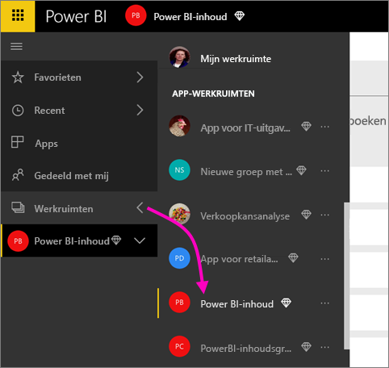
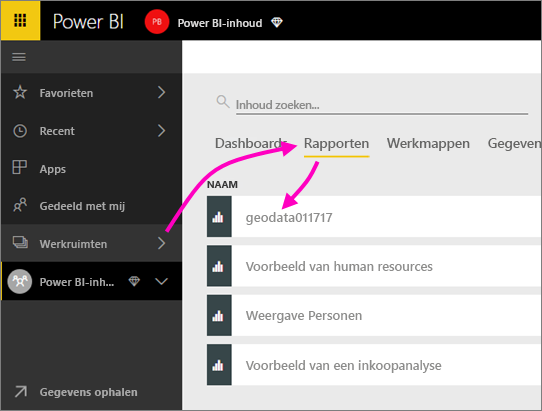
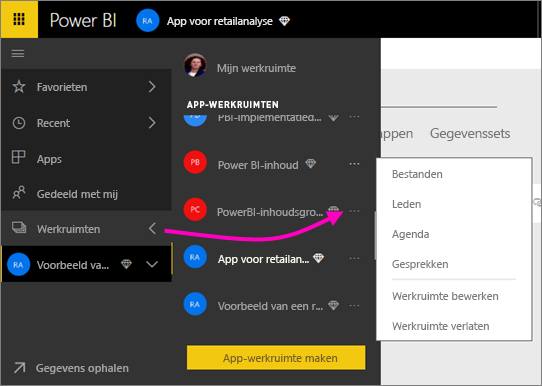
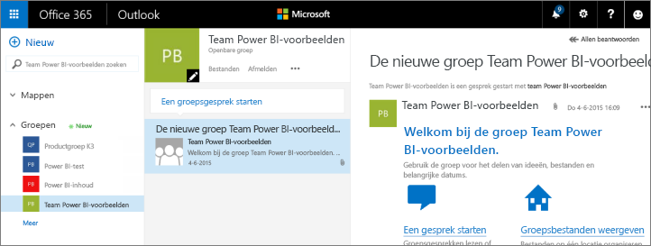
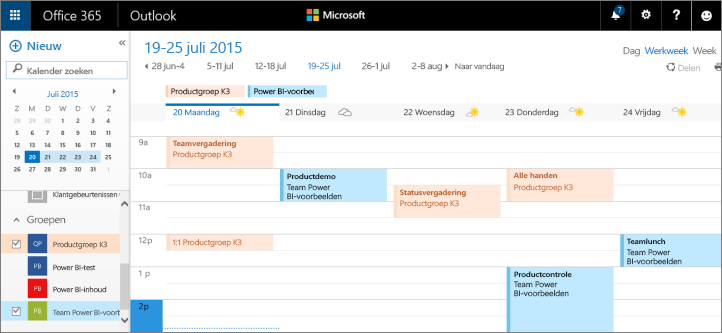

# Samenwerken in de werkruimte van uw Power BI-app
De Power BI app-werkruimten zijn goede plaatsen om met uw collega's samen te werken aan dashboards, rapporten en gegevenssets om *apps* te maken. Samenwerken eindigt niet met de werkruimten in Power BI. Office 365 biedt een andere groep services, zoals het delen van bestanden op OneDrive voor Bedrijven, conversaties in Exchange, gedeelde agenda en taken. Meer informatie over [groepen in Office 365](https://support.office.com/article/Create-a-group-in-Office-365-7124dc4c-1de9-40d4-b096-e8add19209e9).

> [!NOTE]
> Bij de preview van de nieuwe werkruimte-ervaring is de relatie tussen Power BI-werkruimten en Office 365-groepen gewijzigd. Er wordt niet automatisch een Office 365-groep gemaakt wanneer u een van de nieuwe werkruimten maakt. Meer informatie over [het maken van de nieuwe werkruimten (preview)](service-create-the-new-workspaces.md)

App-werkruimten zijn alleen beschikbaar bij een [Power BI Pro-licentie](service-features-license-type.md).

## Samenwerken aan Power BI Desktop-bestanden in uw app-werkruimte
Nadat u een Power BI Desktop-bestand hebt gemaakt, kunt u het publiceren naar uw Power BI app-werkruimte, waarna iedereen in uw werkruimte ermee kan werken.

1. Selecteer in Power BI Desktop **Publiceren** op het lint **Start** en selecteer vervolgens uw app-werkruimte in het vak **Een doel selecteren**.
   
    
2. Selecteer de pijl naast de werkruimten in de Power BI-service > selecteer uw app-werkruimte.
   
    
3. Selecteer het tabblad Rapporten en selecteer uw rapport.
   
    
   
    Vanaf dit punt werkt het net als elk ander rapport in Power BI. U en anderen in uw app-werkruimte kunnen [het rapport wijzigen](consumer/end-user-reports.md) en tegels opslaan in een dashboard van uw keuze.

## Samenwerken in Office 365
Samenwerken in Office 365 wordt gestart vanuit de app-werkruimte in Power BI.

1. Selecteer de pijl naast de werkruimten in de Power BI-service > selecteer het beletselteken (**…**) naast uw werkruimtenaam. 
   
   
2. In dit menu kunt u op een aantal manieren samenwerken met uw groep: 
   
   * Een [groepsconversatie hebben in Office 365](service-collaborate-power-bi-workspace.md#have-a-group-conversation-in-office-365).
   * [Een gebeurtenis plannen](service-collaborate-power-bi-workspace.md#schedule-an-event-on-the-group-workspace-calendar) op de agenda van de groepswerkruimte van de app.
   
   De eerste keer dat u naar de groepswerkruimte van uw app in Office 365 gaat, kan dit even duren. Wacht 15 tot 30 minuten en vernieuw uw browser.

## Een groepsconversatie hebben in Office 365
1. Selecteer het weglatingsteken (...) naast de naam van uw app-werkruimte \> **Conversaties**. 
   
    
   
   De e-mail- en conversatielocatie voor de groepswerkruimte van uw app wordt geopend in Outlook voor Office 365.
   
   
2. Meer informatie over [groepsconversaties in Outlook voor Office 365](https://support.office.com/Article/Have-a-group-conversation-a0482e24-a769-4e39-a5ba-a7c56e828b22).

## Een gebeurtenis plannen op de agenda van de groepswerkruimte van de app
1. Selecteer het weglatingsteken (**…**) naast de naam van uw app-werkruimte \> **Agenda**. 
   
   
   
   Hiermee opent u de kalender voor de groepswerkruimte van uw app in Outlook voor Office 365.
   
   
2. Meer informatie over [groepsagenda's in Outlook in Office 365](https://support.office.com/Article/Add-edit-and-subscribe-to-group-events-0cf1ad68-1034-4306-b367-d75e9818376a).

## Een app-werkruimte beheren
Als u eigenaar of beheerder bent van een app-werkruimte, kunt u ook werkruimteleden toevoegen of verwijderen. Meer informatie over [het beheren van uw Power BI app-werkruimte](service-manage-app-workspace-in-power-bi-and-office-365.md).

## Volgende stappen
* [Apps en app-werkruimten maken in Power BI](service-create-distribute-apps.md)
* Nog vragen? [Misschien dat de Power BI-community het antwoord weet](http://community.powerbi.com/)
* Feedback? Ga naar [Power BI ideeën](https://ideas.powerbi.com/forums/265200-power-bi)

