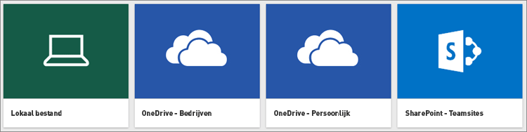

# Gegevens ophalen uit CSV-bestanden (bestand met door komma's gescheiden waarden)

Bestanden met door komma’s gescheiden waarden, beter bekend als een .CSV-bestand, zijn eenvoudige tekstbestanden met rijen gegevens waarbij elke waarde wordt gescheiden door een komma. Deze typen bestanden kunnen zeer grote hoeveelheden gegevens bevatten binnen een relatief kleine bestandsgrootte, waardoor ze een ideale gegevensbron zijn voor Power BI. U kunt een voorbeeld van een .CSV-bestand [hier](http://go.microsoft.com/fwlink/?LinkID=619356) downloaden.

Als u een .CSV-bestand hebt, is het tijd om het als een gegevensset in uw Power BI-site te krijgen waarna u kunt beginnen met het verkennen van uw gegevens, dashboards kunt maken en uw inzichten kunt delen met anderen.

>[!TIP]
>Veel organisaties produceren elke dag een .CSV met bijgewerkte gegevens. Als u wilt dat uw gegevensset in Power BI gesynchroniseerd blijft met uw bijgewerkte bestand, kunt u het bestand op OneDrive opslaan met dezelfde naam.

## Waar uw bestand wordt opgeslagen maakt het verschil
**Lokaal** - Als u het bestand opslaat op een lokaal station op uw computer of op een andere locatie binnen uw organisatie, kunt u het bestand *importeren* in Power BI. Het bestand blijft op het lokale station staan. Het bestand wordt dus eigenlijk niet echt geïmporteerd in Power BI. Wat er werkelijk gebeurt, is dat een nieuwe gegevensset wordt aangemaakt in Power BI en gegevens uit het .CSV-bestand in de gegevensset worden geladen.

**OneDrive Bedrijven**: als u OneDrive voor Bedrijven hebt en zich aanmeldt met hetzelfde account als voor Power BI, is dit verreweg de meest efficiënte manier om uw .CSV-bestand te houden en uw gegevensset, rapporten en dashboards in Power BI gesynchroniseerd te houden. Omdat zowel Power BI als OneDrive zich in de cloud bevinden, maakt Power BI ongeveer om het uur *verbinding* met uw bestand in OneDrive. Als er wijzigingen worden gevonden, worden uw gegevensset, rapporten en dashboards in Power BI automatisch bijgewerkt.

**OneDrive - Persoonlijk** Als u de bestanden opslaat in uw eigen OneDrive-account, geniet u veelal dezelfde voordelen als met OneDrive voor Bedrijven. Het belangrijkste verschil is dat wanneer u voor het eerst verbinding maakt met het bestand (met Gegevens ophalen > Bestanden > OneDrive - Persoonlijk), u zich bij OneDrive moet aanmelden met uw Microsoft-account. Dit is doorgaans een ander account dan het account dat u gebruikt om u aan te melden bij Power BI. Wanneer u zich met uw Microsoft-account aanmeldt bij OneDrive, moet u ervoor zorgen dat u het selectievakje Aangemeld blijven inschakelt. Op deze manier kan er om het uur verbinding via Power BI worden gemaakt met uw bestand en zorgt u ervoor dat uw gegevensset in Power BI wordt gesynchroniseerd.

**SharePoint - Teamsites**: als u uw Power BI Dekstop-bestanden wilt opslaan naar SharePoint - Teamsites, doet u dit op vrijwel dezelfde manier als bij OneDrive voor Bedrijven. Het grootste verschil is de manier waarop u vanuit Power BI verbinding maakt met het bestand. U kunt een URL opgeven of verbinding maken met de hoofdmap.

## .CSV-bestand importeren of verbinding maken met een .CSV-bestand
>[!IMPORTANT]
>De maximale bestandsgrootte die u in Power BI kunt importeren is 1 GB.

1. Klik in Power BI in het navigatievenster op **Gegevens ophalen**.
   
   
2. Klik in **Bestanden** op **Ophalen**.
   
   
3. Zoek het bestand.
   
   

## Volgende stappen
**Verken uw gegevens**: wanneer u gegevens uit het bestand in Power BI hebt geïmporteerd, kunt u ze verkennen. Klik met de rechtermuisknop op de nieuwe gegevensset en klik op **Verkennen**.

**Vernieuwen plannen**: als uw bestand wordt opgeslagen op een lokaal station, kunt u een geplande vernieuwing instellen zodat uw gegevensset en de rapporten in Power BI actueel blijven. Zie [Gegevens vernieuwen in Power BI](refresh-data.md) voor meer informatie. Als uw bestand wordt opgeslagen in OneDrive, dan wordt het elk uur automatisch gesynchroniseerd met Power BI.

