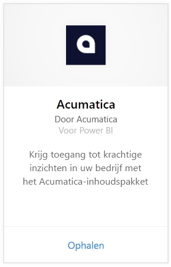
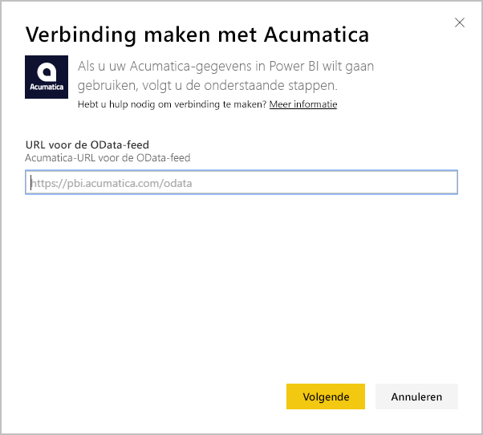
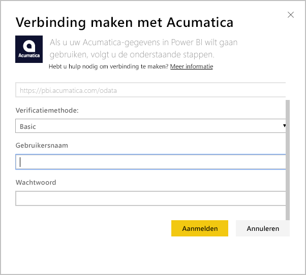
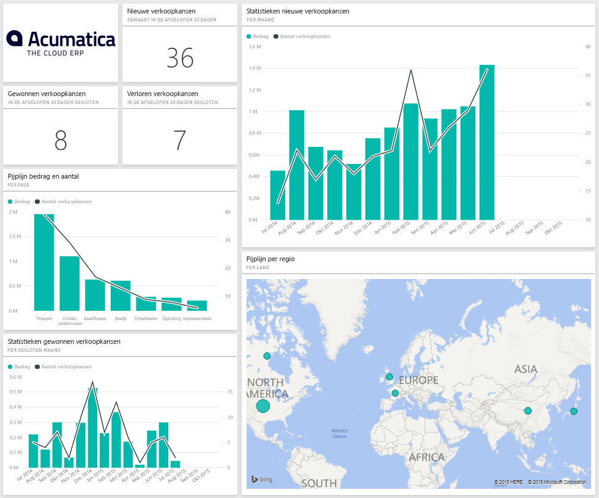
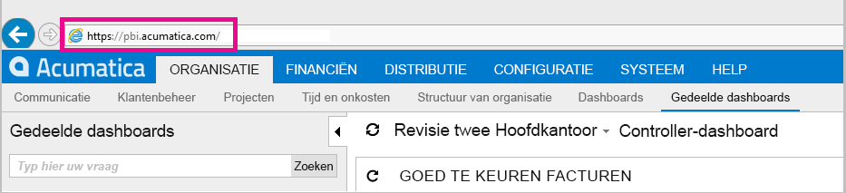
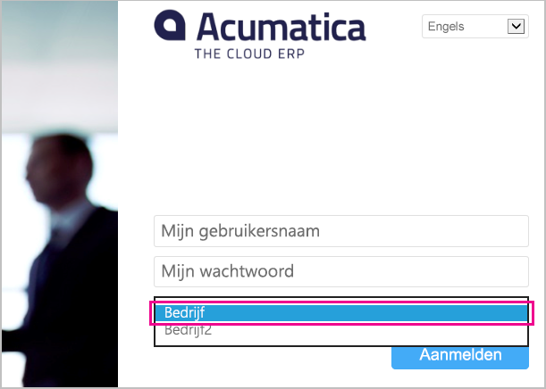

# Verbinding maken met Acumatica met Power BI
Met het Acumatica-inhoudspakket voor Power BI kunt u snel inzicht verkrijgen in uw verkoopkansgegevens. Power BI haalt uw gegevens op inclusief kansen, accounts en klanten, en bouwt vervolgens een standaard dashboard en gerelateerde rapporten op basis van die gegevens.

Maak verbinding met het [Acumatica-inhoudspakket](https://app.powerbi.com/getdata/services/acumatica) of lees meer over de [Acumatica-integratie](https://powerbi.microsoft.com/integrations/acumatica) met Power BI.

>[!NOTE]
>Dit inhoudspakket vereist Acumatica v5.2 of hoger.

## Verbinding maken
1. Selecteer **Gegevens ophalen** onder in het linkernavigatievenster.
   
   
2. Selecteer in het vak **Services** de optie **Ophalen**.
   
   
3. Selecteer **Acumatica** \> **Ophalen**.
   
   
4. Voer uw Acumatica OData-eindpunt in. Met een OData-eindpunt kan een extern systeem gegevens aanvragen van Acumatica. Een Acumatica OData-eindpunt is als volgt ingedeeld en moet HTTPS gebruiken:
   
     https://[sitedomain]/odata/[companyname]
   
   De naam van het bedrijf is alleen vereist als u een implementatie voor meerdere bedrijven hebt. Hieronder vindt u meer informatie over het zoeken naar deze parameter in uw Acumatica-account.
   
   
5. Selecteer voor verificatiemethode **Basisverificatie**. Voer uw gebruikersnaam en wachtwoord van uw Acumatica-account in en klik op **Aanmelden**.
   
    
6. Nadat de gegevens in Power BI zijn geïmporteerd, ziet u een nieuw dashboard, een nieuw rapport en een nieuwe gegevensset in het navigatiedeelvenster aan de linkerzijde. Nieuwe items worden gemarkeerd met een geel sterretje \* dat na het selecteren verdwijnt. Het dashboard wordt weergegeven in een indeling die vergelijkbaar is met die hieronder:
   
    

**Wat nu?**

* [Stel vragen in het vak Q&A](service-q-and-a.md) boven in het dashboard
* [Wijzig de tegels](service-dashboard-edit-tile.md) in het dashboard.
* [Selecteer een tegel](service-dashboard-tiles.md) om het onderliggende rapport te openen.
* Als uw gegevensset is ingesteld op dagelijks vernieuwen, kunt u het vernieuwingsschema wijzigen of de gegevensset handmatig vernieuwen met **Nu vernieuwen**

## Systeemvereisten
Voor dit inhoudspakket is Acumatica v5.2 of hoger vereist. Controleer de versie bij uw Acumatica-beheerder.

## Parameters zoeken
**Acumatica OData-eindpunt**

Een Acumatica OData-eindpunt is als volgt ingedeeld en moet HTTPS gebruiken:

    https://[sitedomain]/odata/[companyname]

Het domein van de toepassingssite vindt u in de adresbalk van uw browser wanneer u zich bij Acumatica aanmeldt. In het onderstaande voorbeeld is het domein van de site https://pbi.acumatica.com. Het OData-eindpunt zou dus https://pbi.acumatica.com/odata moeten zijn.

 

De naam van het bedrijf is alleen vereist als u een implementatie voor meerdere bedrijven hebt. U vindt deze informatie op de aanmeldpagina van Acumatica.

## Probleemoplossing
Als u zich niet kunt aanmelden, controleer dan of het Acumatica OData-eindpunt dat u hebt opgegeven de juiste indeling heeft.

    https://<application site domain>/odata/<company name>

Als u problemen ondervindt bij het verbinding maken, controleer dan uw Acumatica-versie bij uw beheerder. Voor dit inhoudspakket is versie 5.2 of hoger vereist.

## Volgende stappen
[Aan de slag in Power BI](service-get-started.md)

[Gegevens ophalen in Power BI](service-get-data.md)

