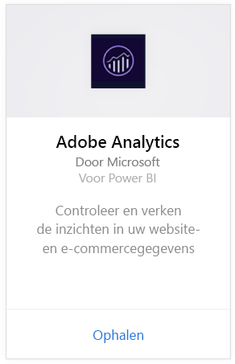
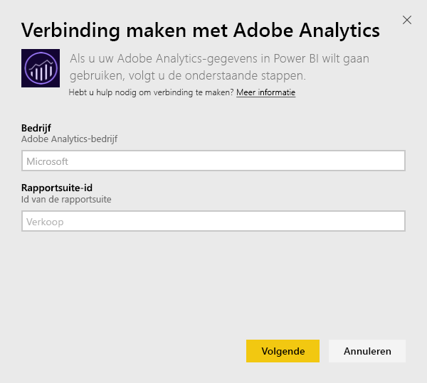
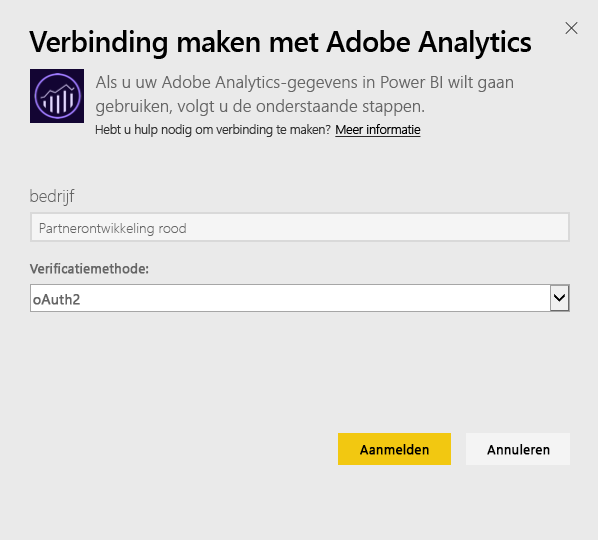
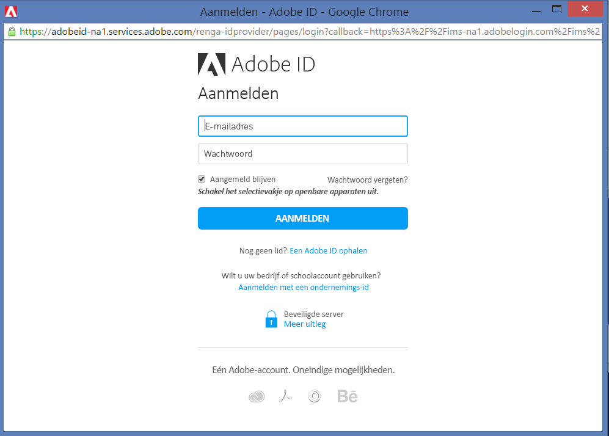
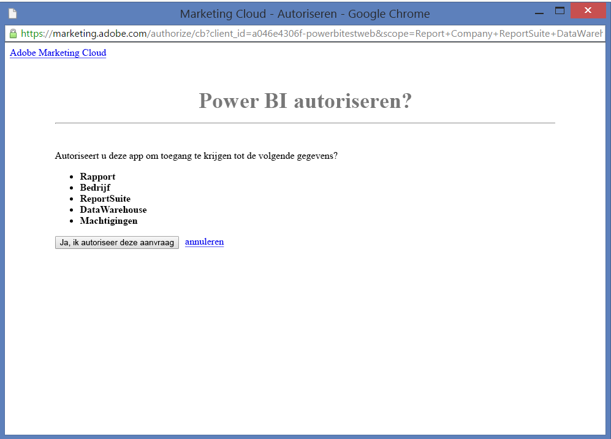
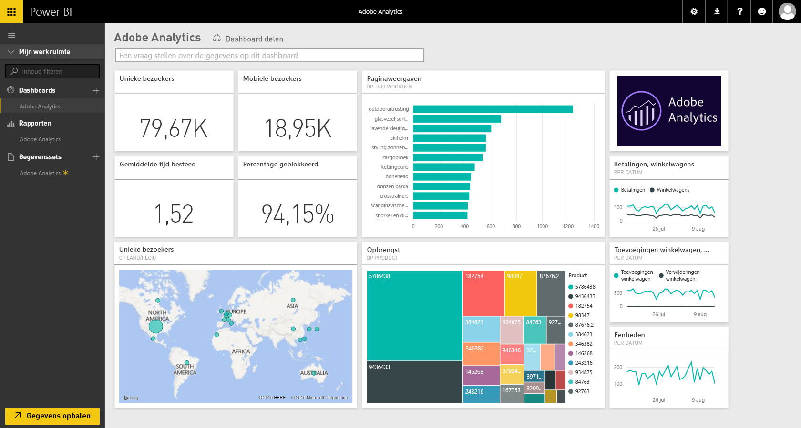
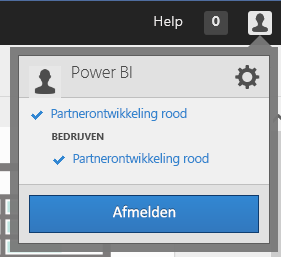
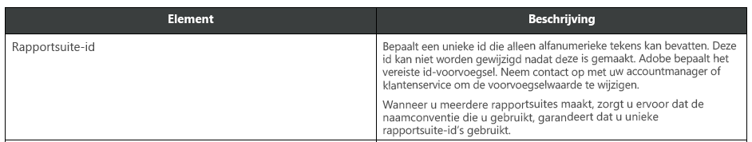

# Verbinding maken met Adobe Analytics via Power BI
Wanneer u verbinding wilt maken met Adobe Analytics via Power BI, kunt u beginnen door eerst verbinding te maken met uw Adobe Analytics Marketing Cloud-account. U krijgt een app met een Power BI-dashboard en een set Power BI-rapporten die inzicht geven in het verkeer van uw site en de gebruikersgegevens. De gegevens worden eenmaal per dag automatisch vernieuwd. U kunt met het dashboard en de rapporten werken, maar u kunt wijzigingen niet opslaan.

Maak verbinding met [Adobe Analytics](https://app.powerbi.com/getdata/services/adobe-analytics) of lees meer informatie over de [integratie van Adobe Analytics](https://powerbi.microsoft.com/integrations/adobe-analytics) met Power BI.

## Verbinding maken
[!INCLUDE [powerbi-service-apps-get-more-apps](./includes/powerbi-service-apps-get-more-apps.md)]

3. Selecteer **Adobe Analytics** \> **Ophalen**.
   
   
4. Power BI maakt verbinding met een specifieke bedrijfs- en rapportsuite-id van Adobe Analytics (niet de naam van de rapportsuite). Hieronder vindt u meer informatie over [hoe u deze parameters kunt vinden](#FindingParams).
   
   
5. Selecteer voor de **verificatiemethode** **oAuth2**\> **Aanmelden**. Voer uw Adobe Analytics-referenties in als dit wordt gevraagd. 
   
    
   
    
6. Klik op **Accepteren** om Power BI toegang te geven tot uw Adobe Analytics-gegevens.
   
   
7. Na uw goedkeuring wordt het importproces automatisch gestart. 

## Het dashboard en de rapporten van Adobe Analytics weergeven
[!INCLUDE [powerbi-service-apps-open-app](./includes/powerbi-service-apps-open-app.md)]

   

[!INCLUDE [powerbi-service-apps-open-app](./includes/powerbi-service-apps-what-now.md)]

## Wat is inbegrepen
Power BI maakt gebruik van de Adobe Analytics Report-API om rapporten te definiëren en uit te voeren voor de volgende tabellen:

| **Tabelnaam** | **Kolomgegevens** |
| --- | --- |
| Producten |elementen = "product" (top 25)   metrische gegevens="cartadditions", "cartremovals", "carts", "cartviews", "checkouts", "revenue", "units" |
| Browsers |elementen = "browser" (top 25)   metrische gegevens ="bounces", "bouncerate", "visitors", "visits", "uniquevisitors", "totaltimespent", "pageviews" |
| Pagina's |elementen= "page" (top 25)   metrische gegevens ="cartadditions", "cartremovals", "carts", "cartviews", "checkouts", "revenue", "units", "visits", "uniquevisitors", "pageviews", "bounces", "bouncerate", "totaltimespent" |
| JavaScript is ingeschakeld |elementen =  "javascriptenabled”, “browser” (top 25) |
| Mobiel besturingssysteem |elementen = "mobileos"(top 25)  metrische gegevens ="bounces", "bouncerate", "visitors", "visits", "uniquevisitors", "totaltimespent", "cartadditions", "cartremovals", "checkouts", "revenue", "units", "pageviews" |
| Trefwoorden zoekmachines |elementen = "searchengine" "searchenginekeyword"   metrische gegevens="bounces", "bouncerate", "visitors", "visits", "entries", "uniquevisitors", "totaltimespent", "cartadditions", "cartremovals", "carts", "cartviews", "checkouts", "revenue", "units", "pageviews" |
| Zoekmachine op producten |elementen = "searchengine", "product"   metrische gegevens="bounces", "bouncerate", "visitors", "visits", "entries", "uniquevisitors", "totaltimespent", "cartadditions", "cartremovals", "carts", "cartviews", "checkouts", "revenue", "units", "pageviews" |
| Verwijzende pagina 's |elementen = "referrer" (top 15), “page" (top 10)   metrische gegevens="bounces", "bouncerate", "visitors", "visits", "entries", "uniquevisitors", "totaltimespent", "cartadditions", "cartremovals", "carts", "cartviews", "checkouts", "revenue", "units", "pageviews" |
| Geocountry-pagina 's |elementen = "geocountry" (Top 20), "page"   metrische gegevens="bounces", "bouncerate", "visitors", "visits", "entries", "uniquevisitors", "totaltimespent", "cartadditions", "cartremovals", "carts", "cartviews", "checkouts", "revenue", "units", "pageviews" |
| Geocountry-product |elementen = "geocountry" (Top 20), "product"  metrische gegevens ="bounces", "bouncerate", "visitors", "visits", "entries", "uniquevisitors", "totaltimespent", "cartadditions", "cartremovals", "carts", "cartviews", "checkouts", "revenue", "units" |
| Zoekfunctie land en regio |elementen = "geocountry" (Top 200)   metrische gegevens ="bounces", "bouncerate", "visitors", "visits", "entries", "uniquevisitors", "totaltimespent", "cartadditions", "cartremovals", "carts", "cartviews", "checkouts", "revenue", "units" |
| Taal |elementen = "language", "browser" (Top 25)   metrische gegevens ="bounces", "bouncerate", "visitors", "visits", "uniquevisitors", "totaltimespent", "pageviews", "cartadditions", "cartremovals", "checkouts", "carts", "cartviews" |
| Zoekfunctie zoekmachines |elementen = "searchengine" (top 100)   metrische gegevens ="bounces", "bouncerate", "visitors", "visits", "entries", "uniquevisitors", "totaltimespent", "cartadditions", "cartremovals", "carts", "cartviews", "checkouts", "revenue", "units" |
| Zoekfunctie browser |elementen = "browser" (top 25) |

## Systeemvereisten
Toegang tot [Adobe Analytics](http://www.adobe.com/marketing-cloud/web-analytics.html) is vereist, waaronder toegang tot de juiste parameters zoals hieronder zijn beschreven.

## Parameters zoeken
**Bedrijf**

De waarde Bedrijf vindt u in de rechterbovenhoek van uw account wanneer u bent aangemeld. De waarde is hoofdletter- en spatiegevoelig. Geef de waarde precies op zoals u deze in uw account ziet.

**Rapportsuite-id**

De suite-id wordt gemaakt wanneer de rapportsuite wordt gemaakt. Neem contact op met uw beheerder om de id-waarde te achterhalen. Dit is niet de naam van de rapportsuite.

Vanuit [documentatie van Adobe](https://marketing.adobe.com/resources/help/en_US/reference/new_report_suite.html):

## Problemen oplossen
Als u, nadat u uw referenties hebt opgegeven, een foutmelding krijgt die aangeeft dat u niet gemachtigd bent, moet u bij uw beheerder nagaan of u toegang tot de Adobe Analytics-API hebt. Controleer ook of de verstrekte Adobe-id gekoppeld is aan uw Marketing Cloud-organisatie (gekoppeld aan een Adobe Analytics-onderneming).

Als u het aanmeldscherm zonder foutmeldingen hebt doorlopen, kan het zijn dat de uitvoering van rapporten te lang duurt. Een algemene fout ziet er zo uit: *'kan geen gegevens ophalen uit het Adobe Analytics-rapport. Inhoud bevat &quot;verwijzende site, pagina&quot;, geschatte duur is xx seconden'*. Raadpleeg de sectie 'Wat is inbegrepen' en vergelijk de grootte van uw Adobe-exemplaar. Er is momenteel helaas geen manier om deze time-out omzeilen. Microsoft overweegt echter updates voor een betere ondersteuning van grotere exemplaren; u kunt het Power BI-team feedback geven op https://ideas.powerbi.com

## Volgende stappen
* [Wat zijn apps in Power BI?](service-create-distribute-apps.md)
* [Gegevens ophalen in Power BI](service-get-data.md)
* Hebt u nog vragen? [Misschien dat de Power BI-community het antwoord weet](http://community.powerbi.com/)

