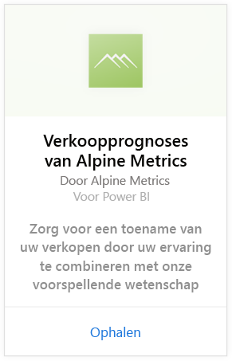
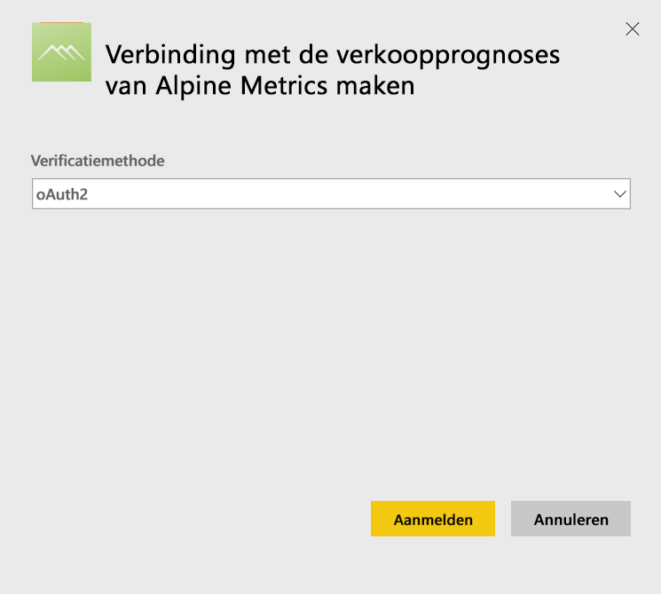
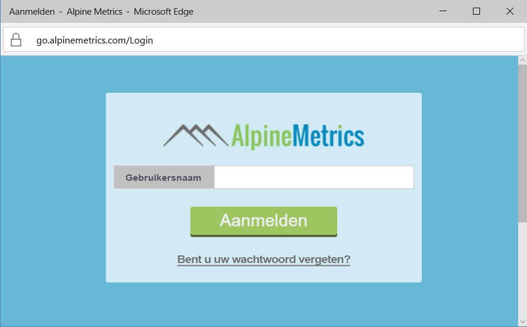
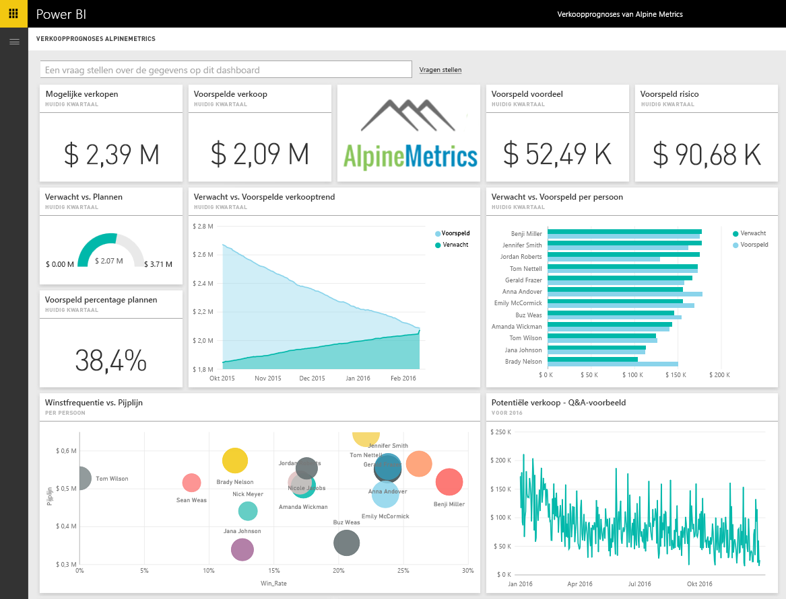

# Verbinding met de verkoopprognoses van Alpine Metrics maken via Power BI
Alpine Metrics voorziet in geavanceerde procesoptimalisatie van voorspellende verkoop in de cloud en op aanvraag voor grote en kleine verkooporganisaties. Het Alpine Metrics Sales Predictions-inhoudspakket voor Power BI bevat metrische gegevens over bijvoorbeeld de potentiële verkopen en risico's, waardoor u een beter inzicht in de toekomst van uw bedrijf krijgt. 

Maak verbinding met het [Alpine Metrics Sales Predictions-inhoudspakket](https://app.powerbi.com/getdata/services/alpine-metrics) voor Power BI.

## Verbinding maken
1. Selecteer Gegevens ophalen onder in het linkernavigatievenster.  
   
    
2. Selecteer in het vak **Services** de optie **Ophalen**.  
   
    
3. Selecteer **Verkoopprognoses van Alpine Metrics** en selecteer vervolgens **Ophalen**.  
   
    
4. Selecteer **OAuth 2** en vervolgens **Aanmelden**. Geef desgevraagd uw Alpine Metrics-referenties op.
   
    
   
    
5. Zodra u bent verbonden, worden er automatisch een dashboard, rapport en gegevensset geladen. Wanneer dit is voltooid, worden de tegels bijgewerkt met gegevens uit uw account.
   
    

**Wat nu?**

* [Stel vragen in het vak Q&A](power-bi-q-and-a.md) boven in het dashboard.
* [Wijzig de tegels](service-dashboard-edit-tile.md) in het dashboard.
* [Selecteer een tegel](service-dashboard-tiles.md) om het onderliggende rapport te openen.
* Als uw gegevensset is ingesteld op dagelijks vernieuwen, kunt u het vernieuwingsschema wijzigen of de gegevensset handmatig vernieuwen met **Nu vernieuwen**.

## Wat is inbegrepen?
Het inhoudspakket bevat gegevens uit de volgende tabellen:  

    - Account    
    - Zakelijk    
    - Land    
    - Branche    
    - Verkoopkans  
    - Persoon  
    - Voorspelling    
    - Voorspellingsgeschiedenis    
    - Product  
    - Regio    

## Systeemvereisten
Een Alpine Metrics-account met machtigingen voor de bovenstaande tabellen is vereist om dit inhoudspakket te starten.

## Volgende stappen
[Aan de slag met Power BI](service-get-started.md)

[Power BI - basisconcepten](service-basic-concepts.md)

