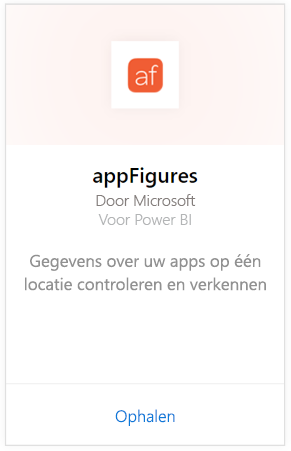
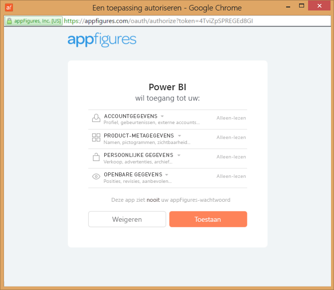
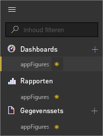
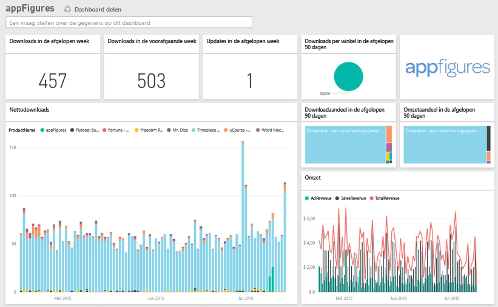
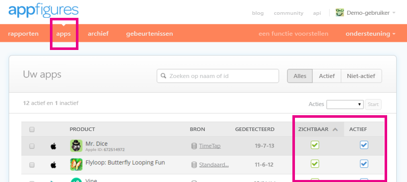

# Verbinding maken met appFigures met Power BI
U kunt belangrijke statistische gegevens over uw apps nu eenvoudig bijhouden met Power BI en het appFigures-inhoudspakket. Power BI haalt uw gegevens op inclusief app-verkopen, downloads en advertentiestatistieken, en bouwt vervolgens een standaard dashboard en gerelateerde rapporten op basis van die gegevens.

Maak verbinding met het [appFigures-inhoudspakket](https://app.powerbi.com/getdata/services/appfigures) of lees meer over de [appFigures-integratie](https://powerbi.microsoft.com/integrations/appfigures) met Power BI.

## Verbinding maken
1. Selecteer **Gegevens ophalen** onder in het linkernavigatievenster.
   
   
2. Selecteer in het vak **Services** de optie **Ophalen**.
   
   
3. Selecteer **appFigures** \> **Ophalen**.
   
   
4. Selecteer voor de **verificatiemethode** **oAuth2**\> **Aanmelden**. Geef desgevraagd uw appFigures-referenties op en voer het verificatieproces van appFigures uit.
   
   De eerste keer dat u verbinding maakt, wordt u door Power BI gevraagd om alleen-lezen toegang tot uw account te geven. Selecteer **Toestaan** om te beginnen met het importproces. Dit kan even duren, afhankelijk van de hoeveelheid gegevens in uw account.
   
   
5. Nadat de gegevens in Power BI zijn geïmporteerd, ziet u een nieuw dashboard, een nieuw rapport en een nieuwe gegevensset in het navigatiedeelvenster aan de linkerzijde. Nieuwe items zijn gemarkeerd met een geel sterretje \*:
   
    
6. Selecteer het appFigures-dashboard. Dit is het standaarddashboard dat door Power BI is gemaakt om uw gegevens weer te geven. U kunt dit dashboard wijzigen om uw gegevens weer te geven zoals u dat wilt.
   
    

**Wat nu?**

* [Stel vragen in het vak Q&A](power-bi-q-and-a.md) boven in het dashboard.
* [Wijzig de tegels](service-dashboard-edit-tile.md) in het dashboard.
* [Selecteer een tegel](service-dashboard-tiles.md) om het onderliggende rapport te openen.
* Als uw gegevensset is ingesteld op dagelijks vernieuwen, kunt u het vernieuwingsschema wijzigen of de gegevensset handmatig vernieuwen met **Nu vernieuwen**.

## Wat is opgenomen
De volgende gegevens zijn beschikbaar via appFigures in Power BI.

| **Tabelnaam** | **Beschrijving** |
| --- | --- |
| Landen |Deze tabel bevat informatie over de naam van het land. |
| Datums |Deze tabel bevat datums vanaf vandaag terug tot de vroegste publicatiedatum van apps die actief en zichtbaar zijn in uw appFigures-account. |
| Gebeurtenissen |Deze tabel bevat download-, verkoop- en advertentiegegevens voor elke app, per land, op dagelijkse basis. Zowel de app als de in-app aankoopgegevens staan in deze enkele tabel. U kunt de kolom <strong>Type</strong> gebruiken om onderscheid te maken. |
| In-apps |Deze tabel bevat gegevens over de verschillende typen in-app aankopen die gekoppeld zijn aan actieve, zichtbare apps op uw appFigures-account. |
| Producten |Deze tabel bevat gegevens over de verschillende apps die actief en zichtbaar zijn op uw appFigures-account. |

## Probleemoplossing
Als gegevens van bepaalde apps niet in Power BI verschijnen, controleer dan of deze apps zichtbaar en actief zijn op het tabblad **apps** van de appFigures-site.

## Volgende stappen
* [Aan de slag in Power BI](service-get-started.md)
* [Gegevens ophalen in Power BI](service-get-data.md)

