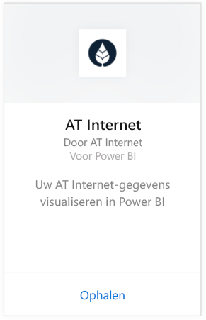
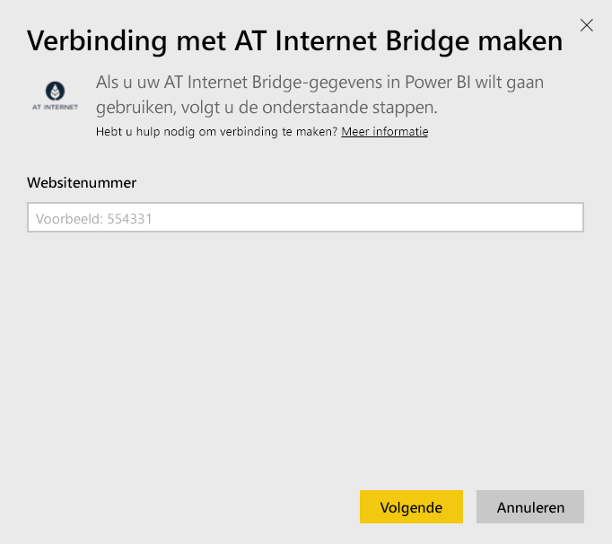
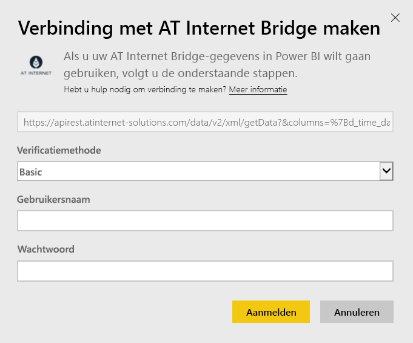

# Verbinding met AT Internet Bridge maken via met Power BI
AT Internet helpt u direct waarde te onttrekken aan uw gegevens dankzij het geïntegreerde digitale analyseplatform, de Analytics Suite. Het AT Internet Bridge-inhoudspakket voor Power BI bevat onder meer gegeven over bezoeken, bronnen, lokalisatie en apparaten voor uw site.

Maak verbinding met het [AT Internet Bridge-inhoudspakket](https://app.powerbi.com/getdata/services/at-internet-bridge) voor Power BI.

## Verbinding maken
1. Selecteer **Gegevens ophalen** onder in het linkernavigatievenster.
   
    
2. Selecteer in het vak **Services** de optie **Ophalen**.
   
    
3. Selecteer **AT Internet Bridge** \> **Ophalen**.
   
   
4. Geef het AT Internet-websitenummer op waarmee u verbinding wilt maken.
   
   
5. Selecteer **Basic** (Standaard) voor het verificatiemechanisme, geef uw gebruikersnaam en wachtwoord voor AT Internet op en klik op **Sign In** (Aanmelden).
   
   
6. Klik op **Verbinding maken** om het importproces te starten. Nadat het importeren is voltooid, bevat het navigatiedeelvenster een nieuw dashboard, rapport en model. Selecteer het dashboard om uw geïmporteerde gegevens weer te geven.
   
    

**Wat nu?**

* [Stel vragen in het vak Q&A](power-bi-q-and-a.md) boven in het dashboard.
* [Wijzig de tegels](service-dashboard-edit-tile.md) in het dashboard.
* [Selecteer een tegel](service-dashboard-tiles.md) om het onderliggende rapport te openen.
* Als uw gegevensset is ingesteld op dagelijks vernieuwen, kunt u het vernieuwingsschema wijzigen of de gegevensset handmatig vernieuwen met **Nu vernieuwen**.

## Wat is inbegrepen?
Dit inhoudspakket bevat gegevens van de afgelopen 45 dagen in de volgende tabellen:  

    - Conversie  
    - Apparaten  
    - Lokalisatie  
    - Bronnen  
    - Globale bezoeken  

## Volgende stappen
[Aan de slag met Power BI](service-get-started.md)

[Power BI - basisconcepten](service-basic-concepts.md)

