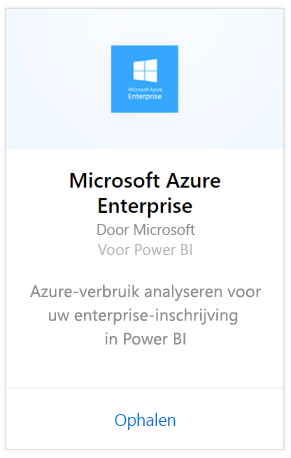
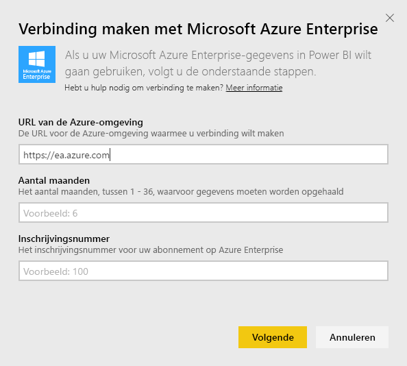
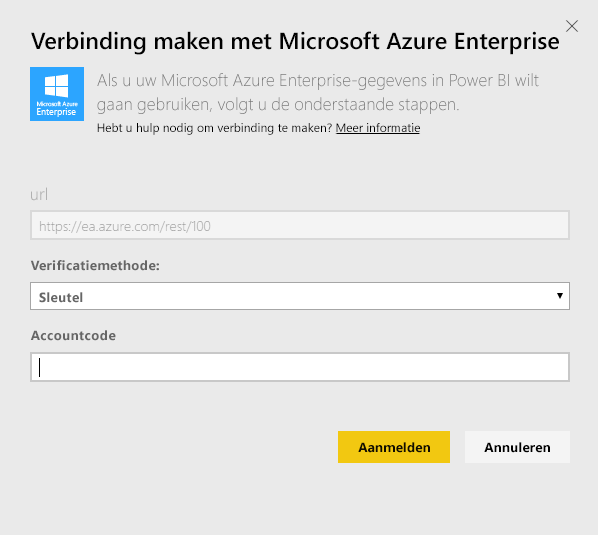
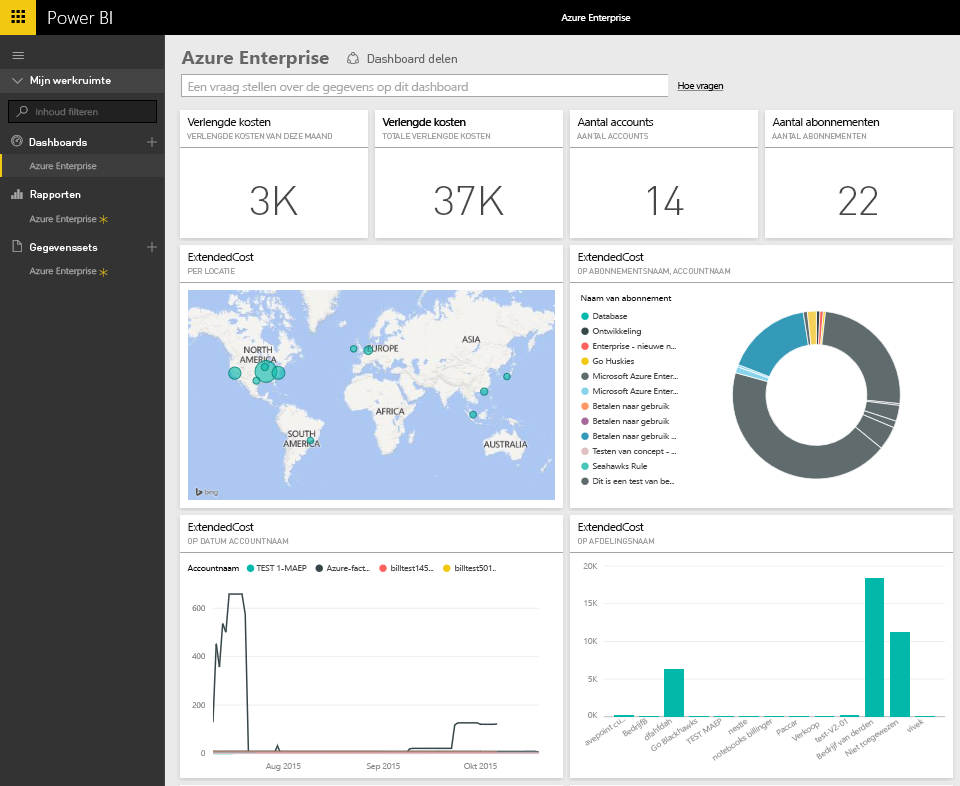
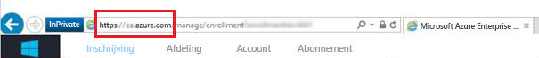
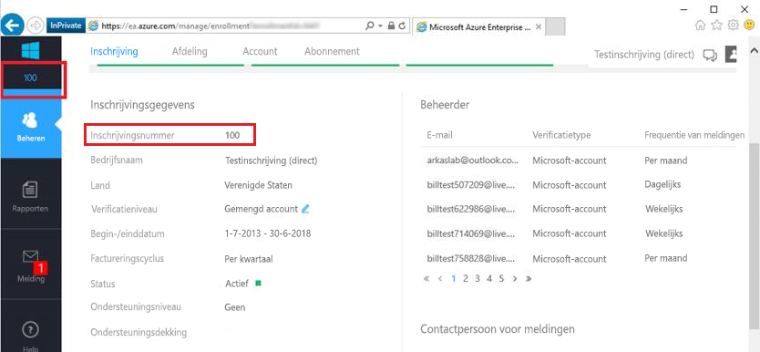
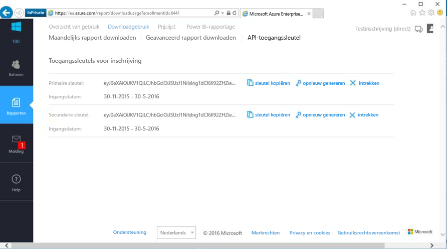

# Verbinding maken met Microsoft Azure Enterprise met Power BI
Verken en bewaak uw Microsoft Azure Enterprise-gegevens in Power BI met het Power BI-inhoudspakket. De gegevens worden eenmaal per dag automatisch vernieuwd.

Maak verbinding met het [Microsoft Azure Enterprise-inhoudspakket](https://app.powerbi.com/getdata/services/azure-enterprise) voor Power BI.

## Verbinding maken
1. Selecteer **Gegevens ophalen** onder in het linkernavigatievenster.
   
    
2. Selecteer in het vak **Services** de optie **Ophalen**.
   
   
3. Selecteer **Microsoft Azure Enterprise** \> **Ophalen**.
   
   
4. Geef de URL van de Azure-omgeving, het aantal maanden van de gegevens die u wilt importeren en uw Azure Enterprise-inschrijvingsnummer op. De URL van uw Azure-omgeving is `https://ea.azure.com` of `https://ea.windowsazure.cn`. Zie details over [het vinden van deze parameters](#FindingParams) hieronder.
   
    
5. Geef uw toegangscode op om verbinding te maken. De code voor uw inschrijving vindt u in uw Azure EA-portal.
   
    
6. Het importproces wordt automatisch gestart. Nadat het importeren is voltooid, bevat het navigatiedeelvenster een nieuw dashboard, rapport en model. Selecteer het dashboard om uw geïmporteerde gegevens weer te geven.
   
   

**Wat nu?**

* [Stel vragen in het vak Q&A](power-bi-q-and-a.md) boven in het dashboard.
* [Wijzig de tegels](service-dashboard-edit-tile.md) in het dashboard.
* [Selecteer een tegel](service-dashboard-tiles.md) om het onderliggende rapport te openen.
* Als uw gegevensset is ingesteld op dagelijks vernieuwen, kunt u het vernieuwingsschema wijzigen of de gegevensset handmatig vernieuwen met **Nu vernieuwen**.

## Wat is opgenomen
Het Azure Enterprise-inhoudspakket bevat maandelijkse rapportagegegevens voor het bereik van de maanden die u tijdens de verbindingsprocedure opgeeft. Het bereik is een zwevend venster, zodat de opgenomen datums worden bijgewerkt zodra de gegevensset wordt vernieuwd.

## Systeemvereisten
Voor het inhoudspakket is toegang vereist tot de Enterprise-functies van Azure Portal.

## Parameters zoeken
Power BI-rapportage is beschikbaar voor EA Direct, partners en indirecte klanten die factuurgegevens kunnen bekijken. Lees de sectie hieronder voor meer informatie over het vinden van elk van de waarden die de verbindingsstroom verwacht.

**URL van de Azure-omgeving**

* Deze waarde is doorgaans https://ea.azure.com, maar u kunt de URL controleren als u zich aanmeldt.
  
    

**Number of Months**

* Dit moet een getal zijn tussen 1-36 dat het aantal maanden (vanaf vandaag) aangeeft waarvoor u gegevens wilt importeren.

**Enrollment Number**

* Dit is het inschrijvingsnummer voor Azure Enterprise, dat u kunt vinden op het beginscherm van de [Azure Enterprise-portal](https://ea.azure.com/), onder Enrollment Detail.
  
    

**Access Key**

* Uw code vindt u in de Azure Enterprise-portal, onder Download Usage > API Access Key.
  
    

**Aanvullende informatie**

* Voor extra hulp bij het instellen van het Azure Enterprise Power BI-pakket kunt u inloggen op de Azure Enterprise-portal om het API-helpbestand te bekijken onder Help en aanvullende instructies onder Reports -> Download Usage -> API Access Key.

## Volgende stappen
[Aan de slag in Power BI](service-get-started.md)

[Gegevens ophalen in Power BI](service-get-data.md)

