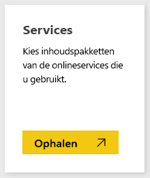
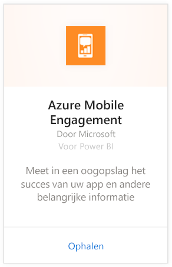
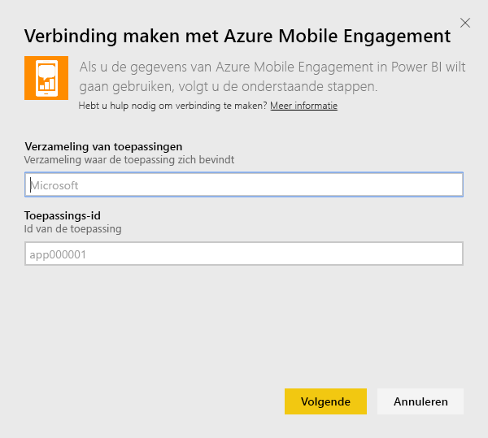
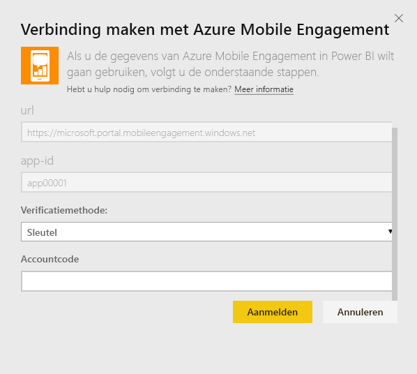
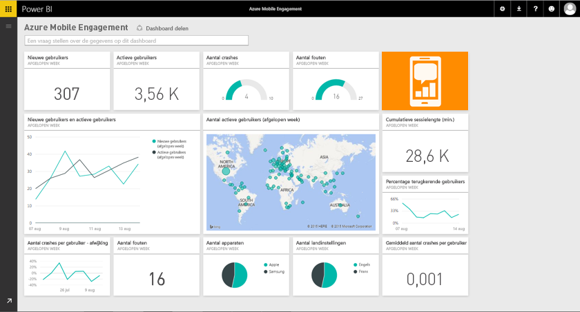

# Met Power BI verbinding maken met Azure Mobile Engagement
Met het Azure Mobile Engagement-inhoudspakket voor Power BI kunt u snel inzicht verkrijgen in uw app-gegevens.

Verbinding maken met het [inhoudspakket van Azure Mobile Engagement](https://app.powerbi.com/groups/me/getdata/services/azme) voor Power BI.

## Verbinding maken
1. Selecteer **Gegevens ophalen** onder in het linkernavigatievenster.
   
    
2. Selecteer in het vak **Services** de optie **Ophalen**.
   
    
3. Selecteer **Azure Mobile Engagement** \> **Ophalen**.
   
     
4. Geef uw app-verzameling en de naam van de app op. Deze informatie kunt u vinden in uw Azure Mobile Engagement-account.
   
     
5. Geef uw sleutel op als verificatiemethode en klik op aanmelden.
   
    
6. Nadat de gegevens in Power BI zijn geïmporteerd, ziet u een nieuw dashboard, een nieuw rapport en een nieuwe gegevensset in het navigatiedeelvenster aan de linkerzijde. Nieuwe items worden gemarkeerd met een geel sterretje \* dat verdwijnt wanneer het wordt geselecteerd:
   
    

 **Wat nu?**

* [Stel vragen in het vak Q&A](power-bi-q-and-a.md) boven in het dashboard.
* [Wijzig de tegels](service-dashboard-edit-tile.md) in het dashboard.
* [Selecteer een tegel](service-dashboard-tiles.md) om het onderliggende rapport te openen.
* Als uw gegevensset is ingesteld op dagelijks vernieuwen, kunt u het vernieuwingsschema wijzigen of de gegevensset handmatig vernieuwen met **Nu vernieuwen**

## Volgende stappen
[Aan de slag in Power BI](service-get-started.md)

[Gegevens ophalen in Power BI](service-get-data.md)

