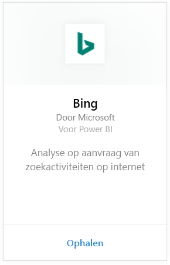
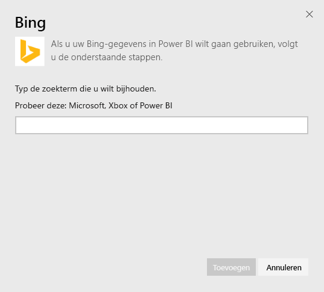
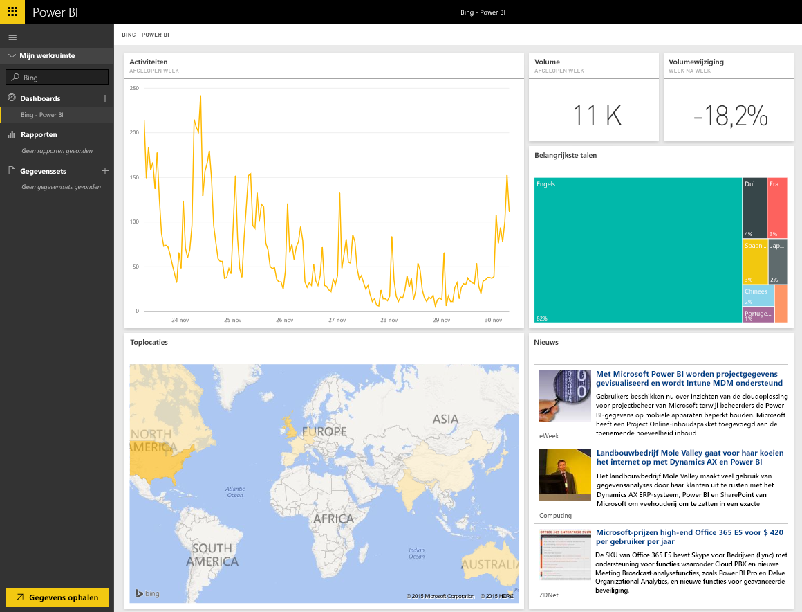

# Verbinding met Bing maken via Power BI
Met het Bing-inhoudspakket kunt u analyses weergeven met betrekking tot de zoekactiviteiten voor een term naar keuze.

Maak verbinding met het [Bing-inhoudspakket](https://app.powerbi.com/groups/me/getdata/services/bing) voor Power BI.

>[!NOTE]
>Bing-tegels worden ongeveer om de vijf minuten automatisch bijgewerkt. De enige tegel die kan worden geselecteerd, is de tegel Nieuws. Hiermee gaat u naar het bijbehorende nieuwsartikel. 

>[!NOTE]
>Tegels van het Bing-inhoudspakket worden niet weergegeven in de mobiele toepassingen. Er wordt momenteel echter naar een oplossing voor dit probleem gezocht.

1. Selecteer **Gegevens ophalen** onder in het linkernavigatievenster.
   
    
2. Selecteer in het vak **Services** de optie **Ophalen**.
   
    
3. Selecteer **Bing** > **Ophalen**.
   
    
4. Geef in het dialoogvenster met parameters de zoekterm op die u wilt bijhouden en klik vervolgens op Toevoegen.
   
        
5. Aan de linkerkant ziet u in de lijst met dashboards een nieuwe vermelding met de naam Bing en de opgegeven zoekterm. Er is geen gegevensset of rapport aan dit dashboard gekoppeld. Het kan even duren voordat de tegels zijn geladen, maar zodra dit is gebeurt, ziet de indeling er ongeveer als hieronder uit.
   
    

Nadat de tegels zijn geladen, kunt u uw gegevens verkennen. U kunt dan ook tegels van dit dashboard vastmaken aan andere dashboards in uw account.

